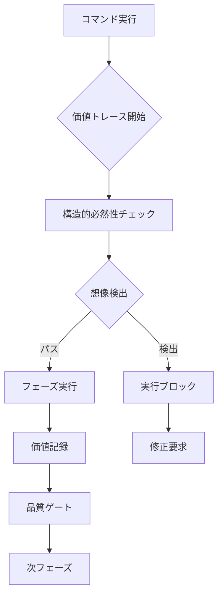

# Parasol V5 統合コマンド体系

**価値駆動設計の完全自動化を実現する新世代コマンドシステム**

---

## 🎯 概要

Parasol V5の統合コマンド体系は、**価値トレーサビリティシステム**と**VMS1-VMS5マイルストーン**を完全統合し、「想像の設計」を技術的に不可能にする革新的なコマンドシステムです。

### 核心的特徴

1. **価値駆動** - すべてのコマンドが価値実現を中心に設計
2. **構造的必然性保証** - 想像や希望的観測を自動排除
3. **段階的実行** - VMS1-VMS5の順序と品質を自動保証
4. **完全自動化** - 複雑な価値管理をワンクリック実行

---

## 📚 コマンドカテゴリ

### 1. 🎯 価値管理コマンド群

価値トレーサビリティの中核機能を提供：

| コマンド | 説明 | 用途 |
|----------|------|------|
| `/parasol:value-trace` | 価値トレース記録・管理 | 設計判断の価値追跡 |
| `/parasol:value-trace okr-link` | VMS-OKR連携設定 | VMSにOKRを紐付け |
| `/parasol:value-trace okr-status` | OKR達成状況確認 | KR進捗・達成率表示 |
| `/parasol:value-trace depth-history` | 価値深化履歴表示 | VL深化の時系列記録 |
| `/parasol:value-trace annual-review` | 年次価値レビュー | VL2/VL3・OKRの年次見直し |
| `/parasol:value-trace mid-term-review` | 中期価値見直し | VL1・VS構造の3-5年見直し |
| `/parasol:necessity-check` | 構造的必然性検証 | 4基準での自動判定 |
| `/parasol:imagination-detect` | 想像の設計検出 | 5パターンの自動検出 |
| `/parasol:value-validate` | 価値妥当性検証 | 価値主張の根拠確認 |

### 2. 🏁 マイルストーン管理コマンド群

VMS1-VMS5の進捗と品質を管理：

| コマンド | 説明 | 用途 |
|----------|------|------|
| `/parasol:milestone` | 統合マイルストーン管理 | VMS1-VMS5進捗確認 |
| `/parasol:quality-gate` | 品質ゲート実行 | 自動品質チェック |
| `/parasol:value-inheritance` | 価値継承チェック | フェーズ間価値確認 |
| `/parasol:ms-report` | マイルストーンレポート | 達成状況可視化 |

### 3. 🚀 統合実行コマンド群

複数フェーズをワンクリック実行：

| コマンド | 説明 | 対象VMS |
|----------|------|--------|
| `/parasol:quick-start` | 高速プロジェクト開始 | VMS1達成まで |
| `/parasol:strategic-design` | 戦略設計完全実行 | VMS1-VMS2 |
| `/parasol:full-design` | 完全設計実行 | VMS1-VMS3 |
| `/parasol:ready-to-build` | 実装準備完了 | VMS1-VMS4 |
| `/parasol:production-ready` | 本番環境準備完了 | VMS1-VMS5 |

### 4. 📊 分析・レポートコマンド群

包括的な分析とレポート生成：

| コマンド | 説明 | 出力 |
|----------|------|------|
| `/parasol:value-report` | 価値実現総合レポート | 価値実現状況 |
| `/parasol:structural-analysis` | 構造的必然性分析 | 判断根拠分析 |
| `/parasol:project-health` | プロジェクト健全性診断 | 総合健康診断 |
| `/parasol:imagination-report` | 想像検出レポート | リスク箇所特定 |

### 5. 🔧 既存コマンド（強化版）

価値トレーサビリティ統合済み：

| コマンド | 強化内容 |
|----------|----------|
| `/parasol:1-context` | VL1-VL3価値分解での自動トレース |
| `/parasol:2-value` | VS設計での構造的必然性検証 |
| `/parasol:3-capabilities` | CL3定義での価値継承確認（BC入力） |
| `/parasol:4-application` | サービス境界での価値維持検証 |
| `/parasol:5-software` | 実装価値の妥当性確認 |
| `/parasol:6-implementation` | 価値実現の検証 |
| `/parasol:7-platform` | 価値保護の確認 |

---

## 🎪 使用例

### 例1: 新規プロジェクトの高速開始

```bash
# ワンコマンドでVMS1（顧客が最初の価値を体験できる状態）まで達成
/parasol:quick-start https://company.com

# 自動実行される内容：
# 1. 企業分析（価値トレース記録）
# 2. ステークホルダー特定（構造的必然性確認）
# 3. VL1-VL3価値分解（想像排除）
# 4. VMS1品質ゲート実行
# 5. 価値実現レポート生成
```

### 例2: 完全設計の実行

```bash
# VMS1-VMS3（顧客が主要価値を日常的に体験できる状態）まで一括実行
/parasol:full-design

# 段階的に実行：
# - Phase 1-2: 戦略レベル設計（VMS1-VMS2）
# - Phase 3: ドメイン分解（VMS3）
# - 各段階で価値継承チェック
# - 想像の設計を自動ブロック
```

### 例3: 構造的必然性の検証

```bash
# 特定の設計判断を検証
/parasol:necessity-check "若年層向けノンアルコール商品開発"

# 4基準で自動評価：
# ✅ 価値起源: 20代飲酒率30%減（統計データ）
# ✅ 因果関係: 構造的変化への適応
# ✅ 代替案: 従来商品では対応不可
# ✅ 測定可能性: 売上・シェアで検証可能
# 
# 判定: 構造的必然性あり
```

### 例4: プロジェクト健全性診断

```bash
# 総合的な健康診断
/parasol:project-health

# 診断項目：
# - 価値トレーサビリティ完全性: 98%
# - 構造的必然性スコア: 4.8/5.0
# - 想像検出件数: 0件
# - VMS進捗: VMS3完了（4週間）
# - 推奨アクション: VMS4への移行準備
```

---

## 🛠️ 技術仕様

### 価値トレース記録形式

```yaml
value_trace:
  id: "vt-2024-001"
  timestamp: "2024-01-15T10:30:00Z"
  phase: "Phase2-ValueStream"
  decision: "VS2を健康食品事業と定義"
  value_origin:
    stakeholder: "健康志向消費者"
    need: "機能性食品への需要"
    evidence: "市場調査データ（年率15%成長）"
  structural_necessity:
    score: 4.5
    criteria:
      value_origin: "明確"
      causality: "検証済み"
      alternatives: "比較済み"
      measurability: "定量可能"
  imagination_check:
    status: "PASSED"
    patterns_detected: []
```

### 品質ゲート基準

```yaml
quality_gates:
  VMS1:
    value_clarity: ">= 95%"
    stakeholder_coverage: ">= 90%"
    vl_decomposition: "完了"

  VMS2:
    vs_validation: "100%"
    strategic_alignment: ">= 95%"
    dependency_clarity: "明確"

  VMS3:
    domain_coverage: ">= 95%"
    bc_definition_quality: ">= 90%"
    value_inheritance: "確認済み"
```

---

## 🚦 コマンド実行フロー



---

## 📈 導入効果

1. **設計品質向上**: 想像排除により100%根拠ある判断
2. **開発速度向上**: 自動化により50%時間短縮
3. **手戻り削減**: 構造的必然性により80%削減
4. **価値実現確率**: VMS1-VMS5により95%以上達成

---

## 🎓 詳細ドキュメント

- [コマンドインデックス](./command-index.md) - 全コマンド詳細仕様
- [価値管理コマンド](./value-management/) - 価値トレーサビリティ機能
- [マイルストーン管理](./milestone-management/) - VMS1-VMS5管理機能
- [統合実行ガイド](./integrated-execution/) - バッチ実行方法
- [分析レポート仕様](./analysis-reports/) - レポート形式と活用法

---

**Parasol V5統合コマンド体系** - 想像を排除し、価値を実現する究極のツール