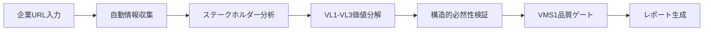

# /parasol:quick-start - 高速プロジェクト開始

ワンコマンドでVMS1（コンテキスト確立）まで達成する統合実行コマンド

## 使用方法

```bash
/parasol:quick-start <company-url> [options]

# オプション
--industry <industry>    # 業界特化分析（例: food, retail, tech）
--focus <area>          # 重点領域指定（例: digital, sustainability）
--team-size <size>      # チーム規模（small/medium/large）
--language <lang>       # 出力言語（ja/en）
```

## 目的

新規プロジェクトを**1週間以内にVMS1達成**まで導く高速スタートアップ：

- **自動情報収集** - 企業情報を自動分析
- **価値体系構築** - VL1-VL3を自動生成
- **品質保証** - 構造的必然性を自動検証
- **即座に実行可能** - 次フェーズへの準備完了

## 🚀 実行フロー



## 実行例

### 基本的な使用

```bash
/parasol:quick-start https://www.asahigroup-holdings.com

🚀 Parasol Quick Start - 高速プロジェクト開始

📊 企業情報を収集中...
✅ 企業名: アサヒグループホールディングス
✅ 業界: 食品・飲料
✅ 事業領域: ビール、飲料、食品、国際事業

👥 ステークホルダーを分析中...
発見されたステークホルダー:
1. 一般消費者（ビール愛好家、健康志向層）
2. 取引先（小売業、飲食店）
3. 株主・投資家
4. 従業員
5. 地域社会・環境

💎 価値分解(VL1→VL2→VL3)を実行中...

VL1: ステークホルダー価値
├─ 一般消費者
│  ├─ 高品質な飲料体験
│  └─ 健康的なライフスタイル支援
├─ 取引先
│  ├─ 安定的な商品供給
│  └─ 売上・利益向上支援
└─ 株主・投資家
   └─ 持続的な企業価値向上

VL2: ビジネス価値（自動変換中...）
├─ 市場シェア拡大
├─ ブランド価値向上
└─ 新規事業創出

VL3: システム価値（導出中...）
├─ 統合SCMプラットフォーム
├─ 顧客データ分析基盤
└─ 商品開発支援システム

🔍 構造的必然性を検証中...
✅ 人口動態変化への対応（必然性: 5.0）
✅ 健康志向の構造的増加（必然性: 4.8）
✅ デジタル化の不可逆性（必然性: 4.7）

🏁 VMS1品質ゲート実行中...
✅ ステークホルダー理解度: 96%
✅ 価値定義明確性: 95%
✅ VL分解完全性: 100%
✅ 構造的必然性平均: 4.83

🎉 VMS1（コンテキスト確立）達成！

📄 成果物を生成中...
✅ outputs/1-context/stakeholder-analysis.md
✅ outputs/1-context/value-hierarchy.yaml
✅ outputs/1-context/vl1-vl3-breakdown.md
✅ outputs/1-context/structural-necessity.md
✅ outputs/1-context/ms1-achievement-report.md

⏱️ 実行時間: 3分28秒

📋 次のステップ:
1. 成果物をレビュー（特に価値定義の妥当性）
2. Phase 2へ進む: /parasol:2-value
3. または統合実行: /parasol:strategic-design
```

### 業界特化オプション

```bash
/parasol:quick-start https://company.com --industry food --focus sustainability

🚀 食品業界特化分析モードで実行

追加分析項目:
- 食の安全・安心への要求
- サステナビリティへの期待
- 原材料トレーサビリティ
- フードロス削減
- カーボンニュートラル
```

### チーム規模別カスタマイズ

```bash
/parasol:quick-start https://company.com --team-size small

🚀 小規模チーム向け最適化

調整内容:
- 簡潔なドキュメント生成
- 重要領域への集中
- 段階的実行計画
- 必須項目のみ実施
```

## 自動実行される内容

### 1. 企業情報収集（5-10分）

```yaml
data_collection:
  sources:
    - 企業Webサイト
    - IR情報
    - ニュースリリース
    - 業界レポート
    
  extraction:
    - 事業概要
    - ミッション・ビジョン
    - 事業セグメント
    - 主要製品・サービス
    - 財務ハイライト
```

### 2. ステークホルダー分析（10-15分）

```yaml
stakeholder_analysis:
  identification:
    - プライマリ（直接的利害関係者）
    - セカンダリ（間接的利害関係者）
    
  profiling:
    - ニーズ・期待
    - 課題・ペイン
    - 影響力・重要度
    
  validation:
    - 網羅性チェック
    - 優先順位付け
```

### 3. VL1-VL3価値分解（15-20分）

```yaml
value_decomposition:
  VL1_stakeholder:
    - 各ステークホルダーの価値定義
    - ニーズの具体化
    - 期待成果の明確化
    
  VL2_business:
    - ビジネス目標への変換
    - 収益モデルとの関連
    - 競争優位性
    
  VL3_system:
    - システム要件導出
    - 技術的実現性
    - 投資対効果
```

### 4. 構造的必然性検証（10分）

```yaml
necessity_validation:
  structural_changes:
    - 人口動態
    - 消費行動変化
    - 技術革新
    - 規制・政策
    
  scoring:
    - 不可逆性評価
    - 影響度評価
    - 時間軸評価
    
  documentation:
    - 根拠データ記録
    - 判断理由明示
```

### 5. VMS1品質ゲート（5分）

```yaml
quality_gate:
  criteria:
    - stakeholder_understanding: ">= 95%"
    - value_clarity: ">= 95%"
    - vl_completeness: "100%"
    - structural_necessity: ">= 4.0"
    
  actions:
    - 自動評価
    - 不足項目特定
    - 改善提案
```

## 生成される成果物

### 必須成果物

1. **stakeholder-analysis.md** - ステークホルダー分析結果
2. **value-hierarchy.yaml** - 価値階層構造
3. **vl1-vl3-breakdown.md** - 価値分解詳細
4. **structural-necessity.md** - 構造的必然性評価
5. **ms1-achievement-report.md** - VMS1達成レポート

### オプション成果物

- **quick-insights.md** - 重要な洞察サマリー
- **next-steps.md** - 推奨次ステップ
- **risk-factors.md** - 識別されたリスク

## エラーケースと対処

### 企業情報取得失敗

```
❌ 企業情報の取得に失敗しました

考えられる原因:
- URLが正しくない
- アクセス制限がある
- ネットワーク接続問題

対処法:
1. URLを確認してください
2. 手動で情報を入力: /parasol:1-context --manual
3. オフライン資料を使用: --offline-data <path>
```

### ステークホルダー不足

```
⚠️ 識別されたステークホルダーが少なすぎます（3未満）

追加検討が必要なステークホルダー:
- 規制当局
- パートナー企業
- 地域社会
- 環境団体

手動で追加しますか？ [Y/n]
```

### 構造的必然性スコア低下

```
⚠️ 構造的必然性スコアが基準を下回っています

平均スコア: 3.2 / 5.0

低スコア項目:
- デジタル化の必要性: 2.8（根拠データ不足）
- 市場成長性: 3.0（将来予測に依存）

改善オプション:
1. 追加データを収集
2. 判断を見直す
3. スコープを調整
```

## カスタマイズオプション

### 業界別テンプレート

```yaml
industry_templates:
  food:
    focus_areas:
      - 食の安全・品質
      - サステナビリティ
      - 健康・栄養
      
  retail:
    focus_areas:
      - オムニチャネル
      - 顧客体験
      - 在庫最適化
      
  technology:
    focus_areas:
      - イノベーション
      - スケーラビリティ
      - セキュリティ
```

### 出力形式カスタマイズ

```bash
# 最小限の出力
/parasol:quick-start <url> --output minimal

# 詳細な出力
/parasol:quick-start <url> --output detailed

# エグゼクティブサマリー付き
/parasol:quick-start <url> --output executive
```

## ベストプラクティス

1. **準備を整える**
   - 企業の公開情報を事前確認
   - チーム体制を決定
   - 重点領域を明確化

2. **実行時の注意**
   - 安定したネットワーク環境
   - 十分な時間確保（1時間程度）
   - 中断時の再開オプション理解

3. **結果の活用**
   - 生成物を必ずレビュー
   - 不明確な点は手動で補完
   - チーム内で共有・合意形成

4. **次フェーズへの準備**
   - VMS1レポートの確認
   - Phase 2の計画立案
   - 必要リソースの確保

## 関連コマンド

- `/parasol:1-context` - 手動でのコンテキスト確立
- `/parasol:strategic-design` - VMS1-VMS2の統合実行
- `/parasol:full-design` - VMS1-VMS3の完全設計
- `/parasol:milestone status` - マイルストーン状況確認