# /parasol:value-trace - 価値トレース管理

すべての設計判断を価値まで追跡可能にする中核コマンド

## 使用方法

```bash
/parasol:value-trace record                     # 新規トレース記録
/parasol:value-trace list [--filter]           # トレース一覧表示
/parasol:value-trace verify [trace-id]         # トレース検証
/parasol:value-trace export [--format]         # トレースエクスポート
/parasol:value-trace visualize                 # 価値チェーン可視化
```

## 目的

設計判断から価値実現までの完全なトレーサビリティを提供し、「想像の設計」を技術的に防止します：

- **価値起源の明確化** - すべての判断の根拠を記録
- **因果関係の追跡** - 判断と価値の関係を可視化
- **継承関係の管理** - フェーズ間の価値継承を確認
- **品質保証** - 価値劣化の早期検出と防止

## 🔧 価値トレーサビリティ連携

**コアエンジン**: `_value-traceability-system/core/value-tracer.yaml`

### トレース記録フロー

```
判断入力 → 価値起源確認 → 構造的必然性チェック → トレース記録 → 継承関係更新
```

## 実行例

### 1. 新規トレース記録

```bash
/parasol:value-trace record

📝 価値トレース記録を開始します

フェーズを選択: Phase 2 - Value Stream
判断内容: VS2を「健康食品事業」として定義

価値起源を入力:
- ステークホルダー: 健康志向消費者
- ニーズ: 機能性食品への需要増
- 根拠: 市場調査レポート（年率15%成長）

構造的必然性を確認:
✅ 価値起源: 明確に定義
✅ 因果関係: データで検証済み
✅ 代替案: 3案を比較検討
✅ 測定可能性: 売上・シェアで測定可能

トレースID: vt-2024-042 を記録しました
```

### 2. トレース一覧表示

```bash
/parasol:value-trace list --filter phase:2

📊 価値トレース一覧（Phase 2）

ID          | 判断内容                    | 必然性 | ステータス
------------|---------------------------|--------|------------
vt-2024-039 | VS1: ビール事業定義        | 4.8    | ✅ 検証済み
vt-2024-040 | VS1: 構造的変化対応        | 5.0    | ✅ 検証済み
vt-2024-041 | VS2: 健康食品事業定義      | 4.5    | ✅ 検証済み
vt-2024-042 | VS2: 市場成長性根拠        | 4.7    | ✅ 検証済み

合計: 4件 | 平均必然性: 4.75
```

### 3. トレース検証

```bash
/parasol:value-trace verify vt-2024-042

🔍 トレース検証: vt-2024-042

基本情報:
- フェーズ: Phase 2 - Value Stream
- 判断: VS2を「健康食品事業」として定義
- 記録日時: 2024-01-15 10:30:45

価値起源検証:
✅ ステークホルダー: 健康志向消費者（明確）
✅ ニーズ: 機能性食品需要（検証済み）
✅ 根拠データ: 市場調査レポート（信頼性高）

構造的必然性スコア: 4.5 / 5.0
- 価値起源: 5.0
- 因果関係: 4.5
- 代替案検討: 4.0
- 測定可能性: 4.5

継承関係:
← 継承元: vt-2024-015 (VL2: ビジネス価値)
→ 継承先: vt-2024-068 (CL2: サブドメイン設計)

総合判定: ✅ 妥当な価値トレース
```

### 4. 価値チェーン可視化

```bash
/parasol:value-trace visualize

📈 価値チェーン可視化

VL1: ステークホルダー価値
├─ 健康志向消費者 → 機能性食品ニーズ
│  └─ VL2: ビジネス価値
│     └─ 健康食品市場成長 → 新規事業機会
│        └─ VL3: システム価値
│           └─ 商品開発プラットフォーム → 迅速な市場投入
│              └─ VS2: 健康食品事業
│                 ├─ BC: 商品企画
│                 ├─ BC: 研究開発
│                 └─ BC: 品質管理

トレーサビリティ完全性: 100%
価値劣化検出: なし
```

## 成果物

### トレース記録ファイル

`outputs/{project}/value-traces/traces.yaml`:
```yaml
traces:
  - id: vt-2024-042
    timestamp: "2024-01-15T10:30:45Z"
    phase: "Phase2-ValueStream"
    decision: "VS2を健康食品事業として定義"
    value_origin:
      stakeholder: "健康志向消費者"
      need: "機能性食品への需要増"
      evidence:
        type: "市場調査レポート"
        source: "富士経済 2023年版"
        key_finding: "年率15%成長"
    structural_necessity:
      score: 4.5
      criteria:
        value_origin: 5.0
        causality: 4.5
        alternatives: 4.0
        measurability: 4.5
    inheritance:
      from: "vt-2024-015"
      to: ["vt-2024-068", "vt-2024-069"]
```

### 価値チェーンマップ

`outputs/{project}/value-traces/value-chain.md`:
```markdown
# 価値チェーンマップ

## 価値の流れ

```mermaid
graph TD
    A[健康志向消費者] -->|機能性ニーズ| B[健康食品市場]
    B -->|成長機会| C[VS2: 健康食品事業]
    C -->|商品開発| D[BC: 商品企画]
    C -->|技術革新| E[BC: 研究開発]
    C -->|安全保証| F[BC: 品質管理]
```



## トレーサビリティ統計

- 総トレース数: 156
- 完全追跡率: 100%
- 平均必然性スコア: 4.6
- 想像検出数: 0
```

## エラーケース

**価値起源が不明確:**
```
⚠️ 価値起源が明確に定義されていません

以下の情報を入力してください：
- 具体的なステークホルダーは誰ですか？
- どのようなニーズや課題を持っていますか？
- それを裏付ける根拠データはありますか？
```

**構造的必然性が低い:**
```
❌ 構造的必然性スコアが基準値(3.0)を下回っています

スコア: 2.5
- 価値起源: 2.0 ← 根拠データが不足
- 因果関係: 3.0
- 代替案: 2.5 ← 比較検討が不十分
- 測定可能性: 2.5 ← KPIが未定義

改善提案:
1. 根拠となるデータを追加
2. 代替案との比較を実施
3. 測定可能なKPIを定義
```

## 高度な機能

### フィルタオプション

```bash
# フェーズ別
/parasol:value-trace list --filter phase:2

# 必然性スコア別
/parasol:value-trace list --filter score:>=4.5

# ステークホルダー別
/parasol:value-trace list --filter stakeholder:"健康志向消費者"

# 期間指定
/parasol:value-trace list --filter date:2024-01
```

### エクスポート形式

```bash
# JSON形式
/parasol:value-trace export --format json

# CSV形式（分析用）
/parasol:value-trace export --format csv

# Markdown形式（レポート用）
/parasol:value-trace export --format markdown

# GraphML形式（ビジュアライズ用）
/parasol:value-trace export --format graphml
```

### バッチ検証

```bash
# 全トレース検証
/parasol:value-trace verify --all

# 特定フェーズの検証
/parasol:value-trace verify --phase 2

# 閾値以下の検証
/parasol:value-trace verify --score-below 3.5
```

## ベストプラクティス

1. **即座に記録** - 判断した瞬間に記録（記憶の鮮度維持）
2. **具体的に記述** - 抽象的な表現を避け、具体的に
3. **根拠を明示** - すべての主張にデータや証拠を
4. **継承を意識** - 前フェーズとの関連を明確に
5. **定期的に検証** - トレースの妥当性を継続確認

## 関連コマンド

- `/parasol:necessity-check` - 構造的必然性の詳細検証
- `/parasol:imagination-detect` - 想像の設計検出
- `/parasol:value-report` - 価値実現レポート生成
- `/parasol:value-inheritance` - 価値継承チェック