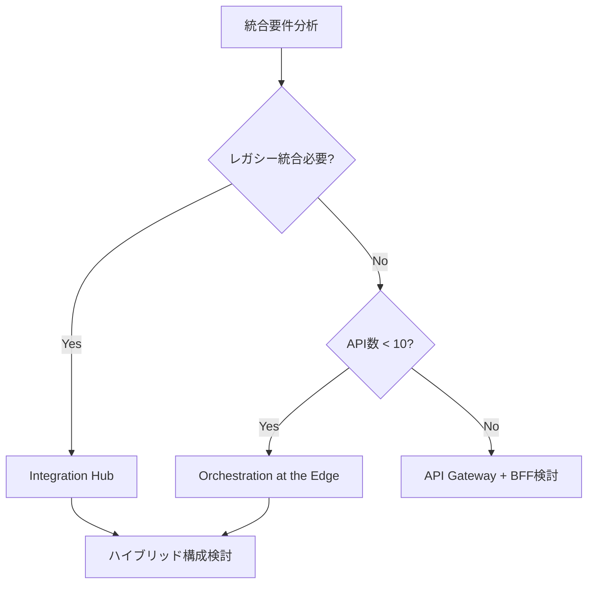

# Parasol V5 デフォルト統合パターン

**作成日**: 2025-12-12
**バージョン**: V5.1
**目的**: Phase 4でのマイクロサービス統合の標準パターン定義

---

## 概要

Parasol V5では、シンプルさと実用性を重視した2つのデフォルト統合パターンを推奨します：

1. **Orchestration at the Edge** - フロントエンドオーケストレーション
2. **Integration Hub Pattern** - レガシー統合ハブ

これらのパターンは、イベント駆動アーキテクチャの複雑さを回避し、理解しやすく運用しやすいシステムを実現します。

---

## パターン1: Orchestration at the Edge（エッジオーケストレーション）

### 概要

フロントエンド（Web/Mobile）が複数のマイクロサービスAPIを直接呼び出し、ビジネスフローを制御するパターン。

### アーキテクチャ

```
┌─────────────────────────────────────────────────────────┐
│              Frontend / Mobile App                       │
│                                                         │
│  // ビジネスフローをフロントエンドで制御                  │
│  async function processOrder() {                        │
│    const inventory = await checkInventory()            │
│    const order = await createOrder()                   │
│    const payment = await processPayment()              │
│    await updateInventory()                             │
│  }                                                      │
│                                                         │
└─────────────────────┬───────────────────────────────────┘
                      │
    ┌─────────────────┼─────────────────┬─────────────────┐
    ▼                 ▼                 ▼                 ▼
┌─────────┐    ┌─────────┐      ┌─────────┐      ┌─────────┐
│Inventory│    │  Order  │      │ Payment │      │Shipping │
│   API   │    │   API   │      │   API   │      │   API   │
└─────────┘    └─────────┘      └─────────┘      └─────────┘
```

### 適用条件

| 条件 | 説明 |
|------|------|
| **推奨** | UIが主導するユースケース |
| **推奨** | マイクロサービス数が少ない（5-10程度） |
| **推奨** | リアルタイム性が重要 |
| **注意** | 複雑なトランザクション管理が必要な場合 |

### 実装ガイドライン

#### 1. API設計原則

```yaml
API設計:
  - RESTful: 標準的なHTTP動詞
  - 冪等性: すべての操作を冪等に
  - エラーコード: 統一されたエラー体系
  - バージョニング: /api/v1形式
```

#### 2. フロントエンド実装

```typescript
// services/order-orchestrator.ts
export class OrderOrchestrator {
  async createOrder(orderData: OrderRequest): Promise<OrderResult> {
    try {
      // 1. 在庫確認（並列実行可能）
      const [inventory, customer] = await Promise.all([
        this.inventoryAPI.checkAvailability(orderData.items),
        this.customerAPI.getCustomer(orderData.customerId)
      ]);
      
      // 2. 検証
      if (!inventory.allAvailable) {
        return { success: false, error: 'INSUFFICIENT_INVENTORY' };
      }
      
      // 3. 注文作成
      const order = await this.orderAPI.create({
        ...orderData,
        customerTier: customer.tier
      });
      
      // 4. 決済処理
      const payment = await this.paymentAPI.process({
        orderId: order.id,
        amount: order.total,
        customerId: customer.id
      });
      
      // 5. 在庫更新（非同期でOK）
      this.inventoryAPI.reserve(order.id, orderData.items)
        .catch(err => this.handleAsyncError(err));
      
      return { success: true, order, payment };
      
    } catch (error) {
      return this.handleError(error);
    }
  }
}
```

#### 3. エラーハンドリング

```typescript
// 統一エラーハンドリング
interface ApiError {
  code: string;
  message: string;
  details?: any;
  retryable: boolean;
}

class ApiClient {
  async request<T>(config: RequestConfig): Promise<T> {
    const response = await fetch(config.url, {
      ...config,
      headers: {
        'X-Request-ID': generateRequestId(),
        'X-Idempotency-Key': config.idempotencyKey,
        ...config.headers
      }
    });
    
    if (!response.ok) {
      throw this.parseError(response);
    }
    
    return response.json();
  }
}
```

---

## パターン2: Integration Hub Pattern（統合ハブ）

### 概要

レガシーシステムや外部システムとの統合を専用のマイクロサービスで管理するパターン。

### アーキテクチャ

```
┌────────────────────────────────────────────────────────┐
│                Core Microservices                      │
│  ┌─────────┐  ┌─────────┐  ┌─────────┐  ┌─────────┐ │
│  │Order MS │  │User MS  │  │Product  │  │Payment  │ │
│  └────┬────┘  └────┬────┘  └────┬────┘  └────┬────┘ │
└───────┼────────────┼────────────┼────────────┼────────┘
        └────────────┴────────────┴────────────┘
                         │
                         ▼
        ┌────────────────────────────────────┐
        │    Integration Hub Service         │
        │  ┌─────────────────────────────┐   │
        │  │ • Anti-Corruption Layer    │   │
        │  │ • データ変換・キャッシュ    │   │
        │  │ • バッチ/リアルタイム統合  │   │
        │  └─────────────────────────────┘   │
        └────────────────┬───────────────────┘
                         │
        ┌────────────────┴────────────────┐
        ▼                ▼                ▼
┌─────────────┐  ┌─────────────┐  ┌─────────────┐
│Legacy ERP   │  │External API │  │Legacy DB    │
└─────────────┘  └─────────────┘  └─────────────┘
```

### 適用条件

| 条件 | 説明 |
|------|------|
| **推奨** | レガシーシステムが存在 |
| **推奨** | 複数の外部システム統合 |
| **推奨** | データ変換が必要 |
| **推奨** | バッチとリアルタイムの混在 |

### 実装ガイドライン

#### 1. 統合ハブの構成

```yaml
integration-hub-service/
├── adapters/              # 外部システム接続アダプター
│   ├── LegacyErpAdapter    # レガシーERP接続
│   ├── ExternalApiAdapter  # 外部API接続
│   └── LegacyDbAdapter     # 直接DB接続
├── transformers/           # データ変換層
│   ├── CustomerTransformer # 顧客データ変換
│   ├── OrderTransformer    # 注文データ変換
│   └── ProductTransformer  # 商品データ変換
├── cache/                  # キャッシュ管理
│   └── CacheService        # キャッシュ戦略実装
├── batch/                  # バッチ処理
│   └── SyncScheduler       # 同期スケジューラー
└── api/                    # API層
    └── IntegrationController # 統合API
```

#### 2. Anti-Corruption Layer（ACL）設計

**概念設計**：
```yaml
Anti-Corruption Layer:
  責務:
    - レガシーモデル検証
    - ドメインモデルへの変換
    - エラーハンドリング
    - データエンリッチメント
  
  変換フロー:
    1. レガシーデータ取得
    2. フォーマット検証
    3. ドメインモデル変換
    4. 追加情報付与
    5. 結果返却
  
  実装パターン:
    - Strategy Pattern: 変換ロジックの切り替え
    - Factory Pattern: 変換器の生成
    - Template Method: 共通変換フローの定義
```

**変換ルールの定義**：
```yaml
# 顧客データ変換マッピング例
CustomerMapping:
  Legacy → Domain:
    CUST_ID → customerId
    CUST_NAME → customerName
    CUST_EMAIL → email
    STATUS_CD → status (変換: 01→Active, 02→Inactive)
    CRT_DT → createdDate (フォーマット変換)
  
  検証ルール:
    - CUST_ID: 必須、数値10桁
    - CUST_NAME: 必須、最大100文字
    - STATUS_CD: 必須、01/02のみ
```

#### 3. キャッシュ戦略

**キャッシュ分類**：

| データタイプ | TTL | 更新戦略 | エラー時 |
|------------|-----|---------|----------|
| **マスタデータ** | 24時間 | バックグラウンド更新 | 古いデータを返却 |
| **トランザクション** | 5-15分 | TTL後に再取得 | エラーを返却 |
| **リアルタイム** | なし | 常に最新取得 | エラーを返却 |

**キャッシュ設計の考慮点**：
```yaml
キャッシュ設計:
  保存先:
    - インメモリ: 高速アクセス、容量制限
    - Redis/Memcached: 分散キャッシュ、永続化オプション
    - ローカルDB: 大容量、複雑なクエリ
  
  無効化戦略:
    - TTLベース: 時間経過で自動無効化
    - イベントベース: 更新通知で無効化
    - 手動: 管理画面から無効化
  
  一貫性保証:
    - 結果整合性: 一時的な不整合を許容
    - 強整合性: 常に最新データ（キャッシュ無効）
```

#### 4. バッチ同期設計

**バッチジョブ定義**：

| ジョブ名 | 実行タイミング | 処理内容 | エラー処理 |
|---------|--------------|---------|-----------|
| **顧客マスタ同期** | 毎日 02:00 | 全件差分同期 | 3回リトライ後アラート |
| **商品マスタ同期** | 6時間ごと | 変更分のみ同期 | 前回成功データ使用 |
| **在庫同期** | 30分ごと | 在庫数更新 | 即座にアラート |
| **価格同期** | 毎日 00:00 | 価格マスタ更新 | 翌日再実行 |

**バッチ処理の設計原則**：
```yaml
バッチ設計原則:
  冪等性:
    - 同じ処理を複数回実行しても結果が同じ
    - 処理済みフラグで重複防止
  
  リカバリ:
    - チェックポイント方式
    - 中断箇所から再開可能
  
  監視:
    - 実行ログ記録
    - 処理件数・時間の記録
    - 異常終了時のアラート
  
  パフォーマンス:
    - バルク処理
    - 並列処理（データ独立性がある場合）
    - オフピーク時間での実行
```

#### 5. エラーハンドリング戦略

```yaml
エラーハンドリング:
  一時的エラー:
    対応: リトライ（指数バックオフ）
    例: ネットワークエラー、タイムアウト
  
  永続的エラー:
    対応: フォールバック or エラー返却
    例: データ不整合、認証エラー
  
  部分的成功:
    対応: 成功分の記録 + 失敗分の再処理
    例: バッチ処理の一部失敗
```

---

## 統合パターンの選択基準

### デシジョンマトリックス

| 要件 | Orchestration at the Edge | Integration Hub |
|------|---------------------------|-----------------|
| レガシーシステム統合 | △ | ◎ |
| リアルタイム性 | ◎ | ○ |
| シンプルさ | ◎ | ○ |
| 大量データ処理 | △ | ◎ |
| 複数システム統合 | ○ | ◎ |
| キャッシュ要件 | △ | ◎ |

### ハイブリッドアプローチ

多くの場合、両パターンの組み合わせが最適：

```
Frontend
    ↓ (Orchestration at the Edge)
Core Microservices
    ↓ (必要に応じて)
Integration Hub
    ↓
Legacy Systems
```

---

## Phase 4での実装手順

### 1. 統合要件の分析

```yaml
統合要件チェックリスト:
  レガシーシステム:
    - [ ] システム数と種類
    - [ ] 通信プロトコル
    - [ ] データ更新頻度
    - [ ] SLA要件
  
  新システム要件:
    - [ ] リアルタイム性
    - [ ] データ整合性
    - [ ] スケーラビリティ
    - [ ] 可用性
```

### 2. パターン選択



### 3. 実装優先順位

1. **Phase 1**: 基本API実装（同期通信）
2. **Phase 2**: Integration Hub（必要な場合）
3. **Phase 3**: キャッシュ・バッチ実装
4. **Phase 4**: 監視・運用機能

---

## まとめ

Parasol V5のデフォルト統合パターンは：

1. **シンプルさを優先** - イベント駆動の複雑さを回避
2. **実用性重視** - 運用しやすく理解しやすい
3. **段階的導入** - 必要に応じて複雑性を追加
4. **ハイブリッド対応** - パターンの組み合わせ可能

これらのパターンにより、保守性が高く、変更しやすいマイクロサービスアーキテクチャを実現できます。