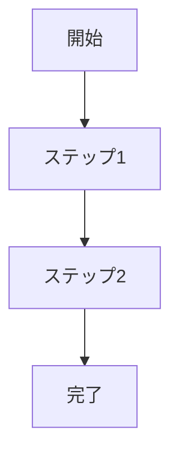
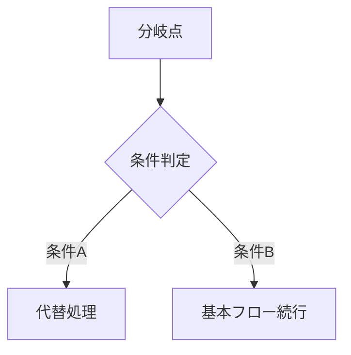
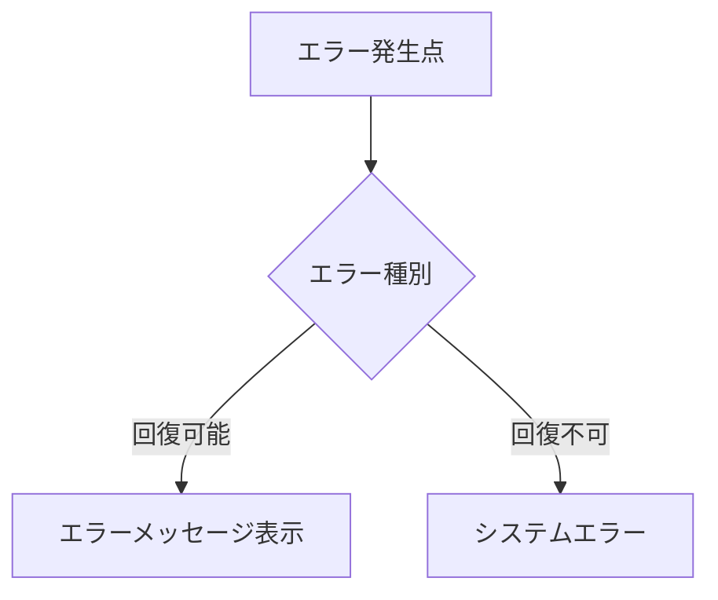

# Parasol V5 vs consultingTool 差分分析レポート

**作成日:** 2025-12-09
**分析対象:**
- **V5 Lite**: amplifier-experiment/.claude/commands/parasol/
- **consultingTool**: consultingTool/docs/parasol/

---

## 1. 全体構造の比較

### 1.1 レイヤー構造

| 観点 | consultingTool | Parasol V5 Lite | 差分 |
|------|---------------|-----------------|------|
| **レイヤー数** | 3層（L1-L2-L3） | 3層（Value-Capability-Software） | 名称が異なるが概念は同一 |
| **L1/Value層** | ビジネスアーキテクチャ | Value Layer（VS0-VS7） | V5はVS-Swimlaneで詳細化 |
| **L2/Capability層** | システム設計（パラソル） | Capability Layer（CL1-CL3） | 概念は同一 |
| **L3/Software層** | サービス実装 | Software Layer | 概念は同一 |

### 1.2 ディレクトリ構造

**consultingTool:**
```
docs/
├── business-architecture/     ← L1: ビジネスアーキテクチャ
│   ├── value-definitions/
│   ├── value-streams/
│   └── value-stages/
├── parasol/                   ← L2: システム設計
│   ├── capabilities/
│   └── business-capabilities/BC-XXX/
│       ├── WHY.md
│       ├── WHAT.md
│       ├── HOW.md
│       ├── domain/
│       ├── api/
│       ├── data/
│       └── capabilities/L3-XXX/operations/OP-XXX/usecases/
└── services/                  ← L3: サービス実装
```

**Parasol V5 Lite:**
```
.claude/commands/parasol/
├── _parasol-overview.md           ← フレームワーク全体
├── _value-methodology.md          ← VS定義
├── _capability-knowledge/         ← ケイパビリティナレッジ
│   └── patterns/
├── _patterns/_axes/               ← 5軸パターン
└── projects/{name}/outputs/       ← プロジェクト出力
    ├── 1-context/
    ├── 2-value/
    ├── 3-capabilities/
    ├── 4-architecture/
    ├── 5-software/
    └── 6-implementation/
```

**差分:**
- consultingToolは固定ディレクトリ構造
- V5 Liteはプロジェクト単位でoutputsを分離

---

## 2. ケイパビリティ階層の比較

### 2.1 階層定義

| 階層 | consultingTool | Parasol V5 | 差分 |
|------|---------------|------------|------|
| **CL1** | Capability L1（大分類） | Domain Classification | 名称が異なるが同一概念 |
| **CL2** | Capability L2（中分類）→BC抽出 | Capability | 同一 |
| **CL3** | Capability L3（小分類）= What | Operation | **差分あり** |
| **Operation** | Business Operation = How | - | V5にはOperation概念なし |
| **UseCase** | UseCase = Implementation | - | V5では未定義 |

### 2.2 L3-Operation階層（重要な差分）

**consultingTool v3.0の定義:**
```
L3 Capability = What（能力の定義）
  └── Business Operation = How（能力を実現する操作）
        └── UseCase = Implementation（操作の具体的実装）
```

**Parasol V5の定義:**
```
CL3 = Operation（操作レベルの実装単位）
  └── Bounded Context
        └── Software Module
```

**主要な差分:**
1. consultingToolはL3とOperationを分離（What vs How）
2. V5はCL3を直接BCにマッピング
3. consultingToolのUseCase層がV5では未定義

### 2.3 数量関係

**consultingTool:**
```
1 BC = 3-5 L3 Capabilities
1 L3 = 2-4 Operations
1 Operation = 1-3 UseCases
```

**Parasol V5:**
```
1 VS = 複数 CL1
1 CL1 = 複数 CL2
1 CL2 = 複数 CL3
1 CL3 = 1 BC（多対多の場合あり）
```

---

## 3. DDD統合の比較

### 3.1 DDDマッピング

| DDD概念 | consultingTool | Parasol V5 |
|---------|---------------|------------|
| **Domain** | BC | VS |
| **Subdomain** | L3 Capability | CL2 (Capability) |
| **Bounded Context** | BC-XXX | CL3 (Operation) |
| **Aggregate** | domain/aggregates.md | 未定義 |
| **Entity** | domain/entities.md | 未定義 |
| **Value Object** | domain/value-objects.md | 未定義 |
| **Domain Service** | ドメインサービス定義 | 未定義 |
| **Domain Event** | ドメインイベント定義 | 未定義 |

### 3.2 ドメイン言語定義

**consultingToolにあってV5にないもの:**
- エンティティ詳細定義
- 値オブジェクト定義
- 集約定義
- ドメインサービス定義
- ドメインイベント定義
- ビジネス不変条件
- Mermaidクラス図自動生成

---

## 4. API/データベース設計の比較

### 4.1 API設計

| 項目 | consultingTool | Parasol V5 |
|------|---------------|------------|
| **API仕様書** | api-specification.md（620行） | 未定義 |
| **REST設計原則** | 詳細定義あり | 未定義 |
| **認証・認可** | JWT Bearer Token, RBAC | 未定義 |
| **エラーコード** | 標準化済み | 未定義 |
| **ページネーション** | 標準化済み | 未定義 |
| **レート制限** | 定義済み | 未定義 |
| **WebSocket** | 定義済み | 未定義 |

### 4.2 データベース設計

| 項目 | consultingTool | Parasol V5 |
|------|---------------|------------|
| **DB設計書** | database-design.md（821行） | 未定義 |
| **ER図** | Mermaid形式で定義 | 未定義 |
| **テーブル設計** | 詳細定義（制約含む） | 未定義 |
| **インデックス設計** | パーシャルインデックス含む | 未定義 |
| **パーティショニング** | 戦略定義済み | 未定義 |
| **ビュー定義** | SQL定義済み | 未定義 |
| **ストアドプロシージャ** | 定義済み | 未定義 |
| **トリガー** | 定義済み | 未定義 |

---

## 5. UseCase/Page設計の比較

### 5.1 UseCase設計

**consultingToolの特徴:**
- 詳細なUseCase定義テンプレート
- 基本フロー/代替フロー/例外フローのMermaid図
- ロバストネス図（BCE要素）
- 1 UseCase = 1 Page の対応

**Parasol V5:**
- UseCase層は未定義
- ロバストネス図なし
- Page定義なし

### 5.2 フロー定義パターン

**consultingTool:**
```markdown
### 基本フロー


### 代替フロー


### 例外フロー

```

**Parasol V5:** なし

---

## 6. 命名規則の比較

### 6.1 ケイパビリティ命名

**consultingTool:**
```
❌ 禁止: 「XXX管理」形式
✅ 推奨: 「XXXする能力」形式

例:
❌ 顧客管理 → ✅ 顧客エンゲージメントを強化する能力
❌ 在庫管理 → ✅ 在庫を最適化する能力
```

**Parasol V5:**
- 明示的な命名規則なし
- VS-Swimlaneモデルの命名は存在

### 6.2 オペレーション命名

**consultingTool:**
```
パターン: 「動詞 + 目的語 + （成果）」
推奨: 「〜を実現する」「〜を最適化する」
避ける: 「〜管理」「〜処理」

例:
❌ プロジェクト登録 → ✅ プロジェクトを立ち上げ成功に導く
❌ 請求書発行 → ✅ 価値提供に基づき収益を確保する
```

**Parasol V5:** 明示的な命名規則なし

---

## 7. V5に不足している要素（要追加候補）

### 7.1 高優先度（Phase 5-6に必須）

| 要素 | 重要度 | 理由 |
|------|--------|------|
| **L3-Operation分離** | ⭐⭐⭐ | What/How分離による設計品質向上 |
| **UseCase設計テンプレート** | ⭐⭐⭐ | 実装者への明確なガイダンス |
| **API設計標準** | ⭐⭐⭐ | REST API実装の一貫性確保 |
| **DB設計テンプレート** | ⭐⭐⭐ | データ設計の標準化 |
| **ドメイン言語テンプレート** | ⭐⭐⭐ | DDDモデリングの具体化 |

### 7.2 中優先度

| 要素 | 重要度 | 理由 |
|------|--------|------|
| **命名規則ガイド** | ⭐⭐ | 一貫性のある設計 |
| **Page定義テンプレート** | ⭐⭐ | UI設計の標準化 |
| **Mermaid図自動生成** | ⭐⭐ | ドキュメント品質向上 |
| **ロバストネス図** | ⭐⭐ | BCE分析の明確化 |

### 7.3 低優先度

| 要素 | 重要度 | 理由 |
|------|--------|------|
| **WebSocket仕様** | ⭐ | リアルタイム通信必要時 |
| **パーティショニング戦略** | ⭐ | 大規模システム対応時 |
| **PITR設計** | ⭐ | 本番運用時 |

---

## 8. 統合提案

### 8.1 推奨アプローチ

```
Parasol V5（現状）
├── Phase 1-3: 価値・ケイパビリティ定義（現行維持）
│   └── VS-Swimlane、CL1-CL2-CL3（現行のまま）
│
├── Phase 4: アーキテクチャ設計（consultingTool統合）
│   ├── BC設計テンプレート（WHY/WHAT/HOW分離）← NEW
│   └── Context Map定義 ← 既存強化
│
├── Phase 5: ソフトウェア設計（consultingTool統合）
│   ├── L3-Operation分離（What/How）← NEW
│   ├── UseCase設計テンプレート ← NEW
│   ├── ドメイン言語テンプレート ← NEW
│   ├── API設計テンプレート ← NEW
│   └── DB設計テンプレート ← NEW
│
└── Phase 6: 実装（consultingTool統合）
    ├── 実装ガイドテンプレート ← NEW
    └── Page定義テンプレート ← NEW
```

### 8.2 コピー済み資料一覧

```
_software-design-reference/
├── PARASOL_LAYERED_DIRECTORY_STRATEGY.md  ← 3層分離戦略
├── PARASOL_L3_OPERATION_HIERARCHY_CORRECTION.md  ← L3-Operation関係
├── business-operations.md  ← UseCase設計パターン
├── naming-conventions.md  ← 命名規則
├── api-specification.md  ← API設計テンプレート
├── database-design.md  ← DB設計テンプレート
├── domain-language.md  ← ドメイン言語テンプレート
├── integration-specification.md  ← 統合仕様
├── mvp-implementation-plan.md  ← 実装計画
└── README.md  ← 概要
```

---

## 9. 次のステップ

### 9.1 即座に実施可能

1. **Phase 5コマンドの拡張**
   - `5-software.md`にL3-Operation分離ガイダンスを追加
   - UseCase設計テンプレートへの参照を追加

2. **テンプレートの参照追加**
   - API設計テンプレート参照
   - DB設計テンプレート参照
   - ドメイン言語テンプレート参照

### 9.2 中期的に実施

1. **命名規則ガイドの統合**
   - ケイパビリティ命名規則
   - オペレーション命名規則

2. **Mermaid図生成ガイド**
   - クラス図テンプレート
   - ER図テンプレート
   - フロー図テンプレート

### 9.3 長期的に検討

1. **自動生成ツール**
   - ドメインクラス図自動生成
   - ER図自動生成
   - API仕様書自動生成

---

## 10. まとめ

### 10.1 主要な差分

| 領域 | consultingTool | Parasol V5 | 優先対応 |
|------|---------------|------------|----------|
| 価値定義 | シンプル | VS-Swimlane詳細 | V5が優位 |
| ケイパビリティ | L3-Operation分離 | CL3直接BC | consultingTool統合 |
| DDD | 詳細定義あり | マッピングのみ | consultingTool統合 |
| API設計 | 完全な仕様書 | 未定義 | consultingTool統合 |
| DB設計 | 完全な仕様書 | 未定義 | consultingTool統合 |
| UseCase | 詳細テンプレート | 未定義 | consultingTool統合 |

### 10.2 統合後の期待効果

- **Phase 5-6の具体化**: 実装可能な詳細設計の提供
- **DDDモデリングの強化**: ドメイン言語の明確化
- **API/DB設計の標準化**: 一貫性のある実装
- **UseCase駆動開発**: 要件と実装の追跡可能性向上

---

**このドキュメントについて**

本分析は以下のソースを比較して作成:
- amplifier-experiment/.claude/commands/parasol/（V5 Lite）
- consultingTool/docs/parasol/（consultingTool v3.0）
