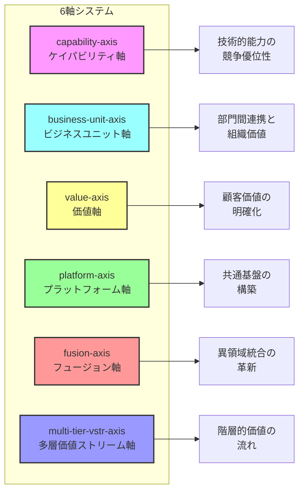

# 付録A　実践リファレンス

この付録は、Parasol V5を実践する際に必要な情報を素早く参照できるリファレンスです。日々の開発作業で手元に置いてご活用ください。

## A.1 フェーズ別チェックリスト

### Phase 0：現状理解

```yaml
phase0_checklist:
  □ ビジネスコンテキストの把握
    □ 事業戦略の確認
    □ 競合環境の分析
    □ 市場トレンドの理解
    
  □ 組織構造の理解
    □ 意思決定プロセス
    □ 部門間の関係性
    □ 文化と価値観
    
  □ 技術資産の棚卸し
    □ 既存システム一覧
    □ 技術スタック
    □ 技術的負債
    
  □ 制約条件の特定
    □ 規制要件
    □ 予算制限
    □ 時間制約
    □ 人的リソース
    
  □ 成果物
    □ 現状分析報告書
    □ ステークホルダーマップ
    □ 制約条件一覧
```

### Phase 1：コンテキスト定義

```yaml
phase1_checklist:
  □ ステークホルダー分析
    □ 主要ステークホルダーの特定
    □ 期待値のヒアリング
    □ 影響力と関心度のマッピング
    
  □ ビジネス目標の明確化
    □ 短期目標（1年）
    □ 中期目標（3年）
    □ 長期ビジョン（5年以上）
    
  □ 成功基準の定義
    □ 定量的KPI
    □ 定性的評価項目
    □ 測定方法
    
  □ プロジェクト憲章
    □ スコープ定義
    □ 前提条件
    □ リスク初期評価
    
  □ 成果物
    □ プロジェクト憲章
    □ ステークホルダー分析書
    □ 成功基準定義書
```

### Phase 2：価値発見と価値設計

```yaml
phase2_checklist:
  □ 価値の洗い出し
    □ ブレインストーミング実施
    □ ステークホルダー別価値マップ
    □ 価値の相互関係分析
    
  □ 価値の優先順位付け
    □ ビジネスインパクト評価
    □ 実現難易度評価
    □ 優先順位マトリックス
    
  □ 価値の定量化
    □ KPI定義
    □ ベースライン測定
    □ 目標値設定
    
  □ 6軸分析
    □ 適用する軸の選択（3軸）
    □ 各軸での価値分析
    □ 統合価値マップ作成
    
  □ 成果物
    □ 価値定義書
    □ 6軸分析結果
    □ 価値実現ロードマップ
```

### Phase 3：ケイパビリティ分解

```yaml
phase3_checklist:
  □ ケイパビリティの識別
    □ 価値からの逆算
    □ 必要能力の洗い出し
    □ 依存関係の分析
    
  □ ケイパビリティの分類
    □ Core（中核）
    □ Supporting（支援）
    □ Generic（汎用）
    
  □ 実装優先順位
    □ 価値貢献度
    □ 技術的依存性
    □ リソース要求
    
  □ 境界の定義
    □ Bounded Context設計
    □ インターフェース定義
    □ データモデル概要
    
  □ 成果物
    □ ケイパビリティマップ
    □ Bounded Context図
    □ 実装優先順位表
```

### Phase 4-7：アーキテクチャから実装まで

```yaml
phase4_7_checklist:
  □ Phase 4：論理アーキテクチャ
    □ 全体構造設計
    □ 主要コンポーネント定義
    □ 統合ポイント特定
    □ 成果物：論理アーキテクチャ図
    
  □ Phase 5：アプリケーション設計
    □ 詳細設計書作成
    □ API仕様定義
    □ データモデル詳細
    □ 成果物：詳細設計書
    
  □ Phase 6：データとサービス
    □ データベース設計
    □ サービス実装
    □ API開発
    □ 成果物：動作するサービス
    
  □ Phase 7：基盤実装
    □ インフラ構築
    □ CI/CDパイプライン
    □ 監視・運用設定
    □ 成果物：本番稼働環境
```

## A.2 6軸システム早見表

### 6軸システムの視覚的理解



### 軸の選択ガイド

```yaml
axis_selection_guide:
  capability_axis:
    use_when:
      - "技術的能力が競争優位の源泉"
      - "複雑な処理能力が必要"
      - "スケーラビリティが重要"
    not_when:
      - "ビジネスプロセスが単純"
      - "技術より人的要素が重要"
      
  business_unit_axis:
    use_when:
      - "部門間連携が成功の鍵"
      - "組織横断的な価値創造"
      - "M&A後の統合"
    not_when:
      - "単一部門で完結"
      - "組織が小規模"
      
  value_axis:
    use_when:
      - "顧客価値が最優先"
      - "価値の定義が複雑"
      - "ステークホルダーが多様"
    not_when:
      - "価値が明確で単純"
      - "内部効率化のみ"
      
  platform_axis:
    use_when:
      - "共通基盤が必要"
      - "エコシステム構築"
      - "データ統合が鍵"
    not_when:
      - "独立システムで十分"
      - "統合コストが高すぎる"
      
  fusion_axis:
    use_when:
      - "異なる領域の統合"
      - "革新的サービス創造"
      - "業界の境界を越える"
    not_when:
      - "単一領域で完結"
      - "統合リスクが高い"
      
  multi_tier_vstr_axis:
    use_when:
      - "階層的な組織構造"
      - "ローカル最適化も重要"
      - "地理的分散"
    not_when:
      - "フラットな組織"
      - "中央集権が必須"
```

### 3軸組み合わせパターン

```yaml
recommended_combinations:
  pattern_1_standard:
    name: "標準エンタープライズ"
    axes: ["capability", "value", "platform"]
    suitable_for:
      - "大企業のDX"
      - "基幹システム刷新"
      - "全社統合プロジェクト"
      
  pattern_2_innovation:
    name: "イノベーション型"
    axes: ["value", "fusion", "capability"]
    suitable_for:
      - "新規事業創造"
      - "破壊的イノベーション"
      - "異業種連携"
      
  pattern_3_organizational:
    name: "組織変革型"
    axes: ["business_unit", "value", "platform"]
    suitable_for:
      - "組織再編"
      - "M&A統合"
      - "グループ経営改革"
      
  pattern_4_hierarchical:
    name: "階層管理型"
    axes: ["multi_tier_vstr", "capability", "platform"]
    suitable_for:
      - "多拠点展開"
      - "フランチャイズ"
      - "グローバル企業"
      
  pattern_5_customer_centric:
    name: "顧客中心型"
    axes: ["value", "capability", "business_unit"]
    suitable_for:
      - "B2Cサービス"
      - "顧客体験改革"
      - "オムニチャネル"
```

## A.3 価値定義テンプレート

### 基本テンプレート

```yaml
value_definition_template:
  value_id: "V-YYYY-NNN"
  value_name: "具体的でわかりやすい名前"
  
  description:
    what: "何を実現するか"
    why: "なぜ必要か"
    for_whom: "誰のためか"
    
  measurement:
    baseline:
      metric: "現在の測定値"
      measured_at: "測定日時"
      method: "測定方法"
      
    target:
      metric: "目標値"
      by_when: "達成期限"
      stretch: "ストレッチ目標"
      
    kpi:
      primary: "主要KPI"
      secondary: ["副次的KPI1", "副次的KPI2"]
      
  stakeholders:
    primary:
      who: "主要ステークホルダー"
      benefit: "得られる利益"
      
    secondary:
      - who: "関連ステークホルダー"
        impact: "影響内容"
        
  dependencies:
    prerequisite_values: ["前提となる価値"]
    required_capabilities: ["必要なケイパビリティ"]
    external_factors: ["外部要因"]
    
  risks:
    - risk: "リスク内容"
      probability: "high/medium/low"
      impact: "high/medium/low"
      mitigation: "軽減策"
```

### 記入例

```yaml
value_example:
  value_id: "V-2024-001"
  value_name: "注文処理時間の短縮"
  
  description:
    what: "注文受付から出荷までの時間を72時間から24時間に短縮"
    why: "競合他社との差別化、顧客満足度向上"
    for_whom: "ECサイト利用顧客"
    
  measurement:
    baseline:
      metric: "平均72時間"
      measured_at: "2024-01-15"
      method: "注文DBからの自動集計"
      
    target:
      metric: "平均24時間以内"
      by_when: "2024-12-31"
      stretch: "12時間以内（都市部）"
      
    kpi:
      primary: "平均処理時間"
      secondary: ["顧客満足度スコア", "リピート率"]
      
  stakeholders:
    primary:
      who: "EC顧客"
      benefit: "商品を早く受け取れる"
      
    secondary:
      - who: "物流部門"
        impact: "業務プロセス変更"
      - who: "カスタマーサポート"
        impact: "問い合わせ減少"
        
  dependencies:
    prerequisite_values: ["在庫可視化"]
    required_capabilities: ["リアルタイム在庫管理", "自動発注"]
    external_factors: ["配送業者の協力"]
    
  risks:
    - risk: "物流キャパシティ不足"
      probability: "medium"
      impact: "high"
      mitigation: "段階的展開、繁忙期対策"
```

## A.4 ケイパビリティ定義テンプレート

### 基本テンプレート

```yaml
capability_definition_template:
  capability_id: "C-YYYY-NNN"
  capability_name: "具体的な能力名"
  
  description:
    what: "何をする能力か"
    how: "どのように実現するか"
    scope: "能力の範囲"
    
  classification:
    type: "Core | Supporting | Generic"
    domain: "業務領域"
    maturity: "Initial | Developing | Mature | Optimizing"
    
  value_contribution:
    contributes_to: ["貢献する価値ID"]
    contribution_level: "Critical | High | Medium | Low"
    
  requirements:
    functional:
      - "機能要件1"
      - "機能要件2"
    non_functional:
      performance: "性能要件"
      scalability: "拡張性要件"
      security: "セキュリティ要件"
      
  implementation:
    approach: "実装アプローチ"
    technology_stack: ["使用技術"]
    estimated_effort: "想定工数"
    
  interfaces:
    consumes: ["依存するケイパビリティ"]
    provides: ["提供する機能"]
    events: ["発行/購読するイベント"]
    
  metrics:
    operational:
      - metric: "稼働率"
        target: "99.9%"
    business:
      - metric: "処理件数"
        target: "10,000/日"
```

## A.5 トラブルシューティングガイド

### よくある問題と対策

```yaml
troubleshooting_guide:
  problem_1_value_drift:
    symptoms:
      - "当初の目的から逸脱"
      - "機能追加の暴走"
      - "ROIが説明できない"
    diagnosis:
      - "価値定義書の確認"
      - "トレーサビリティチェック"
      - "ステークホルダーヒアリング"
    solutions:
      immediate:
        - "開発一時停止"
        - "価値の再確認"
        - "不要機能の削除"
      preventive:
        - "週次価値レビュー"
        - "価値ダッシュボード"
        - "定期的な棚卸し"
        
  problem_2_complexity_explosion:
    symptoms:
      - "理解困難な設計"
      - "変更が困難"
      - "テスト不可能"
    diagnosis:
      - "依存関係の可視化"
      - "複雑度メトリクス"
      - "チーム理解度調査"
    solutions:
      immediate:
        - "複雑性の可視化"
        - "リファクタリング"
        - "設計の簡素化"
      preventive:
        - "KISS原則の徹底"
        - "定期的な設計レビュー"
        - "複雑度の監視"
        
  problem_3_stakeholder_disconnect:
    symptoms:
      - "要求の頻繁な変更"
      - "成果物への不満"
      - "コミュニケーション不足"
    diagnosis:
      - "期待値のギャップ分析"
      - "コミュニケーション頻度"
      - "理解度の確認"
    solutions:
      immediate:
        - "緊急ミーティング"
        - "期待値の再調整"
        - "デモの実施"
      preventive:
        - "定期的なデモ"
        - "早期のフィードバック"
        - "継続的な対話"
```

## A.6 品質チェックリスト

### 価値実現の品質

```yaml
value_quality_checklist:
  □ 価値の明確性
    □ 測定可能な定義
    □ ステークホルダー合意
    □ 実現期限の設定
    
  □ トレーサビリティ
    □ 価値→ケイパビリティ
    □ ケイパビリティ→実装
    □ 実装→テスト
    
  □ 進捗の可視性
    □ KPIダッシュボード
    □ 定期的な測定
    □ 偏差の早期発見
    
  □ 価値の実現確認
    □ 目標達成度
    □ 副次的効果
    □ 想定外の影響
```

### 技術的品質

```yaml
technical_quality_checklist:
  □ アーキテクチャ品質
    □ 疎結合性
    □ 拡張可能性
    □ 保守容易性
    
  □ コード品質
    □ 可読性
    □ テストカバレッジ
    □ 技術的負債
    
  □ 運用品質
    □ 監視設定
    □ ログ設計
    □ 障害対応手順
    
  □ セキュリティ品質
    □ 脆弱性診断
    □ アクセス制御
    □ データ保護
```

## A.7 プロジェクト評価指標

### 成功度評価

```yaml
project_evaluation_metrics:
  business_metrics:
    value_realization:
      formula: "実現価値数 / 定義価値数 × 100"
      target: "> 90%"
      
    roi:
      formula: "(価値創出額 - 投資額) / 投資額 × 100"
      target: "> 200%"
      
    time_to_value:
      formula: "価値実現までの期間"
      target: "< 6ヶ月"
      
  technical_metrics:
    architecture_health:
      coupling: "疎結合度スコア"
      complexity: "循環的複雑度"
      debt_ratio: "技術的負債比率"
      
    operational_excellence:
      availability: "> 99.9%"
      performance: "応答時間 < 200ms"
      scalability: "負荷増加への対応力"
      
  team_metrics:
    productivity:
      velocity: "ストーリーポイント/スプリント"
      quality: "欠陥密度"
      
    satisfaction:
      team_nps: "> 50"
      retention: "> 90%"
      
  stakeholder_metrics:
    satisfaction:
      nps_score: "> 70"
      adoption_rate: "> 80%"
      
    engagement:
      participation: "レビュー出席率"
      feedback: "フィードバック実施率"
```

## A.8 コミュニケーションテンプレート

### ステークホルダー報告

```yaml
stakeholder_report_template:
  executive_summary:
    period: "報告期間"
    highlights: ["主要成果1", "主要成果2", "主要成果3"]
    issues: ["課題1", "課題2"]
    
  value_status:
    realized:
      - value: "実現した価値"
        kpi: "達成KPI"
        impact: "ビジネスインパクト"
        
    in_progress:
      - value: "実装中の価値"
        completion: "完成度%"
        target_date: "完了予定"
        
    planned:
      - value: "計画中の価値"
        start_date: "開始予定"
        dependencies: "前提条件"
        
  metrics_dashboard:
    business:
      metric: "現在値 (前回比)"
    technical:
      metric: "現在値 (目標値)"
    team:
      metric: "現在値 (傾向)"
      
  next_steps:
    immediate: ["今週のアクション"]
    short_term: ["今月の計画"]
    risks: ["要注意事項"]
    
  appendix:
    detailed_metrics: "詳細データへのリンク"
    technical_details: "技術仕様へのリンク"
```

### チーム内コミュニケーション

```yaml
team_communication_templates:
  daily_standup:
    yesterday:
      value_contributed: "昨日貢献した価値"
      completed_tasks: ["完了タスク"]
      
    today:
      target_value: "今日の価値目標"
      planned_tasks: ["予定タスク"]
      
    blockers:
      issue: "ブロッカー内容"
      need: "必要な支援"
      
  sprint_planning:
    sprint_goal: "価値実現目標"
    selected_stories:
      - story: "ストーリー名"
        value: "貢献する価値"
        points: "見積もり"
        
  retrospective:
    went_well: ["うまくいったこと"]
    challenges: ["課題だったこと"]
    improvements: ["改善アクション"]
    value_reflection: "価値実現の振り返り"
```

## A.9 ツールとリソース

### 推奨ツール

```yaml
recommended_tools:
  planning:
    value_mapping:
      - name: "Miro/Mural"
        use_for: "価値マップ作成"
      - name: "draw.io"
        use_for: "アーキテクチャ図"
        
    project_management:
      - name: "Jira + V5プラグイン"
        use_for: "価値トラッキング"
      - name: "Azure DevOps"
        use_for: "統合管理"
        
  development:
    modeling:
      - name: "Event Storming tools"
        use_for: "ドメインモデリング"
      - name: "C4 model tools"
        use_for: "アーキテクチャ記述"
        
    implementation:
      - name: "Claude Code"
        use_for: "AI協働開発"
      - name: "GitHub Copilot"
        use_for: "コード補完"
        
  monitoring:
    business:
      - name: "Tableau/PowerBI"
        use_for: "KPIダッシュボード"
      - name: "Google Analytics"
        use_for: "ユーザー行動分析"
        
    technical:
      - name: "Datadog/New Relic"
        use_for: "システム監視"
      - name: "ELK Stack"
        use_for: "ログ分析"
```

### 学習リソース

```yaml
learning_resources:
  books:
    - title: "Domain-Driven Design"
      author: "Eric Evans"
      relevance: "DDDの基礎"
      
    - title: "Building Evolutionary Architectures"
      author: "Neal Ford et al."
      relevance: "進化的アーキテクチャ"
      
  online_courses:
    - name: "V5 Fundamentals"
      platform: "Parasol Academy"
      duration: "40時間"
      
    - name: "Value-Driven Development"
      platform: "Coursera"
      duration: "6週間"
      
  communities:
    - name: "Parasol V5 User Group"
      platform: "Slack"
      members: "5000+"
      
    - name: "Value Architects Forum"
      platform: "Discord"
      focus: "価値設計の議論"
      
  conferences:
    - name: "ParasolConf"
      frequency: "年次"
      topics: ["最新事例", "新機能", "ネットワーキング"]
      
    - name: "Value-Driven Summit"
      frequency: "隔年"
      topics: ["価値創造", "測定手法", "組織変革"]
```

## A.10 緊急時対応ガイド

### インシデント対応

```yaml
incident_response_guide:
  severity_levels:
    critical:
      definition: "価値提供が完全停止"
      response_time: "15分以内"
      escalation: "即座に経営層へ"
      
    high:
      definition: "主要価値に影響"
      response_time: "1時間以内"
      escalation: "部門長へ"
      
    medium:
      definition: "一部機能に影響"
      response_time: "4時間以内"
      escalation: "チームリードへ"
      
    low:
      definition: "軽微な影響"
      response_time: "1営業日以内"
      escalation: "通常フロー"
      
  response_steps:
    1_assess:
      - "影響範囲の特定"
      - "重要度の判定"
      - "関係者への初期連絡"
      
    2_contain:
      - "被害拡大の防止"
      - "一時的な回避策"
      - "ユーザーへの通知"
      
    3_resolve:
      - "根本原因の特定"
      - "恒久対策の実施"
      - "テストと確認"
      
    4_review:
      - "事後分析"
      - "再発防止策"
      - "ドキュメント更新"
```

---

この付録は、日々の実践で必要な情報を素早く参照できるよう設計されています。プロジェクトの各フェーズで適切なセクションを参照し、V5の価値を最大限に引き出してください。

定期的に更新される最新情報は、Parasol V5公式サイトでご確認ください。