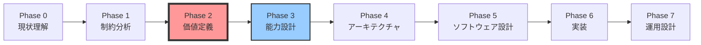
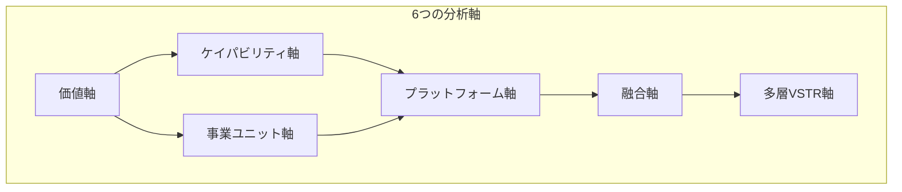
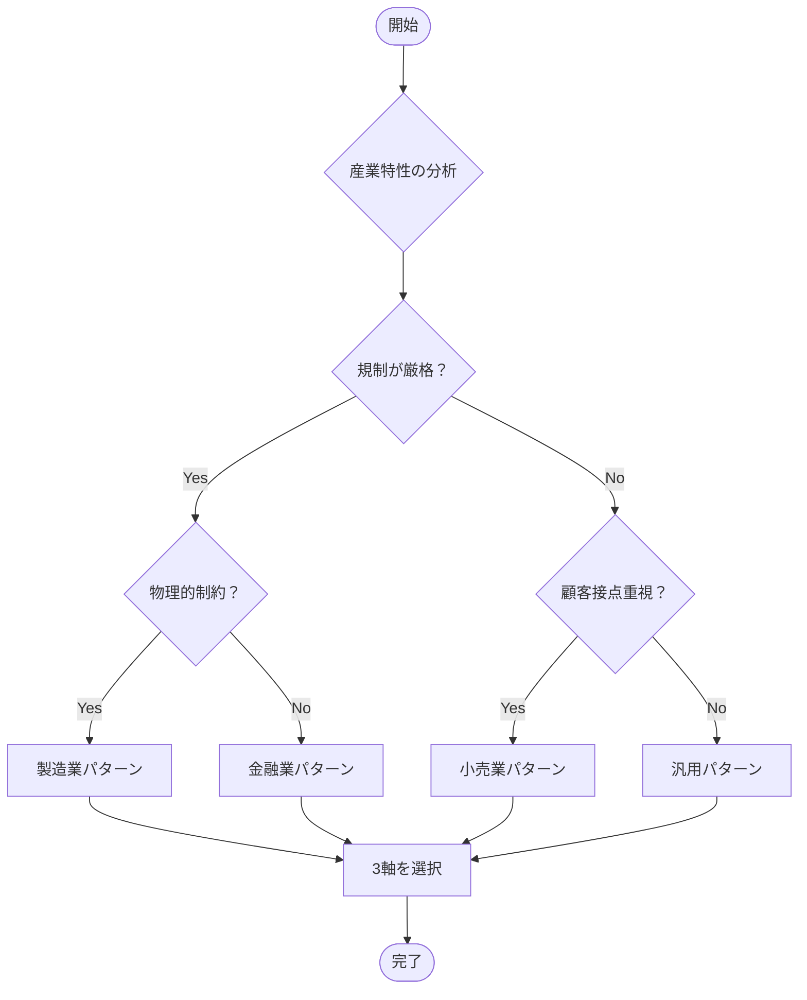

# サンプルMermaid図

このファイルは、書籍に含める図表のサンプルです。

## V5フェーズフロー

```mermaid
graph LR
    P0[Phase 0<br>現状理解] --> P1[Phase 1<br>制約分析]
    P1 --> P2[Phase 2<br>価値定義]
    P2 --> P3[Phase 3<br>能力設計]
    P3 --> P4[Phase 4<br>アーキテクチャ]
    P4 --> P5[Phase 5<br>ソフトウェア設計]
    P5 --> P6[Phase 6<br>実装]
    P6 --> P7[Phase 7<br>運用設計]
    
    style P2 fill:#ff9999,stroke:#333,stroke-width:4px
    style P3 fill:#99ccff,stroke:#333,stroke-width:2px
```

## 6軸システムの関係

```mermaid
graph TB
    subgraph "6つの分析軸"
        A1[ケイパビリティ軸]
        A2[事業ユニット軸]
        A3[価値軸]
        A4[プラットフォーム軸]
        A5[融合軸]
        A6[多層VSTR軸]
    end
    
    A3 --> A1
    A3 --> A2
    A1 --> A4
    A2 --> A4
    A4 --> A5
    A5 --> A6
```

## 産業パターンの選択フロー

```mermaid
flowchart TD
    Start([開始]) --> Q1{産業特性の分析}
    Q1 --> Q2{規制が厳格？}
    Q2 -->|Yes| Q3{物理的制約？}
    Q2 -->|No| Q4{顧客接点重視？}
    
    Q3 -->|Yes| P1[製造業パターン]
    Q3 -->|No| P2[金融業パターン]
    
    Q4 -->|Yes| P3[小売業パターン]
    Q4 -->|No| P4[汎用パターン]
    
    P1 --> Select[3軸を選択]
    P2 --> Select
    P3 --> Select
    P4 --> Select
    
    Select --> End([完了])
```