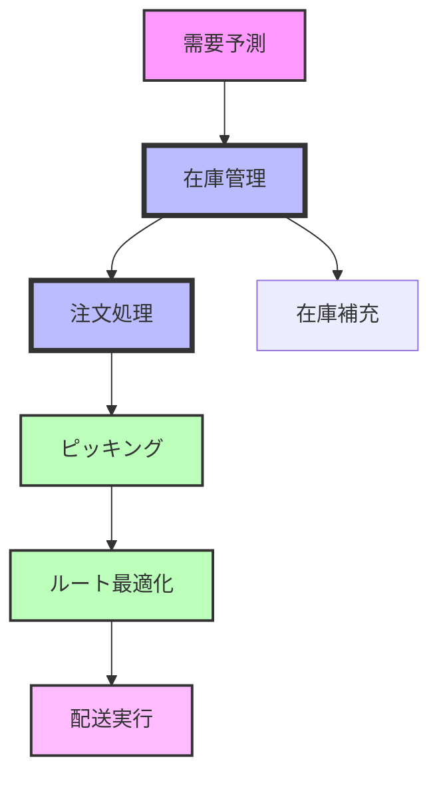
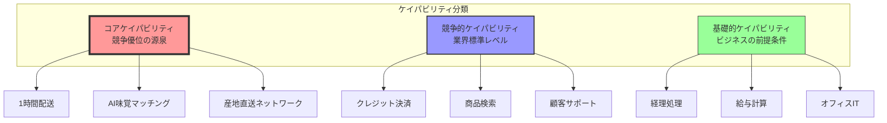

# 第7章　Phase 3：ケイパビリティ分解 ― 価値を実現する能力を設計する

## はじめに：できることとやりたいこと

ある企業の経営戦略会議でのことです。

「我が社は、顧客への即日配送を実現します！」

社長の力強い宣言に、役員たちは拍手を送りました。素晴らしいビジョンです。顧客価値も明確です。

3ヶ月後、プロジェクトは暗礁に乗り上げていました。

「在庫情報がリアルタイムで分からない...」
「配送業者とのシステム連携ができていない...」
「そもそも注文を即座に処理する仕組みがない...」

価値（やりたいこと）は明確でした。でも、それを実現する能力（できること）の設計が欠けていたのです。

この章では、Phase 2で発見した「価値」を、実現可能な「能力」に分解する技術を学びます。夢を現実にする、最も重要なステップです。

## ケイパビリティとは何か

### 能力の本質的な理解

ケイパビリティ（能力）とは、「組織が価値を生み出すために必要な、具体的にできること」です。

```yaml
capability_definition:
  what_it_is:
    - "価値を実現する具体的な能力"
    - "人・プロセス・技術の統合"
    - "測定可能な成果を生む仕組み"
    
  what_it_is_not:
    - "単なる機能やツール"
    - "部門や組織"
    - "一時的なプロジェクト"
    
  examples:
    good_capability:
      - "24時間以内に注文を配送する能力"
      - "顧客の購買履歴から最適な商品を推薦する能力"
      - "在庫を店舗間で融通する能力"
      
    not_capability:
      - "ECサイト" ← これはチャネル
      - "物流部門" ← これは組織
      - "在庫管理システム" ← これはツール
```

### ケイパビリティの3要素

優れたケイパビリティは、3つの要素が統合されています。

```yaml
capability_elements:
  people:  # 人
    skills: "必要なスキルと知識"
    roles: "明確な役割と責任"
    culture: "実行を支える文化"
    
  process:  # プロセス
    workflow: "価値を生む手順"
    rules: "意思決定の基準"
    metrics: "成果の測定方法"
    
  technology:  # 技術
    systems: "実現するシステム"
    data: "必要な情報"
    integration: "連携の仕組み"
    
  # 悪い例：技術だけに偏る
  bad_example:
    "最新のAIを導入しました！"
    → でも使える人がいない
    → プロセスも未整備
    → 結果：宝の持ち腐れ
    
  # 良い例：3要素の統合
  good_example:
    "AI需要予測能力"
    → データサイエンティストを採用（人）
    → 予測→発注の業務フロー確立（プロセス）
    → 機械学習基盤を構築（技術）
```

## Phase 3の実践：ケイパビリティマップの作成

### ステップ1：価値からケイパビリティを導出

Phase 2で定義した価値から、必要な能力を論理的に導き出します。

**事例：オンライン食品スーパーの場合**

```yaml
value_to_capability_mapping:
  value_1: "注文から2時間以内に配送"
  
  required_capabilities:
    1_order_processing:
      name: "高速注文処理能力"
      description: "注文を即座に処理し、配送準備を開始"
      target: "受注から5分以内に処理完了"
      
    2_inventory_visibility:
      name: "リアルタイム在庫管理能力"
      description: "全拠点の在庫を秒単位で把握"
      target: "在庫情報の遅延1秒以内"
      
    3_route_optimization:
      name: "動的配送ルート最適化能力"
      description: "交通状況を考慮した最適ルート算出"
      target: "ルート計算30秒以内"
      
    4_picking_efficiency:
      name: "高速ピッキング能力"
      description: "注文商品を効率的に集める"
      target: "50商品を10分以内"
      
    5_last_mile_delivery:
      name: "ラストマイル配送能力"
      description: "顧客宅への確実な配送"
      target: "指定時間の±15分"
```

### ステップ2：ケイパビリティの依存関係分析

能力は独立して存在するのではなく、相互に依存しています。

```yaml
capability_dependencies:
  high_speed_delivery:
    core_capability: "2時間配送能力"
    
    depends_on:
      critical:  # 必須依存
        - real_time_inventory: "在庫がなければ配送できない"
        - order_processing: "注文を受けられなければ始まらない"
        
      important:  # 重要依存
        - route_optimization: "効率が落ちるが配送は可能"
        - customer_communication: "不安を与えるが配送は可能"
        
      nice_to_have:  # あれば良い
        - demand_prediction: "在庫効率が上がる"
        - packaging_automation: "コストが下がる"
        
```

### ケイパビリティ依存関係の可視化



### ステップ3：ケイパビリティの成熟度評価

現在の能力レベルを正直に評価します。

```yaml
capability_maturity_assessment:
  levels:
    level_0_none: "能力なし"
    level_1_initial: "属人的・場当たり的"
    level_2_developing: "部分的に仕組み化"
    level_3_defined: "プロセス確立"
    level_4_managed: "測定・管理"
    level_5_optimized: "継続的改善"
    
  current_state_example:
    order_processing:
      current_level: 2
      evidence:
        - "一部自動化されているが手作業多い"
        - "ベテランがいないと回らない"
        - "繁忙期にはミスが増える"
      gap_to_target: 3  # 目標はレベル5
      
    inventory_management:
      current_level: 1
      evidence:
        - "Excelで日次更新"
        - "店舗ごとにやり方が違う"
        - "在庫切れが頻発"
      gap_to_target: 4  # 致命的なギャップ
      
    delivery_execution:
      current_level: 3
      evidence:
        - "配送業者との連携確立"
        - "SLAも定義済み"
        - "追跡も可能"
      gap_to_target: 2  # 比較的小さい
```

## ケイパビリティ設計の高度なテクニック

### コア・競争・基礎の3分類

すべてのケイパビリティが同じ重要度ではありません。



```yaml
capability_classification:
  core_capabilities:  # コアケイパビリティ
    definition: "競争優位の源泉"
    characteristics:
      - "他社が真似しにくい"
      - "顧客価値に直結"
      - "自社の強み"
    examples:
      - "1時間配送（業界最速）"
      - "AI味覚マッチング（特許技術）"
      - "産地直送ネットワーク（独占契約）"
    strategy: "徹底的に投資し、磨き上げる"
    
  competitive_capabilities:  # 競争的ケイパビリティ
    definition: "業界標準レベルが必要"
    characteristics:
      - "顧客が当然期待"
      - "劣ると致命的"
      - "差別化は困難"
    examples:
      - "クレジットカード決済"
      - "商品検索機能"
      - "カスタマーサポート"
    strategy: "効率的に業界水準を達成"
    
  foundational_capabilities:  # 基礎的ケイパビリティ
    definition: "ビジネスの前提条件"
    characteristics:
      - "なければ営業できない"
      - "差別化要素ではない"
      - "アウトソース可能"
    examples:
      - "経理処理"
      - "給与計算"
      - "オフィスIT"
    strategy: "標準化・外部活用"
```

### ケイパビリティのモジュール化設計

大きなケイパビリティを、組み合わせ可能な部品に分解します。

```yaml
modular_capability_design:
  # 大きなケイパビリティ
  mega_capability: "パーソナライズドマーケティング能力"
  
  # モジュールに分解
  modules:
    data_collection:
      function: "顧客データ収集"
      interfaces:
        input: "Webログ、購買履歴、アンケート"
        output: "統合顧客プロファイル"
      reusability: "他の分析にも活用可能"
      
    analysis_engine:
      function: "行動パターン分析"
      interfaces:
        input: "統合顧客プロファイル"
        output: "セグメント、予測スコア"
      reusability: "需要予測にも転用"
      
    content_generation:
      function: "パーソナライズドコンテンツ生成"
      interfaces:
        input: "セグメント、商品情報"
        output: "最適化されたコンテンツ"
      reusability: "メール、Web、アプリで共通"
      
    delivery_orchestration:
      function: "最適タイミング配信"
      interfaces:
        input: "コンテンツ、顧客状態"
        output: "配信実行、結果記録"
      reusability: "通知全般で利用"
      
  benefits:
    - "段階的な構築が可能"
    - "部分的な改善が容易"
    - "他用途への転用"
    - "ベンダー選定の柔軟性"
```

### 将来進化を考慮した設計

ケイパビリティは、ビジネスの成長と共に進化します。

```yaml
capability_evolution_planning:
  current_state: "スタートアップ期"
  
  phase_1_mvp:
    focus: "基本的な価値提供"
    capabilities:
      - "簡易な注文受付"
      - "手動での在庫管理"
      - "外部配送サービス利用"
    constraints: "資金、人材"
    
  phase_2_growth:
    focus: "スケーラビリティ"
    enhanced_capabilities:
      - "自動注文処理"
      - "リアルタイム在庫"
      - "複数配送オプション"
    new_requirements: "性能、信頼性"
    
  phase_3_maturity:
    focus: "差別化と最適化"
    advanced_capabilities:
      - "AI需要予測"
      - "動的プライシング"
      - "自社配送網"
    competitive_edge: "データ活用、効率性"
    
  phase_4_innovation:
    focus: "新たな価値創造"
    transformative_capabilities:
      - "予測的在庫配置"
      - "自動運転配送"
      - "バーチャルストア"
    market_leadership: "業界の未来を作る"
```

## Claude Codeとの協働：ケイパビリティの精緻化

### ギャップ分析の自動化

AIは、現状と理想のギャップを体系的に分析します。

```
あなた：現在のシステムで「2時間配送」を実現するためのギャップを分析してください。

Claude Code：システム情報とビジネス要件を分析します。

ギャップ分析レポート：

1. 技術的ギャップ
   
   必要な能力：リアルタイム在庫管理
   現状：日次バッチ更新
   ギャップ：
   - 更新頻度：1440倍の高速化必要
   - データ統合：3システムの同期必要
   - 性能要件：1000倍のスループット
   
   必要な能力：自動配車システム
   現状：手動での配送割り当て
   ギャップ：
   - アルゴリズム：最適化エンジン不在
   - 連携：配送業者APIなし
   - 意思決定：15分→30秒に短縮必要

2. プロセスギャップ
   
   必要プロセス：受注即時処理
   現状：30分ごとのバッチ処理
   影響：最大30分の遅延発生
   
   必要プロセス：動的在庫割当
   現状：固定ルールベース
   影響：在庫の偏在で欠品多発

3. 組織的ギャップ
   
   必要スキル：データアナリスト
   現状：0名
   影響：最適化の継続的改善不可
   
   必要体制：24時間監視
   現状：営業時間のみ
   影響：夜間の異常対応不可

優先対応項目：
1. リアルタイム在庫（前提条件）
2. 受注即時処理（ボトルネック）
3. 24時間体制（サービス条件）
```

### ケイパビリティ間の相乗効果発見

人間が見落としがちな、能力の組み合わせ効果を発見します。

```
あなた：ケイパビリティ間の相乗効果を分析してください。

Claude Code：ケイパビリティマップを分析し、潜在的な相乗効果を発見します。

相乗効果分析：

1. データ活用の相乗効果
   
   組み合わせ：「需要予測」×「在庫最適化」×「価格最適化」
   
   個別効果：
   - 需要予測：欠品率20%→15%
   - 在庫最適化：在庫回転率10→12
   - 価格最適化：粗利率25%→27%
   
   相乗効果：
   - 三位一体で運用：欠品率10%、回転率15、粗利率30%
   - 理由：需要に応じた在庫と価格の動的調整
   - 追加価値：年間5000万円の利益増

2. 顧客体験の相乗効果
   
   組み合わせ：「リアルタイム在庫」×「正確な配送時間予測」×「プロアクティブ通知」
   
   個別効果：
   - 在庫精度：顧客信頼度+10%
   - 配送予測：満足度+15%
   - 通知：安心感+20%
   
   相乗効果：
   - 統合体験：NPS 30→55（業界トップ）
   - 理由：期待値管理の完璧な実現
   - 追加価値：リピート率60%→80%

3. オペレーション効率の相乗効果
   
   組み合わせ：「自動発注」×「配送ルート最適化」×「倉庫自動化」
   
   個別効果：
   - 発注効率：人件費-30%
   - 配送効率：燃料費-25%
   - 倉庫効率：作業時間-40%
   
   相乗効果：
   - エンドツーエンド最適化：総コスト-55%
   - 理由：全体最適による無駄の排除
   - 追加価値：価格競争力の大幅向上

推奨事項：
相乗効果を最大化するための実装順序とKPI設定
[詳細な実装計画]
```

### 実装難易度の評価

理想と現実のバランスを取るため、実装難易度を多角的に評価します。

```
あなた：各ケイパビリティの実装難易度を評価してください。

Claude Code：技術、組織、コストの観点から実装難易度を分析します。

実装難易度マトリクス：

高価値・低難易度（Quick Win）:
1. モバイルアプリ改善
   - 価値：利便性向上で売上10%増
   - 難易度：既存基盤の拡張で対応可
   - 期間：3ヶ月
   - 投資：3000万円
   
2. 基本的な需要予測
   - 価値：欠品率を半減
   - 難易度：OSSツールで実現可能
   - 期間：2ヶ月
   - 投資：1500万円

高価値・高難易度（戦略投資）:
1. 完全自動倉庫
   - 価値：人件費80%削減
   - 難易度：大規模な設備投資必要
   - 期間：18ヶ月
   - 投資：10億円
   
2. AIパーソナライゼーション
   - 価値：顧客単価50%向上
   - 難易度：データ基盤から構築必要
   - 期間：12ヶ月
   - 投資：2億円

実装のリスク要因：
1. 組織の変更抵抗
2. レガシーシステムとの統合
3. 必要スキルの不足
4. ベンダーロックイン

リスク軽減策：
[具体的な対策プラン]
```

## ケイパビリティ設計のアンチパターン

### 1. 手段の目的化

**誤り**：
```yaml
wrong_focus:
  "最新のマイクロサービスアーキテクチャを導入する能力"
  → なぜマイクロサービスが必要？
  → 価値は何？
```

**正しいアプローチ**：
```yaml
right_focus:
  "サービスを独立して素早くリリースする能力"
  → 価値：市場投入速度の向上
  → 手段：マイクロサービス（も選択肢の一つ）
```

### 2. 現状の制約に囚われる

**誤り**：
```yaml
constrained_thinking:
  "うちには技術者がいないから..."
  "予算がないから..."
  "今のシステムでは無理だから..."
  → 最初から諦める
```

**正しい思考**：
```yaml
possibility_thinking:
  1. 理想のケイパビリティを定義
  2. 現状とのギャップを認識
  3. 段階的な獲得計画を作成
  4. 創造的な解決策を探る
     - パートナーシップ
     - 段階的な内製化
     - クラウドサービス活用
```

### 3. 総花的な能力羅列

**誤り**：
```yaml
unfocused_capabilities:
  - "AI活用能力"
  - "ビッグデータ分析能力"  
  - "ブロックチェーン能力"
  - "IoT能力"
  - "量子コンピューティング能力"
  → 焦点が定まらない
```

**選択と集中**：
```yaml
focused_capabilities:
  core_focus: "顧客理解に基づく最適提案能力"
  supporting:
    - "購買データ分析能力"
    - "リアルタイムレコメンド能力"
  defer: "その他の先端技術は当面見送り"
```

## 実践演習：あなたの組織のケイパビリティ設計

### 演習1：価値からケイパビリティを導出

**課題**：
Phase 2で定義した価値一つを選び、必要なケイパビリティを導出してください。

```yaml
template:
  selected_value: "_________________"
  
  capability_derivation:
    step1_what_needed:
      "この価値を実現するには何ができる必要があるか？"
      - capability_1: ""
      - capability_2: ""
      - capability_3: ""
      
    step2_breakdown:
      "各ケイパビリティをさらに詳細に"
      capability_1:
        - sub_capability_1: ""
        - sub_capability_2: ""
        
    step3_prioritize:
      must_have: []
      should_have: []
      nice_to_have: []
```

### 演習2：現状評価とギャップ分析

**課題**：
重要なケイパビリティ一つを選び、現状を評価してください。

```yaml
assessment_template:
  capability_name: "_________________"
  
  current_state:
    maturity_level: "0-5"
    evidence:
      - ""
      - ""
    strengths: []
    weaknesses: []
    
  required_state:
    target_level: "0-5"
    success_criteria:
      - ""
      - ""
      
  gap_analysis:
    people_gap: ""
    process_gap: ""
    technology_gap: ""
    
  investment_required:
    time: ""
    cost: ""
    risk: "高/中/低"
```

### 演習3：ケイパビリティロードマップ

**課題**：
3年間のケイパビリティ獲得ロードマップを作成してください。

```yaml
roadmap_template:
  year_1:
    focus: "基礎固め"
    capabilities_to_build:
      - name: ""
        rationale: ""
        expected_outcome: ""
        
  year_2:
    focus: "差別化"
    capabilities_to_build:
      - name: ""
        rationale: ""
        expected_outcome: ""
        
  year_3:
    focus: "革新"
    capabilities_to_build:
      - name: ""
        rationale: ""
        expected_outcome: ""
        
  success_metrics:
    business_impact: ""
    capability_maturity: ""
    competitive_position: ""
```

## Phase 3の成果物チェックリスト

Phase 3を完了する前に、以下の成果物を確認します。

```yaml
phase_3_deliverables:
  required:
    ✓ ケイパビリティマップ
      - 全必要能力の一覧
      - 各能力の詳細定義
      - 依存関係の明示
      
    ✓ 現状評価レポート
      - 成熟度評価（0-5）
      - エビデンス付き
      - ギャップの定量化
      
    ✓ ケイパビリティ分類
      - コア/競争/基礎の分類
      - 投資優先順位
      - 獲得戦略
      
    ✓ 実装ロードマップ
      - フェーズ分け
      - 依存関係考慮
      - リソース計画
      
  quality_check:
    - 価値との紐付け明確か？
    - 実現可能性を検証したか？
    - ステークホルダーの合意は？
    - 投資対効果は妥当か？
```

## まとめ：能力なくして価値なし

Phase 3で学んだことを整理しましょう。

### ケイパビリティ設計の要点

1. **価値からの逆算**
   - 何のための能力か常に問う
   - 手段を目的化しない

2. **統合的な視点**
   - 人・プロセス・技術の三位一体
   - 単独では機能しない

3. **現実的な計画**
   - 現状を正直に評価
   - 段階的な獲得戦略

4. **選択と集中**
   - コアケイパビリティに投資
   - すべてを自前で持たない

### 次章への橋渡し

ケイパビリティが明確になったら、次はそれを支える「アーキテクチャ」の設計です。

Phase 4-7では、抽象的な能力を、具体的なシステム構造に落とし込んでいきます。いよいよ、建物の具体的な設計図を描く段階です。

価値（なぜ）とケイパビリティ（何を）が明確になりました。
次は、アーキテクチャ（どのように）を設計する番です。

基礎工事は完了。構造設計に入る準備はできましたか？

次章で、理想が現実になり始めます。