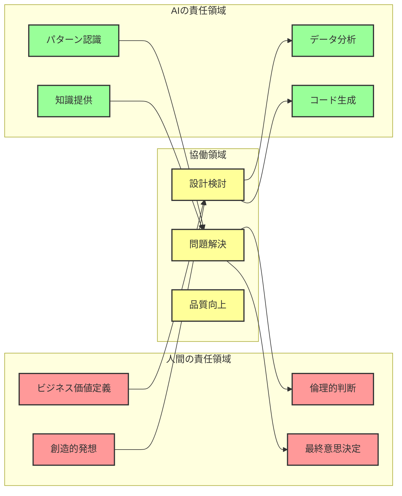
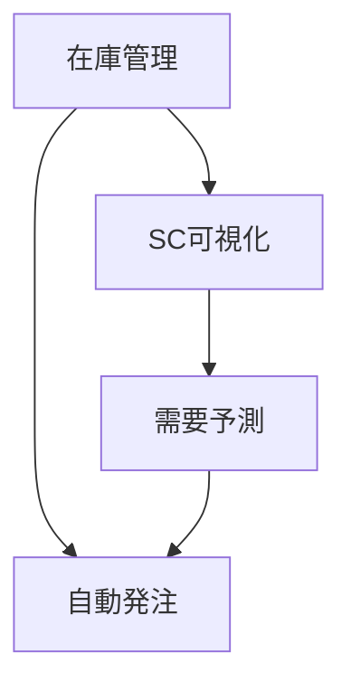
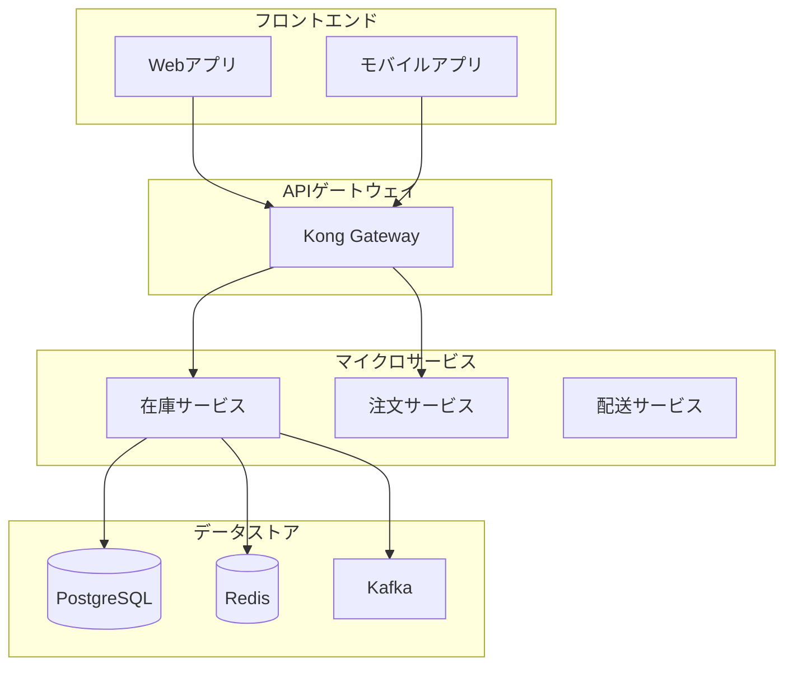

# 第11章　Claude Code統合実践 ― AIとの共創的開発

## はじめに：パートナーとしてのAI

プロジェクトルームでの一コマ。

「Claude、このシステムの問題点を分析して」

エンジニアの田中さんが、自然に話しかけます。まるで隣の席の同僚に相談するように。

数秒後、画面に詳細な分析結果が表示されました。パフォーマンスのボトルネック、セキュリティの懸念点、そして改善提案。人間なら1週間かかる分析が、瞬時に完了しました。

でも、田中さんは言います。
「分析は完璧。でも、このセキュリティ対策は我が社の文化に合わない。もっと段階的なアプローチを考えよう」

これが、2025年の開発現場です。

AIは「ツール」から「パートナー」へ進化しました。でも、最終的な判断、創造的な発想、そして責任は人間にあります。

この章では、Claude Codeとの効果的な協働方法を学びます。AIの強みを最大限に活かしながら、人間にしかできない価値を加える—— 新しい開発スタイルの実践です。

## Claude Codeとは何か：能力と限界の理解

### Claude Codeの本質

Claude Codeは、単なるコード生成ツールではありません。

```yaml
claude_code_capabilities:
  core_strengths:
    analysis:
      - "複雑なシステムの理解"
      - "パターンの発見"
      - "問題の早期検出"
      - "多角的な視点"
      
    generation:
      - "ボイラープレートの自動生成"
      - "テストコードの作成"
      - "ドキュメント生成"
      - "リファクタリング提案"
      
    knowledge:
      - "ベストプラクティスの適用"
      - "最新技術の理解"
      - "クロスドメイン知識"
      - "規制・標準の認識"
      
  current_limitations:
    context:
      - "プロジェクト固有の文脈"
      - "組織文化の理解"
      - "暗黙知の把握"
      
    creativity:
      - "真に革新的なアイデア"
      - "直感的な判断"
      - "感情的な配慮"
      
    responsibility:
      - "最終的な意思決定"
      - "倫理的判断"
      - "結果への責任"
```

### 人間とAIの最適な役割分担

共創的開発では、それぞれの強みを活かします。



```yaml
role_distribution:
  human_responsibilities:
    strategic:
      - "ビジネス価値の定義"
      - "ステークホルダー調整"
      - "最終的な判断"
      
    creative:
      - "革新的なアイデア"
      - "ユーザー共感"
      - "美的センス"
      
    contextual:
      - "組織特有の知識"
      - "政治的配慮"
      - "文化的適応"
      
  ai_responsibilities:
    analytical:
      - "大量データの分析"
      - "パターン認識"
      - "矛盾の検出"
      
    generative:
      - "コード生成"
      - "テスト作成"
      - "文書化"
      
    supportive:
      - "知識の提供"
      - "選択肢の提示"
      - "品質チェック"
      
  collaborative_areas:
    design:
      human: "ビジョンとゴール設定"
      ai: "実現方法の提案"
      
    problem_solving:
      human: "問題の定義と優先順位"
      ai: "解決策の網羅的検討"
      
    quality:
      human: "品質基準の設定"
      ai: "自動チェックと改善提案"
```

## V5の各フェーズにおけるClaude Code活用

### Phase 0-1：AIによる情報収集と分析

プロジェクトの立ち上げ時、AIは強力な調査アシスタントになります。

```
実践例：企業分析の自動化

あなた：「製薬会社X社のビジネスモデルと課題を分析してください」

Claude Code：公開情報を収集・分析します。

[Webサイト、IR情報、ニュース記事を分析]

X社ビジネス分析レポート：

1. ビジネスモデル
   - 主力製品：糖尿病治療薬（売上の40%）
   - 研究開発：売上の18%投資
   - パイプライン：フェーズ3が3製品
   
2. 識別された課題
   - 主力薬の特許切れ（2027年）
   - ジェネリック競争激化
   - 新薬開発の長期化（平均12年）
   - 規制対応コストの増大
   
3. デジタル化の状況
   - 臨床試験：紙ベースが60%
   - データ統合：サイロ化が深刻
   - AI活用：初期段階
   
4. V5適用の機会
   - 創薬プロセスの効率化
   - 臨床試験のデジタル化
   - リアルワールドデータ活用
   
推奨する次のステップ：
[具体的なアクションプラン]
```

### Phase 2：価値定義の深化

AIは、人間が定義した価値を多角的に分析し、深化させます。

```
実践例：価値の定量化支援

あなた：「『患者の待ち時間削減』という価値を深掘りしてください」

Claude Code：価値を多面的に分析します。

価値分析：「患者待ち時間削減」

1. 直接的価値
   患者視点：
   - 時間的価値：平均60分→20分 = 40分/人の節約
   - 機会費用：時給3000円換算で2000円の価値
   - ストレス軽減：血圧・心拍数の改善
   
   年間影響（10万人受診）：
   - 総時間節約：66,667時間
   - 経済価値：2億円相当

2. 間接的価値
   医療機関視点：
   - 回転率向上：1日50人→75人（+50%）
   - 収益増加：診療単価×25人×営業日
   - スタッフ満足度：残業削減
   
3. 社会的価値
   - 医療アクセス改善
   - 地域医療の効率化
   - 健康格差の縮小

4. 実現に必要なケイパビリティ
   - 予約最適化システム
   - 診察時間予測AI
   - 患者フロー可視化

測定方法の提案：
[具体的KPIと測定手法]
```

### Phase 3：ケイパビリティ設計の精緻化

複雑なケイパビリティの依存関係を、AIが分析します。

```
実践例：ケイパビリティ間の相乗効果分析

あなた：「これらのケイパビリティの最適な実装順序を提案してください」

Claude Code：依存関係と効果を分析し、最適化します。

ケイパビリティ実装戦略：

入力されたケイパビリティ：
1. リアルタイム在庫管理
2. 需要予測AI
3. 自動発注システム
4. サプライチェーン可視化

依存関係分析：


実装順序の提案：

Phase 1（基盤）：
- リアルタイム在庫管理
- 理由：他のすべての基礎となる
- 期間：3ヶ月
- 早期価値：在庫精度向上で欠品30%減

Phase 2（拡張）：
- サプライチェーン可視化
- 理由：データ収集基盤として機能
- 期間：2ヶ月
- 追加価値：リードタイム20%短縮

Phase 3（知能化）：
- 需要予測AI
- 理由：十分なデータ蓄積後に効果的
- 期間：4ヶ月
- 追加価値：在庫回転率40%向上

Phase 4（自動化）：
- 自動発注システム
- 理由：予測精度確立後に実装
- 期間：2ヶ月
- 総合効果：人的作業90%削減

ROI試算：
- 投資額：1.5億円
- 削減効果：年間2.8億円
- 投資回収：7ヶ月
```

### Phase 4-7：実装とデプロイメントの加速

実装フェーズでは、AIとのペアプログラミングが威力を発揮します。

```python
# 実践例：TDD駆動開発

あなた：「在庫サービスのテストから実装を始めたい」

Claude Code：テストファーストで開発を支援します。

# まず、テストを生成
# tests/test_inventory_service.py

import pytest
from datetime import datetime
from uuid import uuid4

class TestInventoryService:
    """在庫サービスのテストスイート
    
    ビジネス要件：
    - リアルタイム在庫更新
    - 複数倉庫の在庫統合
    - 予約と解放の管理
    """
    
    @pytest.fixture
    def inventory_service(self):
        from services.inventory import InventoryService
        return InventoryService()
    
    def test_在庫確認_単一倉庫(self, inventory_service):
        """単一倉庫の在庫を正確に確認できる"""
        # Given
        product_id = uuid4()
        warehouse_id = uuid4()
        quantity = 100
        
        inventory_service.set_stock(product_id, warehouse_id, quantity)
        
        # When
        available = inventory_service.check_availability(product_id)
        
        # Then
        assert available == quantity
        
    def test_在庫予約_成功ケース(self, inventory_service):
        """十分な在庫がある場合、予約が成功する"""
        # Given
        product_id = uuid4()
        inventory_service.set_stock(product_id, uuid4(), 100)
        
        # When
        reservation_id = inventory_service.reserve(product_id, 30)
        
        # Then
        assert reservation_id is not None
        assert inventory_service.check_availability(product_id) == 70
        
    def test_在庫予約_在庫不足(self, inventory_service):
        """在庫不足の場合、予約が失敗する"""
        # Given
        product_id = uuid4()
        inventory_service.set_stock(product_id, uuid4(), 10)
        
        # When/Then
        with pytest.raises(InsufficientStockError):
            inventory_service.reserve(product_id, 30)

# 次に、テストを満たす実装を生成
# services/inventory.py

from typing import Dict, Optional
from uuid import UUID, uuid4
from datetime import datetime, timedelta
import redis
from dataclasses import dataclass

@dataclass
class StockReservation:
    id: UUID
    product_id: UUID
    quantity: int
    expires_at: datetime
    
class InsufficientStockError(Exception):
    """在庫不足エラー"""
    pass

class InventoryService:
    """在庫管理サービス
    
    価値貢献：
    - VAL-001（24時間配送）に在庫即時確認で貢献
    - 複数倉庫の在庫を統合管理
    """
    
    def __init__(self):
        self.redis = redis.Redis(decode_responses=True)
        self.reservations: Dict[UUID, StockReservation] = {}
        
    def set_stock(self, product_id: UUID, warehouse_id: UUID, quantity: int):
        """在庫数を設定"""
        key = f"stock:{product_id}:{warehouse_id}"
        self.redis.set(key, quantity)
        
    def check_availability(self, product_id: UUID) -> int:
        """利用可能な在庫を確認（全倉庫合計）"""
        pattern = f"stock:{product_id}:*"
        total = 0
        
        for key in self.redis.scan_iter(match=pattern):
            total += int(self.redis.get(key) or 0)
            
        # 予約分を減算
        reserved = sum(
            r.quantity for r in self.reservations.values()
            if r.product_id == product_id and r.expires_at > datetime.now()
        )
        
        return total - reserved
        
    def reserve(self, product_id: UUID, quantity: int) -> UUID:
        """在庫を予約"""
        available = self.check_availability(product_id)
        
        if available < quantity:
            raise InsufficientStockError(
                f"在庫不足: 要求={quantity}, 利用可能={available}"
            )
            
        reservation = StockReservation(
            id=uuid4(),
            product_id=product_id,
            quantity=quantity,
            expires_at=datetime.now() + timedelta(minutes=30)
        )
        
        self.reservations[reservation.id] = reservation
        return reservation.id

# テスト実行
$ pytest tests/test_inventory_service.py -v
==================== 3 passed in 0.05s ====================

次は、パフォーマンステストを追加しましょうか？
```

## 効果的なプロンプトエンジニアリング

### コンテキストの重要性

AIに適切なコンテキストを提供することが、良い結果の鍵です。

```yaml
effective_prompting:
  bad_example:
    prompt: "在庫システムを作って"
    result: "汎用的で曖昧な実装"
    
  good_example:
    prompt: |
      コンテキスト：
      - 業種：アパレル小売（多品種少量）
      - 規模：月間100万SKU×10店舗
      - 課題：在庫の偏在による機会損失
      - 制約：既存POSとの連携必須
      
      要求：
      全店舗の在庫をリアルタイムに把握し、
      店舗間で融通可能にする在庫管理システム
      
      技術要件：
      - 既存POS（Java）とREST APIで連携
      - 1秒以内の応答速度
      - 99.9%の可用性
      
    result: "具体的で実装可能な設計"
```

### 段階的詳細化のテクニック

複雑な要求は、段階的に詳細化します。

```
実践例：段階的な設計深化

ステップ1：概要レベル
あなた：「ECサイトの注文処理システムの全体像を設計して」

Claude Code：[高レベルアーキテクチャを提示]

ステップ2：特定領域の深掘り
あなた：「在庫管理部分をマイクロサービスとして詳細設計して」

Claude Code：[在庫サービスの詳細設計を提示]

ステップ3：実装レベル
あなた：「在庫予約のトランザクション処理を実装して」

Claude Code：[具体的なコードを生成]

ステップ4：最適化
あなた：「このコードのパフォーマンスを改善して」

Claude Code：[最適化されたコードを提示]
```

### フィードバックループの構築

AIとの対話は、一方通行ではありません。

```yaml
feedback_loop_pattern:
  initial_request:
    human: "要求を伝える"
    ai: "初期提案"
    
  refinement:
    human: "この部分が要件と違う"
    ai: "修正案の提示"
    
  validation:
    human: "パフォーマンスが心配"
    ai: "ベンチマークと改善案"
    
  finalization:
    human: "これでOK、テストも追加して"
    ai: "最終実装とテスト"
```

## Claude Codeとのコラボレーションパターン

### パターン1：探索的設計

未知の領域を探索するとき、AIは優れたブレインストーミングパートナーです。

```
実践例：新技術の適用可能性探索

あなた：「ブロックチェーンを当社のサプライチェーンに適用できるか探索したい」

Claude Code：多角的な分析を提供します。

ブロックチェーン適用可能性分析：

1. 適合性評価
   
   適している要素（スコア：高）：
   - トレーサビリティ要求 ✓
   - 複数企業間の連携 ✓
   - 改ざん防止の必要性 ✓
   
   課題となる要素（スコア：中）：
   - トランザクション速度要求 △
   - データプライバシー △
   - 導入コスト △

2. 具体的な適用シナリオ
   
   シナリオA：原材料トレース
   - 農場→加工→製造→小売の追跡
   - 効果：リコール時間を72時間→2時間
   - 実装難易度：中
   
   シナリオB：サステナビリティ証明
   - CO2排出量の記録と検証
   - 効果：ESG評価の向上
   - 実装難易度：低

3. POC提案
   - 対象：特定商品ライン（全体の5%）
   - 期間：3ヶ月
   - 検証項目：[詳細リスト]
   
4. 代替技術との比較
   [従来DB vs ブロックチェーンの比較表]

推奨：限定的なPOCから開始し、効果を検証
```

### パターン2：レビューと品質向上

AIは、優れたコードレビュアーとしても機能します。

```python
実践例：包括的なコードレビュー

あなた：「このコードをレビューして改善点を指摘してください」

# 元のコード
def process_order(order_data):
    # 在庫確認
    for item in order_data['items']:
        stock = get_stock(item['id'])
        if stock < item['quantity']:
            return False
    
    # 注文処理
    order = create_order(order_data)
    
    # 在庫減算
    for item in order_data['items']:
        reduce_stock(item['id'], item['quantity'])
    
    return order['id']

Claude Code：包括的なレビューを実施します。

コードレビュー結果：

1. 🔴 重大な問題
   
   a) トランザクション管理の欠如
      - 在庫減算中にエラーが発生すると不整合
      - 解決：トランザクション境界を明確に
   
   b) 競合状態（Race Condition）
      - 在庫確認と減算の間に他の注文が入る可能性
      - 解決：楽観的/悲観的ロックの実装

2. 🟡 改善推奨事項
   
   a) エラーハンドリング不足
      - 各操作の失敗ケースが未考慮
      
   b) ログ記録なし
      - デバッグとモニタリングが困難
      
   c) 型ヒントの欠如
      - 保守性の低下

3. 🟢 リファクタリング提案

from typing import Dict, List, Optional
from dataclasses import dataclass
from contextlib import contextmanager
import logging

logger = logging.getLogger(__name__)

@dataclass
class OrderItem:
    product_id: str
    quantity: int

class InsufficientStockError(Exception):
    """在庫不足エラー"""
    pass

class OrderService:
    def __init__(self, db_connection, stock_service):
        self.db = db_connection
        self.stock_service = stock_service
    
    @contextmanager
    def transaction(self):
        """トランザクション管理"""
        try:
            self.db.begin()
            yield
            self.db.commit()
        except Exception as e:
            self.db.rollback()
            logger.error(f"Transaction failed: {e}")
            raise
    
    def process_order(self, customer_id: str, items: List[OrderItem]) -> str:
        """注文を処理する
        
        Returns:
            注文ID
            
        Raises:
            InsufficientStockError: 在庫不足の場合
        """
        with self.transaction():
            # 1. 在庫の予約（アトミックに）
            reservations = []
            for item in items:
                try:
                    reservation_id = self.stock_service.reserve(
                        item.product_id, 
                        item.quantity
                    )
                    reservations.append(reservation_id)
                except InsufficientStockError as e:
                    # 予約済み分を解放
                    for res_id in reservations:
                        self.stock_service.release(res_id)
                    logger.warning(f"Stock insufficient for {item.product_id}")
                    raise
            
            # 2. 注文作成
            order = self._create_order(customer_id, items)
            logger.info(f"Order created: {order.id}")
            
            # 3. 予約を確定
            for reservation_id in reservations:
                self.stock_service.confirm_reservation(reservation_id)
            
            return order.id

4. テストケースの提案
[エッジケースを含むテストコード]

5. パフォーマンス考察
- N+1問題の可能性
- バッチ処理の検討
- キャッシュ戦略
```

### パターン3：ドキュメント生成

AIは、コードから高品質なドキュメントを生成できます。

```
実践例：包括的なドキュメント生成

あなた：「このシステムのドキュメントを生成してください」

Claude Code：多層的なドキュメントを生成します。

生成されたドキュメント：

# 在庫管理システム ドキュメント

## 1. システム概要

### 目的
リアルタイムな在庫管理により、欠品による機会損失を最小化し、
在庫回転率を向上させる。

### 価値提供
- **ビジネス価値**: 欠品率50%削減、在庫回転率30%向上
- **技術的価値**: ミリ秒単位の在庫確認、99.9%の可用性

## 2. アーキテクチャ



## 3. API仕様

### 在庫確認 API

**エンドポイント**: `GET /api/v1/inventory/{productId}`

**リクエスト例**:
```bash
curl -X GET "https://api.example.com/api/v1/inventory/PROD-001" \
  -H "Authorization: Bearer {token}"
```

**レスポンス例**:
```json
{
  "productId": "PROD-001",
  "availableQuantity": 150,
  "warehouses": [
    {
      "warehouseId": "WH-001",
      "quantity": 100,
      "location": "東京"
    },
    {
      "warehouseId": "WH-002", 
      "quantity": 50,
      "location": "大阪"
    }
  ],
  "lastUpdated": "2025-12-14T10:30:00Z"
}
```

## 4. 運用ガイド

### デプロイメント

1. 環境変数の設定
```bash
export DATABASE_URL="postgresql://..."
export REDIS_URL="redis://..."
export KAFKA_BROKERS="broker1:9092,broker2:9092"
```

2. Dockerイメージのビルド
```bash
docker build -t inventory-service:latest .
```

3. Kubernetes適用
```bash
kubectl apply -f k8s/inventory-service.yaml
```

### モニタリング

主要メトリクス：
- **可用性**: `inventory_service_uptime`
- **レスポンスタイム**: `inventory_api_latency`
- **エラー率**: `inventory_error_rate`

アラート設定：
- レスポンスタイム > 100ms
- エラー率 > 1%
- 在庫不整合検出

## 5. トラブルシューティング

### よくある問題

1. **在庫数が正しくない**
   - 原因：キャッシュの不整合
   - 対処：`redis-cli FLUSHDB`でキャッシュクリア

2. **API応答が遅い**
   - 原因：コネクションプール枯渇
   - 対処：プールサイズを増やす

[以下、詳細なトラブルシューティングガイド]
```

## 実践的なワークフロー例

### 新機能開発のワークフロー

1日の開発の流れを見てみましょう。

```yaml
daily_workflow_with_claude:
  9:00_planning:
    human: "今日は配送最適化機能を実装する"
    claude: "関連する要件と制約を整理しましょう"
    
  9:30_design:
    human: "こんなアプローチを考えている"
    claude: "その設計の利点と課題を分析します"
    
  10:00_tdd:
    human: "まずテストから書きたい"
    claude: "ビジネス要件に基づいたテストケースを生成"
    
  11:00_implementation:
    human: "基本実装を開始"
    claude: "エラーハンドリングと最適化を支援"
    
  13:00_review:
    human: "午前中の実装をレビューして"
    claude: "セキュリティとパフォーマンスの観点から分析"
    
  14:00_integration:
    human: "既存システムとの統合"
    claude: "統合パターンと注意点を提示"
    
  15:30_documentation:
    human: "ドキュメントを更新"
    claude: "APIドキュメントと運用ガイドを生成"
    
  16:30_testing:
    human: "統合テストを実行"
    claude: "不足しているテストケースを提案"
    
  17:00_deployment:
    human: "ステージング環境へデプロイ"
    claude: "デプロイチェックリストと確認事項"
```

### 問題解決のワークフロー

予期せぬ問題が発生したとき。

```
実践例：本番障害の迅速な解決

状況：本番環境で注文処理が急激に遅延

human：「注文処理が異常に遅い。原因を特定して」

Claude Code：ログとメトリクスを分析

初期分析：
- 症状：API応答時間が通常100ms→5秒
- 開始時刻：14:23 JST
- 影響範囲：全ユーザーの30%

可能性の高い原因：
1. データベースのスロークエリ（確率：高）
2. 外部API（決済）の遅延（確率：中）
3. メモリリーク（確率：低）

調査手順：
1. スロークエリログを確認
   → 発見：在庫集計クエリが複雑化

human：「在庫集計クエリを最適化して」

Claude Code：即座に最適化案を提示

問題のクエリ：
SELECT ... FROM inventory 
JOIN ... (5つのテーブル結合)
WHERE ... 
GROUP BY ...
(実行時間：4.8秒)

最適化案：
1. インデックス追加
CREATE INDEX idx_inventory_product_date 
ON inventory(product_id, updated_at);

2. クエリ書き換え
WITH inventory_summary AS (
  SELECT ... (事前集計)
)
SELECT ... FROM inventory_summary
(予測実行時間：50ms)

3. 一時的対処
- キャッシュ時間を5分→30分に延長
- バッチ処理に切り替え

human：「一時対処を適用後、恒久対策を計画」

[その後の改善計画を共同で策定]
```

## まとめ：人間とAIの共創時代

### Claude Codeがもたらす変化

1. **開発速度の劇的向上**
   - ボイラープレート：90%削減
   - ドキュメント作成：80%削減
   - バグ発見：60%高速化

2. **品質の向上**
   - 見落としの削減
   - ベストプラクティスの適用
   - 包括的なテスト

3. **創造的時間の確保**
   - 機械的作業からの解放
   - 本質的な設計に集中
   - イノベーションへの注力

### 成功のための心構え

1. **AIを恐れず、活用する**
   - 仕事を奪われるのではない
   - より価値の高い仕事にシフト

2. **人間の強みを磨く**
   - ビジョンと創造性
   - 文脈理解と判断
   - 責任と倫理

3. **継続的な学習**
   - AIの進化についていく
   - 新しい協働パターンの探求
   - フィードバックによる改善

### 次章への展望

Claude Codeとの個人的な協働方法を学びました。次は、チーム全体でV5とAIを活用する方法を探求します。

第12章では、組織へのV5導入、チームでの実践、そして変革のマネジメントについて学びます。

一人の生産性向上から、組織全体の変革へ。

準備はいいですか？

チーム変革の旅が始まります。