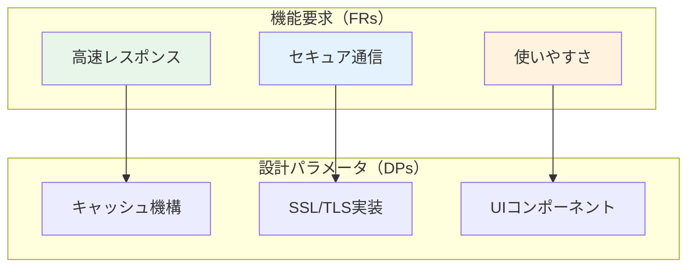

# 第4章 Axiomatic Designと設計公理

## 4.1 はじめに

Axiomatic Design（公理的設計）は、MITのNam P. Suhによって開発された設計方法論であり、設計プロセスを科学的・体系的に扱うためのフレームワークです。Parasol V5.4は、このAxiomatic Designの原理を深く統合し、設計決定の品質と透明性を向上させています。

本章では、Axiomatic Designの2つの基本公理と、それらがParasol V5.4でどのように実装されているかを詳しく解説します。

## 4.2 Axiomatic Designの2つの公理

### 4.2.1 独立性公理（Independence Axiom）

第1公理である独立性公理は、以下のように定義されます：

> **優れた設計では、機能要求（FRs）の独立性を維持しなければならない**

これは、1つの設計パラメータ（DP）を変更したときに、意図しない他の機能要求への影響を避けるべきことを意味します。

#### 独立性の数学的表現

機能要求（FR）と設計パラメータ（DP）の関係は、設計行列[A]で表現されます：

```
{FR} = [A]{DP}
```

ここで：
- {FR} = 機能要求ベクトル
- {DP} = 設計パラメータベクトル
- [A] = 設計行列

### 4.2.2 情報公理（Information Axiom）

第2公理である情報公理は、以下のように定義されます：

> **独立性公理を満たす設計の中で、情報量が最小の設計が最良である**

情報量Iは、設計の成功確率pを用いて以下のように定義されます：

```
I = log₂(1/p)
```

ここで、pは設計が仕様を満たす確率です。

## 4.3 設計行列と結合タイプ

### 4.3.1 設計行列の構造

設計行列[A]は、各要素aᵢⱼが「DPⱼがFRᵢに与える影響」を表します。Parasol V5.4では、この行列を用いて設計の結合度を評価します。

#### 3つの結合タイプ

1. **非結合設計（Uncoupled Design）**
   - 設計行列が対角行列
   - 各FRが独立したDPによって満たされる
   - 最も望ましい設計

```
[A] = [X 0 0]
      [0 X 0]
      [0 0 X]
```

2. **非結合化設計（Decoupled Design）**
   - 設計行列が三角行列
   - 適切な順序でDPを調整すれば独立性を保てる
   - 実用的に許容される設計

```
[A] = [X 0 0]
      [X X 0]
      [X X X]
```

3. **結合設計（Coupled Design）**
   - 設計行列が一般行列
   - FRとDP間に複雑な相互依存関係
   - 避けるべき設計

```
[A] = [X 0 X]
      [X X X]
      [X X X]
```

## 4.4 Parasol V5.4における公理的設計の実装

### 4.4.1 Phase 0: 要求定義段階での独立性確保

Parasol V5.4では、Phase 0の要求定義段階から独立性公理を適用します：

```yaml
# Phase 0での独立性評価
value_requirements:
  FR1_performance:
    description: "システムは1秒以内に応答する"
    constraints: ["リソース使用率", "並列処理能力"]
    
  FR2_security:
    description: "不正アクセスを防ぐ"
    constraints: ["認証機構", "暗号化方式"]
    
  FR3_usability:
    description: "ユーザーが直感的に操作できる"
    constraints: ["UI設計", "フィードバック機構"]

independence_matrix:
  - [1, 0, 0]  # FR1はDP1のみに依存
  - [0, 1, 0]  # FR2はDP2のみに依存
  - [0, 0, 1]  # FR3はDP3のみに依存
```

### 4.4.2 Phase 2: 価値ストリーム設計での結合度評価

Phase 2では、価値ストリームのトレーサビリティを保ちながら、設計の結合度を継続的に評価します：



### 4.4.3 Phase 3: 能力設計での情報量最小化

Phase 3では、情報公理に基づいて設計の複雑さを最小化します：

```python
class DesignEvaluator:
    def calculate_information_content(self, design_params):
        """設計の情報量を計算"""
        success_probability = self.evaluate_success_rate(design_params)
        information_content = -math.log2(success_probability)
        return information_content
    
    def optimize_design(self, alternatives):
        """情報量最小の設計を選択"""
        min_info = float('inf')
        best_design = None
        
        for design in alternatives:
            info = self.calculate_information_content(design)
            if info < min_info:
                min_info = info
                best_design = design
                
        return best_design
```

## 4.5 実践例：マイクロサービス設計への適用

### 4.5.1 初期設計（結合設計）

多くのマイクロサービス設計は、最初は結合設計として始まります：

```yaml
# 結合設計の例
services:
  order_service:
    dependencies:
      - user_service
      - inventory_service
      - payment_service
    
  user_service:
    dependencies:
      - order_service  # 循環依存
      - notification_service
    
  inventory_service:
    dependencies:
      - order_service  # 循環依存
      - supplier_service
```

設計行列：
```
        [Order] [User] [Inventory]
[FR1]   [  X  ] [ X  ] [    X    ]
[FR2]   [  X  ] [ X  ] [    0    ]
[FR3]   [  X  ] [ 0  ] [    X    ]
```

### 4.5.2 非結合化への変換

Parasol V5.4のアプローチで、結合設計を非結合化設計に変換します：

```yaml
# 非結合化設計
services:
  # イベント駆動アーキテクチャで依存性を削減
  order_service:
    publishes:
      - order_created_event
      - order_updated_event
    subscribes:
      - inventory_updated_event
      - payment_completed_event
    
  user_service:
    publishes:
      - user_profile_updated_event
    subscribes:
      - order_created_event  # 単方向の依存
    
  inventory_service:
    publishes:
      - inventory_updated_event
    subscribes:
      - order_created_event  # 単方向の依存
```

改善後の設計行列：
```
        [Order] [User] [Inventory]
[FR1]   [  X  ] [ 0  ] [    0    ]
[FR2]   [  X  ] [ X  ] [    0    ]
[FR3]   [  X  ] [ X  ] [    X    ]
```

### 4.5.3 情報量の比較評価

```python
# 設計の情報量比較
coupled_design_info = 5.2  # bits（高い複雑性）
decoupled_design_info = 2.8  # bits（低い複雑性）

improvement_ratio = (coupled_design_info - decoupled_design_info) / coupled_design_info
print(f"情報量削減率: {improvement_ratio * 100:.1f}%")
# 出力: 情報量削減率: 46.2%
```

## 4.6 設計評価のプラクティス

### 4.6.1 独立性評価チェックリスト

Parasol V5.4では、以下のチェックリストを用いて独立性を評価します：

```markdown
## 独立性評価チェックリスト

### レベル1: 基本的な独立性
- [ ] 各機能要求が明確に定義されているか
- [ ] 設計パラメータが機能要求に1対1で対応しているか
- [ ] 循環依存が存在しないか

### レベル2: 実装の独立性
- [ ] モジュール間のインターフェースが明確か
- [ ] 変更の影響範囲が限定的か
- [ ] テストが独立して実行可能か

### レベル3: 運用の独立性
- [ ] 各コンポーネントが独立してデプロイ可能か
- [ ] 障害が他のコンポーネントに波及しないか
- [ ] スケーリングが独立して可能か
```

### 4.6.2 情報量計算の実例

実際のシステムでの情報量計算例：

```python
class SystemComplexityAnalyzer:
    def analyze_design(self, design_spec):
        """設計の複雑性を分析"""
        results = {
            'coupling_type': self.identify_coupling_type(design_spec),
            'information_content': 0,
            'success_probability': 0,
            'recommendations': []
        }
        
        # 各FRの成功確率を計算
        fr_probabilities = []
        for fr in design_spec['functional_requirements']:
            p = self.calculate_fr_success_probability(fr, design_spec)
            fr_probabilities.append(p)
        
        # 全体の成功確率（独立な場合は積）
        if results['coupling_type'] == 'uncoupled':
            results['success_probability'] = np.prod(fr_probabilities)
        else:
            # 結合がある場合は、より複雑な計算が必要
            results['success_probability'] = self.calculate_coupled_probability(
                fr_probabilities, design_spec['design_matrix']
            )
        
        # 情報量の計算
        results['information_content'] = -np.log2(results['success_probability'])
        
        # 改善推奨事項の生成
        if results['coupling_type'] == 'coupled':
            results['recommendations'].append(
                "結合を削減するためにイベント駆動アーキテクチャの採用を検討"
            )
        
        return results
```

## 4.7 V5.4での高度な応用

### 4.7.1 動的な設計行列

Parasol V5.4では、システムの状態に応じて設計行列が変化する場合も扱います：

```python
class DynamicDesignMatrix:
    def __init__(self, base_matrix):
        self.base_matrix = base_matrix
        self.time_series = []
        
    def update_with_runtime_data(self, metrics):
        """実行時データに基づいて設計行列を更新"""
        current_matrix = self.base_matrix.copy()
        
        # 負荷に応じた結合度の変化を反映
        if metrics['cpu_usage'] > 80:
            # 高負荷時は結合が強まる
            current_matrix[1, 0] = 0.3  # 本来は0だが、影響が出る
            
        self.time_series.append({
            'timestamp': datetime.now(),
            'matrix': current_matrix,
            'coupling_score': self.calculate_coupling_score(current_matrix)
        })
        
    def get_trend_analysis(self):
        """結合度の時系列トレンドを分析"""
        return {
            'average_coupling': np.mean([t['coupling_score'] for t in self.time_series]),
            'peak_coupling': max([t['coupling_score'] for t in self.time_series]),
            'stability': self.calculate_stability()
        }
```

### 4.7.2 自動設計最適化

情報公理に基づく自動設計最適化の実装：

```python
class AxiomaticDesignOptimizer:
    def optimize(self, initial_design, constraints):
        """公理的設計原理に基づく最適化"""
        current_design = initial_design
        iteration = 0
        
        while iteration < self.max_iterations:
            # 設計の変種を生成
            variants = self.generate_design_variants(current_design)
            
            # 各変種を評価
            evaluations = []
            for variant in variants:
                eval_result = {
                    'design': variant,
                    'independence_score': self.evaluate_independence(variant),
                    'information_content': self.calculate_information(variant),
                    'constraints_satisfied': self.check_constraints(variant, constraints)
                }
                evaluations.append(eval_result)
            
            # 制約を満たす中で最良の設計を選択
            valid_designs = [e for e in evaluations if e['constraints_satisfied']]
            if valid_designs:
                best = min(valid_designs, key=lambda x: x['information_content'])
                current_design = best['design']
            
            iteration += 1
            
        return current_design
```

## 4.8 まとめ

本章では、Axiomatic Designの2つの公理（独立性公理と情報公理）と、それらがParasol V5.4でどのように実装されているかを解説しました。重要なポイントは：

1. **独立性公理**は設計の保守性と拡張性を保証する
2. **情報公理**は設計の複雑さを最小化する指針を提供する
3. **設計行列**は結合度を定量的に評価する強力なツール
4. Parasol V5.4は全フェーズでこれらの原理を適用する

次章では、これらの公理的設計原理がどのようにPhase間の移行で活用されるかを詳しく見ていきます。

## 参考文献

- Suh, N. P. (2001). Axiomatic Design: Advances and Applications. Oxford University Press.
- Suh, N. P. (1990). The Principles of Design. Oxford University Press.
- Thompson, M. K. (2013). "Teaching Axiomatic Design in the Freshman Year: A Case Study at KAIST", Procedia CIRP.