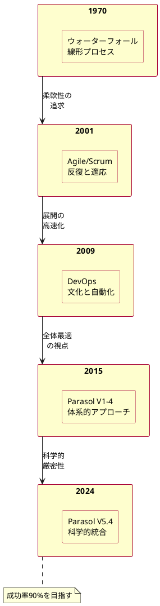

# Chapter 2: 歴史的背景と進化

## IBMシステム/360の教訓

1964年、コンピュータ業界の巨人IBMは、史上最も野心的なプロジェクトの一つを開始しました。システム/360は、全てのビジネスニーズに対応する統一アーキテクチャを持つ、革命的なコンピュータファミリーとなるはずでした。50億ドル（現在の価値で400億ドル相当）という前例のない投資、世界中の優秀なエンジニアの結集、そして綿密な計画。しかし、フレッド・ブルックスが後に『人月の神話』で詳述したように、プロジェクトは予定を大幅に超過し、予算も膨れ上がり、品質問題に悩まされました。

「もし9人の女性を集めれば、1ヶ月で赤ちゃんが産めるでしょうか？」ブルックスの有名な問いかけは、ソフトウェア開発の本質的な課題を鮮やかに描き出しました。人を増やせば速くなるという常識が、ソフトウェアの世界では通用しない。コミュニケーションの複雑性が指数関数的に増大し、かえって進捗を妨げる。

60年後の今日、私たちはクラウドコンピューティング、AI、マイクロサービスといった革新的な技術を手にしています。しかし、大規模な技術変革プロジェクトの失敗率は依然として70%を超えています。なぜ、これほどまでに技術が進歩しても、本質的な問題は解決されていないのでしょうか？

## なぜこの問題が重要なのか

### ビジネスへの影響
McKinseyの2023年調査によれば、デジタル変革プロジェクトの平均超過コストは当初予算の45%に達します。さらに深刻なのは、失敗したプロジェクトの機会損失です。競合他社に先を越され、市場シェアを失い、イノベーションの波に乗り遅れる。経営者にとって、これは企業の存続に関わる問題です。

### アーキテクチャの課題  
技術的には、システムの複雑性が人間の認知能力を超えています。マイクロサービス化により、単一のトランザクションが数十のサービスを経由することも珍しくありません。この分散した複雑性を、どのように設計し、管理し、進化させるのか。従来の手法では限界に達しています。

### 実装の困難さ
開発者の視点では、日々の実装作業が「もぐらたたき」のようになっています。一つの問題を解決すると、別の場所で新たな問題が発生する。全体像が見えないまま、局所的な最適化を繰り返す。その結果、技術的負債が蓄積し、システムは硬直化していきます。

## 変革手法の5つの波

ソフトウェア開発手法は、これまで5つの大きな波を経験してきました。各世代は前世代の限界を克服しようと試み、部分的には成功しましたが、新たな課題も生み出しました。

### 第1波: ウォーターフォール（1970年代〜）
製造業の成功モデルを参考に、ソフトウェア開発を段階的プロセスとして定義しました。要求定義→設計→実装→テスト→保守という線形モデルは、一見合理的でした。しかし、要求の変更に対応できず、最終段階まで問題が発見されないという致命的な欠陥がありました。

### 第2波: Agile/Scrum（2001年〜）
「アジャイルマニフェスト」の発表とともに、反復的で適応的なアプローチが主流となりました。顧客との協調、変化への対応、動くソフトウェアを重視。確かに柔軟性は向上しましたが、長期的な視点やアーキテクチャの一貫性が犠牲になるケースも増えました。

### 第3波: DevOps（2009年〜）
開発と運用の壁を取り払い、継続的デリバリーを実現しようとしました。自動化、文化変革、測定、共有を重視。インフラストラクチャのコード化により、展開速度は飛躍的に向上しました。しかし、組織全体の変革には至らず、局所的な最適化に留まることが多くありました。

### 第4波: Parasol V1-4（2015年〜）
組織全体を対象とした体系的アプローチを提唱しました。価値ストリーム、ケイパビリティ、制約の管理など、より包括的な視点を導入。部分的な成功は収めましたが、理論と実践のギャップ、科学的厳密性の欠如が課題として残りました。

### 第5波: Parasol V5.4（2024年〜）
ZIGZAGプロセスとAxiomatic Designの統合により、科学的厳密性と実践的柔軟性を両立させました。理論と実践の往復運動、設計の数学的検証、段階的な収束メカニズム。これまでの手法の良い部分を統合しつつ、根本的な問題に対処します。



## GEデジタルの教訓

2011年、ゼネラル・エレクトリック（GE）は「デジタル産業企業」への変革を宣言しました。GE Digitalを設立し、Predixプラットフォームを中心に、全社的なアジャイル導入を推進。当初は順調に見えました。

しかし、2017年頃から問題が表面化します。各事業部門が独自にアジャイルチームを立ち上げた結果、全体の整合性が失われました。航空機エンジン部門のIoTソリューションと、医療機器部門のそれは、全く異なるアーキテクチャで構築されていました。データ形式もAPIも統一されておらず、「One GE」というビジョンは絵に描いた餅となりました。

DevOpsの導入も試みました。継続的インテグレーション、インフラのコード化、自動テスト。確かに個々のチームの生産性は向上しました。しかし、それは局所的な最適化でしかありませんでした。全体のアーキテクチャは依然として分断されたまま。

2018年、GEはデジタル事業の大幅な縮小を発表。投資額は100億ドルを超えましたが、期待された変革は実現しませんでした。優秀な人材、潤沢な資金、最新の手法を投入しても、なぜ失敗したのか。それは、部分最適の総和が全体最適にならないという、システム思考の基本原則を見落としていたからです。

```yaml
# ウォーターフォールモデルの基本構造（概念図）
phases:
  - requirements: "要求定義"
  - design: "設計"  
  - implementation: "実装"
  - testing: "テスト"
  - maintenance: "保守"
flow: "sequential"  # 一方向の流れ
feedback: "limited" # フィードバックは限定的
```

## いつ・どのように使うべきか

### 既存手法の限界を認識したとき
もし、あなたの組織が以下のような症状を示しているなら、それは既存手法の限界に達しているサインかもしれません：
- アジャイルを導入したが、全体の統合性が失われている
- DevOpsで展開は速くなったが、品質問題が増えている
- 部分的な成功はあるが、全体的な変革には至っていない

### 成功の条件：歴史から学ぶ姿勢
過去の失敗は、貴重な学習機会です。ウォーターフォールの厳密性、アジャイルの柔軟性、DevOpsの自動化、これらは全て価値ある要素です。問題は、これらを「どう統合するか」にあります。

### よくある落とし穴
「今度こそうまくいく」という楽観的バイアスに陥らないことが重要です。新しい手法も、適切に理解し、組織の文脈に合わせて適用しなければ、過去の失敗を繰り返すだけです。

## 他の手法との組み合わせ

### Agile/Scrum：基盤として活用
V5.4は、アジャイルを否定するものではありません。むしろ、日々の開発活動においては、スクラムの枠組みは有効です。V5.4は、その上位レイヤーで、全体の方向性と整合性を提供します。

### マイクロサービス：適切な粒度の決定
マイクロサービスアーキテクチャは強力ですが、サービスの境界をどう定義するかが課題です。V5.4のAxiomatic Design要素は、この境界定義に科学的根拠を提供します。

### DDD（ドメイン駆動設計）：ドメイン分析の深化
DDDの境界づけられたコンテキストは、V5.4の機能要求（FR）と設計パラメータ（DP）の分離と共鳴します。両者を組み合わせることで、より堅牢な設計が可能になります。

歴史を振り返ると、各時代の手法は、その時代の課題に対する最善の回答でした。しかし、環境が変化し、システムが複雑化する中で、新たなアプローチが必要になりました。V5.4は、これまでの知見を統合し、次の時代への橋渡しを目指します。では、その中核となるZIGZAGプロセスとは何か。次章で詳しく見ていきましょう。

---

**関連情報**
- 詳細な手法比較表：Appendix 2.1
- 推奨参考文献：Appendix 2.2  
- 歴史的マイルストーン年表：Appendix 2.3