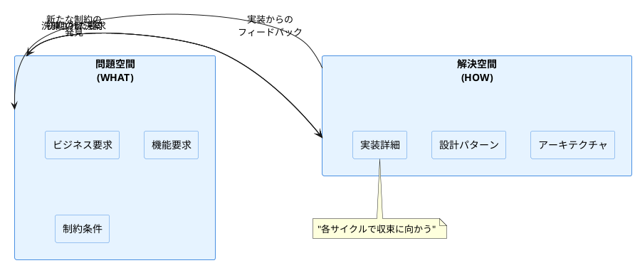
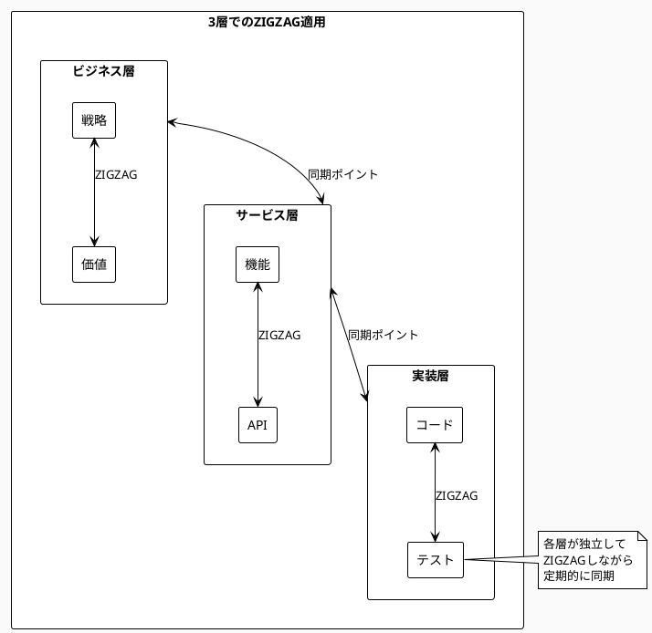

# Chapter 3: ZIGZAGプロセス基礎

## 知識創造の螺旋

1995年、一橋大学の野中郁次郎教授は、日本企業の強さの秘密を解き明かそうとしていました。なぜホンダは革新的なバイクを生み出し続けるのか。なぜトヨタの改善活動は止まらないのか。その答えは、西洋的な「知識管理」とは全く異なるアプローチにありました。

「知識には2つの種類がある」と野中教授は説きました。言葉や数字で表現できる「形式知」と、経験や勘として体に染み付いた「暗黙知」。西洋企業は形式知の管理に長けていましたが、日本企業は暗黙知と形式知の間を行き来する「知識創造の螺旋」を回していたのです。

パン職人の弟子が、師匠の手の動きを見て学ぶ。その動きを自分で試し、失敗し、調整する。やがて「こうすればうまくいく」という感覚を掴む。それを後輩に教えるために言語化する。この往復運動こそが、真の学習と創造の源泉でした。

ソフトウェア開発の世界でも、同じことが言えるのではないでしょうか。要求という「WHAT」と、実装という「HOW」の間を行き来することで、初めて真に価値あるシステムが生まれるのです。

## なぜこの問題が重要なのか

### ビジネス課題：計画の硬直性vs変更の無秩序
従来のウォーターフォール的アプローチでは、最初に立てた計画に固執しすぎて、市場の変化に対応できません。一方、「アジャイル」の名の下に無計画な変更を繰り返せば、システムは継ぎ接ぎだらけになり、保守不能に陥ります。経営者が求めるのは、方向性を保ちながら柔軟に適応できるアプローチです。

### アーキテクチャ課題：大局的設計vs局所的適応
システム全体の一貫性を保つには、大局的な設計が必要です。しかし、現場の具体的な課題に対応するには、局所的な適応も欠かせません。この二つをどう両立させるか。それが、現代のソフトウェアアーキテクトが直面する最大の課題です。

### 実装課題：品質保証vsスピード優先
「早くリリースして、フィードバックを得る」というアジャイルの教えは正しい。しかし、品質を犠牲にして技術的負債を積み重ねれば、いずれシステムは崩壊します。品質とスピードの適切なバランスを、どのように実現するのでしょうか。

## ZIGZAGの3つの原理

ZIGZAGプロセスは、これらの課題に対する一つの答えです。単純な反復でもなく、硬直的な計画でもない。理論と実践、抽象と具体、全体と部分の間を戦略的に往復することで、真の解決に近づいていきます。

### 原理1：往復運動の原理
問題空間（WHAT）と解決空間（HOW）の間を行き来します。まず「何を解決すべきか」を明確にし、次に「どう解決するか」を考える。実装してみると、問題理解が深まり、新たな「WHAT」が見えてくる。この往復運動により、問題と解決の両方が洗練されていきます。

### 原理2：収束メカニズム  
ただ行き来するだけでは、永遠に終わりません。各サイクルで学習したことを次に活かし、徐々に収束させていく必要があります。初期は大きく振れても、回を重ねるごとに振れ幅を小さくし、最適解に近づいていく。これが収束メカニズムです。

### 原理3：3層構造での同期
ビジネス層、サービス層、実装層の3つのレベルで、同時にZIGZAGを適用します。各層が独立して動きながらも、定期的に同期を取ることで、全体の一貫性を保ちます。



## スタートアップのピボット物語

2022年、東京のフィンテックスタートアップ「ペイメントX」（仮名）は、革新的な決済サービスの開発に挑戦していました。当初の計画は明確でした：「中小企業向けの簡単な請求書発行・決済システム」。6ヶ月の開発期間、5人のエンジニアチーム、そして情熱。

### サイクル1：理想と現実のギャップ
最初の2ヶ月で、美しいUIと基本的な請求書機能を実装しました。しかし、実際の中小企業10社にデモをしたところ、反応は芳しくありませんでした。「請求書発行だけなら、Excelで十分」「本当に困っているのは、入金確認と督促の自動化」。

チームは問題空間に戻りました。本当の問題は何か？調査の結果、中小企業の経理担当者は、月末に100件以上の入金を手作業で確認し、未入金の督促に多大な時間を費やしていることが分かりました。

### サイクル2：核心への接近
問題を再定義し、入金確認の自動化機能を追加しました。銀行APIとの連携、入金と請求書の自動マッチング。技術的には複雑でしたが、2ヶ月で実装しました。

再度、ユーザーテストを実施。今度は反応が違いました。「これは便利！でも、督促メールのテンプレートがもっと柔軟だといいな」「入金予測機能があれば、資金繰りに役立つ」。問題の核心に近づいている手応えがありました。

### サイクル3：収束と洗練
3回目のサイクルでは、機械学習を使った入金予測機能と、カスタマイズ可能な督促ワークフローを追加しました。しかし、全てのフィードバックに対応するのではなく、コア機能に集中することを決断。収束メカニズムが働いたのです。

```python
# ZIGZAGサイクルの基本構造
class ZigzagCycle:
    def __init__(self, problem_space, solution_space):
        self.problem = problem_space
        self.solution = solution_space
        self.cycle_count = 0
        self.convergence_threshold = 0.1
        
    def execute_cycle(self):
        # WHAT: 問題の定義/再定義
        refined_problem = self.analyze_problem(self.problem)
        
        # HOW: 解決策の実装/改善
        new_solution = self.implement_solution(refined_problem)
        
        # フィードバックループ
        feedback = self.gather_feedback(new_solution)
        self.problem = self.refine_problem(feedback)
        
        # 収束チェック
        if self.check_convergence():
            return True
        
        self.cycle_count += 1
        return False
```

6ヶ月後、ペイメントXは300社の顧客を獲得し、月次解約率2%という優れた数字を達成しました。直線的な開発では到達できなかった成功でした。

```python
# 収束判定ロジック
def check_convergence(self):
    # 前回との差分を計算
    problem_delta = self.calculate_delta(
        self.previous_problem, 
        self.current_problem
    )
    solution_delta = self.calculate_delta(
        self.previous_solution,
        self.current_solution
    )
    
    # 収束条件：変化が閾値以下
    return (problem_delta < self.convergence_threshold and 
            solution_delta < self.convergence_threshold)
```

## いつ・どのように使うべきか

### 適用タイミング：計画と実態のズレを感じたとき
プロジェクトが計画通りに進んでいないと感じたら、それはZIGZAGを適用する好機です。特に以下のような兆候が見られる場合：
- 要求が頻繁に変更される
- 実装してみると想定外の問題が発生する
- ユーザーフィードバックと開発内容がずれている

### 成功条件：小さなサイクル、早いフィードバック
ZIGZAGの成功の鍵は、サイクルを小さく保つことです。6ヶ月の大きなサイクルより、2週間の小さなサイクルを12回繰り返す方が、はるかに効果的です。各サイクルで具体的な成果物を作り、実際のフィードバックを得ることが重要です。

### よくある失敗パターン
- **サイクルが長すぎる**：3ヶ月以上のサイクルは、学習効果が薄れます
- **学習を省略する**：フィードバックを集めても、それを次のサイクルに活かさない
- **収束を忘れる**：永遠に振り子のように振れ続け、決断できない
- **層の同期を怠る**：ビジネス層と実装層がバラバラに動く

## 他の手法との組み合わせ

### Agile/Scrum：スプリントはZIGZAGサイクルの一実装
2週間のスプリントは、まさにZIGZAGサイクルの一つの形です。スプリント計画（WHAT）→開発（HOW）→レビュー（フィードバック）→振り返り（学習）。ZIGZAGは、この仕組みをより意識的に、戦略的に活用します。

### マイクロサービス：各サービスがZIGZAG単位に
マイクロサービスアーキテクチャでは、各サービスを独立したZIGZAG単位として扱えます。サービスAの学習がサービスBの設計に活かされ、全体として収束していく。これにより、大規模システムでも機動的な開発が可能になります。

### DDD：ドメイン探索がWHAT→HOWの実例
ドメイン駆動設計における「ドメインの探索」は、まさにWHATの深掘りです。ユビキタス言語を作り、境界づけられたコンテキストを定義し、それを実装に落とし込む。その過程で新たな洞察を得て、ドメインモデルを洗練させる。これは ZIGZAGそのものです。



ZIGZAGプロセスは、知識創造の本質を開発プロセスに取り入れたものです。しかし、往復運動だけでは十分ではありません。その運動に科学的な厳密性を与え、確実に収束させる仕組みが必要です。次章では、その基盤となるAxiomatic Designについて探求していきましょう。

---

**実践を始めるために**
- ZIGZAGプロセス実践ガイド：Appendix 3.1
- サイクルテンプレート：Appendix 3.2
- アンチパターン集：Appendix 3.3