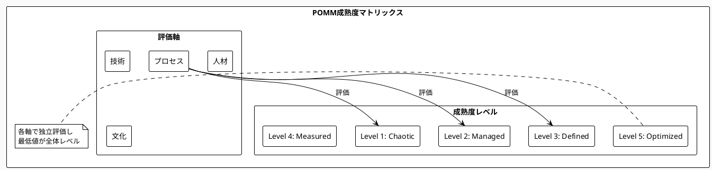

# Chapter 6: Phase 0: 組織アセスメント

## Targetの1,000億円の教訓

2013年、米国小売業界の巨人Target社は、カナダ市場への進出という歴史的な賭けに出ました。124店舗を一気に開店し、デジタル時代の小売革命をカナダで実現する。そのビジョンは壮大でした。最新のPOSシステム、洗練されたサプライチェーン、そしてデータドリブンな在庫管理。すべてが計画通りのはずでした。

しかし、わずか2年後の2015年、Targetはカナダからの全面撤退を発表します。損失額は20億ドル（約2,200億円）。1万7千人の従業員が職を失いました。なぜ、これほどまでに優秀な経営陣と、豊富なリソースを持つ企業が、これほど壮大に失敗したのでしょうか。

後の分析で明らかになったのは、驚くべき事実でした。Targetの経営陣は、カナダの組織の実態を根本的に誤解していたのです。表面的には、カナダチームは「準備ができている」と報告していました。システムは「ほぼ完成」、スタッフは「トレーニング済み」、プロセスは「確立済み」。しかし、これらはすべて希望的観測に基づく報告でした。

実際には、在庫管理システムには致命的な欠陥があり、商品の70%が正しく登録されていませんでした。スタッフの大半は基本的な操作すら習得していませんでした。そして何より、組織文化が根本的に異なっていたのです。米国の「積極的な問題提起」文化に対し、カナダでは「問題を隠す」文化が蔓延していました。

「私たちは、見たいものだけを見ていた」。後にTarget CEOは振り返りました。「組織の真の状態を理解するための、体系的なアセスメントを怠った」。

## なぜこの問題が重要なのか

### ビジネス課題：変革投資の方向性を誤るリスク
企業が大規模な変革に乗り出すとき、多くの経営者は「現状は把握している」と考えがちです。しかし、McKinseyの調査によれば、変革プロジェクトの70%が失敗する主因は、組織の実態に関する誤った前提にあります。平均して、プロジェクト予算の40%が、誤った現状認識に基づく無駄な投資に費やされているのです。

### アーキテクチャ課題：技術的負債の真の深さが不明
「レガシーシステムをマイクロサービス化する」。この決定は簡単ですが、実際の技術的負債の深さを理解せずに始めれば、泥沼にはまります。コードの品質、ドキュメントの有無、知識の属人化度合い。これらを定量的に把握せずに始めた変革は、必ず行き詰まります。

### 実装課題：チームの実際のケイパビリティが不透明
「うちのチームはアジャイルに習熟している」という報告を、額面通り受け取ってよいでしょうか。実際にスクラムイベントを観察し、バックログの質を確認し、ベロシティの安定性を測定してみると、多くの場合「アジャイルもどき」であることが判明します。

## Parasol組織成熟度モデル（POMM）

組織の実態を正確に把握するために、Parasol V5.4は独自の成熟度モデルを提供します。これは単なるチェックリストではありません。4つの軸と5つのレベルで、組織を多面的に診断する科学的なフレームワークです。

### 5段階の成熟度レベル

組織の成熟度は連続的なスペクトラムですが、理解しやすさのために5つのレベルに分類します：

```python
# Parasol組織成熟度レベル定義
maturity_levels = {
    1: "Chaotic",      # カオス：場当たり的、属人的
    2: "Managed",      # 管理：基本プロセス確立
    3: "Defined",      # 定義：標準化と文書化
    4: "Measured",     # 測定：定量的管理
    5: "Optimized"     # 最適化：継続的改善
}
```

各レベルは、前のレベルの基盤の上に構築されます。Level 3に到達するためには、Level 2の要件を満たしている必要があります。

### 4つの評価軸

POMMは組織を4つの視点から評価します：

**プロセス軸**：作業の進め方がどれだけ体系化されているか
- 標準化の度合い
- 文書化のレベル
- プロセス改善の仕組み

**技術軸**：技術基盤とツールの成熟度
- アーキテクチャの健全性
- ツールチェーンの統合度
- 技術的負債の管理

**人材軸**：スキルと知識の管理
- スキルマップの整備
- 知識共有の仕組み
- 成長パスの明確さ

**文化軸**：価値観と行動様式
- 学習する組織文化
- 心理的安全性
- イノベーション志向

### クロスファンクショナル診断の重要性

単一部門の評価では、組織の真の姿は見えません。開発部門がLevel 3でも、ビジネス部門がLevel 1では、全体としてはLevel 1.5程度の能力しか発揮できません。部門間の連携と全体最適の視点が不可欠です。



## 金融機関での現実との対峙

2023年、日本の大手地方銀行（仮名：みらい銀行）は、フィンテック企業との競争激化を受け、全社的なデジタル変革に着手しようとしていました。経営陣の認識では、同行のIT成熟度は「業界平均以上のLevel 3」。5年間で300億円を投資し、最先端のデジタルバンクを目指す計画でした。

### 初期状態：過信という名の落とし穴

「我々のシステム部門は優秀です。基幹系の安定性は業界トップクラスですし、ネットバンキングの利用率も年々向上しています」。CIOは自信満々でした。確かに、表面的な指標は悪くありませんでした。

### 包括的アセスメントの実施

しかし、Parasolフレームワークに基づく包括的なアセスメントの結果は、経営陣に衝撃を与えました：

```python
# みらい銀行のアセスメント結果構造
assessment_results = {
    "overall_level": 1.7,
    "breakdown": {
        "process": {"level": 2.1, "gaps": ["変更管理プロセス未確立", "リリース手順が属人的"]},
        "technology": {"level": 1.5, "gaps": ["COBOL依存70%", "API化率5%未満"]},
        "people": {"level": 1.8, "gaps": ["クラウドスキル保有者3%", "平均年齢52歳"]},
        "culture": {"level": 1.6, "gaps": ["失敗を隠す文化", "新技術への抵抗感"]}
    },
    "critical_findings": [
        "基幹系の知識が3名のベテランに集中（退職リスク高）",
        "テスト自動化率0.5%（手動テストに月間2000時間）",
        "部門間のデータ連携は全てバッチ処理（リアルタイム化困難）"
    ]
}
```

特に衝撃的だったのは、技術的負債の実態でした。基幹系システムの70%が30年以上前のCOBOLで書かれており、仕様書は存在せず、3名のベテラン社員の頭の中にしか全体像がありませんでした。

### ギャップ分析と優先順位付け

アセスメント結果を踏まえ、現実的な改革プランを策定しました：

```python
# 優先順位付けロジックの例
def prioritize_improvements(gaps, constraints):
    """改善項目の優先順位を決定"""
    priorities = []
    
    for gap in gaps:
        score = calculate_priority_score(
            impact=gap["business_impact"],
            effort=gap["implementation_effort"],
            risk=gap["risk_if_not_addressed"],
            dependency=gap["dependency_count"]
        )
        priorities.append((gap["id"], score))
    
    return sorted(priorities, key=lambda x: x[1], reverse=True)
```

最優先事項は、300億円の最新技術導入ではなく、まず10億円をかけて知識の文書化と基本的な自動化を進めることでした。

### 6ヶ月後の成果

現実的なアプローチの成果は顕著でした：
- 重要プロセスの文書化率：20% → 85%
- テスト自動化率：0.5% → 15%（重点領域）
- クラウドスキル保有者：3% → 25%（研修プログラム実施）
- 心理的安全性スコア：2.1 → 3.4（失敗から学ぶ文化の醸成）

最も重要な変化は、組織が「現実を直視する勇気」を持てるようになったことでした。

## いつ・どのように使うべきか

### 適用タイミング

POMMアセスメントが最も効果的なのは以下のタイミングです：

**大規模変革プロジェクトの開始時**
投資額が年間IT予算の30%を超えるような大規模プロジェクトでは、必須です。Targetの失敗を繰り返さないために、まず現在地を正確に把握しましょう。

**年次戦略レビューのタイミング** 
定期的な健康診断と同様、組織も年に一度は包括的な診断が必要です。特に、競争環境が激変している業界では不可欠です。

**M&A前のデューデリジェンス**
技術的な統合可能性だけでなく、文化的な適合性も事前に評価することで、統合後の成功確率が大幅に向上します。

### 成功条件

アセスメントを成功させるには：

**経営層の積極的参加**：トップが本気で現実を知ろうとする姿勢が、組織全体に伝わります
**匿名性の保証による正直な回答**：報復を恐れずに真実を語れる環境づくり
**外部ファシリテーターの活用**：内部の力学から独立した客観的な視点

### よくある失敗パターン

- **都合の良い結果を求める圧力**：「Level 3以上でないと予算が下りない」という本末転倒
- **技術面偏重で文化面を軽視**：最新技術を導入しても、文化が変わらなければ失敗します
- **一度きりの実施で継続測定なし**：改善の進捗が見えず、モチベーションが維持できません

### アセスメント実施チェックリスト

- [ ] ステークホルダーマップ作成（誰が影響を受けるか）
- [ ] アセスメント範囲の明確化（どこまで評価するか）
- [ ] 測定方法の事前合意（何をもって判断するか）
- [ ] フォローアップ計画（結果をどう活用するか）

## 他の手法との組み合わせ

### Agile/Scrum：チームレベルの成熟度評価と連携
スクラムチームの成熟度評価ツールと組み合わせることで、より詳細なチームレベルの診断が可能です。ただし、個別最適に陥らないよう、全体視点を忘れずに。

### CMMI：より軽量で実践的なアプローチ  
CMMIは包括的ですが、重厚すぎて中小企業には適用困難です。POMMは、CMMIの良さを活かしつつ、より実践的で段階的な適用を可能にします。

### TOGAF：エンタープライズアーキテクチャ成熟度と統合
TOGAFのアーキテクチャ成熟度モデルと組み合わせることで、技術軸の評価をより深く行えます。特に大企業では有効な組み合わせです。

組織の真の姿を知ることは、時として痛みを伴います。しかし、現実から目を背けて始めた変革は、必ず失敗します。Targetの1,000億円の教訓を無駄にしないために、まず勇気を持って鏡を見ることから始めましょう。

次章では、このアセスメント結果を基に、どのように組織固有のコンテキストを確立し、変革の方向性を定めていくかを詳しく見ていきます。真の変革は、正確な現状認識から始まるのです。

---

**実践ツールとリソース**
- 完全版アセスメント質問票：Appendix 6.1
- スコアリング自動化ツール：Appendix 6.2
- 業界別ベンチマークデータ：Appendix 6.3