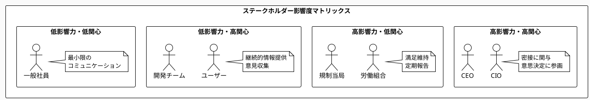

# Chapter 7: Phase 1: 組織コンテキスト確立

## ING銀行：同じアジャイルで異なる結果

2015年、オランダの老舗銀行INGは、大胆な決断を下しました。350年の歴史を持つ伝統的な銀行組織を解体し、SpotifyモデルをベースにしたアジャイルIT企業に生まれ変わるというのです。3,500人の従業員を巻き込む、前例のない組織変革でした。

同時期、世界中の銀行がアジャイル変革に挑戦していました。しかし、ほとんどが失敗に終わりました。スクラムを導入し、デイリースタンドアップを始め、カンバンボードを設置する。表面的には「アジャイル」でしたが、実際の成果は乏しく、むしろ混乱を招いていました。

なぜINGは成功し、他行は失敗したのか。その違いは「組織コンテキスト」の扱い方にありました。

INGのCEO、ラルフ・ハマーズは振り返ります。「多くの企業は、アジャイルを『導入するもの』と考えていました。しかし我々は違いました。まず『なぜ我々はここにいて、どこへ向かうのか』という組織のコンテキストを明確にしました。アジャイルは、そのコンテキストを実現するための手段に過ぎなかったのです」。

INGは6ヶ月をかけて、全社的なコンテキスト定義を行いました：
- **目的**：「銀行業を再定義し、顧客の日常生活のパートナーになる」
- **境界**：「伝統的銀行業務を超えて、ライフスタイルサービスへ」
- **制約**：「規制要件を満たしながら、スタートアップの俊敏性を実現」
- **原則**：「顧客中心、実験重視、失敗から学ぶ」

このコンテキストが全社で共有されたことで、個々のチームが自律的に、しかし一貫した方向に動けるようになりました。結果、INGは3年で顧客満足度を40ポイント向上させ、新サービスのリリースサイクルを6ヶ月から2週間に短縮しました。

## なぜこの問題が重要なのか

### ビジネス課題：変革の方向性が組織内で一致しない
アセスメントで現状を把握しても、「で、どこに向かうのか？」が不明確では、組織は動けません。営業部門は売上拡大を求め、IT部門はシステム刷新を主張し、経営企画は効率化を推進する。各部門が異なる方向を向いていては、どんな優れた手法も機能しません。明確なコンテキストこそが、組織全体のベクトルを揃える羅針盤となるのです。

### アーキテクチャ課題：技術選択が組織文脈と乖離  
「マイクロサービスが流行っているから導入しよう」。このような技術主導の意思決定が、多くの失敗を生んでいます。組織のコンテキスト（規模、文化、スキル、ビジネスゴール）を無視した技術選択は、必ず行き詰まります。技術は、コンテキストに適合して初めて価値を生むのです。

### 実装課題：チームごとに異なる理解での実装
同じ「顧客中心」という言葉でも、営業チームは「要望をすべて受け入れる」と解釈し、開発チームは「使いやすいUIを作る」と解釈し、運用チームは「24時間サポート」と解釈する。共通のコンテキストなしには、バラバラな実装が生まれ、全体としての一貫性が失われます。

## Parasolコンテキスト確立フレームワーク（PCF）

アセスメント結果を実行可能な変革計画に変換するには、明確なコンテキスト定義が不可欠です。PCFは、組織固有の状況を構造化し、全員が理解できる形に可視化するフレームワークです。

### コンテキストの4要素

効果的なコンテキストは、4つの要素で構成されます：

**1. 境界（Boundary）**：何を扱い、何を扱わないか
- 変革の範囲と除外事項
- 影響を受ける組織単位
- タイムフレーム

**2. 制約（Constraints）**：変えられない条件
- 規制要件
- 予算制限
- 既存システムとの共存

**3. 原則（Principles）**：判断の基準
- 意思決定の優先順位
- トレードオフの解決方針
- 行動指針

**4. 関係性（Relationships）**：つながりとdependencies
- ステークホルダー間の関係
- システム間の依存関係
- 外部環境との接点

```python
# Parasolコンテキスト定義構造
context_definition = {
    "boundary": {
        "scope": ["含む範囲のリスト"],
        "exclusions": ["除外事項のリスト"],
        "timeline": "2024-2026"
    },
    "constraints": {
        "regulatory": ["GDPR", "PCI-DSS"],
        "budget": "年間50億円",
        "technical": ["既存基幹系との連携必須"]
    },
    "principles": {
        "priority_1": "顧客価値の最大化",
        "priority_2": "技術的負債の最小化",
        "tradeoff": "速度より品質を優先"
    },
    "relationships": {
        "stakeholders": {"影響度": "高/中/低"},
        "systems": {"依存度": "強/弱"},
        "external": {"重要度": "critical/important/nice-to-have"}
    }
}
```

### 変革ドメインの特定と優先順位付け

組織全体を一度に変革することは不可能です。変革ドメインを特定し、優先順位を付ける必要があります：

```python
def calculate_domain_priority(domain):
    """変革ドメインの優先度スコアを算出"""
    
    # 評価基準と重み付け
    criteria = {
        "business_impact": 0.35,    # ビジネスへの影響度
        "feasibility": 0.25,        # 実現可能性
        "risk": 0.20,              # リスクレベル
        "dependencies": 0.20        # 他ドメインへの依存度
    }
    
    # スコア計算（1-10スケール）
    score = sum(
        domain.scores[criterion] * weight 
        for criterion, weight in criteria.items()
    )
    
    return {
        "domain": domain.name,
        "score": score,
        "rationale": domain.scoring_rationale
    }
```

### ステークホルダーマップとアライメント

コンテキストは、関係者全員が理解し、合意して初めて機能します：



## 製造業DXにおけるコンテキストの力

2024年、日本の中堅製造業A社（従業員3,000名）は、デジタル変革の壁にぶつかっていました。各工場が独自にIoTセンサーを導入し、本社はERPの刷新を進め、営業部門はCRMの導入を検討。バラバラの取り組みが、むしろ混乱を生んでいました。

### 初期状態：サイロ化したデジタル化

「うちの工場のIoTデータは素晴らしい」「新しいCRMで営業効率が上がる」。各部門は自部門の成功を誇っていましたが、全社的な成果は見えませんでした。データは繋がらず、プロセスは分断され、投資対効果は不明確でした。

経営層の危機感が高まる中、Parasolコンテキスト確立フレームワークの導入を決定しました。

### PCFワークショップの実施

2日間の集中ワークショップに、全部門の責任者が参加しました。最初は各部門の主張がぶつかり合いましたが、構造化されたプロセスを通じて、徐々に共通認識が生まれました：

```python
# A社のコンテキスト定義（実際のワークショップ成果）
manufacturing_context = {
    "vision": "データドリブンな次世代製造業",
    "boundary": {
        "in_scope": [
            "国内3工場の生産プロセス",
            "サプライチェーン全体",
            "品質管理システム"
        ],
        "out_of_scope": [
            "海外拠点（Phase2で対応）",
            "研究開発部門（別予算）"
        ]
    },
    "constraints": {
        "budget": "3年間で30億円",
        "legacy": "20年前の生産管理システムと共存",
        "culture": "現場の抵抗感への配慮"
    },
    "principles": [
        "現場の知恵をデジタル化",
        "段階的移行（ビッグバンなし）",
        "データは全社共有財産"
    ]
}
```

### 統一コンテキストがもたらした変化

コンテキスト確立から6ヶ月後：

```python
# ステークホルダー合意形成の追跡
alignment_tracking = {
    "month_1": {
        "alignment_score": 45,  # 100点満点
        "blockers": ["部門間のデータ所有権争い", "優先順位の不一致"]
    },
    "month_3": {
        "alignment_score": 72,
        "progress": ["共通KPI設定", "データガバナンス合意"]
    },
    "month_6": {
        "alignment_score": 88,
        "achievements": [
            "工場間データ連携実現",
            "品質予測精度30%向上",
            "部門横断チーム5つ稼働"
        ]
    }
}
```

最も大きな成果は、「なぜこの取り組みが必要か」を現場の作業員まで説明できるようになったことでした。明確なコンテキストは、組織の末端まで浸透し、自発的な改善提案が月間50件以上生まれるようになりました。

## いつ・どのように使うべきか

### 適用タイミング

コンテキスト確立が最も効果的なタイミング：

**アセスメント完了直後**：現状が明確になったら、すぐに「どこへ向かうか」を定義します。時間が経つと、アセスメントの鮮度が落ち、危機感が薄れます。

**変革チーム編成時**：多様なバックグラウンドを持つメンバーが集まる際、共通言語としてのコンテキストが不可欠です。

**四半期ごとの見直しタイミング**：コンテキストは固定的なものではありません。環境変化に応じて更新し続けることが重要です。

### 成功条件

- **全ステークホルダーの参画**：影響を受ける全ての人を巻き込む
- **定期的な更新とコミュニケーション**：生きた文書として扱う
- **測定可能な成功指標の設定**：抽象的な言葉を具体的な数値に

### よくある失敗パターン

- **IT部門だけでコンテキスト定義**：技術偏重で、ビジネス視点が欠落
- **抽象的すぎる原則設定**：「イノベーション推進」では行動に繋がらない
- **一度作って更新しない**：環境変化に対応できず、形骸化する

### コンテキスト確立チェックリスト

- [ ] 変革ドメイン明確化（スコアリング完了）
- [ ] ステークホルダー特定（影響度マッピング完了）
- [ ] 制約条件の文書化（予算、規制、技術）
- [ ] 成功指標の定義（SMART原則に基づく）

## 他の手法との組み合わせ

### DDD：境界づけられたコンテキストとの整合
ドメイン駆動設計の「境界づけられたコンテキスト」は、技術レベルでのコンテキスト分離です。PCFで定義した組織コンテキストを、DDDの境界コンテキストに落とし込むことで、ビジネスと技術の整合性が保たれます。

### SAFe：ポートフォリオレベルの文脈設定
Scaled Agile Framework（SAFe）を採用している組織では、PCFで定義したコンテキストをポートフォリオビジョンとして設定できます。これにより、複数のアジャイルリリーストレインが同じ方向を向いて進めます。

### バランススコアカード：戦略マップとの連携
既存の戦略管理ツールとも連携可能です。バランススコアカードの4つの視点（財務、顧客、内部プロセス、学習と成長）に、PCFのコンテキスト要素をマッピングすることで、戦略と実行の橋渡しができます。

INGの成功は、アジャイル手法そのものではなく、明確なコンテキストにありました。同じ手法でも、コンテキストが異なれば結果も異なります。あなたの組織固有のコンテキストは何でしょうか。それを明確にすることが、真の変革への第一歩なのです。

次章では、確立したコンテキストを、産業特性に応じてカスタマイズする方法を探ります。金融、製造、小売、それぞれの産業には固有の文脈があり、それを理解することで、より実効性の高い変革が可能になります。

---

**実践を支援するツール**
- コンテキスト定義テンプレート：Appendix 7.1
- ワークショップ実施ガイド：Appendix 7.2  
- 進捗測定ダッシュボード：Appendix 7.3