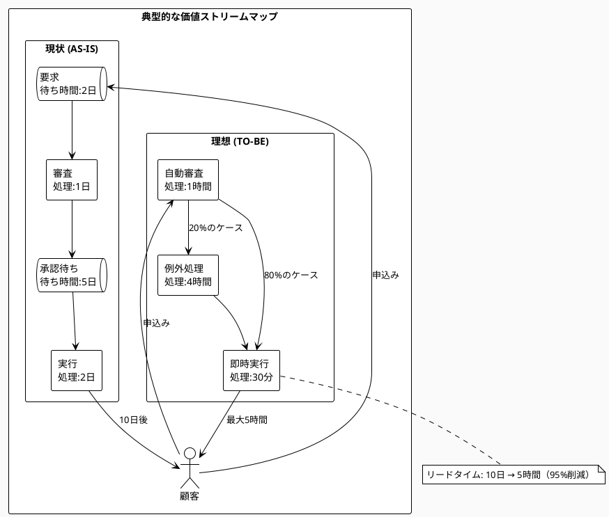

# Chapter 9: Phase 2: 価値ストリーム発見

## 一冊の本が教えてくれること

深夜2時37分、あなたはAmazonで一冊の技術書を注文しました。『Clean Architecture』。明後日のプロジェクトレビューまでに読み終えたい。Prime会員なので、翌日配送が選択できます。「注文を確定する」ボタンをクリック。

その瞬間から、見えない巨大な機械が動き始めます。あなたの注文は、どのような旅をするのでしょうか。

まず、注文データは最も近い在庫を持つ倉庫に転送されます。今回は埼玉県の巨大フルフィルメントセンター。ここで興味深いのは、本はすでに「あなたが買いそうな場所」に配置されているということです。機械学習が過去の購買パターンを分析し、技術書は都市部の倉庫に多く配置されています。

倉庫では、ロボットが棚を作業員のもとへ運びます。人間が歩き回るのではなく、商品が人間のもとへやってくる。ピッキング作業員は、画面の指示に従って本を取り出し、バーコードをスキャン。この時点で、あなたの注文ステータスは「準備中」に更新されます。

梱包ステーションでは、AIが本のサイズを認識し、最適な箱を選択。過剰包装を避け、環境負荷とコストを最小化します。配送ラベルが印刷され、箱は自動ソーターへ。郵便番号を読み取り、適切な配送トラックへ振り分けられます。

翌朝6時、配送ドライバーのスマートフォンに最適化された配送ルートが表示されます。交通状況、配送先の在宅確率、荷物のサイズを考慮した順序。あなたの本は、47番目の配送先として登録されています。

14時23分、インターホンが鳴ります。注文から12時間弱。本はあなたの手元に届きました。

しかし、同じ本を同じ時間に注文した別の人は、3日後にようやく受け取ったかもしれません。なぜこの違いが生まれるのでしょうか。それは、価値ストリームの違いにあります。在庫の有無、倉庫の場所、配送網の密度、すべてが価値の流れる速度に影響を与えるのです。

## なぜこの問題が重要なのか

### ビジネス課題：投資対効果が測定できない
多くの企業では、「デジタル変革に年間50億円投資している」ことは分かっても、「その投資が顧客にどれだけの価値を生み出しているか」は不明です。なぜなら、価値がどこで生まれ、どこで失われているかが見えないからです。価値ストリームを可視化することで、初めて真の投資対効果が測定可能になります。

### アーキテクチャ課題：システム間の価値伝達が不明瞭
マイクロサービスアーキテクチャでは、数十、数百のサービスが連携して価値を生み出します。しかし、各サービスが「正常に動作している」ことと、「価値を効率的に伝達している」ことは別問題です。サービスAからBへ、そしてCへと流れる価値の速度と品質を測定しなければ、ボトルネックは発見できません。

### 実装課題：各コンポーネントの貢献度が不明
開発チームは日々コードを書き、機能を実装しています。しかし、その機能が最終的な顧客価値にどれだけ貢献しているか、誰も説明できません。結果として、価値を生まない機能の開発に貴重なリソースが浪費され、本当に必要な改善が後回しになってしまうのです。

## 価値ストリームマッピング（VSM）の本質

価値ストリームマッピングは、顧客が価値を要求してから、その価値を受け取るまでの全プロセスを可視化する手法です。Parasol V5.4では、従来のVSMにZIGZAGプロセスの動的な側面を統合し、より実践的なアプローチを提供します。

### 価値の定義：顧客視点での本質

価値とは何でしょうか。技術者は「高速なレスポンス」「美しいコード」「最新技術の採用」と考えがちです。しかし、顧客にとっての価値は異なります：

```python
# 価値の多面的定義
value_definition = {
    "functional": {
        "description": "問題を解決する能力",
        "example": "ローン審査が5日から即日に",
        "metric": "処理時間短縮率"
    },
    "emotional": {
        "description": "安心感や満足感",
        "example": "進捗が常に見える透明性",
        "metric": "NPS（Net Promoter Score）"
    },
    "economic": {
        "description": "コスト削減や収益向上",
        "example": "手数料50%削減",
        "metric": "ROI"
    }
}
```

### ストリームの識別：始点から終点まで

価値ストリームには必ず始点（トリガー）と終点（価値の実現）があります。重要なのは、組織の境界ではなく、顧客の視点で定義することです：



### 測定と可視化：3つの重要指標

価値ストリームを測定する際の基本となる3つの指標：

```python
def calculate_stream_metrics(stage_data):
    """価値ストリームの基本メトリクス計算"""
    
    # 1. リードタイム（全体の所要時間）
    lead_time = sum(stage["duration"] for stage in stage_data)
    
    # 2. 処理時間（実際に価値を付加している時間）
    process_time = sum(
        stage["duration"] 
        for stage in stage_data 
        if stage["type"] == "processing"
    )
    
    # 3. 効率（処理時間 / リードタイム）
    efficiency = process_time / lead_time if lead_time > 0 else 0
    
    return {
        "lead_time_days": lead_time,
        "process_time_days": process_time,
        "efficiency_percent": efficiency * 100
    }
```

## 金融機関のデジタル革命

2022年、ある地方銀行（仮名：みどり銀行）は、住宅ローン審査プロセスの抜本的な改革に着手しました。きっかけは、顧客からの痛烈な一言でした。「なぜ、お金を借りるのに1ヶ月も待たなければならないのですか？」

### 初期状態：30日間の迷宮

従来のローン審査プロセスを価値ストリームマッピングで可視化した結果、衝撃的な事実が判明しました：

- 総リードタイム：30日
- 実際の処理時間：8時間
- 効率：1.1%

つまり、98.9%の時間は、書類が誰かの机の上で待機していただけだったのです。

### 価値の流れを追跡する

チームは、実際の申込書に「追跡タグ」を付けて、その旅を記録しました：

```python
# 価値損失パターンの検出
value_loss_patterns = {
    "waiting_patterns": [
        {"stage": "初期審査", "wait_time": "3日", "reason": "担当者不在"},
        {"stage": "収入確認", "wait_time": "5日", "reason": "他部署への照会"},
        {"stage": "最終承認", "wait_time": "7日", "reason": "月次会議待ち"}
    ],
    "rework_patterns": [
        {"stage": "書類確認", "rework_rate": "40%", "reason": "記入不備"},
        {"stage": "査定", "rework_rate": "20%", "reason": "追加資料要求"}
    ]
}
```

### 並列処理とデジタル化の威力

改革チームは、3つの革新的なアプローチを採用しました：

1. **並列処理の導入**：従来の順次処理から、可能な限り並列処理へ
2. **AIによる自動審査**：定型的な判断をAIに委譲
3. **API連携**：外部機関との情報連携を自動化

```python
# 改善後のプロセス構造
improved_process = {
    "自動審査": {
        "duration": "10分",
        "automation_rate": "80%",
        "steps": ["信用情報取得", "収入確認", "初期判定"]
    },
    "専門家審査": {
        "duration": "2時間",
        "parallel": True,
        "steps": ["物件評価", "リスク分析", "特殊条件確認"]
    },
    "最終承認": {
        "duration": "30分",
        "automation": "条件付き自動承認",
        "human_intervention": "例外ケースのみ"
    }
}
```

### 劇的な成果

6ヶ月後、みどり銀行の住宅ローン部門は驚くべき変化を遂げました：

- 平均審査期間：30日 → 2日（93%削減）
- 申込み数：月間100件 → 450件（350%増加）
- 顧客満足度：65% → 92%
- 処理コスト：1件あたり5万円 → 8千円

最も重要な変化は、職員の意識でした。「書類を処理する」から「顧客の夢を実現する」へ。価値の可視化が、組織文化まで変えたのです。

## いつ・どのように使うべきか

### 適用タイミング

価値ストリーム発見が最も効果的なのは：

**新規事業立ち上げ時**：最初から価値の流れを設計することで、無駄のないプロセスを構築できます。後から改善するより、最初から最適化する方が効率的です。

**既存プロセス改革時**：「なんとなく遅い」「効率が悪い気がする」という漠然とした問題意識を、定量的な改善機会に変換できます。

**システム統合・刷新時**：複数のシステムを統合する際、価値の流れを基準に設計することで、技術的な都合ではなく、顧客価値を中心としたアーキテクチャが実現できます。

### 成功条件

- **経営層の支援**：部門横断的な取り組みには、トップの強力なリーダーシップが不可欠
- **現場の協力**：実際の価値の流れを知っているのは現場。彼らの知識なしには真の改善は不可能
- **測定可能な指標**：感覚ではなく、数値で語る文化の醸成

### よくある失敗パターン

- **局所最適化**：一部門だけを効率化しても、全体のボトルネックが移動するだけ
- **測定疲れ**：あまりに詳細な測定は、測定自体が目的化してしまう
- **改善の形骸化**：一度改善したら終わりではなく、継続的な見直しが必要

### 価値ストリーム発見チェックリスト

- [ ] 顧客価値は明確に定義されているか
- [ ] 始点から終点まで、End-to-Endで見ているか
- [ ] 待機時間と処理時間を区別して測定しているか
- [ ] ボトルネックは特定されているか
- [ ] 測定は可能な限り自動化されているか

## 他の手法との組み合わせ

### Agile/Scrum：スプリント内での価値提供サイクル
スクラムの各スプリントを、小さな価値ストリームとして捉えることができます。スプリントプランニングから、デイリースクラム、レビュー、そしてインクリメントのリリースまで。この視点により、スプリント内の無駄を発見し、ベロシティを向上させられます。

### マイクロサービス：サービス間の価値伝達契約
各マイクロサービスは、価値ストリームの中の一つのステージとして機能します。サービス間のAPIは、価値を伝達する契約です。この観点から設計することで、技術的な結合度だけでなく、価値の流れの観点からもサービス境界を最適化できます。

### DDD：ドメイン境界と価値ストリームの整合
ドメイン駆動設計の境界づけられたコンテキストは、多くの場合、価値ストリームの自然な境界と一致します。ビジネスドメインの理解と、価値の流れの理解を統合することで、より本質的なシステム設計が可能になります。

Amazonの一冊の本の旅が示すように、価値は組織の中を流れる血液のようなものです。その流れが滞れば、組織は活力を失います。価値ストリームマッピングは、その流れを可視化し、改善する強力なツールです。

しかし、発見だけでは不十分です。次章では、発見した価値ストリームを、どのように詳細なステージに分解し、各ステージを最適化していくかを探ります。価値の流れを、より速く、より確実にする具体的な手法を見ていきましょう。

---

**実践ツールとリソース**
- 価値測定ダッシュボード実装：Appendix 9.1
- VSMワークショップテンプレート：Appendix 9.2
- 業界別価値指標ガイド：Appendix 9.3