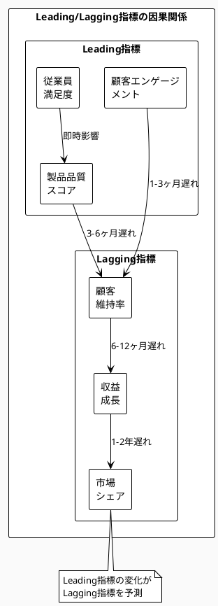

# Chapter 12: 価値メトリクスと測定

## Airbnbの北極星を探して

2016年、サンフランシスコのAirbnb本社。成長チームのミーティングルームでは、激しい議論が交わされていました。「予約数が前年比50%増加！」データアナリストが誇らしげに報告します。しかし、プロダクトマネージャーのLisaの表情は複雑でした。

「確かに予約は増えている。でも、なぜレビューの平均評価が下がっているんだろう？なぜホストの離脱率が上昇しているんだろう？」

この疑問が、Airbnbの測定哲学を根本から変えることになりました。

詳細な分析により、衝撃的な事実が判明しました。成長チームは予約数を最大化するため、品質の低いリスティングも積極的にプロモーションしていました。短期的には予約が増えますが、ゲストの体験は悪化し、ホストも疲弊していきます。

「私たちは間違った山を登っていた」。後にCEOのBrian Cheskyはそう振り返ります。「予約数は結果であって、目的ではない。真の目的は、世界中の人々に『居場所』を提供することだ」。

Airbnbは新たな「北極星指標」を定義しました：**「愛に満ちた滞在の夜数（Nights Booked with Love）」**。これは単なる予約泊数ではなく、以下の要素を組み合わせた複合指標でした：

- ゲストの5つ星レビュー率
- ホストの継続率
- リピート予約率
- 滞在後の推奨意向（NPS）

この指標の導入により、組織の行動が劇的に変わりました。量から質へ。成長から持続可能性へ。2年後、予約の絶対数は減少しましたが、ゲスト一人あたりの生涯価値は2.3倍に、ホストの平均活動期間は1.8倍に延びました。

測定するものが、組織の行動を決める。これがAirbnbが学んだ最も重要な教訓でした。

## なぜこの問題が重要なのか

### ビジネス課題：真の価値創造が数値化できない
「顧客満足度を上げたい」「イノベーションを促進したい」「従業員の幸福度を高めたい」。これらは重要な経営目標ですが、どう測定すればよいでしょうか。多くの企業は、測定の難しさから、測定しやすい代替指標（売上、利益率など）に逃げてしまいます。しかし、それでは真の価値創造から遠ざかってしまうのです。

### アーキテクチャ課題：分散システムでの統合的測定の困難さ
マイクロサービスアーキテクチャでは、各サービスが独自のメトリクスを生成します。しかし、顧客体験は複数のサービスをまたがって実現されます。個別のサービスメトリクスを、どのようにして統合的な価値指標に変換すればよいでしょうか。技術的な複雑性が、ビジネス価値の測定を阻害しているのです。

### 実装課題：データの収集・保存・分析のコスト
詳細なメトリクスを収集すればするほど、インフラコストは増大します。リアルタイム分析を行えば、さらにコストは跳ね上がります。「測定のROIはあるのか？」という問いに、多くのIT部門は答えられません。測定自体が目的化し、本来の価値創造から資源を奪ってしまう危険があります。

## 価値測定フレームワーク

効果的な価値測定には、体系的なアプローチが必要です。Parasol V5.4の価値測定フレームワークは、測定を価値創造の手段として位置づけます。

### Leading vs Lagging指標の設計

すべての指標は、2つのタイプに分類できます：

**Lagging指標（遅行指標）**：すでに起こった結果を測定
- 売上、利益、顧客数
- 確実だが、手遅れになりやすい

**Leading指標（先行指標）**：将来の結果を予測
- エンゲージメント率、品質スコア、従業員満足度
- 不確実だが、行動を変える余地がある

```python
# メトリクス定義のデータ構造
metrics_definition = {
    "customer_lifetime_value": {
        "type": "lagging",
        "formula": "総収益 / アクティブ顧客数",
        "measurement_frequency": "monthly",
        "data_sources": ["billing_system", "crm"]
    },
    "engagement_score": {
        "type": "leading",
        "formula": "(DAU/MAU) * session_duration * feature_adoption",
        "measurement_frequency": "daily",
        "predictive_power": 0.73,  # CLVとの相関係数
        "data_sources": ["analytics_db", "product_telemetry"]
    }
}
```

効果的な測定システムは、両者のバランスを取ります：



### 測定の4原則

効果的な測定は、以下の4原則を満たす必要があります：

1. **正確性（Accuracy）**：測定値は実態を正しく反映しているか
2. **適時性（Timeliness）**：行動を変えるのに十分な速さで提供されるか
3. **行動可能性（Actionability）**：測定結果から具体的な行動が導けるか
4. **費用対効果（Cost-Effectiveness）**：測定コストは得られる価値に見合うか

### 価値ダッシュボードの階層的構成

組織の各レベルに適した情報を提供する階層的ダッシュボード：

```python
# 階層別ダッシュボード構成
dashboard_hierarchy = {
    "executive": {
        "refresh_rate": "daily",
        "metrics": ["revenue_growth", "customer_ltv", "market_share"],
        "visualization": "trend_charts",
        "alert_threshold": "5%_deviation"
    },
    "management": {
        "refresh_rate": "hourly",
        "metrics": ["team_velocity", "quality_score", "customer_satisfaction"],
        "visualization": "scorecards",
        "drill_down": True
    },
    "operational": {
        "refresh_rate": "real_time",
        "metrics": ["response_time", "error_rate", "throughput"],
        "visualization": "live_graphs",
        "anomaly_detection": True
    }
}
```

## デジタルバンクの予知能力

2023年、あるデジタル専業銀行（仮名：ネクストバンク）は、顧客離反という深刻な問題に直面していました。毎月、何の前触れもなく優良顧客が他行に流出していきます。

### 初期状態：後手に回る対応

従来の測定システムでは：
- 月次で口座残高と取引件数を集計
- 四半期ごとに顧客満足度調査
- 年次でNPS（Net Promoter Score）測定

問題が表面化した時には、すでに手遅れでした。

### 予測的測定システムの構築

ネクストバンクは、Leading指標を中心とした新しい測定体系を構築しました：

```python
# リアルタイムデータ収集パイプライン
class CustomerHealthMonitor:
    def __init__(self):
        self.metrics_buffer = []
        self.alert_threshold = 0.7
        
    async def collect_signals(self, customer_id):
        """顧客の行動シグナルをリアルタイム収集"""
        
        signals = {
            "login_frequency": await self.get_login_pattern(customer_id),
            "transaction_diversity": await self.analyze_transactions(customer_id),
            "support_interactions": await self.get_support_sentiment(customer_id),
            "app_feature_usage": await self.track_feature_adoption(customer_id),
            "external_indicators": await self.scan_competitor_activity()
        }
        
        # 複合スコアの計算
        health_score = self.calculate_health_score(signals)
        
        # 閾値を下回ったらアラート
        if health_score < self.alert_threshold:
            await self.trigger_retention_campaign(customer_id)
            
        return health_score
```

特に効果的だったのは、「マイクロ行動」の追跡でした：

- ログイン頻度の減少（離反の90日前に検出可能）
- 新機能の利用率低下（離反の60日前）
- 問い合わせ内容のネガティブ化（離反の30日前）

### アクションへの接続

測定だけでは価値を生みません。ネクストバンクは、測定結果を即座にアクションに変換する仕組みを構築しました：

```python
# アラート条件と自動アクション
alert_rules = {
    "high_value_at_risk": {
        "condition": "health_score < 0.5 AND customer_value > 10000",
        "actions": [
            "assign_relationship_manager",
            "offer_premium_benefits",
            "schedule_personal_call"
        ],
        "escalation": "24_hours"
    },
    "engagement_drop": {
        "condition": "login_frequency_change < -50%",
        "actions": [
            "send_personalized_email",
            "push_notification_campaign",
            "feature_tutorial_prompt"
        ],
        "monitoring_period": "2_weeks"
    }
}
```

### 劇的な成果

新しい測定システム導入から6ヶ月：

- **離反率**：月2.5% → 0.8%（68%削減）
- **顧客生涯価値**：平均150万円 → 240万円（60%向上）
- **離反予測精度**：45% → 87%
- **対応リードタイム**：離反後 → 離反90日前

最も重要な変化は、組織文化でした。「事後対応」から「予防的ケア」へ。データが組織の行動を根本から変えたのです。

## いつ・どのように使うべきか

### 適用タイミング

価値測定システムの導入・改善が最も効果的なタイミング：

**新規KPI導入時**：最初から測定インフラを組み込むことで、後付けのコストを削減できます。

**システム刷新時**：レガシーシステムの更新は、測定ポイントを再設計する絶好の機会です。

**四半期レビュー時**：定期的な見直しにより、環境変化に対応した測定体系を維持できます。

### 成功条件

- **自動化された収集**：手動収集は続かない。APIやイベントストリームからの自動収集が必須
- **リアルタイム可視化**：ダッシュボードは常に最新状態を表示
- **行動への接続**：測定結果が具体的なアクションにつながる仕組み

### よくある失敗パターン

- **測定疲れ**：多すぎる指標で、何が重要か分からなくなる
- **虚栄の指標**：見栄えは良いが行動につながらない指標
- **遅延したフィードバック**：問題発生から測定まで時間がかかりすぎる

### 価値測定導入チェックリスト

- [ ] Leading指標とLagging指標のバランスは適切か
- [ ] 各指標は具体的な行動に結びついているか
- [ ] データ収集は可能な限り自動化されているか
- [ ] ダッシュボードは役割別に最適化されているか
- [ ] 測定コストは得られる価値に見合っているか

## 他の手法との組み合わせ

### Agile/Scrum：スプリントメトリクスとの統合
スプリントごとのベロシティやバーンダウンチャートを、より大きな価値指標と結びつけることで、日々の開発活動が企業価値にどう貢献しているかを可視化できます。

### マイクロサービス：分散トレーシングとの連携
OpenTelemetryなどの分散トレーシングツールと統合することで、技術的なメトリクス（レイテンシー、エラー率）をビジネス価値（顧客体験、収益影響）に変換できます。

### DDD：ドメインイベントからのメトリクス生成
ドメインイベント（OrderPlaced、PaymentProcessedなど）は、ビジネス価値の自然な測定ポイントです。イベントソーシングパターンと組み合わせることで、過去の価値創造プロセスも分析可能になります。

Airbnbが「愛に満ちた滞在」を測定したように、真の価値は単純な数値では表現できません。しかし、適切に設計された複合指標と、先行指標の活用により、組織が目指すべき北極星を定義し、追求することができます。

Part 3では、価値の発見から定義、階層化、そして測定まで、包括的な価値管理の手法を見てきました。次のPart 4では、この価値を実現するための具体的な問題解決アプローチ、ZIGZAGプロセスの詳細に入っていきます。測定された価値のギャップこそが、次なる改善の出発点となるのです。

---

**測定システムの実装支援**
- メトリクス収集パイプライン（Python/Go）：Appendix 12.1
- Grafanaダッシュボード設定例：Appendix 12.2
- 業界別測定指標カタログ：Appendix 12.3