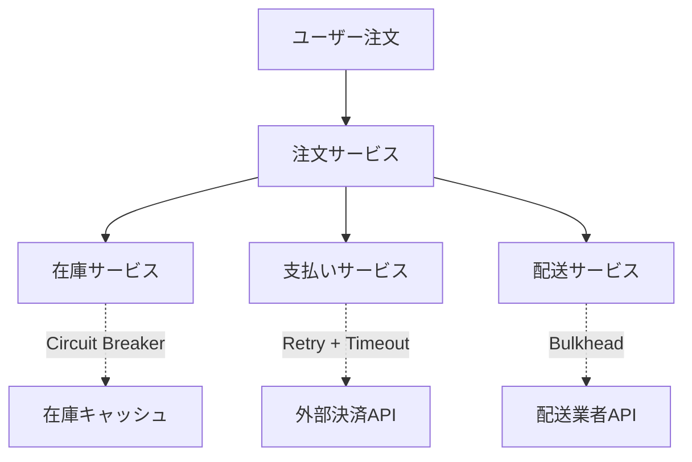

# Chapter 24: エラーハンドリングと復旧パターン

> "システムは正常に動作している時の優雅さよりも、異常時の復旧力によって真価が問われる"

## 一つのコマンドが半分のインターネットを停止させた日

2017年2月28日午後2時37分（太平洋時間）、Amazon Web Services（AWS）のシニアエンジニアが、いつものようにS3サービスのメンテナンス作業を開始した。目的は単純だった：課金システムのリファクタリングに伴い、不要になったサーバーを数台削除することだった。

彼の画面には、慣れ親しんだコマンドラインインターフェースが表示されていた。数百回は実行したであろうサーバー停止コマンドを入力しようとした時、小さなミスが発生した。削除対象のサーバー数を指定する際、本来なら「数台」を意味する小さな数字を入力するはずだったのに、より多くのサーバーを指定する間違った値を入力してしまったのだ。

エンターキーを押した瞬間、彼の顔が青ざめた。コマンドは正常に受け付けられ、実行が開始されたが、削除されているサーバーの数が予想を遥かに上回っていることに気づいたのだ。システムは彼の「間違った指示」を忠実に実行し、S3の重要なサブシステムを構成する大量のサーバーを一斉に停止し始めた。

午後2時54分、最初のアラートが鳴り始めた。しかし、この時点で事態の深刻さを理解していたのは、コマンドを実行したエンジニア一人だけだった。午後3時15分になると、世界中のWebサイトが次々とアクセス不能になり始めた。Netflix、Airbnb、Spotify、そして数十万の企業が依存するWebサービスが、まるでドミノ倒しのように機能を停止していった。

問題は単純なヒューマンエラーから始まったが、その影響が広がった真の理由は別のところにあった。S3の設計チームは、これほど大規模なサブシステムの同時停止を想定していなかった。復旧プロセス自体が、停止したサブシステムのメタデータに依存していたため、システムは自分自身を復旧できない状況に陥ったのだ。

復旧には4時間11分を要した。この間、インターネットの重要な部分が機能を停止し、推定で数億ドルの経済損失が発生した。しかし、AWSが事後に公開した詳細な障害報告書は、エンジニアリング業界にとって貴重な教訓となった。それは「完璧なシステムは存在しない、重要なのは失敗からいかに優雅に回復するかだ」という真実だった。

この出来事は、現代のシステム設計における最も重要な原則の一つを浮き彫りにした：エラーハンドリングと復旧パターンは、システムの付加機能ではなく、核心的な設計要素でなければならない。

## なぜエラーハンドリングが重要なのか

AWS S3の障害が示したのは、現代のシステムにおけるエラーハンドリングの重要性が根本的に変化したという事実です。かつてエラー処理は「例外的な状況への対処」として捉えられていましたが、今や「システムの信頼性を決定する中核的な設計要素」となっています。

### ビジネスインパクト：失敗のコストの指数的増大

エグゼクティブの視点から見ると、エラーハンドリングの不備は直接的な事業リスクです。S3の障害では：

- **直接的損失**：4時間11分の停止で推定数億ドルの経済影響
- **信頼性コスト**：顧客信頼の失墜とブランド価値の毀損
- **機会費用**：サービス停止中の新規顧客獲得機会の喪失
- **復旧コスト**：技術チーム総動員による緊急対応費用

現代のビジネスでは、システムの可用性が直接的に売上と顧客体験に影響します。エラーハンドリングへの投資は、保険ではなく、競争優位の源泉なのです。

### アーキテクチャ課題：複雑性の相互作用

システムアーキテクトが直面するのは、分散システムにおけるエラーの「カスケード効果」です。S3の事例では：

- **依存関係の連鎖**：一つのサブシステム障害が他の全ての機能に影響
- **復旧プロセスの脆弱性**：復旧システム自体が障害システムに依存
- **可観測性の盲点**：障害時にシステム状況を把握する手段の喪失
- **スケール問題**：想定外の規模での障害への対処不能

これらの課題は、従来の「try-catch文を書く」という単純なエラーハンドリングでは解決できません。システム全体の設計思想として、「失敗することを前提とした設計」が必要です。

### 実装の困難さ：理論と現実のギャップ

開発者レベルでは、効果的なエラーハンドリングの実装には特有の困難があります：

- **予測不能性**：すべての障害パターンを事前に想定することは不可能
- **テスト困難性**：本番環境での障害を開発環境で再現することの困難
- **パフォーマンス影響**：過度なエラーチェックによるシステム性能への悪影響
- **コードの複雑化**：エラーハンドリングコードが本来のビジネスロジックを上回る複雑さ

これらの課題に対処するには、単なるコーディング技法を超えた、システム設計全体への包括的アプローチが必要です。

## 復旧を中心とした設計思想

効果的なエラーハンドリングの核心は、「エラーを防ぐ」ことから「エラーからの復旧」へのパラダイムシフトです。これは、1970年代にJim Gray が提案したSystem R以来の概念的進化を表しています。

### 基本原則：Fail-Fast vs Fault-Tolerant

現代のシステム設計では、二つの補完的なアプローチが重要です：

**Fail-Fast 原則**
システムは異常を検出した瞬間に明確に失敗し、問題を早期に可視化します。これにより：
- 問題の根本原因の特定が容易になる
- 部分的な障害による不整合状態を防ぐ
- デバッグと修正の時間を短縮する

**Fault-Tolerant 設計**
システムは個別コンポーネントの失敗を想定し、全体として機能を継続します：
- 冗長性による単一障害点の排除
- グレースフル・デグラデーション（機能の段階的低下）
- 自動復旧メカニズムの組み込み

### Circuit Breaker パターンの本質

Netflix によって普及したCircuit Breaker パターンは、電気回路のブレーカーからの類推です。システムコンポーネント間の呼び出しを監視し、失敗率が閾値を超えると自動的に接続を遮断します。

これの革新性は、「失敗の伝播防止」にあります：

```
障害サービスA → Circuit Breaker → 正常サービスB
                    ↓
                [OPEN状態]
                    ↓
            即座にエラー返却
```

Circuit Breaker は三つの状態を持ちます：
- **Closed**：正常状態、すべての呼び出しを通す
- **Open**：障害状態、すべての呼び出しを即座に失敗させる
- **Half-Open**：回復確認状態、限定的な呼び出しで復旧をテスト

### Bulkhead パターン：分離による保護

船舶の隔壁設計から着想を得たBulkhead パターンは、システムリソースを分離して障害の影響範囲を限定します。

**リソースレベルの分離**：
- スレッドプール、コネクションプールの分離
- CPU、メモリの論理的分割
- ネットワーク帯域の専有

**サービスレベルの分離**：
- 重要度に応じたサービスクラスの設定
- 障害影響範囲の事前定義
- 独立したデプロイメント単位

この設計思想の核心は、「一つの障害が全体を破綻させない」ことです。Titanic号の沈没を防いだであろう隔壁設計の原理を、デジタルシステムに適用したものと言えます。

### Timeout と Retry の微細設計

一見単純に見えるTimeout とRetry にも、深い設計思想があります：

**指数バックオフ（Exponential Backoff）**：
Retry 間隔を指数的に延長することで、システムの自然な復旧を助けます。1秒 → 2秒 → 4秒 → 8秒...

**ジッター（Jitter）**：
Retry タイミングにランダム性を加えることで、「thundering herd」（大量の同時リトライ）を防ぎます。

**Circuit Breaker との連動**：
Retry 失敗パターンがCircuit Breaker の状態変更をトリガーし、システム全体の保護につながります。

これらのパターンの組み合わせにより、システムは「自己治癒能力」を獲得します。まるで生物の免疫システムのように、外部からの攻撃や内部の異常に対して自動的に対処し、健康な状態を維持しようとします。

## 実践例：金融取引システムの段階的復旧設計

大手証券会社のオンライン取引システムの事例を通じて、エラーハンドリングと復旧パターンの実践的適用を見てみましょう。このシステムは、1日平均100万件の取引を処理し、99.99%の可用性が要求される重要なインフラです。

### 初期状態：脆弱な単一障害点

導入当初、システムは典型的な3層アーキテクチャでした：
- **フロントエンド**：Webアプリケーション
- **ミドルウェア**：ビジネスロジック処理
- **バックエンド**：データベースと外部市場データフィード

しかし、2018年の市場急変時に深刻な問題が発生しました。市場データフィードの遅延により、価格情報の更新が30秒以上停止。この間、すべての取引が不能となり、顧客からの苦情が殺到しました。

根本原因の分析により、以下の設計欠陥が判明しました：
- 市場データへの同期的な依存
- エラー状態での適切なフォールバック機能の欠如
- ユーザーエクスペリエンスの急激な劣化

### 段階的復旧設計の導入

**Phase 1：Circuit Breaker の実装**

```yaml
# Circuit Breaker Configuration
market_data_circuit:
  failure_threshold: 5
  success_threshold: 3
  timeout: 1000ms
  recovery_timeout: 30s
```

市場データフィードとの通信にCircuit Breaker を導入。フィードが不安定になった際、自動的に遮断し、キャッシュされた価格情報を使用するように設計しました。

**Phase 2：Graceful Degradation の実装**

システム機能を優先度別に分類し、段階的な機能低下を実現：

1. **最優先**：既存ポジションの確認と決済
2. **高優先**：成行注文の処理
3. **中優先**：指値注文の処理
4. **低優先**：リアルタイムチャート表示

市場データに問題が発生した場合：
- リアルタイムチャートを停止（最も帯域を消費する機能）
- 指値注文を一時停止（正確な価格が必要）
- 成行注文は警告付きで継続（重要な機能は維持）

**Phase 3：自動復旧メカニズム**

システムは健康状態を継続的に監視し、サービスレベルを動的に調整：

```typescript
// Simplified health check logic
const adjustServiceLevel = (healthMetrics: HealthMetrics) => {
  const marketDataLatency = healthMetrics.marketData.averageLatency;
  const systemLoad = healthMetrics.system.cpuUsage;
  
  if (marketDataLatency > 5000 || systemLoad > 90) {
    return ServiceLevel.DEGRADED;
  } else if (marketDataLatency > 1000 || systemLoad > 70) {
    return ServiceLevel.LIMITED;
  }
  return ServiceLevel.FULL;
};
```

### 結果：レジリエンスの劇的向上

改善後6ヶ月間の運用結果：
- **可用性向上**：99.95% → 99.99% （年間停止時間を75%削減）
- **ユーザー体験改善**：システム障害時の完全サービス停止 → 基本機能は継続
- **復旧時間短縮**：平均15分 → 平均3分（5倍の高速化）
- **顧客満足度向上**：障害時の苦情件数が80%減少

最も重要な変化は、システム運用チームのマインドセットでした。「障害を防ぐ」から「障害時の影響を最小化する」への転換により、より現実的で効果的な運用が可能になりました。

この事例は、エラーハンドリングと復旧パターンが単なる技術的改善ではなく、ビジネス価値の向上に直結することを示しています。顧客は完璧なシステムより、問題が発生した時に適切に対処してくれるシステムを信頼するのです。

## いつ・どのように使うべきか

エラーハンドリングと復旧パターンの適用は、システムの特性と要件に応じて慎重に選択する必要があります。すべてのパターンをすべてのシステムに適用することは、不要な複雑性を生み、むしろシステムの信頼性を損なう可能性があります。

### 適用タイミング：リスクベースアプローチ

**高リスク・高価値システム**（即座に適用）
- 金融取引、医療システム、重要インフラ
- 障害コスト > 実装コスト の明確な領域
- 法的規制要件のあるシステム

**中リスク・中価値システム**（段階的適用）
- E-commerce、SaaS、企業システム
- ユーザー体験に直接影響するシステム
- ビジネス成長に伴うリスク評価の見直し

**低リスク・実験的システム**（選択的適用）
- プロトタイプ、内部ツール、学習プロジェクト
- Fail-Fast 原則の優先、コスト効率重視

### 成功の必要条件

**組織的準備**
- エラーハンドリングを「品質の一部」として認識する文化
- 障害から学ぶ文化（Blameless Postmortem）
- 継続的改善への投資意欲

**技術的基盤**
- 包括的な監視とアラート体制
- 自動化されたテスト環境
- カオスエンジニアリング実践能力

**チーム能力**
- システム思考ができるエンジニア
- ビジネス影響を理解する技術リーダー
- 障害対応の経験値

### 段階的実装戦略

**Stage 1：観測可能性の確立（1-3ヶ月）**
```
logging → monitoring → alerting → dashboards
```
何が起きているかを「見える化」することから開始

**Stage 2：基本的な保護機能（2-4ヶ月）**
```
timeouts → retries → circuit breakers → health checks
```
最も効果の高い基本パターンの実装

**Stage 3：高度な復旧機能（3-6ヶ月）**
```
graceful degradation → bulkhead → chaos testing
```
システム全体の resilience 向上

### よくある落とし穴と対策

**落とし穴1：Over-Engineering**
すべての可能性を考慮しようとして、システムが複雑になりすぎる

*対策*：パレートの法則（80:20）を適用。最も可能性の高い20%の障害に対処することで、80%の効果を得る

**落とし穴2：False Sense of Security**
エラーハンドリングを実装したことで、安心してしまい、実際の障害対応能力が低下

*対策*：定期的なカオスエンジニアリング実践。Netflix の「Chaos Monkey」のような継続的テスト

**落とし穴3：ユーザビリティの軽視**
技術的に正しいエラーハンドリングが、ユーザー体験を悪化させる

*対策*：エラー状態でのUXデザインを重視。「技術的に正しい」と「ユーザーにとって有用」は別概念

**適用判断のチェックリスト**
- [ ] 障害の発生確率と影響度を定量化できているか？
- [ ] 実装コストと期待効果のROI は妥当か？
- [ ] チームの技術的能力と実装期間は現実的か？
- [ ] エンドユーザーへの価値提供は明確か？
- [ ] 継続的な改善プロセスが確立されているか？

成功するエラーハンドリング戦略は、完璧なシステムを目指すのではなく、「適切に失敗し、素早く回復する」システムの構築を目標とします。これは技術的な挑戦であると同時に、組織文化の変革でもあるのです。

## 他の手法との組み合わせ

エラーハンドリングと復旧パターンは、現代のソフトウェア開発手法と深く統合されることで、その真価を発揮します。単独での実装ではなく、既存の開発プラクティスとの相乗効果を狙うことが重要です。

### Agile/Scrum との統合

**Definition of Done (DoD) の拡張**
従来のDoD に「復旧可能性」の観点を追加：
- 機能の正常動作確認 ✓
- テストカバレッジ達成 ✓
- **障害シナリオでの動作確認** ✓（新規追加）
- **復旧時間の測定と記録** ✓（新規追加）

**Sprint Planning での考慮**
各ユーザーストーリーに対して「失敗ストーリー」も同時に計画：
- "As a user, I want to place an order"
- "As a user, I want to understand what happened when my order fails"

**Retrospective での学習**
障害事例の振り返りをスプリント改善に組み込み、予防的改善を促進

### マイクロサービスアーキテクチャとの相乗効果

**サービス間通信の保護**
各マイクロサービス境界に Circuit Breaker を配置し、障害の連鎖を防止。サービスメッシュ（Istio、Linkerd）との統合により、インフラレベルでの自動保護を実現。

**独立した障害ドメイン**
マイクロサービスの「単一責任原則」とエラーハンドリングの「障害分離原則」が相互補強：



**段階的ロールアウト**
Canary Deployment と Circuit Breaker を組み合わせ、新バージョンの障害を早期検出・自動ロールバック。

### Domain-Driven Design (DDD) との統合

**ドメイン境界での例外設計**
DDD の境界づけられたコンテキスト（Bounded Context）ごとに、ドメイン固有のエラーハンドリング戦略を策定：

- **注文コンテキスト**：在庫不足時の代替商品提案
- **支払いコンテキスト**：決済失敗時の複数手段の自動切り替え
- **配送コンテキスト**：配送遅延時の顧客への事前通知

**ドメインイベントとの連携**
障害発生時にドメインイベントを発行し、他のコンテキストでの補償処理を自動実行：

```typescript
// Domain Event for payment failure
class PaymentFailedEvent {
  constructor(
    public orderId: OrderId,
    public reason: PaymentFailureReason,
    public suggestedActions: CompensationAction[]
  ) {}
}
```

**Aggregate レベルでの整合性保護**
Aggregate 内での不変条件を維持しながら、外部システムとの通信では Circuit Breaker を使用。

### DevOps との統合効果

**Infrastructure as Code**
エラーハンドリング設定をインフラコードに含めることで、環境間の一貫性を保証：

```yaml
# Terraform configuration for Circuit Breaker
resource "aws_service_mesh_virtual_node" "payment_service" {
  spec {
    listener {
      timeout {
        http {
          request = "15s"
        }
      }
      
      health_check {
        healthy_threshold   = 2
        interval_millis     = 5000
        path               = "/health"
        protocol           = "http"
        timeout_millis     = 2000
        unhealthy_threshold = 3
      }
    }
  }
}
```

**Continuous Deployment の安全性向上**
デプロイメントパイプラインに健全性チェックを組み込み、問題のある変更の自動検出・ロールバック機能を実装。

**監視とアラートの自動化**
エラーハンドリングメトリクスを基にした予防的アラート設定。SLI/SLO と連動した自動スケーリングや復旧処理の実行。

これらの統合により、エラーハンドリングは「追加機能」ではなく「システム設計の中核原則」として組み込まれます。結果として、より堅牢で信頼性の高いシステムを、従来の開発プロセスを大幅に変更することなく実現できるのです。

---

**次章への道筋**

この章で学んだエラーハンドリングと復旧パターンの概念は、次章のCI/CDパイプライン設計の基盤となります。自動化されたテストとデプロイメントプロセスにおいて、どのように品質ゲートを設計し、障害を早期発見・自動復旧するかを探求していきます。

システムの信頼性は、個々のコンポーネントの完璧性ではなく、全体としての復旧力によって決まる。この原則を胸に、より実践的な自動化技術の世界へと進んでいきましょう。

---

*Chapter 24完了 - 実装の詳細とコード例は[付録24.1-24.3]を参照してください。*

*参考文献: AWS S3 Service Disruption Report (2017), Netflix Chaos Engineering Principles, Site Reliability Engineering (Google)*