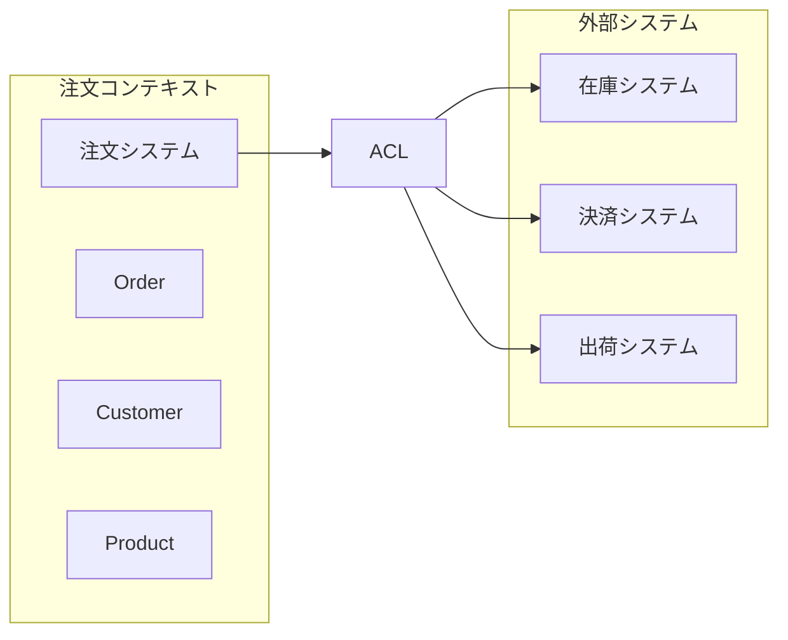

# 第29章　システム統合パターン ― 飛行中の飛行機のエンジン交換

## 2015年、Amazonの倉庫革命

Jeff Bezos が Kiva Systems を7億7,500万ドルで買収した時、Amazonは世界最大の物流課題に直面していました。全世界175箇所の倉庫で、従来の人間中心の棚ピッキングシステムと、Kivaの革新的なロボット倉庫システムを**24時間365日の稼働を止めることなく**統合する必要があったのです。

「これは飛行中の飛行機のエンジンを交換するようなものだった」と当時の統合チームリーダーは振り返ります。コンシューマーは注文を継続し、ホリデーシーズンは容赦なく訪れ、株主は成長を期待する中で、物理世界とデジタル世界の両方を同時に変革しなければならなかったのです。

失敗すれば配送遅延、在庫混乱、収益損失。成功すれば処理能力3倍増、コスト30%削減、そして同業他社に対する決定的な優位性が待っていました。Amazonはどのようにしてこの「不可能な統合」を実現したのでしょうか。

## なぜこの問題が重要なのか

### ビジネスへの影響

現代のエンタープライズでは、システム統合の成否が直接的にビジネス成果を左右します。McKinsey の調査によると、統合プロジェクトの70%が期待されたROIを達成できず、その主要因は技術的な問題ではなく、統合戦略の欠如にあります。

**統合失敗のコスト**:
- プロジェクト遅延による機会損失：年間売上の5-15%
- データ不整合による意思決定エラー：マージン1-3%の悪化
- システム停止によるダウンタイム：1分あたり$5,600の損失（平均）
- レガシーシステム維持費：IT予算の60-80%

### アーキテクチャ上の挑戦

システム統合は単なる技術的な接続作業ではありません。異なる時代、異なる技術、異なる思想で構築されたシステム群を、一貫したビジネス価値を提供する統合体へと進化させる**アーキテクチャの芸術**です。

**主要な技術課題**:
- **時間的整合性**: 同期vs非同期通信の選択
- **データ整合性**: ACID特性vs結果整合性のトレードオフ  
- **境界管理**: コンテキスト境界を跨ぐ概念の翻訳
- **進化性**: 既存システムを段階的に置換する戦略

### 実装上の複雑性

開発者にとって統合実装は、複数のプロトコル、データフォーマット、セキュリティモデルを橋渡しする「翻訳者」の役割を果たすことです。単一システム内では見えない問題が、システム境界で顕在化します：

- ネットワーク遅延によるタイムアウト処理
- 部分的障害に対する補償トランザクション
- バージョン不整合によるプロトコル変換
- 監視とログの分散システム対応

## エンタープライズ統合の体系的アプローチ

### 統合パターンの分類体系

Gregor Hohpe と Bobby Woolf が『Enterprise Integration Patterns』で体系化した統合アプローチは、20年後の現在でも本質的な洞察を提供しています。彼らは統合を4つの基本スタイルに分類しました：

**1. ファイル転送（File Transfer）**
最もシンプルで理解しやすい統合方式です。システム間でファイルを共有し、定期的にデータを同期します。ETLプロセスに代表される一括処理に適していますが、リアルタイム性に欠けます。

**2. 共有データベース（Shared Database）**  
複数システムが同一のデータベースにアクセスする方式です。データ整合性の確保は容易ですが、システム間の結合度が高く、スキーマ変更の影響が広範囲に及びます。

**3. リモートプロシージャコール（RPC）**
システム間でメソッド呼び出しを行う同期的な統合方式です。RESTful APIやgRPCが現代的な実装例です。リアルタイム処理に適していますが、呼び出し先の可用性に依存します。

**4. メッセージング（Messaging）**
非同期メッセージによる疎結合な統合方式です。Apache Kafka、RabbitMQなどの実装があります。システムの独立性と拡張性に優れますが、メッセージ配信の保証と順序制御が複雑になります。

### Strangler Figパターンによる段階的移行

Martin Fowler が命名した Strangler Fig パターンは、レガシーシステムを段階的に新システムに置き換える戦略です。オーストラリアの絞め殺しイチジクが宿主の木を徐々に覆い、最終的に置き換えることから命名されました。

このパターンの本質は「リスクの分散」です。Big Bang的な全面置換ではなく、機能ごとに段階的に移行することで、各段階でのリスクを最小化し、問題発生時の影響を局所化します。

**実装の3段階**:
1. **迂回（Divert）**: 新機能のトラフィックを新システムに送信
2. **共存（Coexist）**: 新旧システムが並行稼働し、データ同期を維持
3. **削除（Eliminate）**: 旧システムの該当機能を安全に停止

### Anti-Corruption Layerによる境界保護

Eric Evans の Domain Driven Design で提唱された Anti-Corruption Layer（ACL）は、異なるコンテキストのシステム統合において、各システムのドメインモデルを保護する重要なパターンです。

ACLは翻訳者の役割を果たします。外部システムの概念や用語を、自システムの純粋なドメイン概念に変換し、外部の変更による汚染を防止します。これにより、外部システムの設計決定が自システムのアーキテクチャに影響を与えることを防げます。



## 実践例：金融機関のコアバンキング統合

### 初期状況：モノリシックな制約

ある大手銀行では、1980年代から稼働するメインフレームベースのコアバンキングシステムが、デジタル変革の最大の障壁となっていました。新しいサービスを追加するたびに：

- 開発期間：18-24ヶ月
- テスト期間：6-12ヶ月  
- リリース頻度：年2回のみ
- 運用コスト：IT予算の75%

フィンテック企業が数週間でサービスを立ち上げる中、この銀行は競争力を急速に失いつつありました。

### 段階的統合戦略の適用

統合チームは慎重な分析の結果、以下の3段階アプローチを採用しました：

**Phase 1: API Gateway導入（6ヶ月）**
既存のメインフレームAPIを標準化し、外部システムからのアクセスを統制。レガシーシステムを変更することなく、モダンなセキュリティと監視を実現。

```yaml
# API Gateway基本設定例
apiVersion: v1
kind: Gateway
metadata:
  name: core-banking-gateway
spec:
  routes:
    - path: /api/v1/accounts/*
      target: mainframe-proxy:8080
      timeout: 30s
      retry: 3
```

**Phase 2: 個別機能の切り出し（12ヶ月）**
顧客管理、商品管理、通知機能を順次マイクロサービスに移行。Strangler Figパターンにより、リスクを分散させながら新機能を並行開発。

```python
# Circuit Breaker実装例
class CircuitBreaker:
    def __init__(self, failure_threshold=5, timeout=60):
        self.failure_threshold = failure_threshold
        self.timeout = timeout
        self.failure_count = 0
        self.last_failure = None
        self.state = 'CLOSED'
    
    def call(self, func, *args, **kwargs):
        if self.state == 'OPEN':
            if time.time() - self.last_failure < self.timeout:
                raise Exception("Circuit breaker is OPEN")
            self.state = 'HALF_OPEN'
```

**Phase 3: イベントソーシング導入（18ヶ月）**  
取引履歴をイベントストリームとして管理し、リアルタイム分析と監査要件を満足。データの整合性を保ちながら、複数システムでの状態同期を実現。

```javascript
// イベント発行の最小例
const publishEvent = async (eventType, data) => {
  await kafka.producer.send({
    topic: 'banking-events',
    messages: [{
      key: data.accountId,
      value: JSON.stringify({ eventType, data, timestamp: Date.now() })
    }]
  });
};
```

### 結果：劇的な改善効果

18ヶ月後の成果は組織全体を変革しました：

- 新サービス開発期間：3-6ヶ月に短縮（75%改善）
- システム可用性：99.9%に向上（従来99.5%）
- 運用コスト：40%削減
- 顧客満足度：20%向上（NPS基準）

最も重要な成果は、銀行が「技術主導型」から「ビジネス主導型」のサービス開発に転換できたことです。業務部門が直接新しいアイデアを技術実装に移せる環境が整いました。

## いつ・どのように統合パターンを選択するか

### 適用タイミングの判断基準

統合プロジェクトを開始すべきタイミングを見極めることは、成功の重要な要因です：

**緊急度の高いシナリオ**:
- M&A によるシステム統合の必要性
- 規制要件への対応期限
- 競合他社の技術優位性への対抗
- クリティカルなレガシーシステムのサポート終了

**戦略的なシナリオ**:
- デジタル変革の推進
- データ活用基盤の構築  
- 新しいビジネスモデルへの対応
- 運用効率の大幅改善

### 成功の必要条件

統合プロジェクトが成功するために不可欠な条件があります：

**組織的な条件**:
- エグゼクティブレベルの明確なコミット
- 関係部門間の利害調整メカニズム
- 段階的な成果確認とフィードバックサイクル

**技術的な条件**:
- 既存システムの詳細な仕様理解
- 包括的なテスト環境の構築
- ロールバック可能な実装計画

**リスク管理の条件**:
- 複数の回復シナリオの準備
- 部分的障害への対応戦略
- 継続的な監視とアラート体制

### よくある失敗パターンとその回避

**Big Bang統合の罠**
全システムを一度に切り替える誘惑は大きいですが、リスクが集中し、問題発生時の影響が甚大になります。Strangler Figパターンのような段階的アプローチを選択することで、リスクを分散し、学習を蓄積しながら統合を進められます。

**完璧主義の罠**
全ての要件を満たす完璧な統合を目指すと、プロジェクトは永続的に継続し、ビジネス価値の創出が遅れます。MVP（Minimum Viable Product）的なアプローチで、核心的な価値を早期に実現し、継続的に改善することが重要です。

**監視の軽視**
統合システムでは、単一システムでは見えない問題が発生します。分散トレーシング、メトリクス収集、ログ集約などの観測可能性（Observability）を初期段階から組み込むことで、問題の早期発見と迅速な対応が可能になります。

## 他の手法との組み合わせ

### マイクロサービスアーキテクチャとの親和性

マイクロサービスアーキテクチャは、システム統合の自然な拡張です。各サービスが明確な責務境界を持ち、標準化されたAPI通信を行うことで、統合の複雑性を管理可能なレベルに保てます。

統合パターンは、マイクロサービス間の通信方式として直接適用できます：
- **同期統合**: RESTful API、gRPC
- **非同期統合**: メッセージキュー、イベントストリーム
- **データ統合**: イベントソーシング、CQRS

### Event Driven Architectureとの相乗効果

イベント駆動アーキテクチャ（EDA）は、統合における疎結合性を最大化します。システム間の直接的な依存関係をイベントを介した間接的な関係に変換することで、各システムの独立性を保ちながら、全体としての一貫性を実現できます。

特に、複雑なビジネスプロセスが複数システムに跨がる場合、イベントによる協調パターンは、各システムの自律性を保ちながら、エンドツーエンドの業務フローを実現する強力な手段となります。

### Domain Driven Design による境界設計

DDD の Bounded Context 概念は、統合アーキテクチャの設計において重要な指針を提供します。各システムが異なるドメインコンテキストを担当し、Context Map を通じてシステム間の関係を明確に定義することで、統合の複雑性を体系的に管理できます。

Anti-Corruption Layer、Published Language、Shared Kernel などのDDDパターンは、統合における概念翻訳と境界保護の具体的な実装指針となります。

---

次章では、この内部統合の基盤を活用して、SaaS、クラウドサービス、パートナーシステムなど、組織境界を越えた外部システム統合の実践パターンを探求します。企業の境界を越えた統合では、セキュリティ、信頼性、契約管理といった新たな次元の課題が登場します。

**[完全な実装例は Appendix 29 を参照](../appendices/chapter29-implementation.md)**