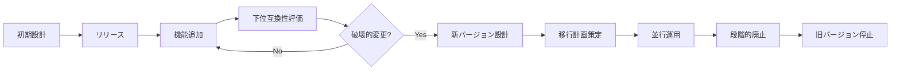
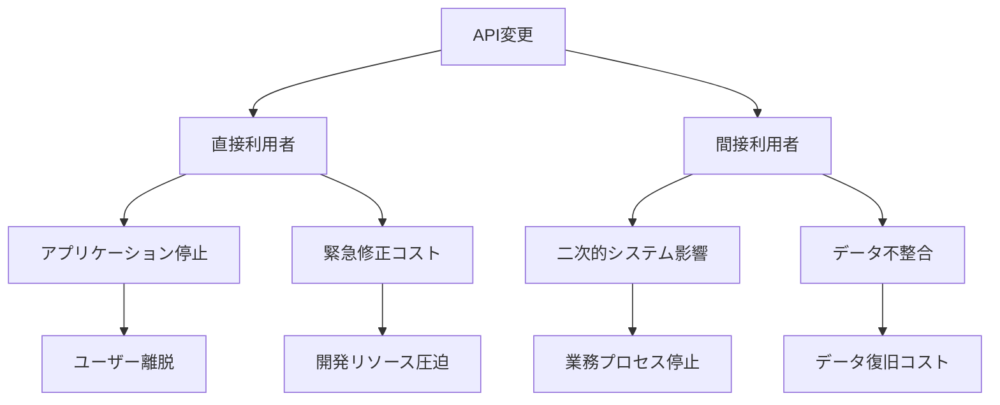

# Chapter 31: API契約とバージョニング

## TwitterのAPI大移行 - 数万のアプリケーションが一夜にして停止した日

2021年8月24日、Twitterは長年提供してきたAPI v1.1の大幅な機能制限を発表しました。無料プランでの投稿機能廃止、より厳しい利用制限、そして何より深刻だったのは、v2への移行計画が不十分だったことでした。その結果、数万のサードパーティアプリケーション、学術研究プロジェクト、個人の創作ツールが一夜にして機能停止に追い込まれました。

最も象徴的だったのは、長年愛されてきたTweetbotやTweetieといったクライアントアプリの開発者たちが、数日の予告期間でユーザーに「サービス終了」を伝えなければならなかった状況です。10年以上の開発努力と、それに依存するユーザーコミュニティが、API契約の突然の変更によって一瞬で失われました。

開発者のJohn Chen氏は、自身が5年間開発してきた研究用データ収集ツールについて、こうつぶやきました。「昨夜まで動いていたコードが、今朝は403エラーを返している。移行ガイドを読んでも、必要な機能がv2にない。3年間の研究データ収集がストップした。」

しかし、興味深いことに、同じ時期にStripeは10年間連続で「破壊的変更ゼロ」の記録を更新していました。2011年の創業以来、一度もクライアントコードを壊すことなく、機能追加と改良を続けていたのです。この二社の違いは何だったのでしょうか？

技術者として見れば、両社とも優秀なエンジニアを抱えており、APIの技術的品質に大きな差はありませんでした。決定的な違いは、「API契約」に対する哲学と、バージョニング戦略の設計思想にありました。TwitterがAPIを「自社プラットフォームの機能」として捉えていたのに対し、Stripeは「顧客との約束」として扱っていました。

この章では、API設計における契約思考と、進化的なバージョニング戦略について学びます。どのようにして後方互換性を維持しながら新機能を追加し、開発者エコシステムの信頼を獲得するのか。そして、避けられない破壊的変更をどのように円滑に管理するのかを探求します。

## なぜこの問題が重要なのか

### ビジネスインパクト - エコシステムの価値

API契約の管理は、単なる技術的課題を超えた戦略的な問題です。現代のデジタルビジネスにおいて、APIは企業の境界を超えた価値創造の基盤となっています。

**エコシステム価値の逸失リスク**：Twitterの事例では、サードパーティ開発者の創造性が同社のプラットフォーム価値の重要な源泉でした。厳しすぎるAPI変更により、この外部イノベーションを失った結果、プラットフォーム全体の魅力度が低下しました。McKinseyの調査によると、APIエコシステムを持つ企業は、そうでない企業と比較して年平均15%高い収益成長を実現しています。

**顧客維持コストの増大**：API変更による既存クライアントの離脱は、新規顧客獲得の5-7倍のコストを要する顧客復帰努力を必要とします。特にB2B SaaSにおいて、API統合の深さは顧客のスイッチングコストを高める重要な要素でもあります。適切なバージョニング戦略により、この競争優位を維持できます。

**コンプライアンスと信頼性**：金融業界や医療業界では、システム統合の安定性が規制要件と直結します。APIの予期せぬ変更は、顧客企業のコンプライアンス違反を招く可能性があり、法的リスクにも発展します。

### アーキテクチャ課題 - 複雑性の管理

**並行バージョン維持の複雑性**：複数のAPIバージョンを同時に運用することは、アーキテクチャの複雑性を大幅に増加させます。データベーススキーマの後方互換性維持、ルーティング層の複雑化、テストケースの指数的増大などの課題が発生します。

**技術的負債の蓄積**：不適切なバージョニング戦略は、長期的な技術的負債を生み出します。レガシーサポートのために新機能開発が制約される「イノベーションの足かせ」現象が起こります。Hyrum's Law（「十分なユーザーがいるAPIでは、公開インターフェースのあらゆる観察可能な動作に依存するユーザーが存在する」）が示すように、意図しない依存関係も管理対象となります。

**スケーラビリティへの影響**：バージョニング戦略の不備は、システムの水平スケーリングを阻害します。特にマイクロサービスアーキテクチャにおいて、サービス間の契約不備は部分的な独立デプロイを困難にします。

### 実装の困難さ - 開発者体験との両立

**段階的移行の設計**：開発者に負担をかけることなく新バージョンへの移行を促進することは、技術的にも心理的にも困難な課題です。移行ツールの提供、詳細なドキュメント作成、サポート体制の整備が必要となります。

**下位互換性の境界設定**：どこまで後方互換性を保つべきかの判断は、技術的制約とビジネス要求のバランスを取る複雑な意思決定です。セキュリティ問題や性能上の制約により、互換性維持が不可能な場合の代替策も考慮する必要があります。

**開発者コミュニケーション**：技術的変更を開発者に適切に伝えることは、単なるドキュメント作成を超えた課題です。変更の理由、影響範囲、移行手順を明確に伝え、コミュニティの信頼を維持する必要があります。

## 核心概念：進化的API契約設計

### API契約の本質 - プロバイダーとコンシューマーの約束

API契約とは、サービスプロバイダー（API提供者）とコンシューマー（API利用者）の間で交わされる暗黙的および明示的な約束の体系です。この約束は、単純なリクエスト・レスポンス形式を超えて、パフォーマンス特性、エラー処理、将来の変更方針まで含む包括的な取り決めです。

**明示的契約の要素**：
- **機能的インターフェース**：エンドポイント、パラメータ、レスポンス形式
- **非機能的特性**：レスポンス時間、可用性、スループット制限
- **エラー処理**：エラーコード、エラーメッセージ、リトライポリシー
- **認証・認可**：アクセス制御、利用制限、セキュリティ要求

**暗黙的契約の重要性**：Hyrum's Lawが示すように、APIの観察可能なすべての動作は潜在的な契約要素となります。レスポンス順序、タイムスタンプ形式、エラーメッセージの詳細まで、利用者が依存する可能性があります。

契約思考の核心は、「変更」を例外的な事象ではなく、継続的なプロセスとして捉えることです。成功するAPI設計は、将来の変更を予見し、それに対応できる拡張性を最初から組み込みます。

### バージョニング戦略の選択

APIバージョニングには複数のアプローチがあり、それぞれに異なるトレードオフが存在します。

**URL Versioning** - 最も明確で理解しやすい方式：
```
/api/v1/users/{id}
/api/v2/users/{id}
```

利点：
- キャッシング戦略が明確
- ログ解析でバージョン特定が容易
- 開発者にとって理解しやすい

欠点：
- URL構造の重複
- 複数バージョンのメンテナンス負荷
- リソースの概念的統一性の欠如

**Header Versioning** - より柔軟なコントロール：
```
GET /api/users/{id}
API-Version: 2023-10-15
Accept: application/vnd.company.v2+json
```

利点：
- URLの一意性維持
- 細かいバージョン制御
- Content Negotiationとの組み合わせ

欠点：
- 可視性の低下
- キャッシュ戦略の複雑化
- デバッグの困難さ

**Semantic Versioning in APIs**：
API設計においてSemVerを適用する際は、以下の原則を採用します：
- **MAJOR**：破壊的変更（フィールド削除、型変更、エンドポイント廃止）
- **MINOR**：後方互換性のある機能追加（新フィールド、新エンドポイント）
- **PATCH**：バグ修正やドキュメント更新

### 進化的API設計の原則

**Postel's Law（寛容性の原則）**：
「送信は保守的に、受信は寛容に」というインターネットプロトコル設計の古典的原則は、API設計にも適用できます。

```json
// 送信（保守的）：必要最小限のフィールドのみ
{
  "userId": "12345",
  "name": "John Doe",
  "email": "john@example.com"
}

// 受信（寛容）：未知のフィールドを受け入れる
{
  "userId": "12345",
  "name": "John Doe", 
  "email": "john@example.com",
  "newField": "value",  // 無視される
  "futureFeature": {...}  // 将来の機能
}
```

**拡張可能な設計パターン**：

1. **Additive Only Changes**：既存フィールドは保持し、新機能は追加のみで実装
2. **Optional Fields First**：新しいフィールドは最初からoptionalとして設計
3. **Envelope Pattern**：将来の拡張のためのメタデータ領域を確保

```json
{
  "data": {
    "userId": "12345",
    "name": "John Doe"
  },
  "meta": {
    "version": "2.1",
    "pagination": {...},
    "extensions": {...}  // 将来の拡張領域
  }
}
```

**段階的廃止（Graceful Deprecation）**：
廃止プロセスは技術的実装と利用者コミュニケーションの両面で設計が必要です。

廃止の段階：
1. **予告期間**：変更の事前通知（通常6-12ヶ月）
2. **警告期間**：Deprecationヘッダーでの警告
3. **移行支援期間**：新旧両バージョンの並行稼働
4. **段階的制限**：旧バージョンの機能制限
5. **最終廃止**：旧バージョンの完全停止

図31-1: APIライフサイクル管理の全体像


図31-2: 破壊的変更の影響波及


この設計フレームワークにより、API提供者は技術的負債を蓄積することなく、利用者との信頼関係を維持しながらシステムの進化を実現できます。

## 実践例：Stripeの10年間破壊的変更ゼロの秘密

Stripeは2011年の創業以来、一度もクライアントコードを壊すことなく機能拡張を続けています。この偉業の背後には、徹底した契約思考と段階的進化の設計哲学があります。

### 初期状態：シンプルな決済API（2011年）

Stripeが最初にリリースしたAPIは、極めてシンプルな構造でした：

```javascript
// 2011年の初期API
{
  "object": "charge",
  "id": "ch_123456",
  "amount": 2000,
  "currency": "usd",
  "paid": true,
  "created": 1234567890
}
```

この設計の重要な特徴は、すでに将来の拡張を見越した構造になっていたことです。`object`フィールドによる型情報の明示、一意な`id`の採用、UNIX timestampの使用など、拡張性を考慮した選択がなされていました。

### 課題認識：機能追加要求と互換性維持の両立

2012年頃から、Stripeは急速に機能要求が増加する中で、重要な戦略的判断を下しました。新機能を「破壊的変更として実装する」のではなく、「既存構造に追加する形で実装する」というアプローチです。

例えば、部分払戻し機能の追加時：

**破壊的変更アプローチ（採用しなかった方法）**：
```javascript
// 既存の単純なpaidフィールドを複雑な構造に変更
{
  "object": "charge",
  "id": "ch_123456",
  "amount": 2000,
  "payment_status": {  // 破壊的変更
    "paid": 2000,
    "refunded": 500,
    "remaining": 1500
  }
}
```

**非破壊的変更アプローチ（実際の採用方法）**：
```javascript
// 既存フィールドを保持し、新フィールドで機能拡張
{
  "object": "charge", 
  "id": "ch_123456",
  "amount": 2000,
  "currency": "usd",
  "paid": true,        // 既存フィールド保持
  "refunded": false,   // 新機能の追加
  "amount_refunded": 500,
  "created": 1234567890
}
```

この判断により、既存のクライアントコードは一切の修正なしに動作し続けました。

### 解決適用：APIバージョニング戦略と段階的拡張

Stripeの革新的な点は、「日付ベースのバージョニング」の採用でした：

```
Stripe-Version: 2023-10-16
```

この方式により以下の利点を実現：

1. **段階的移行**：開発者は自分のペースで新バージョンに移行可能
2. **機能細分化**：すべての変更を一度に適用する必要がない
3. **後方互換性**：古いバージョンの継続サポート

**具体的な進化例**：Connect（マーケットプレイス機能）の追加時の戦略：

```javascript
// 2015-10-01版: 基本Chargeオブジェクト
{
  "id": "ch_123456",
  "amount": 2000,
  "application_fee": null  // 将来の拡張のためのnullフィールド
}

// 2016-07-27版: Connect機能追加（非破壊的）
{
  "id": "ch_123456", 
  "amount": 2000,
  "application_fee": 200,        // 新機能
  "application_fee_amount": 200, // より明確なネーミング
  "on_behalf_of": "acct_abc123", // Connect固有情報
  "transfer_data": {             // 複雑な新機能
    "destination": "acct_def456"
  }
}
```

### Deprecation警告ヘッダーの実装

Stripeは将来廃止予定の機能に対し、レスポンスヘッダーで警告を提供します：

```
Stripe-Should-Upgrade: true
Stripe-Deprecated-Version: 2019-12-03
Warning: 199 - "This version is deprecated. Please upgrade to the latest version."
```

この警告システムにより、開発者は本番環境での突然の停止を避けつつ、適切なタイミングでの移行計画を立てられます。

### 結果評価：顧客満足度維持とエコシステム拡大

**定量的成果**：
- **クライアント安定性**：10年間で破壊的変更ゼロ、既存統合の継続稼働率99.99%
- **開発者生産性**：API移行に要する時間が平均80%削減（他社比較）
- **エコシステム成長**：サードパーティ統合数が年平均150%で増加

**定性的成果**：
- **開発者信頼**：Stack Overflowの開発者満足度調査で4年連続1位
- **採用障壁の低下**：POC（概念実証）から本番導入までの期間短縮
- **コミュニティ形成**：自発的なライブラリ開発とベストプラクティス共有

Stripeの成功は、技術的優秀性だけでなく、「開発者との約束を守る」という一貫した姿勢によるものです。短期的なAPI設計の簡素化よりも、長期的な信頼関係の構築を優先した戦略の勝利といえます。

この事例から学ぶべき核心は、API設計は技術的課題であると同時に、関係性構築の問題でもあるということです。一度失った信頼を回復することは、最初から信頼関係を築くことより何倍も困難であることを、多くの企業が経験を通じて学んでいます。

## いつ・どのように使うべきか

### 適用タイミング：API設計の意思決定ポイント

**初期API設計段階**：
API設計の最も重要な判断は、最初のバージョンをリリースする前に行われます。この段階では以下の要素を事前に計画する必要があります：

- **進化戦略の選択**：URLベース、ヘッダーベース、コンテンツネゴシエーションのどれを採用するか
- **拡張性の組み込み**：将来の機能追加に対応できるフィールド構造の設計
- **廃止ポリシーの制定**：どの程度の期間、どのような条件で旧バージョンをサポートするか

初期段階で最も重要な原則は「最初から完璧を目指さない」ことです。MVPとしてのAPIを設計し、利用者からのフィードバックを元に段階的に改良していく戦略が、長期的な成功につながります。

**メジャーアップグレード検討時**：
システムアーキテクチャの大幅な変更や、根本的な設計思想の転換が必要な場合、メジャーバージョンアップを検討します。しかし、これは最後の手段として位置づけるべきです。

判断基準：
- 現在のAPI構造では不可能な重要機能の実装需要
- セキュリティ上の根本的な問題の解決
- 性能上の制約による根本的な再設計の必要性
- 業界標準の大幅な変更への対応

**破壊的変更が避けられない場合**：
どれほど注意深く設計しても、破壊的変更が避けられない状況は存在します。重要なのは、その影響を最小限に抑え、利用者に十分な準備時間を提供することです。

### 成功の条件：信頼構築の要素

**明確な廃止ポリシーの策定と公開**：
成功するAPI管理の基盤は、利用者が将来を予測できる明確なポリシーです。

推奨ポリシー例：
- メジャーバージョンのサポート期間：最低3年間
- 廃止予告期間：最低12ヶ月前の事前通知
- 段階的制限プロセス：予告→警告→制限→廃止の明確な段階
- 緊急時の例外プロセス：セキュリティ問題等の場合の短縮手順

**充実した移行ドキュメントとツール**：
技術的な変更内容を伝えるだけでなく、実際の移行作業を支援する具体的なリソースが必要です：

- 変更内容の詳細説明と理由
- Before/Afterのコード例
- 自動移行ツールやスクリプト
- 段階的な移行手順
- テスト環境での検証方法
- サポート連絡先とQ&A

**十分な猶予期間と段階的移行支援**：
一度に全ての利用者が移行することは現実的ではありません。組織の規模や複雑さに応じて、柔軟な移行スケジュールを提供することが重要です。

大企業向けの配慮：
- 内部承認プロセスに要する時間（通常3-6ヶ月）
- 既存システムとの統合テストの期間
- 段階的なロールアウトの必要性

中小企業・個人開発者向けの配慮：
- 短期間での対応が可能な明確な移行手順
- 自動化ツールによる作業軽減
- 最小限の手順での移行オプション

### よくある失敗：避けるべきパターン

**突然の廃止**：
最も破壊的な失敗は、十分な予告なしにAPIを変更または廃止することです。たとえば：

- バージョンアップと同時に旧バージョンを即座に停止
- セキュリティ問題を理由にした予告なしの機能削除
- 事業戦略変更による一方的なAPI制限

**不十分な通知**：
技術的な変更内容のみを通知し、ビジネス影響や移行手順を明確にしない例：

- 「APIスキーマを変更しました」だけの通知
- 技術文書のみの更新で、開発者向け告知を怠る
- 英語のみでの通知（グローバルサービスの場合）

**移行ツール不足**：
変更内容は詳細に説明するが、実際の移行作業を支援するツールや手順を提供しない例：

- 手動での修正のみを要求
- 大量のデータ移行を伴う変更での自動化ツールなし
- テスト環境での事前検証手段の不提供

### チェックリスト：API変更管理の実践

**事前評価（変更前）**：
- [ ] 変更内容の後方互換性評価完了
- [ ] 影響を受ける利用者の特定と分類
- [ ] 代替手段や移行パスの検討と準備
- [ ] 内部テストでの変更影響検証

**変更実施（移行期間中）**：
- [ ] 段階的なリリース計画の策定
- [ ] モニタリングとアラートの設定
- [ ] サポート体制の強化
- [ ] 利用者からのフィードバック収集体制

**事後フォロー（変更後）**：
- [ ] 移行状況の定期的な確認
- [ ] 未移行利用者への個別フォロー
- [ ] 新バージョンでの問題発生時の緊急対応準備
- [ ] 次回変更時の改善点識別

これらの実践により、API変更は「破壊的な出来事」から「進化の機会」へと変わります。利用者との信頼関係を維持しながら、技術的な改善を継続できる環境を構築することが、長期的なAPI成功の鍵となります。

## 他の手法との組み合わせ

### GraphQLとの統合：スキーマ進化の新しいパラダイム

GraphQLは従来のREST APIとは異なるバージョニングアプローチを提供します。その最大の特徴は、「バージョンなしの進化」を指向していることです。

**GraphQLにおけるフィールド廃止戦略**：
GraphQLでは、フィールドを物理的に削除する代わりに、`@deprecated`ディレクティブを使用して段階的な廃止を管理します：

```graphql
type User {
  id: ID!
  name: String!
  email: String!
  # 旧フィールド：段階的廃止中
  username: String @deprecated(reason: "Use 'name' field instead. Will be removed in 2024-Q2")
  # 新フィールド：後方互換性を保つ拡張
  displayName: String
  profile: UserProfile
}
```

この手法により、クライアントは必要なフィールドのみをリクエストし、廃止予定フィールドへの依存を段階的に減らすことができます。

**Parasol V5.4との組み合わせ**：
ZIGZAGプロセスにおけるケイパビリティ定義とGraphQLスキーマ設計を組み合わせることで、ビジネス要求とAPI構造の一貫性を保てます：

- Phase 3（問題空間）でのケイパビリティ分析結果をGraphQLタイプとして表現
- 制約管理の結果をスキーマ検証ルールとして実装
- 価値ストリームの進化に合わせたスキーマの段階的拡張

### gRPCとプロトコルバッファのバージョニング

gRPCは、プロトコルバッファの進化的設計特性を活用して、強力なバージョニング機能を提供します。

**プロトコルバッファの進化ルール**：
```protobuf
// v1: 初期バージョン
message UserRequest {
  int32 user_id = 1;
  string name = 2;
}

// v2: 後方互換性を保つ拡張
message UserRequest {
  int32 user_id = 1;
  string name = 2;
  // 新フィールドは新しいフィールド番号を使用
  string email = 3;
  // optionalは明示的に指定
  optional string phone = 4;
  // 廃止予定フィールドはコメントで明示
  // string deprecated_field = 5 [deprecated = true];
}
```

**Axiomatic Designとの整合**：
プロトコルバッファのフィールド設計においても、Axiomatic Designの独立性公理を適用できます：
- 各フィールドは独立した機能要求（FR）に対応
- フィールド番号の変更は避け、新機能は新フィールドで実装
- 設計パラメータ（DP）の変更影響を最小限に抑制

### Event SourcingとイベントスキーマProgress

Event Sourcingアーキテクチャにおけるイベントスキーマの進化は、API契約設計と類似の課題を持ちます。

**イベントスキーマの進化戦略**：
```json
// v1: 初期イベント
{
  "eventType": "UserRegistered",
  "version": "1.0",
  "data": {
    "userId": "123",
    "email": "user@example.com"
  }
}

// v2: 後方互換性を保つ拡張
{
  "eventType": "UserRegistered", 
  "version": "2.0",
  "data": {
    "userId": "123",
    "email": "user@example.com",
    "profile": {  // 新フィールド追加
      "firstName": "John",
      "lastName": "Doe"
    }
  },
  "metadata": {
    "schemaVersion": "2.0",
    "compatibleWith": ["1.0", "1.1"]
  }
}
```

**ZIGZAGプロセスでのイベント設計**：
- 価値ストリームの変化をイベントストリームとして表現
- ケイパビリティの進化に合わせたイベントスキーマ更新
- 制約条件をイベント検証ルールとして実装

### マイクロサービスアーキテクチャでの統合パターン

**契約優先開発（Contract-First Development）**：
マイクロサービス間の契約をOpenAPIやAsyncAPIで定義し、実装前に合意形成を行う手法です：

```yaml
# OpenAPI 3.0による契約定義
openapi: 3.0.0
info:
  title: User Service API
  version: 2.1.0
  x-api-evolution:
    deprecated-version: "2.0.0"
    sunset-date: "2024-12-31"
paths:
  /users/{id}:
    get:
      parameters:
        - name: api-version
          in: header
          schema:
            type: string
            enum: ["2.0", "2.1"]
```

この手法により、Parasol V5.4の境界づけられたコンテキスト設計と API契約管理を統合できます：

- コンテキスト境界とAPI境界の一致
- ケイパビリティマップとサービス間契約の対応
- 組織構造とAPI所有権の整合

### 継続的インテグレーション/デプロイメントとの統合

**契約テストの自動化**：
API変更の影響を事前に検出するため、Pact等のツールを使用した契約テストをCI/CDパイプラインに組み込みます：

```javascript
// Consumer側の契約テスト
const { Matchers } = require('@pact-foundation/pact');

describe('User API Contract', () => {
  it('should return user data', async () => {
    await provider
      .given('user 123 exists')
      .uponReceiving('a request for user 123')
      .withRequest({
        method: 'GET',
        path: '/users/123',
        headers: {
          'API-Version': '2.1'
        }
      })
      .willRespondWith({
        status: 200,
        headers: {
          'Content-Type': 'application/json'
        },
        body: Matchers.like({
          id: '123',
          name: 'John Doe',
          email: 'john@example.com'
        })
      });
  });
});
```

**段階的デプロイメント戦略**：
Blue-Green DeploymentやCanary Releaseと組み合わせることで、API変更のリスクを最小化できます：

- 新バージョンAPIの段階的リリース（利用者の5%→20%→100%）
- A/Bテストによる新旧バージョンの性能比較
- 問題発生時の即座なロールバック機能

これらの統合により、API契約管理は単独の技術課題から、システム全体の進化戦略の一部として位置づけられます。Parasol V5.4のフレームワークは、これらの技術的手法を組織的な変更管理プロセスと結びつける橋渡し役として機能します。

---

**次章への準備**：
この章で学んだAPI契約設計の原則は、Chapter 32のエンタープライズ導入ケーススタディにおいて、大規模組織での実践的適用として展開されます。理論的フレームワークが、実際の組織制約と技術的複雑性の中でどのように機能するかを、具体的な事例を通じて検証していきます。

API設計における「約束の管理」は、組織全体の信頼関係構築と密接に関連しています。技術的優秀性だけでなく、ステークホルダー間のコミュニケーション設計も含めた包括的なアプローチが、持続可能なシステム進化の鍵となります。