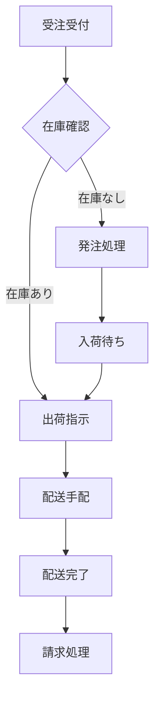

# 第6章: Phase 0 - 組織とドメインの理解

## 6.1 なぜ組織とドメインの理解から始めるのか

### 6.1.1 価値駆動開発の土台

Parasol V5.4における価値駆動開発は、技術的な実装から始まるのではなく、組織とドメインの深い理解から始まります。これは、真の価値創出が技術の巧拙ではなく、組織が直面する実際の課題を解決し、ドメインの本質的なニーズに応えることから生まれるという認識に基づいています。

多くの開発プロジェクトが失敗する原因は、技術的な問題ではなく、組織やドメインに対する理解不足にあります。最新の技術を駆使して構築されたシステムでも、組織の実際の働き方やドメインの複雑性を考慮していなければ、使われないシステムになってしまいます。

---

## 読者別ガイド

**エグゼクティブの方へ** 💼
- Phase 0の投資価値とROI（10分）
- 組織変革への影響と準備（10分）
- ステークホルダー管理の重要性（5分）

**アーキテクト・技術リードの方へ** 🏗️
- ステークホルダー分析の手法（15分）
- ドメイン探索と現状分析（20分）
- 技術的制約と機会の特定（10分）

**開発者の方へ** 💻
- ドメイン知識の習得方法（15分）
- ユーザー理解のためのペルソナ構築（10分）
- 業務プロセスの理解手法（10分）

---

### 6.1.2 Phase 0の位置づけ

Phase 0は、プロジェクトの正式な開始前に行う準備フェーズです。この段階では、コードを書くことはありません。代わりに、以下のような活動に集中します：

1. **ステークホルダーの特定と理解**
   - 誰が関わっているのか
   - それぞれの関心事は何か
   - どのような期待を持っているのか

2. **組織構造の把握**
   - 意思決定の流れ
   - 情報の流れ
   - 権限と責任の分布

3. **ドメイン知識の獲得**
   - 業務プロセスの理解
   - 専門用語の習得
   - 既存の課題と制約の把握

### 6.1.3 投資としての理解活動

Phase 0に時間を投資することは、一見すると開発の遅延に見えるかもしれません。しかし、この投資は後のフェーズで大きなリターンをもたらします：

- **手戻りの削減**: 要求の誤解による再開発を防ぐ
- **コミュニケーションの効率化**: 共通言語の確立により対話がスムーズに
- **適切な優先順位付け**: 真に価値のある機能に集中できる
- **リスクの早期発見**: 組織的・技術的な制約を事前に把握

## 6.2 ステークホルダー分析

### 6.2.1 ステークホルダーマップの作成

ステークホルダー分析は、プロジェクトに関わるすべての人々を特定し、その関係性を理解することから始まります。

**ステークホルダーの分類:**

```
┌─────────────────────────────────────────┐
│          直接的ステークホルダー          │
│  ┌─────────────┐  ┌─────────────┐  │
│  │  エンドユーザー  │  │  開発チーム   │  │
│  └─────────────┘  └─────────────┘  │
│  ┌─────────────┐  ┌─────────────┐  │
│  │   運用チーム    │  │ プロダクトオーナー│  │
│  └─────────────┘  └─────────────┘  │
└─────────────────────────────────────────┘

┌─────────────────────────────────────────┐
│          間接的ステークホルダー          │
│  ┌─────────────┐  ┌─────────────┐  │
│  │    経営層     │  │   規制当局    │  │
│  └─────────────┘  └─────────────┘  │
│  ┌─────────────┐  ┌─────────────┐  │
│  │   パートナー   │  │    顧客      │  │
│  └─────────────┘  └─────────────┘  │
└─────────────────────────────────────────┘
```

### 6.2.2 ステークホルダーインタビューの技法

効果的なステークホルダーインタビューは、単なる要求収集ではありません。それぞれのステークホルダーの視点を理解し、隠れた期待や懸念を明らかにすることが目的です。

**インタビューの準備:**

1. **事前調査**
   - 組織図の確認
   - 既存資料の収集
   - 業界動向の把握

2. **質問の設計**
   - オープンエンドな質問を中心に
   - 具体的な例を引き出す質問
   - 「なぜ」を5回繰り返す技法

3. **環境の準備**
   - リラックスできる場所の選定
   - 十分な時間の確保
   - 記録方法の準備

**インタビューの実施テクニック:**

```
開始時:
「今日は〇〇さんの日常的な業務について教えていただきたいと思います。
 まず、典型的な一日の流れを教えていただけますか？」

深掘り:
「今おっしゃった〇〇の作業で、特に時間がかかる部分はどこですか？」
「それはなぜ時間がかかるのでしょうか？」
「もし魔法の杖があったら、どう変えたいですか？」

確認:
「つまり、〇〇という理解で正しいでしょうか？」
「他に重要だと思われることはありますか？」
```

### 6.2.3 ペルソナの構築

ステークホルダー分析の成果として、主要なユーザーグループのペルソナを構築します。ペルソナは、実際のユーザーの特徴を統合した架空の人物像です。

**ペルソナテンプレート例:**

```markdown
## ペルソナ: 田中 花子（営業部門マネージャー）

### 基本情報
- 年齢: 42歳
- 経験: 営業20年、マネージャー5年
- チーム: 8名の営業担当者を管理

### 一日の流れ
- 8:30 メールチェックと返信（約30件）
- 9:00 チームメンバーとの朝会
- 10:00 顧客訪問または商談（オンライン/対面）
- 14:00 提案書作成・レビュー
- 16:00 売上データの確認と分析
- 17:00 翌日の準備と報告書作成

### 課題とフラストレーション
- 複数のシステムにデータが分散している
- リアルタイムで売上状況を把握できない
- チームメンバーの活動を一元管理できない

### 目標と動機
- チームの売上目標を確実に達成したい
- メンバーの成長を支援したい
- 効率的な営業プロセスを確立したい

### 技術スキル
- Excel: 上級
- CRM: 中級
- モバイルデバイス: 日常的に使用
```

## 6.3 組織構造のマッピング

### 6.3.1 公式組織と非公式組織

組織を理解する際、組織図に表れる公式な構造だけでなく、実際の情報の流れや意思決定のパターンを表す非公式な構造も把握することが重要です。

**公式組織の要素:**
- 部門構成
- 報告ライン
- 職務権限
- 公式な会議体

**非公式組織の要素:**
- 実際の相談相手
- 情報のハブとなる人物
- 影響力のあるキーパーソン
- 非公式なコミュニケーションチャネル

### 6.3.2 組織の成熟度評価

組織のデジタル成熟度を評価することで、適切な変革アプローチを選択できます。

**成熟度レベル:**

| レベル | 特徴 | アプローチ |
|--------|------|------------|
| レベル1: 初期 | - プロセスが属人的<br>- ドキュメント不足<br>- 標準化されていない | 小さな成功体験から開始<br>基本的なプロセス定義 |
| レベル2: 発展 | - 基本プロセスの確立<br>- 部分的な標準化<br>- 部門内での共有 | プロセスの可視化<br>部門間連携の強化 |
| レベル3: 定義 | - 組織全体での標準化<br>- プロセスの文書化<br>- 役割の明確化 | 継続的改善の仕組み<br>測定と分析の導入 |
| レベル4: 管理 | - 定量的な管理<br>- 予測可能なプロセス<br>- データドリブン | 高度な分析<br>プロアクティブな改善 |
| レベル5: 最適化 | - 継続的な最適化<br>- イノベーション文化<br>- 自己改善組織 | 革新的アプローチ<br>実験と学習の促進 |

### 6.3.3 文化的側面の理解

組織文化は、システムの受け入れやすさや変革の進め方に大きく影響します。

**文化評価の観点:**

1. **意思決定スタイル**
   - トップダウン vs ボトムアップ
   - 合意形成重視 vs スピード重視
   - データ重視 vs 経験重視

2. **リスクに対する態度**
   - 保守的 vs 革新的
   - 失敗への寛容度
   - 実験的取り組みへの姿勢

3. **コミュニケーション様式**
   - フォーマル vs カジュアル
   - 文書重視 vs 対話重視
   - 階層的 vs フラット

## 6.4 ドメイン探索の手法

### 6.4.1 ドメインエキスパートとの協働

ドメイン知識の獲得において、ドメインエキスパートとの効果的な協働は不可欠です。

**ドメインエキスパートの特定:**
- 長年の経験を持つベテラン社員
- 特定業務の専門家
- 業界団体の関係者
- 顧客側のキーパーソン

**知識抽出のテクニック:**

1. **シャドーイング**
   - 実際の業務を観察
   - 作業手順の記録
   - 判断基準の理解

2. **ペアワーク**
   - エキスパートと共同作業
   - リアルタイムでの質問
   - 暗黙知の形式知化

3. **シナリオウォークスルー**
   - 典型的なケースの説明
   - 例外ケースの洗い出し
   - 判断の分岐点の特定

### 6.4.2 業務プロセスの可視化

業務プロセスを可視化することで、全体像を把握し、改善ポイントを特定できます。

**プロセスマッピングの手法:**

```
[顧客] → [受注] → [在庫確認] → [出荷手配] → [請求]
           ↓          ↓            ↓          ↓
        [受注DB]  [在庫DB]    [物流システム] [会計システム]
```

**詳細プロセスフロー例:**



### 6.4.3 ドメイン言語の収集と整理

ドメイン固有の言語を正確に理解し、使用することは、ステークホルダーとの信頼関係構築に不可欠です。

**用語集の作成:**

| 用語 | 定義 | 使用例 | 関連用語 |
|------|------|--------|----------|
| 与信限度額 | 顧客に対して設定される最大取引金額 | 「A社の与信限度額は1000万円です」 | 与信管理、信用調査 |
| リードタイム | 発注から納品までの所要時間 | 「この商品のリードタイムは3営業日です」 | 納期、配送日数 |
| 歩留まり | 生産工程における良品の割合 | 「今月の歩留まりは95%でした」 | 不良率、品質管理 |

**コンテキストマップの作成:**

異なる部門や システム間で同じ用語が異なる意味を持つ場合があります。これらの違いを明確にするコンテキストマップを作成します。

```
営業部門の「顧客」
├─ 見込み客を含む
├─ 個人担当者レベル
└─ 商談単位で管理

経理部門の「顧客」
├─ 契約済みのみ
├─ 法人レベル
└─ 請求単位で管理
```

## 6.5 現状分析と課題の特定

### 6.5.1 As-Is分析

現状（As-Is）を正確に把握することは、改善の出発点となります。

**分析の視点:**

1. **プロセスの視点**
   - 作業の流れ
   - ボトルネック
   - 重複作業
   - 手作業の箇所

2. **データの視点**
   - データの発生源
   - データの流れ
   - データの重複
   - データの不整合

3. **システムの視点**
   - 既存システム構成
   - システム間連携
   - 技術的負債
   - 運用上の制約

### 6.5.2 ペインポイントの発見

ステークホルダーが日々直面している課題を具体的に特定します。

**ペインポイント分析マトリクス:**

| 課題 | 頻度 | 影響度 | 解決難易度 | 優先度 |
|------|------|--------|------------|--------|
| 日次売上集計に3時間かかる | 毎日 | 高 | 中 | A |
| 在庫データの不整合 | 週2-3回 | 高 | 高 | B |
| 顧客情報の重複入力 | 毎回 | 中 | 低 | A |
| レポート作成の属人化 | 月1回 | 中 | 低 | C |

### 6.5.3 機会の識別

課題だけでなく、新たな価値創出の機会も探索します。

**機会発見の質問:**
- 「もし〇〇ができたら、どんな新しいことが可能になりますか？」
- 「競合他社にあって自社にない機能は何ですか？」
- 「顧客から最も要望される機能は何ですか？」
- 「現在諦めていることは何ですか？」

## 6.6 Phase 0の成果物

### 6.6.1 理解の文書化

Phase 0で得られた理解を、次のフェーズで活用できる形で文書化します。

**主要な成果物:**

1. **ステークホルダーマップ**
   - 関係者の一覧と役割
   - 影響力と関心度のマトリクス
   - コミュニケーション計画

2. **組織理解ドキュメント**
   - 組織構造図
   - 意思決定フロー
   - 文化的特性の記述

3. **ドメインモデル**
   - 主要概念の関係図
   - 業務プロセスフロー
   - 用語集

4. **現状分析レポート**
   - As-Is プロセスマップ
   - 課題一覧と優先順位
   - 機会の記述

### 6.6.2 仮説の構築

収集した情報を基に、価値創出の仮説を構築します。

**仮説のフレームワーク:**

```
「もし [解決策] を実現すれば、
 [ステークホルダー] は [価値] を得られ、
 それにより [ビジネス成果] が期待できる」
```

**例:**
```
「もし 売上データのリアルタイム可視化 を実現すれば、
 営業マネージャー は 迅速な意思決定 を得られ、
 それにより 売上目標達成率の10%向上 が期待できる」
```

### 6.6.3 次フェーズへの準備

Phase 0の成果を、Phase 1（価値の発見と定義）につなげる準備をします。

**チェックリスト:**
- [ ] 主要ステークホルダーとの関係構築
- [ ] ドメイン言語での会話能力
- [ ] 組織の意思決定プロセスの理解
- [ ] 主要な課題と機会の特定
- [ ] 初期仮説の構築
- [ ] Phase 1 参加メンバーの特定

## 6.7 Phase 0 実践のポイント

### 6.7.1 よくある落とし穴

1. **表面的な理解で満足する**
   - 対策: 「なぜ」を繰り返し、本質に迫る

2. **技術ソリューションに飛びつく**
   - 対策: 問題の理解を優先し、解決策は保留

3. **一部の声の大きい人の意見に偏る**
   - 対策: 幅広いステークホルダーから情報収集

4. **現状分析で疲弊する**
   - 対策: タイムボックスを設定し、80%の理解で前進

### 6.7.2 成功のためのTips

- **謙虚な姿勢**: 学習者として接する
- **好奇心**: 当たり前を疑う
- **共感**: ステークホルダーの立場で考える
- **記録**: 小さな気づきも文書化
- **フィードバック**: 理解の確認を怠らない

### 6.7.3 期間の目安

組織規模やドメインの複雑さにより異なりますが、一般的な目安:

- **小規模（～50名）**: 2-3週間
- **中規模（～500名）**: 4-6週間  
- **大規模（500名～）**: 6-12週間

重要なのは、完璧を求めすぎないことです。Phase 0は継続的な学習プロセスの始まりに過ぎません。

## まとめ

Phase 0「組織とドメインの理解」は、価値駆動開発の成功の鍵を握る重要なフェーズです。技術的な実装に着手する前に、組織の文脈とドメインの本質を深く理解することで、真に価値のあるシステムを構築する基盤が整います。

このフェーズで得られた洞察は、プロジェクト全体を通じて羅針盤となり、困難な意思決定の場面で正しい方向を示してくれるでしょう。時間をかけてでも、しっかりとした理解の土台を築くことが、結果として最も効率的な開発への道となるのです。

---

## 理解度チェック

□ Phase 0の目的と価値を説明できる
□ ステークホルダー分析とペルソナ構築の手法を理解している
□ 組織構造と文化の評価方法を知っている
□ ドメイン探索と現状分析の技法を身につけている
□ Phase 0の成果物と次フェーズへの連携を理解している

**すべてにチェックできたら、次章へ進みましょう！**