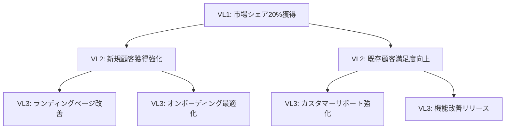

# 第11章 価値レベル（VL）の階層化

価値駆動型開発において、価値の階層化は組織全体の戦略的アラインメントを実現する上で不可欠な概念です。本章では、Parasol V5.4における価値レベル（Value Level: VL）の階層構造について詳しく解説し、価値ストリームを効果的に分解・管理する方法を学びます。

---

## 読者別ガイド

**エグゼクティブの方へ** 💼
- 価値階層による戦略アラインメント効果（10分）
- 三層構造（VL1-VL3）の投資価値（15分）
- 経営意思決定への活用方法（10分）

**アーキテクト・技術リードの方へ** 🏗️
- 価値レベル分解の設計技法（25分）
- 測定フレームワークの実装方法（20分）
- KPIツリーの構築と価値追跡（15分）

**開発者の方へ** 💻
- 運用的価値（VL3）の実践管理（20分）
- アジャイルスプリントでの価値測定（15分）
- ボトムアップ価値集約の参加方法（10分）

---

## 11.1 価値レベル階層の基本概念

### 価値階層の必要性

組織における価値創造は、さまざまなレベルで同時並行的に行われています。経営層が考える戦略的価値と、現場で日々創出される運用価値の間には、しばしばギャップが生じます。価値レベルの階層化は、このギャップを可視化し、組織全体の価値創造活動を整合させるためのフレームワークです。

価値階層を導入することで：
- 戦略と実行の整合性が向上
- 各レベルでの価値測定が可能に
- 意思決定の質とスピードが改善
- チーム間の協調が促進

### 三層構造の設計思想

Parasol V5.4では、価値を以下の3つのレベルに階層化します：

```
VL1: 戦略的価値（Strategic Value）
├── VL2: 戦術的価値（Tactical Value）
│   └── VL3: 運用的価値（Operational Value）
```

この三層構造は、組織の一般的な意思決定階層と対応しており、各レベルで異なる時間軸と影響範囲を持ちます。

## 11.2 VL1：戦略的価値（Strategic Value）

### 定義と特徴

戦略的価値は、組織の長期的な競争優位性と持続的成長に直結する価値です。通常、3～5年の時間軸で測定され、市場ポジション、ブランド価値、イノベーション能力などの観点から評価されます。

**主な特徴：**
- 長期的インパクト（3年以上）
- 組織全体への影響
- 競争優位性の源泉
- 経営層による意思決定

### 戦略的価値の例

**市場拡大型価値：**
```yaml
VL1_市場拡大:
  価値指標:
    - 新市場シェア獲得率
    - 顧客基盤の拡大規模
    - ブランド認知度向上
  測定期間: 3年
  目標値:
    市場シェア: 15% → 25%
    顧客数: 10万 → 50万
```

**イノベーション型価値：**
```yaml
VL1_技術革新:
  価値指標:
    - 新技術による収益貢献度
    - 特許取得数
    - 技術的リーダーシップ指標
  測定期間: 5年
  目標値:
    新技術収益比率: 0% → 30%
```

### 戦略的価値の測定フレームワーク

戦略的価値の測定には、バランスト・スコアカード（BSC）アプローチを拡張したフレームワークを使用します：

```python
class StrategicValueMetrics:
    def __init__(self):
        self.perspectives = {
            "財務": ["ROI", "収益成長率", "利益率"],
            "顧客": ["顧客満足度", "市場シェア", "顧客生涯価値"],
            "内部プロセス": ["イノベーション率", "品質指標", "効率性"],
            "学習と成長": ["組織能力", "技術力", "人材育成"]
        }
    
    def calculate_strategic_value(self, period="3年"):
        value_score = 0
        for perspective, metrics in self.perspectives.items():
            perspective_score = self._evaluate_perspective(metrics, period)
            value_score += perspective_score * self._get_weight(perspective)
        return value_score
```

## 11.3 VL2：戦術的価値（Tactical Value）

### 定義と特徴

戦術的価値は、戦略的目標を達成するための中期的な価値創造活動です。通常、6ヶ月から2年の時間軸で、部門やプロジェクトレベルで管理されます。

**主な特徴：**
- 中期的インパクト（6ヶ月～2年）
- 部門・プロジェクト単位の影響
- 戦略実行の具体化
- ミドルマネジメントによる意思決定

### 戦術的価値の例

**製品改善型価値：**
```yaml
VL2_製品改善:
  親価値: VL1_市場拡大
  価値指標:
    - 機能追加による顧客獲得数
    - ユーザビリティスコア向上
    - サポートコスト削減率
  測定期間: 1年
  目標値:
    新規顧客獲得: 月1000人増
    UXスコア: 3.5 → 4.2
```

**プロセス最適化型価値：**
```yaml
VL2_開発プロセス改善:
  親価値: VL1_技術革新
  価値指標:
    - リードタイム短縮率
    - 品質向上指標
    - チーム生産性
  測定期間: 6ヶ月
  目標値:
    リードタイム: 30% 短縮
    欠陥率: 50% 削減
```

### 戦術的価値の分解方法

戦略的価値を戦術的価値に分解する際は、以下のステップを踏みます：

1. **戦略目標の具体化**
   - 抽象的な戦略目標を測定可能な指標に変換
   - タイムラインの設定

2. **実行可能な施策の特定**
   - リソース制約の考慮
   - 実現可能性の評価

3. **相互依存関係の明確化**
   - 施策間のシナジー効果
   - リスクと制約の識別

```python
class TacticalValueDecomposition:
    def decompose_strategic_value(self, strategic_value):
        tactical_values = []
        
        # 戦略価値の要素を分析
        components = self._analyze_components(strategic_value)
        
        for component in components:
            # 各要素を実行可能な施策に変換
            tactics = self._generate_tactics(component)
            
            for tactic in tactics:
                tactical_value = {
                    "id": f"VL2_{tactic.name}",
                    "parent": strategic_value.id,
                    "metrics": self._define_metrics(tactic),
                    "timeline": self._estimate_timeline(tactic),
                    "dependencies": self._identify_dependencies(tactic)
                }
                tactical_values.append(tactical_value)
        
        return tactical_values
```

## 11.4 VL3：運用的価値（Operational Value）

### 定義と特徴

運用的価値は、日々の活動で創出される短期的な価値です。通常、数日から数ヶ月の時間軸で、チームや個人レベルで管理されます。

**主な特徴：**
- 短期的インパクト（日次～月次）
- チーム・個人単位の影響
- 具体的な実装・実行
- 現場レベルの意思決定

### 運用的価値の例

**機能実装型価値：**
```yaml
VL3_検索機能改善:
  親価値: VL2_製品改善
  価値指標:
    - 検索精度向上
    - レスポンス時間短縮
    - ユーザー利用率
  測定期間: 2週間スプリント
  目標値:
    検索精度: 85% → 95%
    レスポンス: 500ms → 200ms
```

**バグ修正型価値：**
```yaml
VL3_決済バグ修正:
  親価値: VL2_製品改善
  価値指標:
    - エラー率削減
    - 顧客クレーム減少
    - 処理成功率向上
  測定期間: 1週間
  目標値:
    エラー率: 0.5% → 0.01%
```

### 運用的価値の管理手法

運用的価値は、アジャイル開発のスプリント単位で管理されることが多く、以下の手法を用います：

```python
class OperationalValueTracking:
    def __init__(self, sprint_duration=14):
        self.sprint_duration = sprint_duration
        self.value_backlog = []
        
    def prioritize_operational_values(self, values):
        # WSJF (Weighted Shortest Job First) による優先順位付け
        for value in values:
            value.wsjf_score = self._calculate_wsjf(
                cost_of_delay=value.impact,
                duration=value.estimated_effort
            )
        
        return sorted(values, key=lambda x: x.wsjf_score, reverse=True)
    
    def track_value_delivery(self, sprint_number):
        delivered_values = []
        for value in self.value_backlog:
            if value.status == "完了":
                actual_value = self._measure_actual_value(value)
                delivered_values.append({
                    "id": value.id,
                    "expected": value.expected_value,
                    "actual": actual_value,
                    "variance": actual_value - value.expected_value
                })
        
        return self._generate_value_report(sprint_number, delivered_values)
```

## 11.5 価値ストリームの分解技法

### トップダウン分解

戦略的価値から始めて、段階的に詳細化していく手法：



### ボトムアップ集約

現場の運用的価値を集約して戦術的・戦略的価値を構築する手法：

```python
class ValueAggregation:
    def aggregate_operational_values(self, operational_values):
        # 運用的価値をカテゴリ別に分類
        categorized = self._categorize_values(operational_values)
        
        tactical_values = []
        for category, values in categorized.items():
            # 同じカテゴリの運用価値を集約
            aggregated_metrics = self._aggregate_metrics(values)
            
            tactical_value = {
                "id": f"VL2_{category}",
                "category": category,
                "aggregated_metrics": aggregated_metrics,
                "child_values": [v.id for v in values],
                "total_impact": sum(v.impact for v in values)
            }
            tactical_values.append(tactical_value)
        
        return tactical_values
```

### ハイブリッドアプローチ

実際の運用では、トップダウンとボトムアップの両方を組み合わせます：

1. **戦略的方向性の設定**（トップダウン）
2. **現場からの価値提案**（ボトムアップ）
3. **整合性の検証と調整**
4. **価値ストリームの最適化**

## 11.6 測定フレームワークの実装

### 統合価値測定システム

各レベルの価値を統合的に測定するシステム：

```python
class IntegratedValueMeasurement:
    def __init__(self):
        self.value_hierarchy = {}
        self.measurement_intervals = {
            "VL1": "quarterly",
            "VL2": "monthly",
            "VL3": "weekly"
        }
    
    def measure_value_cascade(self):
        results = {}
        
        # VL3から順に測定（ボトムアップ）
        vl3_results = self._measure_operational_values()
        results["VL3"] = vl3_results
        
        # VL3の結果をVL2に集約
        vl2_results = self._aggregate_to_tactical(vl3_results)
        results["VL2"] = vl2_results
        
        # VL2の結果をVL1に集約
        vl1_results = self._aggregate_to_strategic(vl2_results)
        results["VL1"] = vl1_results
        
        return self._generate_value_report(results)
```

### KPIツリーの構築

価値階層に対応したKPIツリー：

```yaml
KPI_Tree:
  VL1_市場リーダーシップ:
    primary_kpi: 市場シェア
    target: 25%
    sub_kpis:
      VL2_顧客獲得:
        primary_kpi: 新規顧客数
        target: 月5000人
        sub_kpis:
          VL3_マーケティング:
            - リード生成数: 日200件
            - コンバージョン率: 5%
          VL3_製品改善:
            - オンボーディング完了率: 80%
            - 初月継続率: 90%
      VL2_顧客満足:
        primary_kpi: NPS
        target: 50+
        sub_kpis:
          VL3_サポート:
            - 応答時間: 1時間以内
            - 解決率: 95%
          VL3_品質向上:
            - バグ発生率: 0.1%以下
            - パフォーマンス: 99.9%稼働
```

### 価値レポーティング

各ステークホルダー向けのレポート生成：

```python
class ValueReporting:
    def generate_executive_report(self, vl1_data):
        return {
            "summary": self._create_executive_summary(vl1_data),
            "strategic_progress": self._analyze_strategic_progress(vl1_data),
            "key_insights": self._extract_insights(vl1_data),
            "recommendations": self._generate_recommendations(vl1_data)
        }
    
    def generate_manager_report(self, vl2_data):
        return {
            "tactical_performance": self._analyze_tactical_performance(vl2_data),
            "team_contributions": self._summarize_team_values(vl2_data),
            "bottlenecks": self._identify_bottlenecks(vl2_data),
            "action_items": self._propose_actions(vl2_data)
        }
    
    def generate_team_report(self, vl3_data):
        return {
            "sprint_achievements": self._list_delivered_values(vl3_data),
            "velocity_trends": self._analyze_velocity(vl3_data),
            "improvement_areas": self._suggest_improvements(vl3_data),
            "upcoming_values": self._preview_next_sprint(vl3_data)
        }
```

## 11.7 実践例：ECプラットフォームの価値階層

### ケーススタディの背景

あるECプラットフォーム企業が、Parasol V5.4を使用して価値階層を構築した事例を見てみましょう。

**企業の状況：**
- 中規模ECプラットフォーム
- 月間取引額：50億円
- アクティブユーザー：200万人
- 主要課題：成長の鈍化と競合の台頭

### 価値階層の設計

**VL1：戦略的価値の定義**

```yaml
VL1_持続的成長基盤:
  ビジョン: "3年後に業界トップ3入り"
  主要指標:
    - 月間取引額: 50億 → 150億円
    - アクティブユーザー: 200万 → 500万人
    - 市場シェア: 8% → 15%
  
VL1_プラットフォーム革新:
  ビジョン: "次世代ECプラットフォームの確立"
  主要指標:
    - AI機能利用率: 0% → 60%
    - API連携数: 50 → 500
    - 開発者エコシステム: 0 → 1000社
```

**VL2：戦術的価値への展開**

```yaml
VL2_ユーザー体験向上:
  親価値: VL1_持続的成長基盤
  施策:
    - パーソナライゼーション強化
    - レコメンドエンジン刷新
    - モバイルアプリ最適化
  指標:
    - コンバージョン率: 2.5% → 4.0%
    - 平均滞在時間: 5分 → 8分
    - リピート率: 30% → 45%

VL2_出店者支援強化:
  親価値: VL1_持続的成長基盤
  施策:
    - 分析ダッシュボード提供
    - 在庫管理システム連携
    - マーケティング自動化
  指標:
    - 出店者数: 1万 → 2.5万
    - 平均売上/店: 500万 → 800万円
    - 出店者満足度: 3.5 → 4.5
```

**VL3：運用的価値の具体化**

```yaml
VL3_検索精度改善:
  親価値: VL2_ユーザー体験向上
  スプリント: 4-6
  実装内容:
    - 自然言語処理導入
    - 同義語辞書拡充
    - 検索結果ランキング最適化
  測定指標:
    - 検索成功率: 70% → 85%
    - ゼロ件ヒット率: 15% → 5%
    - 検索後購買率: 3% → 5%

VL3_決済フロー簡素化:
  親価値: VL2_ユーザー体験向上
  スプリント: 7-8
  実装内容:
    - ワンクリック決済
    - 決済方法追加
    - エラーハンドリング改善
  測定指標:
    - カート放棄率: 70% → 55%
    - 決済完了時間: 3分 → 1分
    - 決済成功率: 95% → 99%
```

### 実装結果と学び

**6ヶ月後の成果：**

```python
results = {
    "VL3_achievements": {
        "完了した運用価値": 45,
        "創出価値総額": "2.3億円",
        "平均達成率": "87%"
    },
    "VL2_progress": {
        "ユーザー体験向上": {
            "コンバージョン率": "2.5% → 3.2%（目標の64%）",
            "平均滞在時間": "5分 → 6.5分（目標の75%）"
        },
        "出店者支援強化": {
            "出店者数": "1万 → 1.3万（目標の30%）",
            "出店者満足度": "3.5 → 4.1（目標の86%）"
        }
    },
    "VL1_outlook": {
        "月間取引額": "50億 → 58億円（年間成長率35%）",
        "予測達成可能性": "3年後目標に対して78%の確度"
    }
}
```

**主要な学び：**

1. **価値の可視化効果**
   - 各レベルでの進捗が明確に
   - 早期の軌道修正が可能に
   - チーム間の協力が促進

2. **測定の重要性**
   - 定量的な価値測定により客観的評価が可能
   - 予実管理の精度が向上
   - 投資対効果の明確化

3. **階層間の連携**
   - VL3の積み上げがVL2、VL1に確実に反映
   - トップダウンの方向性とボトムアップの実行が調和
   - 全社的な価値創造文化の醸成

## 11.8 価値階層導入のベストプラクティス

### 段階的導入アプローチ

1. **パイロットチームでの試行**
   - 小規模チームで価値階層を試験導入
   - フィードバックを収集し改善

2. **部門単位での展開**
   - 成功事例を基に部門全体へ展開
   - 部門間での学びを共有

3. **全社展開**
   - 標準化されたフレームワークを全社導入
   - 継続的な改善サイクルの確立

### 成功要因

**経営層のコミットメント：**
- VL1の明確な定義と共有
- 価値測定への投資
- 長期視点での評価

**ミドルマネジメントの巻き込み：**
- VL2の設計への参画
- 部門間調整の促進
- 実行責任の明確化

**現場の主体性：**
- VL3の提案権限
- 価値創造へのインセンティブ
- 継続的な学習機会

### よくある課題と対策

**課題1：測定の複雑さ**
```
対策：
- シンプルな指標から開始
- 自動化ツールの活用
- 段階的な精緻化
```

**課題2：階層間の不整合**
```
対策：
- 定期的なアラインメント会議
- 価値マッピングの可視化
- 相互依存関係の明確化
```

**課題3：短期志向への偏り**
```
対策：
- バランスト・スコアカードの活用
- 長期インセンティブの設計
- 戦略的価値の定期的レビュー
```

## まとめ

価値レベルの階層化は、組織全体の価値創造活動を整合させ、戦略から実行まで一貫した価値駆動を実現するための強力なフレームワークです。VL1（戦略的価値）、VL2（戦術的価値）、VL3（運用的価値）の三層構造により、各レベルでの価値創造と測定が可能となり、組織全体のアラインメントが向上します。

成功の鍵は、トップダウンの戦略的方向性とボトムアップの価値創造活動を効果的に結びつけることにあります。適切な測定フレームワークと継続的な改善により、価値階層は組織の持続的成長を支える基盤となるでしょう。

次章では、この価値階層を基に、どのようにして価値の優先順位付けを行い、リソース配分を最適化するかについて詳しく見ていきます。

---

## 理解度チェック

□ 価値レベルの三層構造（VL1-VL3）の定義と特徴を理解している
□ 戦略的価値から運用的価値への分解手法を身につけている
□ 価値測定フレームワークと KPIツリーの構築方法を知っている
□ トップダウンとボトムアップの価値アプローチを理解している
□ 価値階層導入時の課題と対策を把握している

**すべてにチェックできたら、次章へ進みましょう！**