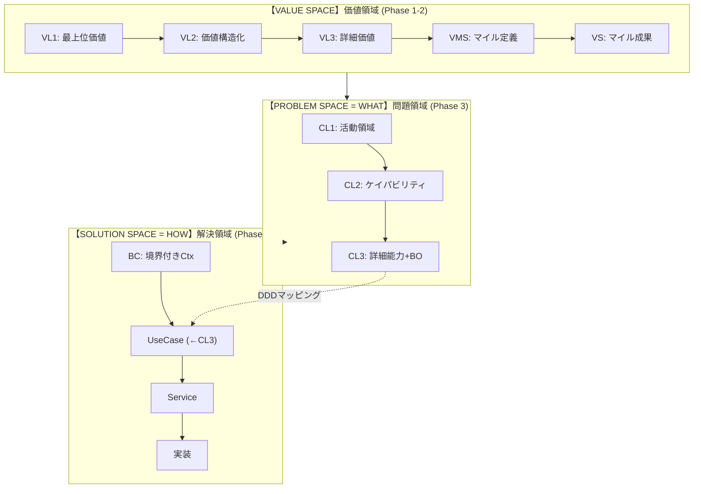

# Parasol V5 Three-Space Flow Diagram Specification

このドキュメントは、Parasol V5の3スペースフローを視覚化するための仕様です。

---

## 概要

Parasol V5は3つの独立したスペース（領域）を通じて、価値から実装まで体系的に分解します。

```
Value Space → Problem Space → Solution Space
(WHY + WHEN)     (WHAT)          (HOW)
  (価値)          (問題)          (解決)
```

**3軸モデル**:
- **WHAT**: 何を解決するか（Problem Space）
- **HOW**: どう解決するか（Solution Space）
- **WHEN**: いつ価値を届けるか（Value Space内のバリューステージ/顧客ジャーニー時間軸）

---

## 全体フロー図

```
┏━━━━━━━━━━━━━━━━━━━━━━━━━━━━━━━━━━━━━━━━━━━━━━━━━━━━━━━━━━━━━━━━━━━━━━━━━━┓
┃                         Parasol V5 Three-Space Flow                      ┃
┗━━━━━━━━━━━━━━━━━━━━━━━━━━━━━━━━━━━━━━━━━━━━━━━━━━━━━━━━━━━━━━━━━━━━━━━━━━┛

╔══════════════════════════════════════════════════════════════════════════╗
║  【VALUE SPACE】価値領域                                    Phase 1-2    ║
║  ────────────────────────────────────────────────────────────────────    ║
║  「なぜこのプロジェクトが必要か」を定義                                   ║
║                                                                          ║
║    VL1        VL2        VL3        VMS        VS                        ║
║   (抽象)  →  (中間)  →  (具体)  →  (マイル) →  (成果)                    ║
║    ┌──┐      ┌──┐      ┌──┐      ┌──┐      ┌──┐                         ║
║    │最│      │価│      │詳│      │マ│      │状│                         ║
║    │上│  →   │値│  →   │細│  →   │イ│  →   │態│                         ║
║    │位│      │構│      │価│      │ル│      │変│                         ║
║    │価│      │造│      │値│      │定│      │化│                         ║
║    │値│      │化│      │  │      │義│      │  │                         ║
║    └──┘      └──┘      └──┘      └──┘      └──┘                         ║
║                                                                          ║
║  例: 「健康的な生活を支援」→「食事管理」→「栄養計算機能」→「MS1」→「完了」  ║
╚══════════════════════════════════════════════════════════════════════════╝
                                    │
                                    ▼ 価値→問題 変換
╔══════════════════════════════════════════════════════════════════════════╗
║  【PROBLEM SPACE = WHAT】問題領域                             Phase 3    ║
║  ────────────────────────────────────────────────────────────────────    ║
║  「何を解決するか」を定義（機能要件 = Functional Requirements）           ║
║                                                                          ║
║         CL1              CL2              CL3                            ║
║        (抽象)     →     (中間)     →     (具体)                          ║
║    ┌──────────┐    ┌──────────┐    ┌──────────┐                          ║
║    │ 活動領域  │    │ケイパビリティ│    │業務オペレーション│                ║
║    │ 識別     │ →  │ 分類      │ →  │ 詳細      │                        ║
║    │          │    │          │    │          │                          ║
║    │ 経営層   │    │ 事業部長  │    │ 業務担当  │                          ║
║    └──────────┘    └──────────┘    └──────────┘                          ║
║                                                                          ║
║  例: 「食事管理」→「栄養管理ケイパビリティ」→「食事記録オペレーション」     ║
╚══════════════════════════════════════════════════════════════════════════╝
                                    │
                                    ▼ 問題→解決 変換（DDDマッピング）
╔══════════════════════════════════════════════════════════════════════════╗
║  【SOLUTION SPACE = HOW】解決領域                           Phase 4-6    ║
║  ────────────────────────────────────────────────────────────────────    ║
║  「どう解決するか」を定義（設計パラメータ = Design Parameters）           ║
║                                                                          ║
║     BC           UseCase          Service         実装                   ║
║   (抽象)    →    (←CL3)     →    (中間)     →    (具体)                  ║
║  ┌────────┐   ┌──────────┐   ┌──────────┐   ┌──────────┐                 ║
║  │境界付き │   │ユースケース│   │サービス  │   │コード    │                 ║
║  │コンテキスト│→ │          │ → │設計      │ → │実装      │                 ║
║  │        │   │          │   │          │   │          │                 ║
║  │アーキテクト│   │ PO/開発   │   │開発リード │   │ 開発者   │                 ║
║  └────────┘   └──────────┘   └──────────┘   └──────────┘                 ║
║       ▲                                                                  ║
║       │ CL3 → UseCase マッピング                                         ║
║       └──────────────────────────────────────────────────────────────    ║
║                                                                          ║
║  例: 「栄養管理BC」→「食事記録UC」→「MealService」→「meal_service.py」    ║
╚══════════════════════════════════════════════════════════════════════════╝
```

---

## スペース間の関係

### Axiomatic Design との対応

| スペース | AD用語 | 役割 | Phase |
|---------|--------|------|-------|
| Value Space | - | WHY（なぜ）+ WHEN（いつ：顧客ジャーニー時間軸） | 1-2 |
| Problem Space | Functional Domain | WHAT（何を） | 3 |
| Solution Space | Physical Domain | HOW（どう） | 4-6 |

**重要**: Value SpaceはWHY（なぜ価値があるか）だけでなく、WHEN（いつ価値を届けるか）を含む。バリューステージ（VS1→VS2→...）は顧客ジャーニーの時間軸を表現し、これがビジネス変更の自然な境界となる。

### 変換ポイント

```
Value Space
     │
     ▼ 「価値をケイパビリティに変換」
Problem Space (WHAT)
     │
     ▼ 「DDDマッピング: CL3 → UseCase」
Solution Space (HOW)
```

---

## 各スペースの詳細

### 1. Value Space（価値領域）

**目的**: プロジェクトの存在意義と成功基準を定義

#### Value Space内の3軸モデル

Value Spaceは内部に3つの軸を持ちます：

```
┌─────────────────────────────────────────────────────────────────┐
│                Value Space内の3軸モデル                          │
├─────────────────────────────────────────────────────────────────┤
│                                                                 │
│  WHY = 顧客価値レベル（VL1→VL2→VL3）                             │
│        「何を顧客に届けるか」                                   │
│                    │                                            │
│        ┌──────────┴──────────┐                                  │
│        ▼                     ▼                                  │
│  HOW = バリューストリーム    WHEN = バリューステージ             │
│        (VStr)                     (VS0-VS7)                     │
│        「どう価値を流すか」       「いつ価値を届けるか」         │
│        全体フロー                 顧客ジャーニー時間軸           │
│                                                                 │
└─────────────────────────────────────────────────────────────────┘
```

| 軸 | 概念 | 説明 | 主語 |
|----|------|------|------|
| **WHY** | VL1-VL3 | 顧客に何を届けるか | 組織 |
| **HOW** | VStr | 価値がどう流れるか | 組織 |
| **WHEN** | VS0-VS7 | いつ価値を届けるか（顧客状態遷移） | **顧客** |

#### Value Space構成要素

| 要素 | 軸 | 説明 | 例 |
|-----|-----|------|-----|
| VL1 | WHY | 最上位価値（ミッション） | 健康的な生活を支援する |
| VL2 | WHY | 価値構造化 | 食事・運動・睡眠の3軸 |
| VL3 | WHY | 詳細価値 | 栄養バランスの可視化 |
| VStr | HOW | 価値の流れ全体 | VS0→VS1→...→VS7のプロセス |
| VMS | - | マイルストーン定義 | MS1: 基本機能リリース |
| VS | WHEN | 顧客状態（バリューステージ） | VS2: 顧客が選びたいと思う状態 |

### 2. Problem Space（問題領域）= WHAT

**目的**: 解決すべき問題を機能要件として定義

| 要素 | 説明 | 担当 | 例 |
|-----|------|------|-----|
| CL1 | 活動領域識別 | 経営層 | 食事管理 |
| CL2 | ケイパビリティ分類 | 事業部長/PO | 栄養管理ケイパビリティ |
| CL3 | 詳細能力 + BO対応 | 業務担当者 | 食事記録能力 → BO |

### 3. Solution Space（解決領域）= HOW

**目的**: 問題の解決方法を設計パラメータとして定義

| 要素 | 説明 | 担当 | 例 |
|-----|------|------|-----|
| BC | 境界付きコンテキスト | アーキテクト | 栄養管理BC |
| UseCase | ユースケース（←CL3） | PO/開発 | 食事記録UC |
| Service | サービス設計 | 開発リード | MealService |
| 実装 | コード | 開発者 | meal_service.py |

---

## 視覚化のためのカラーパレット提案

```
Value Space:    #4CAF50 (緑系) - 成長・価値を表現
Problem Space:  #2196F3 (青系) - 分析・論理を表現
Solution Space: #FF9800 (橙系) - 実行・構築を表現

矢印/変換:      #9E9E9E (グレー)
背景:           #FAFAFA (ライトグレー)
テキスト:       #212121 (ダークグレー)
```

---

## 図の生成指示

この仕様に基づいて以下の形式で図を生成できます:

1. **フローチャート形式**: 3つのボックスを縦に配置、矢印で接続
2. **スイムレーン形式**: 横方向に各スペースをレーンとして配置
3. **階層図形式**: 各スペース内の要素を階層的に表示
4. **アニメーション**: 価値→問題→解決の流れをステップで表示

### Mermaid記法での例



---

## 関連ドキュメント

- [space-structure-diagrams.md](./space-structure-diagrams.md) - **各領域の内部構造詳細図**
- [zigzag-foundations.md](../philosophy/zigzag-foundations.md) - ZIGZAGプロセスの詳細
- [cl3-to-bc-ascii-diagrams.md](./cl3-to-bc-ascii-diagrams.md) - CL3→BCマッピングの詳細図
- [_value-methodology.md](../../_value-methodology.md) - 価値方法論リファレンス
- [0-help.md](../commands/0-help.md) - Parasol V5コマンドヘルプ
