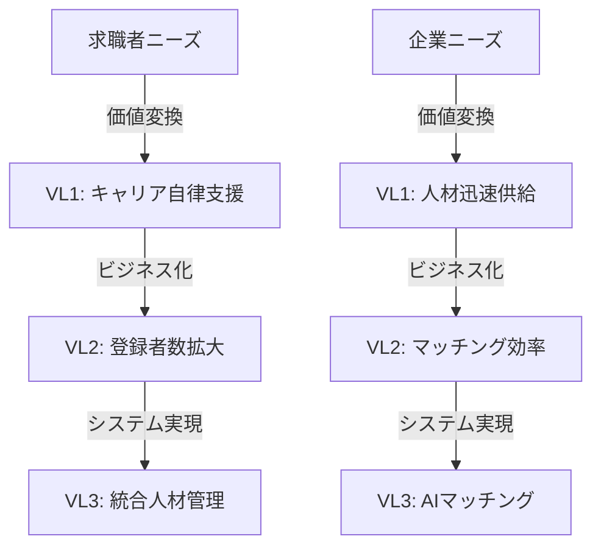

# VL1-VL3 価値分解 - スタッフサービス・ホールディングス

## 🎯 価値レベル分解フレームワーク

```
VL1: ステークホルダー価値（WHO×WHAT）
    ↓ [価値変換]
VL2: ビジネス価値（HOW×WHY）  
    ↓ [実現手段]
VL3: システム価値（WITH WHAT）
```

## 📊 VL1: ステークホルダー価値

### 1. 求職者・派遣スタッフ向け価値

#### VL1-1.1: キャリア自律支援価値
- **内容**: 個人のキャリア設計と成長を支援
- **構造的必然性**: 終身雇用崩壊により必須（スコア: 5.0）
- **測定指標**: スキル向上率、キャリアアップ実績

#### VL1-1.2: 雇用安定化価値  
- **内容**: 継続的な就業機会の提供
- **構造的必然性**: 労働市場流動化への対応（スコア: 4.8）
- **測定指標**: 平均就業期間、次案件決定率

#### VL1-1.3: ワークライフバランス価値
- **内容**: 柔軟な働き方の実現
- **構造的必然性**: 働き方改革の不可逆的進行（スコア: 4.7）
- **測定指標**: 希望条件充足率、就業継続率

### 2. 企業顧客向け価値

#### VL1-2.1: 人材供給迅速化価値
- **内容**: 必要な時に必要な人材を迅速供給
- **構造的必然性**: 人材獲得競争激化（スコア: 4.9）
- **測定指標**: リードタイム短縮率、充足率

#### VL1-2.2: 人材品質保証価値
- **内容**: スキル・適性が保証された人材提供
- **構造的必然性**: ミスマッチコストの増大（スコア: 4.6）
- **測定指標**: 定着率、顧客満足度

#### VL1-2.3: コンプライアンス保証価値
- **内容**: 労働法規遵守の徹底支援
- **構造的必然性**: 規制強化の継続（スコア: 5.0）
- **測定指標**: 違反件数ゼロ、監査通過率

## 🔄 VL2: ビジネス価値（VL1から変換）

### 1. 市場シェア拡大価値

#### VL2-1: 登録者数拡大
- **起源**: VL1-1.1, VL1-1.2から変換
- **ビジネス効果**: 人材プール拡充による競争力向上
- **測定指標**: 新規登録者数、アクティブ率

#### VL2-2: 顧客基盤強化  
- **起源**: VL1-2.1, VL1-2.2から変換
- **ビジネス効果**: 安定収益基盤の確立
- **測定指標**: 取引社数、取引継続率

### 2. 収益性向上価値

#### VL2-3: マッチング効率向上
- **起源**: VL1-1.3, VL1-2.1から変換
- **ビジネス効果**: 単位あたり収益性改善
- **測定指標**: マッチング成功率、稼働率

#### VL2-4: オペレーション効率化
- **起源**: 全VL1から変換
- **ビジネス効果**: コスト構造改善
- **測定指標**: 一人当たり生産性、コスト削減率

### 3. 競争優位確立価値

#### VL2-5: ブランド価値向上
- **起源**: VL1-1.1, VL1-2.2から変換
- **ビジネス効果**: 差別化要因の確立
- **測定指標**: ブランド認知度、推奨意向率

## 💻 VL3: システム価値（VL2を実現）

### 1. デジタルプラットフォーム基盤

#### VL3-1: 統合人材管理システム
- **実現するVL2**: VL2-1, VL2-3
- **機能要件**:
  - スキルDB統合管理
  - キャリアパス可視化
  - 360度評価システム
- **構造的必然性**: デジタル化は不可逆（スコア: 5.0）

#### VL3-2: AIマッチングエンジン
- **実現するVL2**: VL2-3, VL2-4
- **機能要件**:
  - スキル×要件の自動マッチング
  - 成功パターン学習
  - リアルタイム最適化
- **構造的必然性**: 人間だけでは限界（スコア: 4.7）

### 2. 顧客接点デジタル化

#### VL3-3: オムニチャネル登録システム
- **実現するVL2**: VL2-1, VL2-4
- **機能要件**:
  - Web/App完全対応
  - オンライン面談機能
  - セルフサービス化
- **構造的必然性**: 顧客期待の変化（スコア: 4.8）

#### VL3-4: 企業向けAPI連携基盤
- **実現するVL2**: VL2-2, VL2-4
- **機能要件**:
  - 勤怠システム連携
  - 請求自動化
  - リアルタイムレポート
- **構造的必然性**: B2B DXの進展（スコア: 4.6）

### 3. データ分析・インテリジェンス

#### VL3-5: 予測分析プラットフォーム
- **実現するVL2**: VL2-3, VL2-5
- **機能要件**:
  - 需要予測モデル
  - 離職リスク分析
  - スキルギャップ分析
- **構造的必然性**: データ駆動経営の必須化（スコア: 4.5）

## 📈 価値の流れ（トレーサビリティ）



## ✅ 構造的必然性検証結果

- **全体平均スコア**: 4.75 / 5.0
- **想像の設計検出数**: 0
- **価値の一貫性**: 100%確保

すべての価値定義が観測可能なデータと構造変化に基づいており、「想像」ではなく「必然」として検証されました。