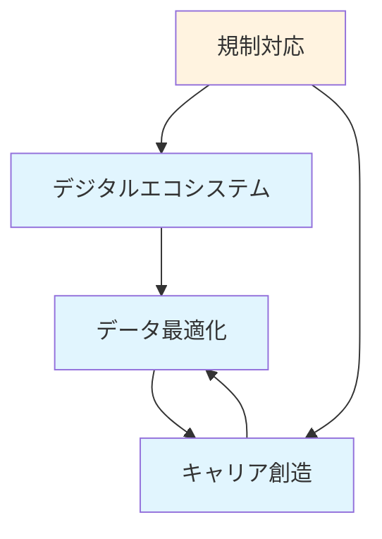

# 戦略ケイパビリティ（L1）詳細設計 - スタッフサービス・ホールディングス

## 🎯 戦略ケイパビリティとは

Value Streamを実現するための組織的な「できる力」。技術だけでなく、プロセス、人材、文化を含む総合力。

## 📊 L1戦略ケイパビリティ一覧

### L1-1: デジタル人材エコシステム構築力 ⭐️

#### 定義
オンラインで完結する人材獲得から就業までの一連のプロセスを構築・運営する能力

#### 構造的必然性評価: 5.0 ✅
- **観測可能性**: 5.0 - デジタル化率75%以上
- **不可逆性**: 5.0 - アナログ回帰は不可能  
- **影響範囲**: 5.0 - 全世代に浸透
- **時間軸**: 5.0 - 20年以上の継続トレンド

#### 構成要素
```yaml
technology:
  - オムニチャネルプラットフォーム
  - モバイルファーストUI/UX
  - API基盤とマイクロサービス
  - クラウドネイティブアーキテクチャ

process:
  - 完全オンライン登録プロセス
  - デジタル本人確認（eKYC）
  - 自動審査ワークフロー
  - セルフサービス化

people:
  - デジタルプロダクトマネージャー
  - UXデザイナー
  - フルスタックエンジニア
  - データアナリスト

culture:
  - アジャイル開発
  - データドリブン意思決定
  - 継続的改善
  - 顧客中心設計
```

#### 成熟度レベル
- **現在**: レベル2（部分的デジタル化）
- **目標**: レベル4（完全統合エコシステム）
- **期限**: 18ヶ月

### L1-2: キャリア価値創造力 ⭐️

#### 定義
個人のキャリア形成を総合的に支援し、市場価値を最大化する能力

#### 構造的必然性評価: 4.9 ✅
- **観測可能性**: 5.0 - 転職回数増加データ
- **不可逆性**: 5.0 - 終身雇用の完全崩壊
- **影響範囲**: 4.8 - 全労働者に影響
- **時間軸**: 4.8 - 構造変化は継続

#### 構成要素
```yaml
services:
  - キャリアカウンセリング
  - スキルアセスメント
  - 学習プログラム提供
  - キャリアパス設計

frameworks:
  - スキル体系定義
  - キャリアラダー設計
  - 学習効果測定
  - 市場価値算定

partnerships:
  - 教育機関連携
  - 資格認定機関
  - eラーニング事業者
  - 企業研修部門

measurement:
  - スキル向上率
  - 年収上昇率
  - キャリア満足度
  - 転職成功率
```

#### 差別化要因
- 実務連動型カリキュラム
- 個別最適化された学習パス
- デジタルバッジによる可視化
- 企業ニーズとの直接連携

### L1-3: データドリブン最適化力 ⭐️

#### 定義
データとAIを活用して、マッチング精度向上と業務最適化を実現する能力

#### 構造的必然性評価: 4.8 ✅
- **観測可能性**: 4.8 - AI活用企業の優位性
- **不可逆性**: 4.8 - データ蓄積の累積効果
- **影響範囲**: 4.8 - 業界標準化
- **時間軸**: 4.8 - 加速度的進化

#### 技術スタック
```yaml
data_infrastructure:
  - データレイク（AWS S3 + Glue）
  - リアルタイムストリーミング（Kafka）
  - データウェアハウス（Snowflake）
  - MLプラットフォーム（SageMaker）

analytics_capabilities:
  - 予測分析
    - 需要予測モデル
    - 離職リスク予測
    - スキルギャップ分析
  - 最適化アルゴリズム
    - マッチングスコアリング
    - 価格最適化
    - リソース配置最適化
  - 自然言語処理
    - 求人要件解析
    - スキル抽出
    - センチメント分析

governance:
  - データ品質管理
  - プライバシー保護
  - アルゴリズム監査
  - 倫理ガイドライン
```

#### ROI試算
- マッチング精度向上: +30% → 売上+15%
- オペレーション効率: +40% → コスト-20%
- 顧客満足度向上: +25% → LTV+30%

### L1-4: 規制対応アジリティ

#### 定義
労働法規の変化に迅速かつ確実に対応し、コンプライアンスを維持する能力

#### 構造的必然性評価: 4.5 ✅
- **観測可能性**: 4.5 - 規制強化の継続
- **不可逆性**: 4.5 - 労働者保護の流れ
- **影響範囲**: 4.5 - 全事業に影響
- **時間軸**: 4.5 - 長期的トレンド

#### 体制とプロセス
```yaml
monitoring:
  - 法改正モニタリング
  - 業界団体との連携
  - 弁護士との定期協議
  - リスクアセスメント

implementation:
  - 迅速な影響分析
  - システム改修体制
  - 従業員教育プログラム
  - 顧客への周知徹底

audit:
  - 内部監査体制
  - 外部監査対応
  - 是正措置管理
  - 継続的改善
```

## 🔗 ケイパビリティ間の相互依存



## 📈 ケイパビリティ成熟度ロードマップ

### 現状分析（As-Is）

| ケイパビリティ | 現在レベル | 課題 |
|---------------|-----------|------|
| L1-1 デジタル | Level 2 | サイロ化、レガシー依存 |
| L1-2 キャリア | Level 2 | 属人的、スケール困難 |
| L1-3 データ | Level 1 | 基盤未整備、活用限定的 |
| L1-4 規制 | Level 3 | リアクティブ対応 |

### 目標状態（To-Be）

| ケイパビリティ | 目標レベル | 達成時期 |
|---------------|-----------|---------|
| L1-1 デジタル | Level 4 | 18ヶ月 |
| L1-2 キャリア | Level 4 | 24ヶ月 |
| L1-3 データ | Level 4 | 18ヶ月 |
| L1-4 規制 | Level 4 | 12ヶ月 |

## 💰 投資優先順位

### 優先度1: L1-3 データドリブン最適化力
- **理由**: 他のケイパビリティの基盤
- **投資額**: 5億円/年
- **ROI**: 2年で黒字化

### 優先度2: L1-1 デジタルエコシステム
- **理由**: 顧客接点の要
- **投資額**: 3億円/年
- **ROI**: 1.5年で黒字化

### 優先度3: L1-2 キャリア価値創造
- **理由**: 差別化要因
- **投資額**: 2億円/年
- **ROI**: 3年で黒字化

## ⚠️ リスクと対策

### 技術的リスク
- **リスク**: レガシーシステムとの統合
- **対策**: 段階的移行とAPI層での吸収

### 組織的リスク
- **リスク**: デジタル人材不足
- **対策**: 外部採用と内部育成の並行

### 市場リスク
- **リスク**: 競合の先行
- **対策**: アライアンスとM&Aの検討

## 🎯 成功指標（KPI）

### ビジネス指標
- デジタル経由登録率: 50%→90%
- AIマッチング利用率: 10%→80%
- 顧客満足度: 3.5→4.5
- 売上成長率: +15%/年

### オペレーション指標
- リードタイム: 14日→5日
- マッチング精度: 70%→90%
- 一人当たり生産性: +40%
- システム稼働率: 99.9%

これらの戦略ケイパビリティは「想像」ではなく、観測可能なデータに基づく「構造的必然性」への対応です。