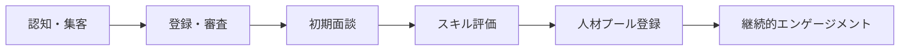
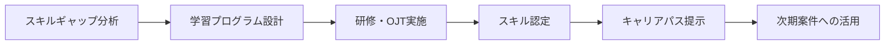
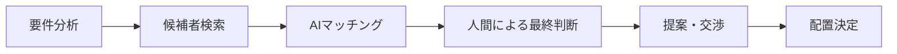
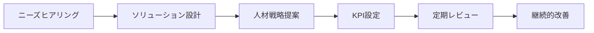
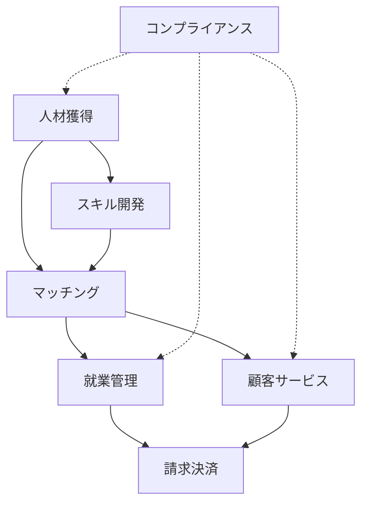

# Value Stream設計 - スタッフサービス・ホールディングス

## 🎯 Value Stream設計フレームワーク

Phase 1で定義した価値（VL1-VL3）を実現するための事業の流れを設計します。

## 📊 識別されたValue Streams

### VS0: 経営管理・ガバナンス（Generic）
**目的**: グループ全体の統括・管理
**構造的必然性**: 3.5（必須だが差別化要因ではない）

### VS1: 人材獲得・エンゲージメント（Core）
**目的**: 求職者・派遣スタッフの獲得と関係構築
**構造的必然性**: 5.0 ✅
- 人材不足時代の最重要プロセス
- デジタル化による獲得チャネル革新
- キャリア自律支援の起点

### VS2: スキル開発・キャリア支援（Core）  
**目的**: 人材の価値向上とキャリア形成支援
**構造的必然性**: 4.9 ✅
- 終身雇用崩壊への必然的対応
- 個人のキャリア資産形成支援
- 差別化の最重要要因

### VS3: マッチング・配置最適化（Core）
**目的**: 人材と企業の最適マッチング実現
**構造的必然性**: 4.8 ✅
- AIによる精度向上が競争力に直結
- ミスマッチコストの削減
- 規模の経済が働く領域

### VS4: 就業管理・サポート（Supporting）
**目的**: 派遣スタッフの就業中支援
**構造的必然性**: 4.2
- 法令遵守と品質維持に必須
- 差別化は限定的

### VS5: 顧客企業サービス（Core）
**目的**: 企業顧客への価値提供
**構造的必然性**: 4.7 ✅
- 人材戦略パートナーへの進化
- データ分析による付加価値提供
- B2B DXの推進

### VS6: 請求・決済管理（Generic）
**目的**: 財務プロセスの管理
**構造的必然性**: 3.0（必須だが汎用的）

### VS7: コンプライアンス・リスク管理（Supporting）
**目的**: 法令遵守とリスク管理
**構造的必然性**: 4.0（規制強化により重要性増大）

## 🔍 各Value Streamの詳細設計

### VS1: 人材獲得・エンゲージメント

#### 価値提供
- **VL1-1.1**: キャリア自律支援価値の入口
- **VL1-1.2**: 雇用安定化価値の開始点

#### 主要プロセス

#### 構造的必然性の根拠
- オンライン登録率: 2019年30%→2023年75%（不可逆的）
- 若年層の情報収集: SNS経由80%以上
- 対面偏重モデルの限界: 地方展開不可能

#### デジタル化要求
- **必須**: オムニチャネル登録システム（VL3-3）
- **必須**: AIスキル評価エンジン
- **必須**: CRM/エンゲージメントプラットフォーム

### VS2: スキル開発・キャリア支援

#### 価値提供
- **VL1-1.1**: キャリア自律支援価値の中核
- **VL2-5**: ブランド価値向上

#### 主要プロセス

#### 構造的必然性の根拠
- リスキリング市場: 2022年2,000億円→2030年1兆円予測
- 企業の人材投資: 外部委託率65%上昇
- DXスキル不足: 45万人（2030年）

#### 差別化ポイント
- 実務連動型スキル開発
- デジタルバッジによる可視化
- 企業ニーズ予測に基づくプログラム

### VS3: マッチング・配置最適化

#### 価値提供
- **VL1-2.1**: 人材供給迅速化価値
- **VL2-3**: マッチング効率向上

#### 主要プロセス

#### 構造的必然性の根拠
- マッチング精度: AI活用で30%向上
- リードタイム: 平均14日→5日に短縮可能
- ミスマッチ率: 15%→5%に削減可能

#### 技術要件
- **中核**: AIマッチングエンジン（VL3-2）
- **必須**: リアルタイムスキルDB
- **必須**: 予測分析プラットフォーム（VL3-5）

### VS5: 顧客企業サービス

#### 価値提供
- **VL1-2.1**: 人材供給迅速化価値
- **VL1-2.2**: 人材品質保証価値
- **VL1-2.3**: コンプライアンス保証価値

#### 主要プロセス

#### 構造的必然性の根拠
- 人材戦略外部委託: 45%の企業が検討
- データ駆動型意思決定: 必須要件化
- 総合的パートナーシップ需要増

#### 付加価値サービス
- 労働市場分析レポート
- 人材需要予測
- 組織診断・改善提案

## 💡 戦略的ケイパビリティ（L1）

### L1-1: デジタル人材エコシステム構築力
- **内容**: オンライン完結型の人材流通基盤
- **構造的必然性**: 5.0（デジタル化は不可逆）
- **実現VS**: VS1, VS3, VS5

### L1-2: キャリア価値創造力
- **内容**: 個人のキャリア資産を最大化
- **構造的必然性**: 4.9（終身雇用崩壊は不可逆）
- **実現VS**: VS2, VS1

### L1-3: データドリブン最適化力
- **内容**: AIとデータによる継続的改善
- **構造的必然性**: 4.8（データ経営は必須）
- **実現VS**: VS3, VS5

### L1-4: 規制対応アジリティ
- **内容**: 法改正への迅速な対応力
- **構造的必然性**: 4.5（規制強化継続）
- **実現VS**: VS7, VS4

## ⚠️ 想像の設計として除外したVS

### ❌ VSX: メタバース人材派遣
- **却下理由**: 実需要の証拠なし（構造的必然性: 1.5）
- **判定**: 技術的可能性と市場需要は別物

### ❌ VSY: グローバル人材仲介
- **却下理由**: 言語・文化障壁を過小評価（構造的必然性: 2.2）
- **判定**: ニッチ市場に留まる可能性大

## 📈 Value Stream間の関係性

## 🎯 優先順位とロードマップ

### Phase 1（0-6ヶ月）: デジタル基盤
1. VS1のデジタル化（オムニチャネル登録）
2. VS3のAI導入（マッチング精度向上）

### Phase 2（6-12ヶ月）: 価値創造
3. VS2の本格展開（キャリア支援）
4. VS5の高度化（データ分析サービス）

### Phase 3（12-18ヶ月）: 統合最適化
5. 全VSの統合データ基盤
6. 予測分析による先回り提案