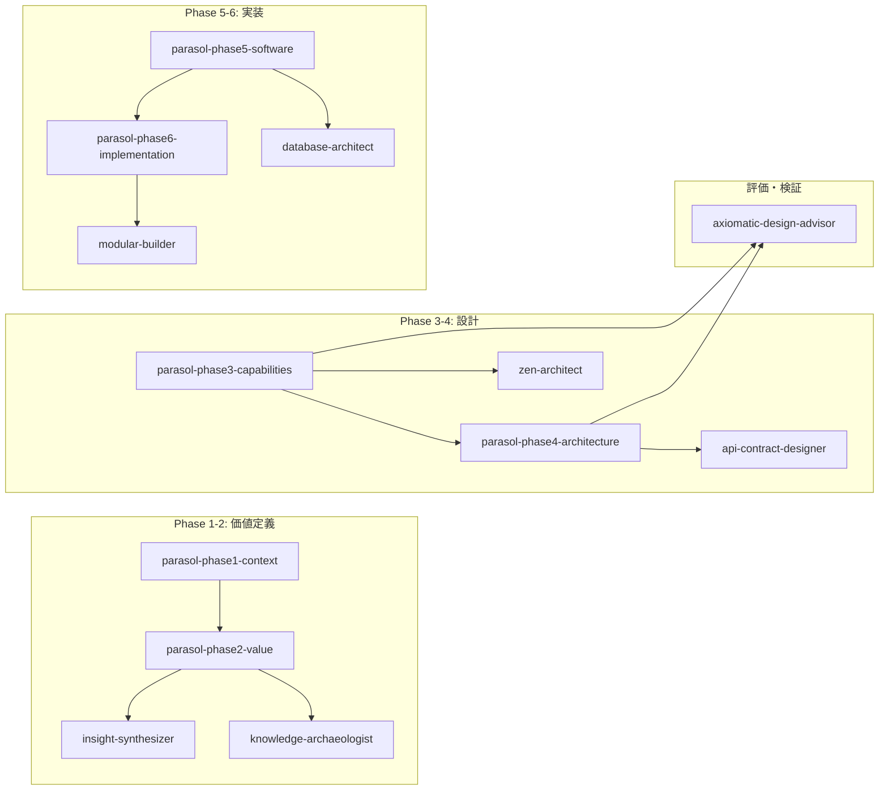
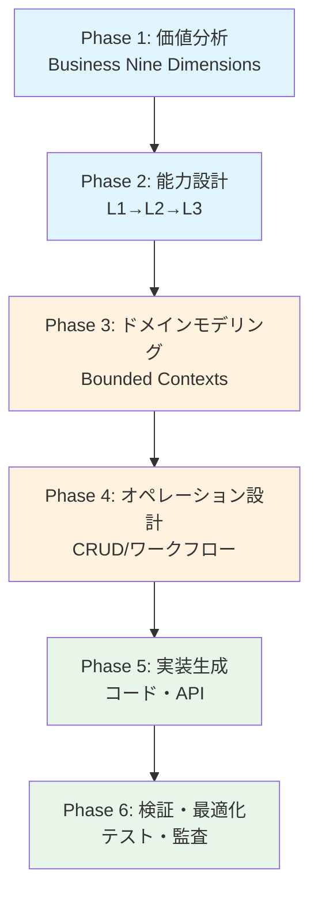
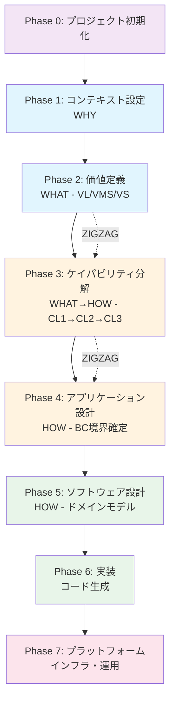
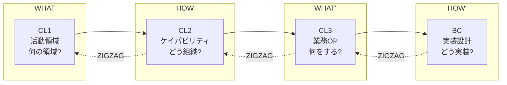
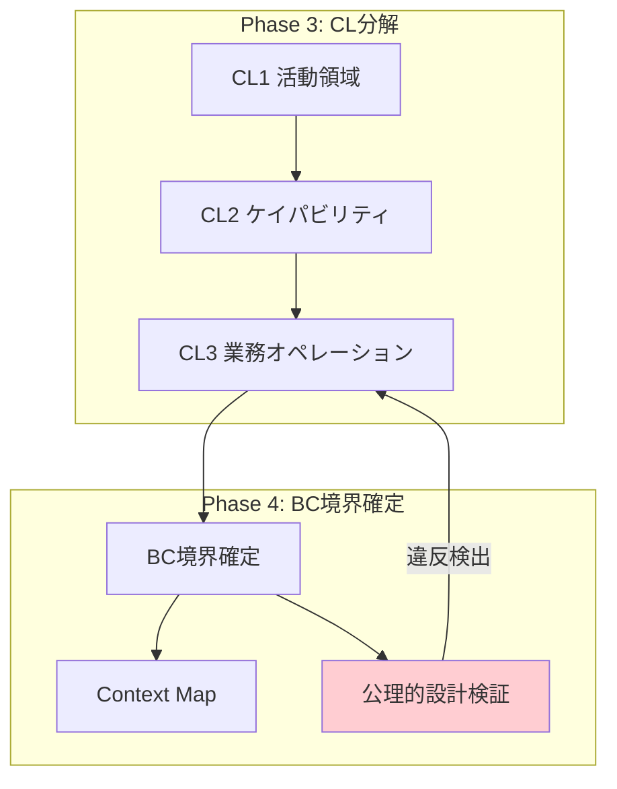
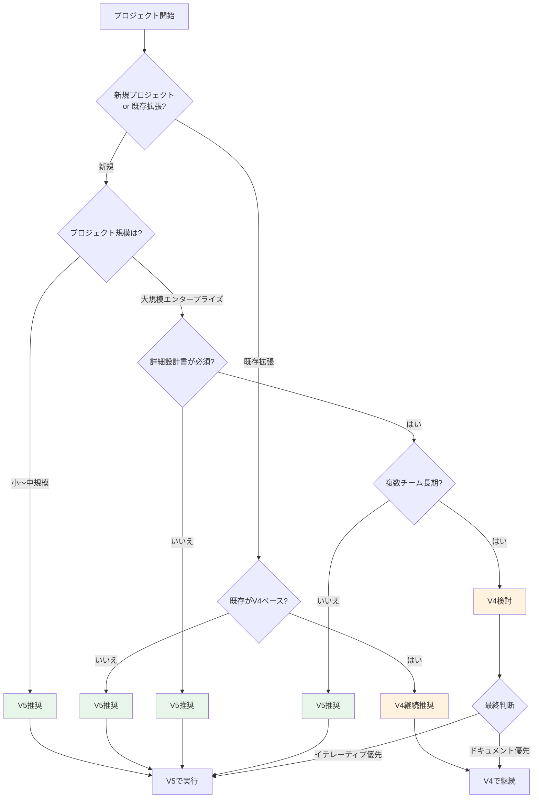

# Parasol V4 vs V5 完全比較ガイド

このドキュメントはParasol V4とV5の主要な違いを包括的に解説し、実務者が適切なバージョンを選択・活用できるようにするためのガイドです。

---

## 目次

1. [概要比較](#概要比較)
2. [Amplifier統合とサブエージェント活用](#amplifier統合とサブエージェント活用)
3. [フェーズ構成の詳細比較](#フェーズ構成の詳細比較)
4. [ZIGZAGプロセスと公理的設計](#zigzagプロセスと公理的設計)
5. [能力階層とドメイン設計](#能力階層とドメイン設計)
6. [価値定義システム](#価値定義システム)
7. [実行方法とコマンド体系](#実行方法とコマンド体系)
8. [BC境界確定の方法](#bc境界確定の方法)
9. [選択フローチャート](#選択フローチャート)
10. [移行ガイド](#移行ガイド)
11. [よくある質問（FAQ）](#よくある質問faq)
12. [関連リンク](#関連リンク)

---

## 概要比較

### クイック比較表

| 項目 | V4（アーカイブ） | V5（アクティブ・推奨） |
|------|-----------------|-----------------|
| **設計思想** | 重厚長大な本格的DDD | 実用的・軽量なアプローチ |
| **場所** | `reference/v4/` | `/.claude/commands/parasol/` |
| **実行方法** | `/ddd:1-plan` + MDファイル | `/parasol:X-xxx` スラッシュコマンド |
| **所要時間** | 複数日〜週単位 | 数時間〜数日 |
| **対象規模** | 大規模エンタープライズ | 中小〜大規模対応 |
| **公理的設計** | 暗黙的 | 明示的に統合 |
| **価値追跡** | 限定的 | VSTR（価値追跡）システム完備 |
| **サブエージェント** | 一部活用 | 各フェーズ専用エージェント |

### 設計思想の根本的違い

```mermaid
graph TB
    subgraph V4["V4: ウォーターフォール型"]
        V4A[Phase 1: 価値分析] --> V4B[Phase 2: 能力設計]
        V4B --> V4C[Phase 3: ドメイン]
        V4C --> V4D[Phase 4: オペレーション]
        V4D --> V4E[Phase 5: 実装]
        V4E --> V4F[Phase 6: 検証]
    end

    subgraph V5["V5: ZIGZAGイテレーティブ型"]
        V5A[WHY: Context] --> V5B[WHAT: 価値定義]
        V5B <--> V5C[HOW: ケイパビリティ]
        V5C <--> V5D[WHAT': BC境界]
        V5D <--> V5E[HOW': Software]
        V5E --> V5F[実装]
    end
```



---

## Amplifier統合とサブエージェント活用

### Amplifierフレームワークとの関係

Parasolは**Amplifier**フレームワークの一部として設計されており、Claude Codeとの深い統合を実現しています。

```
Amplifier Framework
├── Claude Code統合
│   ├── スラッシュコマンド（/.claude/commands/）
│   └── サブエージェント（/.claude/agents/）
├── Parasol（価値駆動設計）
│   ├── V4（レガシー・参照用）
│   └── V5（アクティブ・推奨）
└── DDD統合（/ddd:* コマンド）
```

### V4のAmplifier統合パターン

V4はAmplifier DDDワークフローを通じて実行：

```bash
# DDDコンテキストをロード
/ddd:prime

# 各フェーズの実行
/ddd:1-plan phase2-capability/2-1-strategic-capabilities.md
/ddd:2-docs
/ddd:3-code-plan
/ddd:4-code
/ddd:5-finish
```

### V5のAmplifier統合パターン

V5は専用スラッシュコマンドとサブエージェントで直接実行：

```bash
# 直接実行
/parasol:0-project create [name]
/parasol:1-context
/parasol:2-value
/parasol:3-capabilities
/parasol:4-application-design
/parasol:5-software-design
/parasol:6-implementation
/parasol:7-platform
```

### サブエージェント活用体系

V5は各フェーズに専用のサブエージェントを提供：



### 各サブエージェントの役割

| エージェント | 用途 | 呼び出しタイミング |
|-------------|------|------------------|
| **parasol-phase1-context** | 組織・市場・制約分析 | Phase 1開始時 |
| **parasol-phase2-value** | 価値ストリーム定義、VMS/VS設計 | Phase 2開始時 |
| **parasol-phase3-capabilities** | CL1→CL2→CL3分解 | Phase 3開始時 |
| **parasol-phase4-architecture** | BC境界確定、Context Map | Phase 4開始時 |
| **parasol-phase5-software** | ドメインモデル、API設計 | Phase 5開始時 |
| **parasol-phase6-implementation** | コード生成、テスト | Phase 6開始時 |
| **axiomatic-design-advisor** | 設計品質評価（独立公理・情報公理） | 設計判断時随時 |
| **zen-architect** | アーキテクチャ分析・設計 | 複雑な設計判断時 |

### サブエージェント活用例

#### 例1: 価値定義時のinsight-synthesizer活用

```markdown
## parasol-phase2-valueからの委譲

Prompt: "Synthesize insights from the organizational context to identify:
{context-documents}

1. Primary value drivers for customers
2. Patterns in successful value delivery
3. Gaps between current and desired state
4. Opportunities for value multiplication

Output as structured value stream recommendations."
```

#### 例2: BC境界確定時のaxiomatic-design-advisor活用

```markdown
## parasol-phase4-architectureからの委譲

Prompt: "Evaluate this service boundary design:
{service-boundaries}

Check:
1. Independence Axiom compliance (Design Matrix pattern)
2. Information Axiom compliance (success probability)
3. Coupling patterns (Uncoupled/Decoupled/Coupled)
4. CL3 → BC ratio (should be ≤ 1.2)

Output verdict and recommendations."
```

---

## フェーズ構成の詳細比較

### V4: 6フェーズ構成



**V4の各フェーズ詳細:**

| Phase | 名称 | 主要活動 | 成果物 |
|-------|------|---------|--------|
| 1 | 価値分析 | Business Nine Dimensions + Five Pillars | 価値構造化文書 |
| 2 | 能力設計 | L1戦略→L2戦術→L3運用の分解 | 能力階層設計書 |
| 3 | ドメインモデリング | BC定義、エンティティ、アグリゲート | ドメインモデル |
| 4 | オペレーション設計 | CRUD定義、ワークフロー | オペレーション仕様 |
| 5 | 実装生成 | コード、テスト、API仕様 | 実装成果物 |
| 6 | 検証・最適化 | パフォーマンス、セキュリティ監査 | 検証レポート |

### V5: 8フェーズ構成



**V5の各フェーズ詳細:**

| Phase | 名称 | ZIGZAGレベル | 主要活動 | 担当エージェント |
|-------|------|-------------|---------|----------------|
| 0 | プロジェクト初期化 | - | プロジェクト作成、設定 | - |
| 1 | コンテキスト設定 | WHY | 組織分析、市場評価、制約 | parasol-phase1-context |
| 2 | 価値定義 | WHAT（価値） | VL分解、VMSバックキャスト、VS設計 | parasol-phase2-value |
| 3 | ケイパビリティ分解 | WHAT↔HOW | CL1→CL2→CL3、活動領域分類 | parasol-phase3-capabilities |
| 4 | アプリケーション設計 | HOW | BC境界確定、Context Map | parasol-phase4-architecture |
| 5 | ソフトウェア設計 | HOW | ドメインモデル、API、DB設計 | parasol-phase5-software |
| 6 | 実装 | WHAT' | コード生成、テスト | parasol-phase6-implementation |
| 7 | プラットフォーム | - | インフラ、デプロイ、運用 | parasol-phase7-platform |

---

## ZIGZAGプロセスと公理的設計

### ZIGZAGプロセスとは

ZIGZAGはMIT Suh教授のAxiomatic Designに基づく設計手法で、**WHAT（機能要件）** と **HOW（設計パラメータ）** の間を往復することで創発的に設計を深化させます。

```
┌─────────────────────────────────────────────────────────────────────────────────┐
│                    ZIGZAG = つまり時の領域間移動による創発                       │
├─────────────────────────────────────────────────────────────────────────────────┤
│                                                                                 │
│  【重要】WHAT/HOWは「レベル」ではなく「領域」                                    │
│                                                                                 │
│    WHAT領域（問題空間）              HOW領域（解決空間）                        │
│    ┌─────────────────────┐          ┌─────────────────────┐                    │
│    │  同領域内では        │          │  同領域内では        │                    │
│    │  分解を続ける        │  ZIGZAG  │  分解を続ける        │                    │
│    │  CL1→CL2→CL3        │←────────→│  BC→Service→実装    │                    │
│    │                     │ つまり時 │                     │                    │
│    └─────────────────────┘          └─────────────────────┘                    │
│                                                                                 │
└─────────────────────────────────────────────────────────────────────────────────┘
```

### V4とV5のZIGZAG適用比較

| 観点 | V4 | V5 |
|------|----|----|
| **ZIGZAG適用** | 暗黙的・部分的 | 明示的・全フェーズ |
| **行き詰まり検知** | なし | 3つの検知シグナル |
| **公理的設計統合** | なし | axiomatic-design-advisor |
| **Design Matrix** | なし | 明示的評価 |

### 公理的設計の2つの公理

#### Axiom 1: 独立公理（Independence Axiom）

> **「機能は互いに独立させよ」**

```
【UNCOUPLED】独立公理を満たす ✅ BEST
┌───────────────────────────┐
│     DP1   DP2   DP3       │
│ FR1 [X     0     0 ]      │  Each FR maps to exactly one DP
│ FR2 [0     X     0 ]      │  Independent changes possible
│ FR3 [0     0     X ]      │  Parallel development enabled
└───────────────────────────┘

【COUPLED】独立公理に違反 ❌ REDESIGN NEEDED
┌───────────────────────────┐
│     DP1   DP2   DP3       │
│ FR1 [X     X     0 ]      │  Cross-dependencies everywhere
│ FR2 [X     X     X ]      │  Changes unpredictable
│ FR3 [0     X     X ]      │  "Distributed Monolith"
└───────────────────────────┘
```

#### Axiom 2: 情報公理（Information Axiom）

> **「成功確率を最大化せよ」**

- 情報内容 = log₂(1/p) where p = 成功確率
- 低い情報内容 = 高い成功確率 = 良い設計

### 「詰まり」の検知と突破

V5では以下のシグナルで「詰まり」を検知：

1. **同じ単語が3回以上繰り返される**
   - 「顧客管理...顧客を管理...管理する顧客...」

2. **「つまり」で言い換えても新情報がない**
   - 「認証機能、つまりユーザーを認証する機能」

3. **抽象度が変わらない**
   - 上にも下にも行けない膠着状態

**突破方法:**
```
詰まり検知
  ↓
「これをどう実装/実現するか？」と強制的に問う
  ↓
具体的な手段・技術・活動を列挙
  ↓
各HOWから見えてくる新しいWHATを言語化
  ↓
新しいWHAT（WHAT'）を記録して次へ
```

---

## 能力階層とドメイン設計

### V4: L1-L2-L3モデル

```
V4能力階層
├── L1: 戦略的能力（Strategic Capabilities）
│   └── 経営判断レベル、投資判断の単位
├── L2: 戦術的能力（Tactical Capabilities）
│   └── 部門レベル、プロジェクト単位
└── L3: 運用的能力（Operational Capabilities）
    └── 現場レベル、日次業務単位
```

### V5: CL0-CL1-CL2-CL3モデル

```
V5能力階層
├── CL0: 企業活動（Enterprise Activities）
│   └── 経営層向け、存在意義レベル
├── CL1: 活動領域（Activity Areas）
│   └── 経営層向け、投資判断単位（Core/Supporting/Generic）
├── CL2: ケイパビリティ（Capabilities）
│   └── 事業部長向け、チーム境界・サービス境界（★正式分類）
└── CL3: ビジネスオペレーション（Business Operations）
    └── 業務担当者向け、トリガー→活動→成果物
```

### V5の4階層ZIGZAGパターン



### 各階層の対象読者

| 階層 | 対象読者 | 関心事 | 言語 |
|------|---------|--------|------|
| CL1 | 経営層 | 投資判断、戦略整合性 | ビジネス用語 |
| CL2 | 事業部長 | チーム編成、責任範囲 | ビジネス用語 |
| CL3 | 業務担当者 | 日々の業務フロー | ビジネス用語 |
| BC | 開発者 | 実装境界、API契約 | 技術用語 |

---

## 価値定義システム

### V4: Business Nine Dimensions

9つの次元で価値を構造化：

1. **Customer Value** - 顧客価値
2. **Revenue Model** - 収益モデル
3. **Market Position** - 市場ポジション
4. **Operations** - オペレーション
5. **Technology** - テクノロジー
6. **Organization** - 組織
7. **Partners** - パートナー
8. **Resources** - リソース
9. **Cost Structure** - コスト構造

### V5: 価値ストリーム（VS0-VS7）+ VL + VMS

V5は3つの価値概念を統合：

```mermaid
graph TD
    subgraph "VL: 価値レベル階層"
        VL1[VL1: 最上位価値<br/>企業の存在意義] --> VL2[VL2: 価値グループ<br/>部門レベル価値]
        VL2 --> VL3[VL3: 詳細価値<br/>実行可能レベル]
    end

    subgraph "VMS: 価値マイルストーン"
        VMS5[VMS5: 理想状態<br/>18ヶ月後] --> VMS4[VMS4: 最適化状態<br/>12ヶ月後]
        VMS4 --> VMS3[VMS3: 成熟状態<br/>9ヶ月後]
        VMS3 --> VMS2[VMS2: 展開状態<br/>6ヶ月後]
        VMS2 --> VMS1[VMS1: 基礎状態<br/>3ヶ月後]
    end

    subgraph "VS: バリューステージ"
        VS0[VS0: 潜在ニーズ] --> VS1[VS1: 認知]
        VS1 --> VS2[VS2: 選好]
        VS2 --> VS3[VS3: 決定]
        VS3 --> VS4[VS4: 獲得]
        VS4 --> VS5[VS5: 実感]
        VS5 --> VS6[VS6: 継続]
        VS6 --> VS7[VS7: 共創]
    end
```



### 価値定義の核心的違い

| 観点 | V4 | V5 |
|------|----|----|
| **主語** | 組織中心（我々が〜） | 顧客中心（顧客が〜） |
| **時間軸** | 静的な構造化 | バックキャストによる動的計画 |
| **追跡性** | 限定的 | VSTR（Value Stream Trace）完備 |
| **マイルストーン** | なし | VMS（顧客価値状態として定義） |

### VMSの正しい定義

| 観点 | 誤った定義（プロセス完了） | 正しい定義（顧客価値状態） |
|------|------------------------|------------------------|
| **主語** | 組織（我々が〜した） | **顧客**（顧客が〜を得ている） |
| **記述** | 活動の完了 | **状態の達成** |
| **測定** | タスク完了率 | **顧客価値の実現度** |
| **例** | 「システム構築完了」 | 「顧客が24時間注文可能な状態」 |

---

## 実行方法とコマンド体系

### V4: DDD統合実行

```bash
# ステップ1: DDDコンテキストをロード
/ddd:prime

# ステップ2: フェーズ別に順次実行
/ddd:1-plan phase2-capability/2-1-strategic-capabilities.md
/ddd:2-docs
/ddd:3-code-plan
/ddd:4-code
/ddd:5-finish

# 各フェーズで同様のサイクルを繰り返す
```

**特徴:**
- DDDワークフローに依存
- MDファイルを入力として使用
- 5ステップのサイクルを各フェーズで実行

### V5: スラッシュコマンド直接実行

```bash
# ヘルプ・状態確認
/parasol:0-help           # ヘルプ表示
/parasol:0-status         # プロジェクト状態確認
/parasol:0-validate       # 一貫性検証

# プロジェクト管理
/parasol:0-project create [name]  # 新規作成
/parasol:0-init [url]             # URLからの初期化

# フェーズ実行
/parasol:1-context                # Phase 1: コンテキスト設定
/parasol:2-value                  # Phase 2: 価値定義
/parasol:3-capabilities [VS]      # Phase 3: ケイパビリティ分解
/parasol:4-application-design     # Phase 4: アプリケーション設計
/parasol:5-software-design [svc]  # Phase 5: ソフトウェア設計
/parasol:6-implementation [svc]   # Phase 6: 実装
/parasol:7-platform               # Phase 7: プラットフォーム
```

**特徴:**
- 直接コマンド実行
- 各フェーズが独立して実行可能
- サブエージェントが自動的に起動

### コマンド比較表

| 目的 | V4コマンド | V5コマンド |
|------|-----------|-----------|
| 初期化 | `/ddd:prime` | `/parasol:0-project create` |
| 価値分析 | `/ddd:1-plan phase1-value/...` | `/parasol:2-value` |
| 能力設計 | `/ddd:1-plan phase2-capability/...` | `/parasol:3-capabilities` |
| ドメイン設計 | `/ddd:1-plan phase3-domain/...` | `/parasol:4-application-design` |
| 実装 | `/ddd:4-code` | `/parasol:6-implementation` |
| 状態確認 | `/ddd:status` | `/parasol:0-status` |

---

## BC境界確定の方法

### V4のBC境界確定

V4ではPhase 3でBCを定義：

1. 能力階層（L1→L2→L3）からボトムアップで特定
2. エンティティとアグリゲートの関係から境界を導出
3. 主にドメインエキスパートの暗黙知に依存

### V5のBC境界確定

V5ではPhase 4で明示的にBC境界を確定：



### BC境界確定チェックリスト

```markdown
## CL3 → BC 公理的設計コンプライアンスチェック

### 独立公理
- [ ] 各CL3は≤1つのBCにマッピング（理想は1:1）
- [ ] BC比率: [BC数] / [CL3数] ≤ 1.2
- [ ] 循環依存: 0
- [ ] Coupledパターン: 0

### 情報公理
- [ ] 各BCは単一の明確な責務を持つ
- [ ] BC名がその機能を説明している
- [ ] アグリゲート数は最小限
- [ ] 新規開発者が素早く理解可能

### 判定
[✅ PASS / ⚠️ WARNING / ❌ FAIL]
```

### Context Map パターン

```
[Context A] <--> [Context B]  : Partnership (共同目標)
[Context A] --> [Context B]   : Customer-Supplier
[Context A] -U-> [Context B]  : Upstream-Downstream
[Context A] -ACL-> [Context B]: Anti-Corruption Layer
[Context A] -OHS-> [Context B]: Open Host Service
[Context A] -PL-> [Context B] : Published Language
[Context A] = [Context B]     : Shared Kernel
[Context A] X [Context B]     : Separate Ways
```

---

## 選択フローチャート

### どちらを使うべきか判断フロー



### V4が適している場合

- 大規模エンタープライズの全面刷新
- 複数チームによる長期プロジェクト（6ヶ月以上）
- 詳細な設計ドキュメントが契約上必須
- レガシーシステムの完全移行
- 既存のV4プロジェクトの拡張

### V5が適している場合（推奨）

- 新規プロジェクト
- 中小規模のシステム開発
- アジャイル・イテレーティブな開発スタイル
- 迅速な価値検証が必要
- Claude Codeとの緊密な統合活用
- 価値追跡（VSTR）が重要な場合

---

## 移行ガイド

### V4からV5への概念マッピング

| V4概念 | V5概念 | 備考 |
|--------|--------|------|
| L1 戦略的能力 | CL1 活動領域 | より上位にCL0を追加 |
| L2 戦術的能力 | CL2 ケイパビリティ | ほぼ同等、正式分類の位置付け |
| L3 運用的能力 | CL3 ビジネスオペレーション | BC境界確定を追加 |
| Nine Dimensions | VS0-VS7 + VL + VMS | 価値ストリーム概念に進化 |
| Phase 1-6 | Phase 0-7 | 初期化・プラットフォーム追加 |
| なし | VMS（価値マイルストーン） | 顧客価値状態の時間軸管理 |
| なし | VSTR（価値追跡） | 価値の追跡可能性 |

### 移行手順

#### ステップ1: コンテキスト移行

```bash
# V4の成果物を確認
ls projects/your-project/phase1-value-analysis/

# V5プロジェクト作成
/parasol:0-project create your-project-v5

# コンテキスト情報の移行
/parasol:1-context
# → V4のphase0-contextの内容を参照しながら回答
```

#### ステップ2: 価値定義の変換

```bash
# V5価値定義を実行
/parasol:2-value

# 変換ガイド:
# V4 Nine Dimensions → V5 VL階層
# - Customer Value → VL1最上位価値の一部
# - Revenue Model → VL2価値グループ
# - 他の次元 → CL1活動領域の分類に反映
```

#### ステップ3: 能力階層の変換

```bash
# V5ケイパビリティ分解
/parasol:3-capabilities

# 変換マッピング:
# V4 L1 → V5 CL1（活動領域として再定義）
# V4 L2 → V5 CL2（ケイパビリティとして再定義）
# V4 L3 → V5 CL3（業務OPとして詳細化）
```

#### ステップ4: BC境界の再確認

```bash
# V5でBC境界を確定
/parasol:4-application-design

# 公理的設計で検証
# axiomatic-design-advisorが自動的に起動
```

### 移行時の注意点

1. **V4成果物は参照用として保持** - 完全に破棄しない
2. **段階的移行を推奨** - 一度に全て移行しない
3. **価値定義は再検討** - V5の顧客中心の視点で見直す
4. **公理的設計で検証** - 移行後のBC境界を必ず検証

---

## よくある質問（FAQ）

### Q1: V4とV5を混在させることはできますか？

**A:** 推奨しません。両バージョンは設計思想が異なるため、混在させると一貫性が失われます。既存V4プロジェクトは継続し、新規はV5で始めることを推奨します。

### Q2: V5はV4の完全な上位互換ですか？

**A:** いいえ。V5はV4の進化形ですが、一部機能（詳細なドキュメントテンプレートなど）はV4の方が充実しています。目的に応じて選択してください。

### Q3: 公理的設計の知識がなくてもV5を使えますか？

**A:** はい。`axiomatic-design-advisor`エージェントが自動的にガイダンスを提供します。ただし、基本概念（独立公理・情報公理）の理解があると効果的に活用できます。

### Q4: ZIGZAGで「詰まり」が解消しない場合はどうすればよいですか？

**A:** 以下を試してください：
1. より具体的な実装手段を列挙（技術選定）
2. 類似ドメインのパターンを参照
3. ステークホルダーへのヒアリング実施
4. 一時的にスコープを狭める

### Q5: V5のサブエージェントを個別に呼び出すことはできますか？

**A:** はい。Task toolを使用して直接呼び出せます：
```
Task: axiomatic-design-advisor
"このサービス境界設計を評価してください: {設計内容}"
```

### Q6: 小規模プロジェクトでもParasolを使うべきですか？

**A:** 規模によります。1〜2週間で完了する小規模開発であれば、Parasolは過剰かもしれません。ただし、価値駆動の思考フレームワークとしては有用です。

### Q7: V5のVMS（価値マイルストーン）は必須ですか？

**A:** 必須ではありませんが強く推奨します。VMSなしだと価値実現の時間軸が曖昧になり、「いつまでに何が達成されるか」の判断が困難になります。

---

## 関連リンク

### V5関連ドキュメント

- [V5 概要](../overview-v5.md)
- [V5 フレームワーク](../../)
- [ZIGZAGプロセス詳細](../../docs/philosophy/zigzag-process.md)
- [価値マイルストーンフレームワーク](../../docs/value-system/VALUE-MILESTONE-FRAMEWORK.md)
- [実装ガイド](../../docs/guides/IMPLEMENTATION-GUIDE.md)

### エージェント定義

- [公理的設計アドバイザー](/.claude/agents/axiomatic-design-advisor.md)
- [zen-architect](/.claude/agents/zen-architect.md)
- [parasol-phase2-value](/.claude/agents/parasol-phase2-value.md)
- [parasol-phase3-capabilities](/.claude/agents/parasol-phase3-capabilities.md)
- [parasol-phase4-architecture](/.claude/agents/parasol-phase4-architecture.md)

### V4参照（アーカイブ）

- [V4 フェーズ構成](./phases/README.md)
- [V4 価値定義](./value-definition/)
- [V4 パターンライブラリ](./patterns/)

---

**更新履歴:**
- 2025-01-06: 大幅拡充（Amplifier統合、ZIGZAG詳細、FAQ追加）
- 2024-XX-XX: 初版作成
