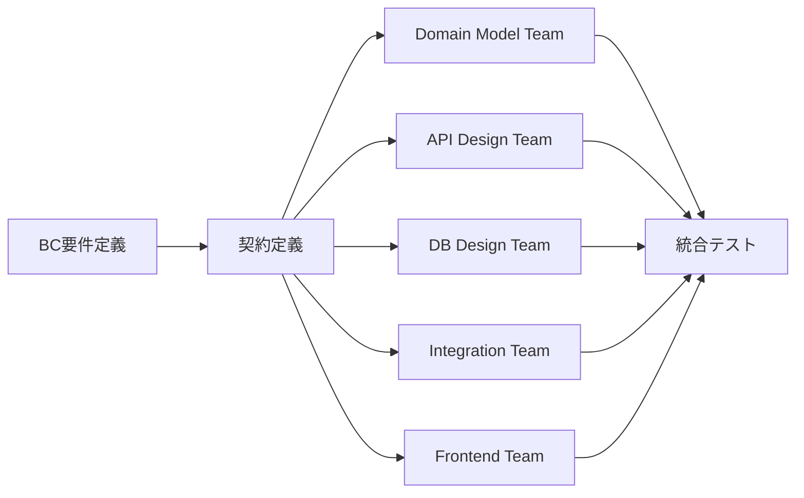

---
bundle:
  name: parasol-bc-modular-design
  version: 1.0.0
  description: Bounded Context modular design patterns for parallel development
  
config:
  bc_design:
    parallel_modules:
      - domain-model
      - api-contract
      - database-schema
      - integration-adapters
      - frontend-ui
      - test-scenarios
      
    module_contracts:
      domain-model:
        inputs: [business-requirements, ubiquitous-language]
        outputs: [entities.yaml, value-objects.yaml, aggregates.yaml]
        
      api-contract:
        inputs: [domain-model, use-cases]
        outputs: [openapi.yaml, graphql-schema.graphql]
        
      database-schema:
        inputs: [domain-model, performance-requirements]
        outputs: [schema.sql, migrations/]
        
      frontend-ui:
        inputs: [api-contract, ux-requirements, design-system]
        outputs: [components/, pages/, state-management/]
        
    parallel_variants:
      api_styles: [rest, graphql, grpc]
      database_types: [postgresql, mongodb, dynamodb]
      event_patterns: [event-sourcing, crud-events, cqrs]
      frontend_frameworks: [react, vue, angular, svelte]
      ui_architectures: [spa, ssr, ssg, pwa]
      state_management: [redux, vuex, mobx, zustand, pinia]
      styling_approaches: [css-modules, styled-components, tailwind, emotion]
---

# BC Modular Design Pattern

Bounded Context内部を並列で設計・実装するためのパターン集です。

## 並列モジュール設計

### 1. BC内部のモジュール分割

```yaml
bounded-context/
├── contracts/           # 各モジュール間の契約
│   ├── domain-to-api.yaml
│   ├── domain-to-db.yaml
│   ├── api-to-integration.yaml
│   └── api-to-frontend.yaml
├── modules/
│   ├── domain/         # ドメインモデル
│   ├── api/            # API設計
│   ├── database/       # DB設計
│   ├── integration/    # 統合アダプター
│   ├── frontend/       # フロントエンドUI
│   └── tests/          # テストシナリオ
└── variants/           # 並列バリエーション
    ├── api-rest/
    ├── api-graphql/
    ├── db-nosql/
    ├── ui-react/
    ├── ui-vue/
    └── ui-angular/
```

### 2. 並列設計ワークフロー



## 実装例: 商品管理BC

### Phase 1: 契約定義

```yaml
# contracts/product-bc-contract.yaml
bc_contract:
  name: ProductManagement
  purpose: 商品情報の一元管理
  
  domain_concepts:
    - Product (商品)
    - Category (カテゴリー)
    - Price (価格)
    - Inventory (在庫)
    
  capabilities:
    - 商品登録・更新
    - カテゴリー管理
    - 価格設定
    - 在庫照会
    
  integration_points:
    inbound:
      - from: OrderManagement
        interface: ProductAvailabilityCheck
      - from: PricingEngine
        interface: PriceUpdate
        
    outbound:
      - to: InventoryManagement
        interface: StockLevelQuery
      - to: NotificationService
        interface: ProductChangeEvent
```

### Phase 2: 並列モジュール開発

#### A. Domain Model Module

```yaml
# modules/domain/product-model.yaml
aggregates:
  Product:
    root: Product
    entities:
      - Product
      - ProductVariant
    value_objects:
      - ProductId
      - SKU
      - Price
      - Dimensions
      
  Category:
    root: Category
    entities:
      - Category
    value_objects:
      - CategoryId
      - CategoryPath
```

#### B. API Contract Module (並列で3つのスタイル)

**REST版**:
```yaml
# modules/api/variants/rest/openapi.yaml
paths:
  /products:
    post:
      operationId: createProduct
    get:
      operationId: listProducts
      
  /products/{productId}:
    get:
      operationId: getProduct
    put:
      operationId: updateProduct
```

**GraphQL版**:
```graphql
# modules/api/variants/graphql/schema.graphql
type Product {
  id: ID!
  name: String!
  variants: [ProductVariant!]!
  category: Category!
}

type Query {
  product(id: ID!): Product
  products(filter: ProductFilter): [Product!]!
}
```

**gRPC版**:
```proto
# modules/api/variants/grpc/product.proto
service ProductService {
  rpc CreateProduct(CreateProductRequest) returns (Product);
  rpc GetProduct(GetProductRequest) returns (Product);
}
```

#### C. Database Schema Module (並列で複数DB)

**PostgreSQL版**:
```sql
-- modules/database/variants/postgresql/schema.sql
CREATE TABLE products (
    id UUID PRIMARY KEY,
    name VARCHAR(255) NOT NULL,
    category_id UUID REFERENCES categories(id),
    created_at TIMESTAMP NOT NULL
);

CREATE TABLE product_variants (
    id UUID PRIMARY KEY,
    product_id UUID REFERENCES products(id),
    sku VARCHAR(100) UNIQUE NOT NULL,
    price DECIMAL(10, 2)
);
```

**MongoDB版**:
```javascript
// modules/database/variants/mongodb/schema.js
db.createCollection("products", {
  validator: {
    $jsonSchema: {
      bsonType: "object",
      required: ["name", "category", "variants"],
      properties: {
        _id: { bsonType: "objectId" },
        name: { bsonType: "string" },
        variants: {
          bsonType: "array",
          items: {
            bsonType: "object",
            required: ["sku", "price"]
          }
        }
      }
    }
  }
});
```

#### D. Frontend UI Module (並列で複数フレームワーク)

**React版**:
```tsx
// modules/frontend/variants/react/components/ProductList.tsx
interface Product {
  id: string;
  name: string;
  price: number;
  category: Category;
  variants: ProductVariant[];
}

const ProductList: React.FC = () => {
  const { data, loading, error } = useQuery(GET_PRODUCTS);
  
  if (loading) return <LoadingSpinner />;
  if (error) return <ErrorMessage error={error} />;
  
  return (
    <Grid container spacing={3}>
      {data.products.map(product => (
        <Grid item key={product.id} xs={12} sm={6} md={4}>
          <ProductCard product={product} />
        </Grid>
      ))}
    </Grid>
  );
};

// State management with Redux Toolkit
const productSlice = createSlice({
  name: 'products',
  initialState,
  reducers: {
    setProducts: (state, action) => {
      state.items = action.payload;
    }
  }
});
```

**Vue版**:
```vue
<!-- modules/frontend/variants/vue/components/ProductList.vue -->
<template>
  <div class="product-list">
    <div v-if="loading" class="loading">
      <LoadingSpinner />
    </div>
    <div v-else-if="error" class="error">
      <ErrorMessage :error="error" />
    </div>
    <div v-else class="grid">
      <ProductCard 
        v-for="product in products" 
        :key="product.id"
        :product="product"
      />
    </div>
  </div>
</template>

<script setup lang="ts">
import { useQuery } from '@vue/apollo-composable'
import { GET_PRODUCTS } from '../graphql/queries'

// Using Pinia for state management
const productStore = useProductStore()
const { result, loading, error } = useQuery(GET_PRODUCTS)

const products = computed(() => result.value?.products || [])
</script>
```

**Angular版**:
```typescript
// modules/frontend/variants/angular/components/product-list.component.ts
@Component({
  selector: 'app-product-list',
  template: `
    <div class="product-grid" *ngIf="products$ | async as products">
      <app-product-card 
        *ngFor="let product of products"
        [product]="product">
      </app-product-card>
    </div>
  `
})
export class ProductListComponent implements OnInit {
  products$: Observable<Product[]>;
  
  constructor(
    private productService: ProductService,
    private store: Store<AppState>
  ) {}
  
  ngOnInit() {
    this.products$ = this.store.select(selectAllProducts);
    this.store.dispatch(ProductActions.loadProducts());
  }
}
```

### Phase 3: バリアント評価と選択

```yaml
# evaluation/comparison-matrix.yaml
evaluation:
  criteria:
    - performance
    - scalability
    - developer_experience
    - maintenance_cost
    - ecosystem_maturity
    - learning_curve
    
  results:
    api_style:
      rest: { score: 8, reason: "広く理解されている" }
      graphql: { score: 9, reason: "フロントエンド効率" }
      grpc: { score: 7, reason: "高性能だが複雑" }
      
    database:
      postgresql: { score: 9, reason: "ACID保証" }
      mongodb: { score: 7, reason: "柔軟だが一貫性課題" }
      
    frontend:
      react: { score: 9, reason: "エコシステム成熟、人材豊富" }
      vue: { score: 8, reason: "学習曲線が緩やか、日本で人気" }
      angular: { score: 7, reason: "エンタープライズ向け、TypeScript完全対応" }
      svelte: { score: 6, reason: "高性能だがエコシステム発展途上" }
      
    ui_architecture:
      spa: { score: 8, reason: "リッチなUI体験" }
      ssr: { score: 9, reason: "SEO対応、初期表示高速" }
      ssg: { score: 7, reason: "静的サイトに最適" }
      pwa: { score: 8, reason: "オフライン対応" }
      
    state_management:
      redux: { score: 8, reason: "予測可能、デバッグ容易" }
      vuex: { score: 8, reason: "Vue公式、シンプル" }
      pinia: { score: 9, reason: "Vue3向け最新設計" }
      zustand: { score: 8, reason: "軽量で使いやすい" }
      
  decision:
    api: graphql
    database: postgresql
    frontend: react
    ui_architecture: ssr
    state_management: zustand
    rationale: "フロントエンドの柔軟性とSEO対応、軽量な状態管理を重視"
```

## CLI統合

```bash
# BC内のモジュールを並列生成（フロントエンド含む）
parasol bc generate ProductManagement \
  --parallel domain,api,database,frontend \
  --variants api:rest,graphql \
             database:postgresql,mongodb \
             frontend:react,vue,angular \
             ui:spa,ssr

# フロントエンドバリアントの個別生成
parasol bc generate-frontend ProductManagement \
  --frameworks react,vue \
  --ui-architectures ssr,spa \
  --state-management redux,zustand,pinia \
  --styling tailwind,styled-components

# 特定モジュールのみ再生成
parasol bc regenerate ProductManagement \
  --module frontend \
  --variant react-ssr-zustand \
  --from-contract contracts/product-bc-contract.yaml

# バリアント比較（フロントエンド含む）
parasol bc compare ProductManagement \
  --variants frontend:all \
  --criteria performance,bundle-size,developer-experience,seo

# フルスタック統合テスト
parasol bc test ProductManagement \
  --integration-test \
  --variants "api:graphql,database:postgresql,frontend:react-ssr"

# E2Eテスト実行
parasol bc test-e2e ProductManagement \
  --frontend react \
  --api graphql \
  --scenarios user-journey,admin-flow
```

## 利点

1. **並列開発**: 複数チームが同時に作業可能
2. **選択肢の探索**: 複数の実装を試して最適解を選択
3. **リスク軽減**: 一つのアプローチに依存しない
4. **学習効果**: 複数アプローチから知見を獲得
5. **再生成可能**: 契約から何度でも生成可能

## 統合パターン

```yaml
# 選択したモジュールの統合
integration:
  selected_variants:
    api: graphql
    database: postgresql
    frontend: react
    ui_architecture: ssr
    state_management: zustand
    
  integration_tests:
    - test: domain_to_api_mapping
      verify: "全てのドメインモデルがAPIで表現可能"
      
    - test: api_to_database_persistence
      verify: "APIの全操作がDBに永続化される"
      
    - test: event_propagation
      verify: "ドメインイベントが統合ポイントに伝播"
      
    - test: frontend_api_integration
      verify: "フロントエンドがAPI全機能を利用可能"
      
    - test: state_synchronization
      verify: "フロントエンド状態とバックエンド状態の一貫性"
      
    - test: ssr_hydration
      verify: "サーバーサイドレンダリングの正常な動作"
```

## フロントエンドバリアント生成例

### React + Next.js (SSR) + GraphQL

```typescript
// variants/frontend/react-ssr/pages/products/index.tsx
import { GetServerSideProps } from 'next';
import { initializeApollo } from '../../lib/apollo';
import { GET_PRODUCTS } from '../../graphql/queries';
import { ProductList } from '../../components/ProductList';

export const getServerSideProps: GetServerSideProps = async () => {
  const apolloClient = initializeApollo();
  
  await apolloClient.query({
    query: GET_PRODUCTS,
  });
  
  return {
    props: {
      initialApolloState: apolloClient.cache.extract(),
    },
  };
};

export default function ProductsPage() {
  return <ProductList />;
}
```

### Vue + Nuxt.js (SSR) + GraphQL

```vue
<!-- variants/frontend/vue-ssr/pages/products/index.vue -->
<template>
  <div class="products-page">
    <ProductList :products="products" />
  </div>
</template>

<script setup lang="ts">
const { $apollo } = useNuxtApp()

// SSRで実行される
const { data } = await $apollo.query({
  query: GET_PRODUCTS,
})

const products = computed(() => data.value?.products || [])
</script>
```

### Angular + Universal (SSR) + REST

```typescript
// variants/frontend/angular-ssr/pages/products/products.component.ts
@Component({
  selector: 'app-products',
  template: `<app-product-list [products]="products$ | async"></app-product-list>`
})
export class ProductsComponent implements OnInit {
  products$: Observable<Product[]>;
  
  constructor(
    private productService: ProductService,
    private transferState: TransferState
  ) {}
  
  ngOnInit() {
    const key = makeStateKey<Product[]>('products');
    
    // SSRで実行される場合
    if (this.transferState.hasKey(key)) {
      this.products$ = of(this.transferState.get(key, []));
    } else {
      this.products$ = this.productService.getProducts()
        .pipe(tap(products => {
          if (isPlatformServer(this.platformId)) {
            this.transferState.set(key, products);
          }
        }));
    }
  }
}
```