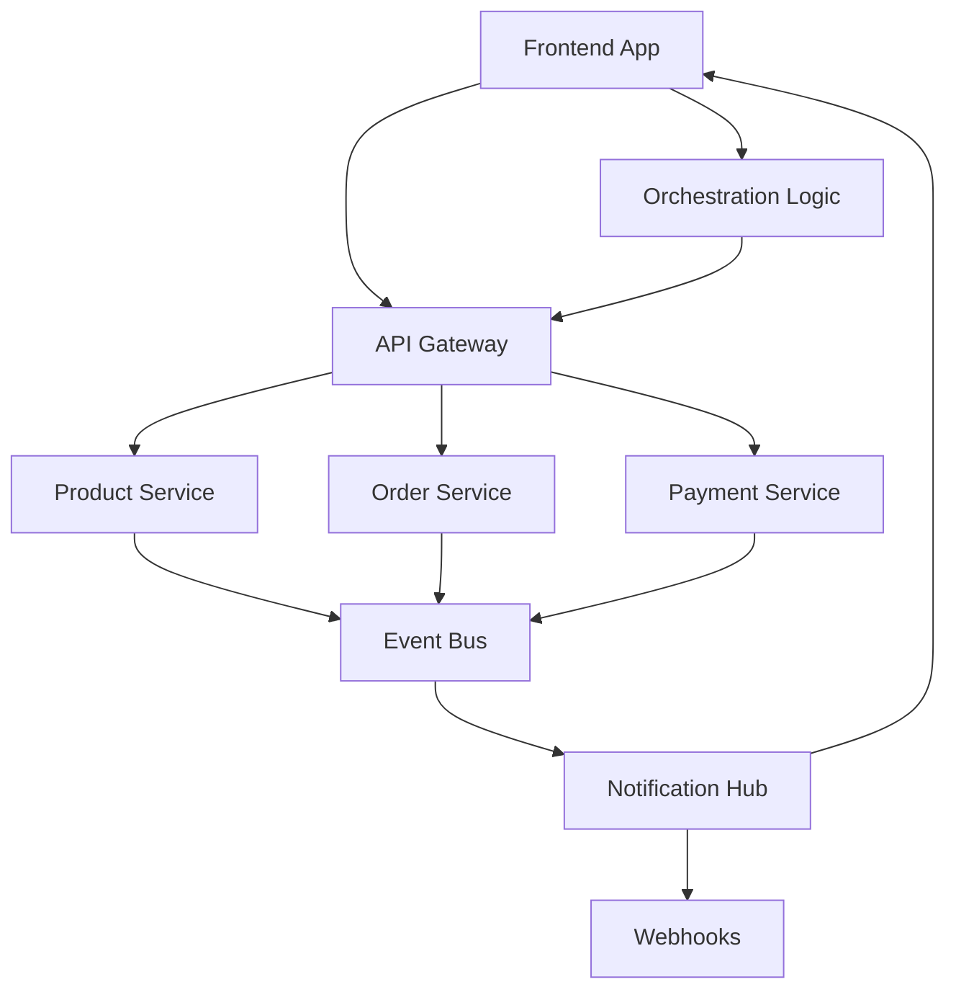

---
bundle:
  name: parasol-v5-event-driven
  version: 1.0.0
  description: Parasol V5 event-driven patterns - lightweight, edge-orchestrated, without event sourcing
  
includes:
  - bundle: ./bc-architecture-patterns.md
  
config:
  v5_principles:
    - lightweight_events
    - frontend_orchestration
    - edge_coordination
    - stateless_backend
    - crud_plus_events
    - no_event_sourcing
---

# Parasol V5 Event-Driven Patterns

Parasol V5の軽量イベント駆動アーキテクチャパターンです。

## V5の基本方針

### ❌ 使用しないパターン
- **Event Sourcing**: 複雑すぎる、オーバーエンジニアリング
- **Event Store**: 追加のインフラ負担
- **Backend SAGA**: サーバーサイドの複雑な状態管理
- **Event Models**: ドメインモデルとの分離による複雑さ

### ✅ 採用するパターン
- **Simple State Changes + Notifications**: CRUDベース＋イベント通知
- **Frontend Orchestration**: フロントエンドでのワークフロー管理
- **Edge Coordination**: エッジでのトランザクション調整
- **Lightweight Events**: 通知のみのシンプルなイベント

## 1. V5 Event-Driven Architecture

### アーキテクチャ概要

```yaml
# V5 Event-Driven Pattern
v5_event_architecture:
  backend:
    role: stateless_services
    pattern: crud_plus_notifications
    
  frontend:
    role: orchestrator
    pattern: workflow_coordination
    
  events:
    purpose: notifications_only
    storage: ephemeral
    
  transactions:
    pattern: optimistic_coordination
    rollback: frontend_driven
```

### システム構成



## 2. Simple State Changes + Notifications

### 従来の重いイベントソーシング
```typescript
// ❌ 複雑なEvent Sourcing
class ProductAggregate {
  private events: DomainEvent[] = [];
  
  changePrice(newPrice: Money): void {
    const event = new ProductPriceChanged(this.id, this.price, newPrice);
    this.apply(event);
    this.events.push(event);
  }
  
  private apply(event: ProductPriceChanged): void {
    this.price = event.newPrice;
    this.version++;
  }
}
```

### V5の軽量アプローチ
```typescript
// ✅ V5: Simple CRUD + Notifications
export class ProductService {
  async updatePrice(productId: string, newPrice: number, userId: string): Promise<Product> {
    // 1. シンプルなCRUD操作
    const product = await this.repository.findById(productId);
    if (!product) throw new ProductNotFoundError();
    
    const oldPrice = product.price;
    product.price = newPrice;
    product.updatedAt = new Date();
    product.updatedBy = userId;
    
    // 2. データベース更新
    await this.repository.save(product);
    
    // 3. 軽量な通知イベント発行（非同期）
    this.eventNotifier.notify({
      type: 'product.price_changed',
      productId: product.id,
      oldPrice,
      newPrice,
      changedBy: userId,
      timestamp: new Date()
    });
    
    return product;
  }
}

// 軽量なイベント通知
interface EventNotification {
  type: string;
  [key: string]: any;
  timestamp: Date;
}

class EventNotifier {
  async notify(event: EventNotification): Promise<void> {
    // 非同期で通知（失敗してもメイン処理に影響しない）
    setImmediate(async () => {
      try {
        await this.eventBus.publish(event);
      } catch (error) {
        console.warn('Event notification failed:', error);
      }
    });
  }
}
```

## 3. Frontend Orchestration at the Edge

### エッジでのワークフロー管理

```typescript
// Frontend での注文処理オーケストレーション
export class OrderOrchestrator {
  async placeOrder(orderData: OrderRequest): Promise<OrderResult> {
    const workflow = new OrderWorkflow();
    
    try {
      // 1. 在庫確認
      const inventoryResult = await workflow.step('check_inventory', async () => {
        return await this.productService.checkAvailability(orderData.items);
      });
      
      if (!inventoryResult.available) {
        return { success: false, reason: 'insufficient_inventory' };
      }
      
      // 2. 支払い処理
      const paymentResult = await workflow.step('process_payment', async () => {
        return await this.paymentService.charge({
          amount: orderData.total,
          paymentMethod: orderData.paymentMethod
        });
      });
      
      if (!paymentResult.success) {
        // 在庫予約を解除
        await workflow.compensate('check_inventory', async () => {
          await this.productService.releaseReservation(orderData.items);
        });
        return { success: false, reason: 'payment_failed' };
      }
      
      // 3. 注文確定
      const orderResult = await workflow.step('create_order', async () => {
        return await this.orderService.create({
          ...orderData,
          paymentId: paymentResult.paymentId
        });
      });
      
      // 4. 完了通知
      this.notificationService.notify('order_placed', {
        orderId: orderResult.id,
        customerId: orderData.customerId
      });
      
      return { success: true, orderId: orderResult.id };
      
    } catch (error) {
      // エラー時の補償処理
      await workflow.compensateAll();
      throw error;
    }
  }
}

// 軽量ワークフローエンジン
class OrderWorkflow {
  private steps: Map<string, () => Promise<void>> = new Map();
  
  async step<T>(name: string, action: () => Promise<T>): Promise<T> {
    const result = await action();
    // 補償アクションを記録
    return result;
  }
  
  async compensate(stepName: string, compensateAction: () => Promise<void>): Promise<void> {
    await compensateAction();
  }
  
  async compensateAll(): Promise<void> {
    // 実行した全ステップの補償を逆順で実行
    for (const [stepName, compensateAction] of Array.from(this.steps.entries()).reverse()) {
      try {
        await compensateAction();
      } catch (error) {
        console.error(`Failed to compensate step ${stepName}:`, error);
      }
    }
  }
}
```

### リアルタイム状態同期

```typescript
// Frontend での状態管理とリアルタイム同期
export class OrderStateManager {
  private state = reactive({
    currentOrder: null,
    status: 'idle',
    error: null
  });
  
  constructor() {
    // SSEでリアルタイム更新を受信
    this.eventSource = new EventSource('/api/events/orders');
    this.eventSource.onmessage = (event) => {
      const notification = JSON.parse(event.data);
      this.handleNotification(notification);
    };
  }
  
  handleNotification(notification: EventNotification): void {
    switch (notification.type) {
      case 'order.status_changed':
        if (this.state.currentOrder?.id === notification.orderId) {
          this.state.currentOrder.status = notification.newStatus;
        }
        break;
        
      case 'inventory.reserved':
        this.updateInventoryStatus(notification.productId, 'reserved');
        break;
        
      case 'payment.processed':
        this.state.status = 'payment_confirmed';
        break;
    }
  }
  
  // 楽観的UI更新
  async updateOrderOptimistically(orderId: string, changes: Partial<Order>): Promise<void> {
    // 1. UI を即座に更新
    if (this.state.currentOrder?.id === orderId) {
      Object.assign(this.state.currentOrder, changes);
    }
    
    try {
      // 2. バックエンドに変更を送信
      await this.orderService.update(orderId, changes);
    } catch (error) {
      // 3. エラー時はロールバック
      this.rollbackOptimisticUpdate(orderId, changes);
      throw error;
    }
  }
}
```

## 4. Lightweight Event Patterns

### イベント通知の設計原則

```typescript
// ✅ V5: 軽量なイベント設計
interface V5Event {
  // 最小限の情報のみ
  type: string;           // 'product.price_changed'
  entityId: string;       // 影響を受けたエンティティのID
  timestamp: Date;        // いつ発生したか
  triggeredBy?: string;   // 誰がトリガーしたか
  metadata?: any;         // 追加のコンテキスト
}

// 具体例
const priceChangedEvent: V5Event = {
  type: 'product.price_changed',
  entityId: 'product_123',
  timestamp: new Date(),
  triggeredBy: 'user_456',
  metadata: {
    oldPrice: 1000,
    newPrice: 1200,
    reason: 'market_adjustment'
  }
};
```

### Backend イベント発行

```typescript
// サービス層でのシンプルなイベント発行
export class ProductService {
  constructor(
    private repository: ProductRepository,
    private eventBus: SimpleEventBus  // 軽量なイベントバス
  ) {}
  
  async updateProduct(id: string, updates: Partial<Product>): Promise<Product> {
    const product = await this.repository.update(id, updates);
    
    // 非同期でイベント通知（メイン処理をブロックしない）
    this.eventBus.emit({
      type: 'product.updated',
      entityId: id,
      timestamp: new Date(),
      metadata: { fields: Object.keys(updates) }
    });
    
    return product;
  }
}

// 軽量なイベントバス実装
class SimpleEventBus {
  private handlers = new Map<string, Array<(event: V5Event) => void>>();
  
  emit(event: V5Event): void {
    // 非同期で処理（メイン処理に影響しない）
    setImmediate(() => {
      const handlers = this.handlers.get(event.type) || [];
      handlers.forEach(handler => {
        try {
          handler(event);
        } catch (error) {
          console.error(`Event handler failed for ${event.type}:`, error);
        }
      });
    });
  }
  
  on(eventType: string, handler: (event: V5Event) => void): void {
    if (!this.handlers.has(eventType)) {
      this.handlers.set(eventType, []);
    }
    this.handlers.get(eventType)!.push(handler);
  }
}
```

## 5. Edge Transaction Patterns

### フロントエンド主導の分散トランザクション

```typescript
// エッジでのトランザクション協調
export class EdgeTransactionCoordinator {
  async executeTransaction<T>(
    transactionDef: TransactionDefinition<T>
  ): Promise<TransactionResult<T>> {
    const context = new TransactionContext();
    
    try {
      // 各ステップを順次実行
      for (const step of transactionDef.steps) {
        const result = await this.executeStep(step, context);
        context.addResult(step.name, result);
      }
      
      // 全て成功したらコミット通知
      await this.notifyCommit(context);
      return { success: true, result: context.getFinalResult() };
      
    } catch (error) {
      // 失敗時は補償処理
      await this.executeCompensation(context);
      return { success: false, error };
    }
  }
  
  private async executeStep(
    step: TransactionStep,
    context: TransactionContext
  ): Promise<any> {
    const result = await step.execute(context);
    
    // 楽観的ロック用のバージョンチェック
    if (step.requiresVersionCheck && result.version !== step.expectedVersion) {
      throw new OptimisticLockError('Resource was modified by another transaction');
    }
    
    return result;
  }
  
  private async executeCompensation(context: TransactionContext): Promise<void> {
    // 実行済みステップの補償を逆順で実行
    const executedSteps = context.getExecutedSteps().reverse();
    
    for (const step of executedSteps) {
      try {
        await step.compensate(context);
      } catch (error) {
        // 補償失敗もログのみ（ベストエフォート）
        console.error('Compensation failed:', error);
      }
    }
  }
}

// 使用例：注文処理
const placeOrderTransaction = {
  steps: [
    {
      name: 'reserve_inventory',
      execute: async (ctx) => await inventoryService.reserve(ctx.orderItems),
      compensate: async (ctx) => await inventoryService.release(ctx.orderItems)
    },
    {
      name: 'charge_payment',
      execute: async (ctx) => await paymentService.charge(ctx.paymentInfo),
      compensate: async (ctx) => await paymentService.refund(ctx.chargeId)
    },
    {
      name: 'create_order',
      execute: async (ctx) => await orderService.create(ctx.orderData),
      compensate: async (ctx) => await orderService.cancel(ctx.orderId)
    }
  ]
};

await edgeCoordinator.executeTransaction(placeOrderTransaction);
```

## 6. CLI Integration for V5

```bash
# V5パターンでのBC生成
parasol bc generate OrderManagement \
  --architecture v5-event-driven \
  --event-style lightweight-notifications \
  --transaction-pattern frontend-orchestration \
  --state-management optimistic-updates

# V5 イベントパターンの生成
parasol generate event-patterns OrderFlow \
  --style v5-lightweight \
  --coordination frontend \
  --no-event-sourcing \
  --no-saga

# エッジオーケストレーション設定
parasol setup orchestration OrderWorkflow \
  --location frontend \
  --compensation-strategy best-effort \
  --state-sync realtime-sse
```

## 7. V5 vs 従来手法の比較

```yaml
comparison:
  complexity:
    traditional_event_sourcing: 
      score: 9/10
      reason: "Event Store, projections, versioning"
    v5_lightweight:
      score: 3/10  
      reason: "Simple CRUD + notifications"
      
  infrastructure:
    traditional:
      requirements: [event_store, projection_db, saga_coordinator]
    v5:
      requirements: [simple_message_bus, sse_endpoint]
      
  development_speed:
    traditional: slow
    v5: fast
    
  debugging:
    traditional: complex
    v5: straightforward
    
  scalability:
    traditional: high_but_complex
    v5: sufficient_and_simple
```

## まとめ

Parasol V5では、実用性と簡単さを重視した軽量なイベント駆動アーキテクチャを採用：

1. **Simple State + Notifications**: 複雑なEvent Sourcingを避け、CRUD＋通知
2. **Frontend Orchestration**: サーバーサイドSAGAではなく、エッジでのワークフロー管理
3. **Lightweight Events**: 通知目的のみのシンプルなイベント
4. **Optimistic Coordination**: 楽観的ロックと補償ベースのトランザクション
5. **Real-time Updates**: SSEによるリアルタイム状態同期

これにより、エンタープライズでも運用しやすく、開発速度が速い実用的なアーキテクチャを実現します。