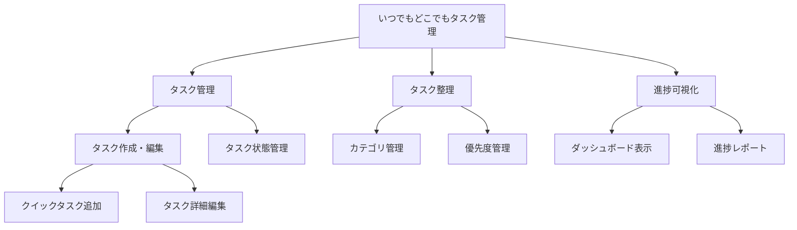

# TODOアプリのケイパビリティ分解例

シンプルなTODOアプリを例に、Parasol V5のケイパビリティ分解を実践します。

## 1. ビジネス価値の定義（Phase 2）

```yaml
business_value:
  VS-001:
    name: "いつでもどこでもタスク管理"
    description: "ユーザーが場所や時間を問わずタスクを管理でき、生産性を向上させる"
    target_metrics:
      - タスク完了率を30%向上
      - タスク忘れを80%削減
      - 平均タスク完了時間を20%短縮
```

## 2. ZIGZAG分解パターンの適用（Phase 3）

### CL1: Activity Areas（活動領域）

```yaml
activity_areas:
  AA-001:
    name: "タスク管理"
    description: "タスクの作成、編集、削除、完了管理"
    
  AA-002:
    name: "タスク整理"
    description: "タスクの分類、優先順位付け、検索"
    
  AA-003:
    name: "進捗可視化"
    description: "タスクの状態表示、統計情報の提供"
```

### CL2: Business Capabilities（ビジネスケイパビリティ）

```yaml
capabilities:
  # タスク管理から展開
  BC-001:
    name: "タスク作成・編集"
    parent: AA-001
    description: "新しいタスクを素早く作成し、必要に応じて編集"
    maturity:
      current: 1  # 手動入力のみ
      target: 3   # テンプレート、音声入力対応
      
  BC-002:
    name: "タスク状態管理"
    parent: AA-001
    description: "タスクの進行状態を追跡"
    maturity:
      current: 2  # 基本的な完了/未完了
      target: 4   # 詳細なステータス、自動遷移
      
  # タスク整理から展開
  BC-003:
    name: "カテゴリ管理"
    parent: AA-002
    description: "タスクを論理的にグループ化"
    maturity:
      current: 1  # 単一カテゴリ
      target: 3   # 階層カテゴリ、タグ併用
      
  BC-004:
    name: "優先度管理"
    parent: AA-002
    description: "重要度と緊急度に基づく優先順位付け"
    maturity:
      current: 1  # なし
      target: 4   # AIによる自動優先度提案
      
  # 進捗可視化から展開
  BC-005:
    name: "ダッシュボード表示"
    parent: AA-003
    description: "タスクの全体像を一目で把握"
    maturity:
      current: 1  # リスト表示のみ
      target: 3   # グラフ、カレンダー表示
      
  BC-006:
    name: "進捗レポート"
    parent: AA-003
    description: "達成状況の分析とレポート"
    maturity:
      current: 1  # なし
      target: 3   # 週次/月次レポート自動生成
```

### CL3: Sub-capability + BO（詳細能力 + 業務オペレーション対応）

```yaml
operations:
  # BC-001: タスク作成・編集
  BO-001:
    name: "クイックタスク追加"
    capability: BC-001
    sla: "<1秒でタスク作成"
    automation: "semi-auto"  # テンプレート利用
    
  BO-002:
    name: "タスク詳細編集"
    capability: BC-001
    sla: "全項目編集可能"
    automation: "manual"
    
  # BC-002: タスク状態管理
  BO-003:
    name: "ステータス更新"
    capability: BC-002
    sla: "即座に反映"
    automation: "full-auto"  # ワンクリック
    
  BO-004:
    name: "完了タスクアーカイブ"
    capability: BC-002
    sla: "30日後自動アーカイブ"
    automation: "full-auto"
    
  # BC-003: カテゴリ管理
  BO-005:
    name: "カテゴリ作成"
    capability: BC-003
    sla: "階層制限なし"
    automation: "manual"
    
  BO-006:
    name: "カテゴリ別フィルタ"
    capability: BC-003
    sla: "<100ms応答"
    automation: "full-auto"
```

## 3. サービス設計（Phase 4-5）

### V5軽量実装パターン

```typescript
// BC-001: タスク作成・編集 → TaskManagementService
export class TaskManagementService {
  // シンプルなCRUD操作
  async createTask(title: string, userId: string): Promise<Task> {
    const task = {
      id: generateId(),
      title,
      status: 'todo',
      createdBy: userId,
      createdAt: new Date()
    };
    
    // データベースに保存
    await this.repository.save(task);
    
    // V5: 軽量通知（イベントソーシングなし）
    this.notifier.notify({
      type: 'task.created',
      taskId: task.id,
      userId,
      timestamp: new Date()
    });
    
    return task;
  }
  
  async updateTaskStatus(taskId: string, status: TaskStatus): Promise<void> {
    await this.repository.update(taskId, { status });
    
    // 完了時の通知
    if (status === 'done') {
      this.notifier.notify({
        type: 'task.completed',
        taskId,
        timestamp: new Date()
      });
    }
  }
}
```

### フロントエンドオーケストレーション（V5スタイル）

```typescript
// Frontend でのタスク操作オーケストレーション
export class TaskOrchestrator {
  async createTaskWithCategory(data: CreateTaskRequest): Promise<TaskResult> {
    // 1. カテゴリ存在確認（楽観的）
    const category = await this.categoryService.findOrCreate(data.category);
    
    // 2. タスク作成
    const task = await this.taskService.create({
      title: data.title,
      categoryId: category.id,
      priority: data.priority || 'medium'
    });
    
    // 3. UIの即座更新（楽観的更新）
    this.uiState.addTask(task);
    
    // 4. 必要に応じてダッシュボード更新
    if (data.priority === 'high') {
      this.dashboardService.refreshHighPrioritySection();
    }
    
    return { success: true, task };
  }
}
```

## 4. 成熟度ロードマップ

```yaml
maturity_roadmap:
  phase_1: "基本機能（3ヶ月）"
    - BC-001: Level 1 → 2（基本的なCRUD）
    - BC-002: Level 2 → 3（状態管理の標準化）
    - BC-005: Level 1 → 2（基本的なリスト表示）
    
  phase_2: "使いやすさ向上（3ヶ月）"
    - BC-003: Level 1 → 3（階層カテゴリ実装）
    - BC-004: Level 1 → 2（手動優先度設定）
    - BC-005: Level 2 → 3（ビジュアル表示追加）
    
  phase_3: "自動化・最適化（6ヶ月）"
    - BC-001: Level 2 → 3（テンプレート、音声入力）
    - BC-004: Level 2 → 4（AI優先度提案）
    - BC-006: Level 1 → 3（自動レポート生成）
```

## 5. 実装例：CLIで実行

```bash
# 1. ケイパビリティ分解の開始
capability-map decompose --value-stream "いつでもどこでもタスク管理"

# 対話形式で入力：
# CL1: 活動領域
# - タスク管理
# - タスク整理  
# - 進捗可視化

# CL2: ケイパビリティ（各活動領域ごと）
# - タスク作成・編集（現在:1, 目標:3）
# - タスク状態管理（現在:2, 目標:4）
# ...

# 2. 可視化
capability-map visualize --format mermaid
```

出力されるMermaidダイアグラム：



## 6. 価値トレーサビリティ

```yaml
traceability:
  # 価値 → ケイパビリティ
  "タスク完了率30%向上":
    required_capabilities:
      - BC-002: "状態管理で進捗を正確に追跡"
      - BC-004: "優先度管理で重要タスクにフォーカス"
      - BC-006: "レポートで改善点を可視化"
      
  # ケイパビリティ → 実装
  BC-001:
    services:
      - TaskManagementService
    frontend_components:
      - TaskCreationForm
      - QuickAddButton
    database_tables:
      - tasks
      
  # 実装 → メトリクス
  TaskManagementService:
    metrics:
      - task_creation_time
      - daily_active_tasks
      - completion_rate
```

## まとめ

このTODOアプリの例では：

1. **明確な価値定義**：「いつでもどこでもタスク管理」から開始
2. **段階的分解**：ZIGZAG パターンで価値→活動→能力→操作へ
3. **成熟度設定**：現実的な現状と目標を設定
4. **V5実装**：シンプルなCRUD + 軽量通知
5. **トレーサビリティ**：価値から実装まで追跡可能

小さなアプリでも、この体系的アプローチにより：
- 開発の優先順位が明確になる
- 段階的な機能拡張が計画できる
- ビジネス価値と技術実装が紐づく