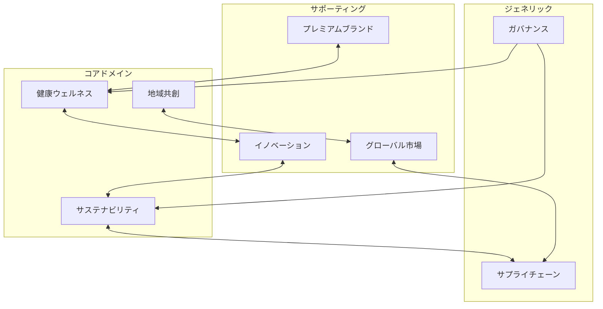

# Phase 3-1: 境界づけられたコンテキスト設計

## 実行コンテキスト

このドキュメントは、アサヒグループのドメイン駆動設計における境界づけられたコンテキスト（Bounded Contexts）を定義するための実行可能なMarkdownです。

### 前提条件
- Phase 2の能力設計（L1/L2/L3）が完了していること
- ビジネス価値とKPIが定義されていること
- 主要なステークホルダーが識別されていること

### 実行方法
```bash
/ddd:1-plan parasol/phases/phase3-domain/3-1-bounded-contexts.md
```

---

## 入力：能力設計からの要求

### 主要なビジネス能力領域
1. **価値創造領域**: 持続可能性、健康・ウェルネス
2. **市場開拓領域**: グローバル展開、プレミアム化
3. **イノベーション領域**: オープンイノベーション、デジタル変革
4. **基盤領域**: サプライチェーン、ガバナンス

### ユビキタス言語の候補
- ワクワク創造指数（WCI）
- サステナビリティスコア
- 顧客体験価値
- イノベーションパイプライン

---

## タスク：境界コンテキストの定義

### 実行ステップ

#### Step 1: ドメインの識別と分割

主要なビジネスドメインを識別し、適切な境界を設定します。

```
ドメイン分割マップ
==========================================

【コアドメイン】
1. 価値創造ドメイン
   - サステナビリティコンテキスト
   - 健康ウェルネスコンテキスト
   - 地域共創コンテキスト

【サポーティングドメイン】
2. 市場展開ドメイン
   - グローバル市場コンテキスト
   - プレミアムブランドコンテキスト
   - カテゴリー創造コンテキスト

3. イノベーションドメイン
   - R&Dコンテキスト
   - パートナーシップコンテキスト
   - デジタルプラットフォームコンテキスト

【ジェネリックドメイン】
4. 基盤ドメイン
   - サプライチェーンコンテキスト
   - ガバナンスコンテキスト
   - 人材管理コンテキスト
```

#### Step 2: 各コンテキストの詳細定義

##### BC-001: サステナビリティコンテキスト
```yaml
種別: コアドメイン
目的: 環境価値の創造と管理
責任:
  - CO2排出量の管理
  - 循環型経済の推進
  - 水資源の保全
主要概念:
  - カーボンフットプリント
  - リサイクル率
  - 環境インパクト
境界:
  内部:
    - 排出量計算ロジック
    - 削減施策管理
    - 環境レポーティング
  外部インターフェース:
    - 生産システムとの連携
    - サプライヤーデータ取得
    - 規制報告API
```

##### BC-002: 健康ウェルネスコンテキスト
```yaml
種別: コアドメイン
目的: 消費者の健康価値創造
責任:
  - 機能性商品開発
  - 栄養価値管理
  - 健康データ分析
主要概念:
  - 健康スコア
  - 栄養プロファイル
  - ウェルネスプログラム
境界:
  内部:
    - 商品開発パイプライン
    - 臨床試験管理
    - 健康効果測定
  外部インターフェース:
    - R&Dシステム連携
    - 消費者アプリAPI
    - 医療機関データ連携
```

##### BC-003: グローバル市場コンテキスト
```yaml
種別: サポーティングドメイン
目的: 海外市場での価値提供
責任:
  - 市場分析・参入戦略
  - ローカライゼーション
  - 現地パートナー管理
主要概念:
  - 市場セグメント
  - ローカル適応度
  - 市場シェア
境界:
  内部:
    - 市場調査システム
    - 価格戦略エンジン
    - 流通チャネル管理
  外部インターフェース:
    - グローバルSCM
    - 現地規制DB
    - パートナーAPI
```

#### Step 3: コンテキストマップの作成



#### Step 4: 統合パターンの定義

| From Context | To Context | 統合パターン | 方式 |
|--------------|------------|--------------|------|
| サステナビリティ | サプライチェーン | 顧客-供給者 | REST API |
| 健康ウェルネス | イノベーション | パートナーシップ | イベント駆動 |
| グローバル市場 | プレミアムブランド | 共有カーネル | 共通DB |
| ガバナンス | 全コンテキスト | 公開ホストサービス | API Gateway |

#### Step 5: ユビキタス言語の定義

```yaml
サステナビリティコンテキスト:
  カーボンフットプリント: "製品ライフサイクル全体のCO2排出量"
  循環率: "リサイクル素材使用率と回収率の総合指標"
  環境価値: "環境負荷削減による社会的価値"

健康ウェルネスコンテキスト:
  健康スコア: "個人の健康状態を表す総合指標"
  機能性価値: "科学的根拠に基づく健康効果"
  ウェルネスジャーニー: "顧客の健康改善プロセス"

グローバル市場コンテキスト:
  ローカルフィット: "現地市場への適合度"
  市場浸透率: "対象市場でのブランド認知と購買率"
  グローカル戦略: "グローバル戦略とローカル適応の融合"
```

---

## 出力：境界コンテキスト定義書

### 生成する成果物
1. 境界コンテキストカタログ（全コンテキストの詳細）
2. コンテキストマップ（関係性の可視化）
3. 統合パターン定義書
4. ユビキタス言語辞書
5. チーム編成提案

### 保存先
```
projects/asahi-parasol-development/
└── phase3-domain-modeling/
    ├── bounded-contexts.md
    ├── context-map.png
    └── ubiquitous-language.md
```

---

## 検証項目

- [ ] 各コンテキストの境界が明確か
- [ ] コンテキスト間の依存関係が適切か
- [ ] ユビキタス言語が統一されているか
- [ ] 統合パターンが実装可能か
- [ ] チーム編成が現実的か

---

## 次のステップ

この境界コンテキスト定義が承認されたら：

```bash
# エンティティとアグリゲートの設計へ進む
/ddd:1-plan parasol/phases/phase3-domain/3-2-entities-aggregates.md
```

---

## 参考情報

- [能力設計書](../../projects/asahi-parasol-development/phase2-capability-design/)
- [価値定義書](../../projects/asahi-parasol-development/phase1-value-analysis/)
- [DDDリファレンス](https://domainlanguage.com/ddd/reference/)

---

*このドキュメントは実行可能なMDとして、AmplifierのDDDワークフローで処理できます。*