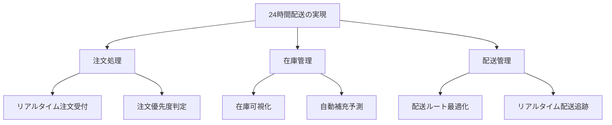

# Capability Mapper Module

Parasol V5 Phase 3のケイパビリティ分解を支援するCLIツール。

## 概要

価値ストリーム（Value Stream）からケイパビリティへの体系的な分解と、ケイパビリティからサービスへのマッピングを自動化します。

### 主な機能

- **ZIGZAG分解**: VS → CL1 → CL2 → CL3 → BC実装への段階的分解
- **成熟度評価**: 現状と目標のギャップ分析
- **依存関係分析**: ケイパビリティ間の関係性可視化
- **サービス生成**: ケイパビリティからサービス契約を自動生成

## インストール

```bash
cd modules/capability-mapper
uv pip install -e .
```

## 使用方法

### 1. 価値ストリームからの分解

```bash
capability-map decompose --value-stream "24時間配送の実現"
```

対話形式で以下を定義：
- CL1: Activity Areas (活動領域)
- CL2: Business Capabilities (ビジネスケイパビリティ) 
- CL3: Business Operations (ビジネスオペレーション)

### 2. ケイパビリティマップの可視化

```bash
capability-map visualize --format mermaid
```

出力例：


### 3. 成熟度評価

```bash
capability-map assess --capability BC-003
```

評価基準：
- Level 1: 初期（場当たり的）
- Level 2: 管理（基本プロセス）
- Level 3: 確立（標準化）
- Level 4: 予測可能（測定・制御）
- Level 5: 最適化（継続改善）

### 4. サービス契約生成

```bash
capability-map to-service BC-003 --pattern entity-service
```

生成される契約：
```yaml
service:
  name: InventoryVisibilityService
  capability: BC-003
  pattern: entity-service
  
  operations:
    - getInventoryStatus
    - updateInventoryLevel
    - subscribeToInventoryChanges
    
  sla:
    availability: 99.9%
    response_time: <100ms
    
  events:
    - inventory.updated
    - inventory.low_stock
```

## 統合機能

### 依存関係分析

```bash
capability-map analyze-dependencies
```

検出される依存タイプ：
- データ依存
- プロセス依存
- イベント依存

### バッチ処理

```bash
# 複数の価値ストリームを一括処理
capability-map batch process --input values.yaml
```

### エクスポート

```bash
# 様々な形式でエクスポート
capability-map export --format json
capability-map export --format yaml
capability-map export --format graphml
```

## 出力形式

### YAML形式

```yaml
capability_map:
  value_stream:
    id: VS-001
    name: 24時間配送の実現
    
  activity_areas:
    - id: AA-001
      name: 注文処理
      capabilities: [BC-001, BC-002]
      
  capabilities:
    - id: BC-001
      name: リアルタイム注文受付
      maturity:
        current: 2
        target: 4
      operations:
        - BO-001: 注文データ取り込み
        - BO-002: 注文検証処理
```

### JSON形式

```json
{
  "capabilities": [
    {
      "id": "BC-001",
      "name": "リアルタイム注文受付",
      "maturity": {
        "current": 2,
        "target": 4
      },
      "dependencies": ["BC-003", "BC-004"]
    }
  ]
}
```

## Parasol CLIとの連携

```bash
# Parasolから直接実行
parasol capability decompose VS-001
parasol capability assess --all
parasol capability to-service --all --dry-run
```

## 高度な使用法

### カスタムパターン定義

```yaml
# patterns/custom-pattern.yaml
pattern:
  name: microservice-pattern
  rules:
    - one_capability_per_service
    - event_driven_communication
    - autonomous_deployment
```

### 成熟度ロードマップ

```bash
# 成熟度向上計画を生成
capability-map roadmap --from current --to target --quarters 4
```

出力：
- Q1: Level 2 → Level 3 の改善項目
- Q2: Level 3 → Level 4 の改善項目
- Q3-Q4: Level 4 の定着と最適化

## ライセンス

MIT License