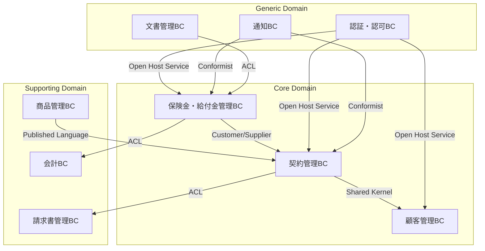

# Phase 4: 明治安田生命保険のアプリケーションアーキテクチャ設計

## 1. Bounded Context（BC）の識別とマッピング

### 1.1 Core領域のBounded Context設計

#### 契約管理BC (Contract Management BC)
```yaml
契約管理BC:
  責務:
    - 保険契約のライフサイクル管理
    - 契約条件の管理と検証
    - 契約変更処理
  主要集約:
    - Contract (契約)
    - PolicyHolder (契約者)
    - Coverage (保障内容)
  公開API:
    - 契約照会
    - 契約変更申請
    - 契約状態管理
```

#### 保険金・給付金管理BC (Claims & Benefits BC)
```yaml
保険金・給付金管理BC:
  責務:
    - 保険金請求の受付と審査
    - 給付金計算と支払い
    - 医療診断書の管理
  主要集約:
    - Claim (保険金請求)
    - Benefit (給付金)
    - MedicalDocument (医療診断書)
  公開API:
    - 請求申請
    - 審査状態照会
    - 支払い実行
```

#### 顧客管理BC (Customer Management BC)
```yaml
顧客管理BC:
  責務:
    - 顧客情報の統合管理
    - 顧客接点の履歴管理
    - 顧客価値分析
  主要集約:
    - Customer (顧客)
    - CustomerProfile (顧客プロファイル)
    - InteractionHistory (接触履歴)
  公開API:
    - 顧客情報照会
    - 顧客履歴取得
    - 顧客セグメント分析
```

### 1.2 Context Map（コンテキストマップ）



### 1.3 統合パターンの選定

#### パターン選定基準
1. **Customer/Supplier**: 上流・下流の関係が明確で、下流が上流に要求を出せる
2. **Shared Kernel**: 密結合が許容され、同一チームで管理
3. **Published Language**: 業界標準や社内標準の用語・プロトコル使用
4. **Anti-Corruption Layer (ACL)**: レガシーシステムとの統合時に使用
5. **Open Host Service**: 汎用的なサービスとして公開
6. **Conformist**: 下流が上流の仕様に完全に従う

## 2. マイクロサービス抽出戦略

### 2.1 段階的移行アプローチ

#### Phase 1: Strangler Fig Pattern適用（6ヶ月）
```yaml
対象機能:
  - 顧客ポータルの照会機能
  - モバイルアプリAPI
  
実装方針:
  - APIゲートウェイでルーティング制御
  - 新規機能から順次マイクロサービス化
  - レガシーシステムは読み取り専用に移行
```

#### Phase 2: Core BCの抽出（12ヶ月）
```yaml
優先順位:
  1. 顧客管理BC
     - 顧客データの統合が最優先
     - 全チャネルからアクセスされる
  
  2. 契約管理BC
     - ビジネスロジックが複雑
     - 変更頻度が高い
  
  3. 保険金・給付金管理BC
     - 規制対応が頻繁
     - 外部連携が多い
```

#### Phase 3: Supporting/Generic BCの移行（18ヶ月）
```yaml
移行対象:
  - 商品管理BC（新商品開発の柔軟性向上）
  - 通知BC（マルチチャネル対応）
  - 認証・認可BC（セキュリティ強化）
```

### 2.2 サービス分割の具体例

#### 契約管理サービスの分割
```yaml
契約管理API Service:
  責務: 外部向けAPI提供
  技術: Spring Boot + GraphQL
  
契約ドメインService:
  責務: ビジネスロジック実装
  技術: Spring Boot + DDD
  
契約データService:
  責務: データ永続化とイベント発行
  技術: Spring Boot + Event Sourcing
```

### 2.3 データ移行戦略

#### Event Sourcingによる段階的移行
```yaml
Step 1: Dual Write
  - レガシーDBとイベントストアに二重書き込み
  - 3ヶ月間の並行稼働で整合性確認
  
Step 2: Event First
  - イベントストアをマスターに切り替え
  - レガシーDBは非同期で更新
  
Step 3: Legacy Retirement
  - レガシーDBへの書き込み停止
  - 読み取り専用として段階的廃止
```

## 3. 技術アーキテクチャ

### 3.1 API Gateway構成
```yaml
Kong Gateway:
  機能:
    - ルーティング
    - 認証・認可
    - Rate Limiting
    - Request/Response変換
  
  ルーティング例:
    /api/v1/contracts/* → 契約管理Service
    /api/v1/claims/* → 保険金管理Service
    /api/v1/customers/* → 顧客管理Service
    /legacy/* → レガシーシステム
```

### 3.2 サービスメッシュ
```yaml
Istio導入:
  機能:
    - サービス間通信の暗号化
    - トラフィック管理
    - 分散トレーシング
    - Circuit Breaker
  
  段階的導入:
    Phase 1: 監視機能のみ
    Phase 2: トラフィック管理
    Phase 3: セキュリティポリシー適用
```

### 3.3 イベント駆動アーキテクチャ
```yaml
Apache Kafka:
  トピック設計:
    contract.events: 契約関連イベント
    claim.events: 保険金請求イベント
    customer.events: 顧客関連イベント
  
  イベント例:
    - ContractCreated
    - ClaimSubmitted
    - CustomerProfileUpdated
```

## 4. セキュリティアーキテクチャ

### 4.1 Zero Trust Security Model
```yaml
原則:
  - 全ての通信を検証
  - 最小権限の原則
  - 継続的な監視
  
実装:
  - mTLS for service-to-service
  - OAuth 2.0 + OpenID Connect
  - API Key管理
  - WAF導入
```

### 4.2 データ保護
```yaml
保存時:
  - AES-256暗号化
  - 暗号化キーの定期ローテーション
  
転送時:
  - TLS 1.3
  - 証明書のピンニング
  
アクセス制御:
  - Attribute-Based Access Control (ABAC)
  - データマスキング
```

## 5. 移行リスクと対策

### 5.1 技術的リスク
```yaml
データ整合性:
  リスク: 二重管理期間中の不整合
  対策: 
    - Saga patternによる分散トランザクション
    - 定期的な整合性チェックバッチ
    
性能劣化:
  リスク: サービス間通信によるレイテンシ増加
  対策:
    - キャッシング戦略（Redis）
    - 非同期通信の活用
    
障害伝播:
  リスク: 一部障害の全体波及
  対策:
    - Circuit Breaker pattern
    - Bulkhead pattern
```

### 5.2 組織的リスク
```yaml
スキル不足:
  リスク: マイクロサービスの運用経験不足
  対策:
    - 段階的な教育プログラム
    - 外部専門家の活用
    - パイロットチームの成功事例展開
    
サイロ化:
  リスク: サービス毎の縦割り
  対策:
    - プラットフォームチームの設置
    - InnerSource活動の推進
    - 定期的なアーキテクチャレビュー
```

## 6. 成功指標（KPI）

```yaml
技術指標:
  - API応答時間: < 200ms (95%ile)
  - 可用性: 99.95%以上
  - デプロイ頻度: 週次以上
  - MTTR: < 30分
  
ビジネス指標:
  - 新商品投入期間: 50%短縮
  - 顧客満足度: 10%向上
  - 運用コスト: 20%削減
  - 規制対応期間: 70%短縮
```