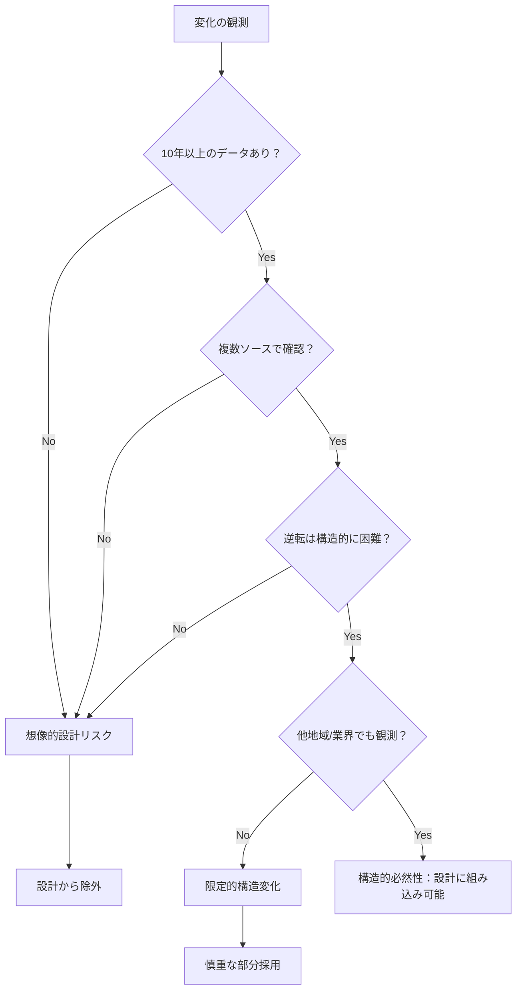

# Parasol V5 哲学

**価値駆動型開発における本質的思考の原則**

---

## 核心哲学：構造的必然性 vs 想像的設計

Parasolの基盤哲学は、**構造的現実に基づく設計と想像的願望に基づく設計の明確な区別**にあります。

### 構造的必然性（Structural Inevitability）

**定義**: 観測可能な構造的変化に基づく、不可逆的な現実への適応設計

**特徴**:
- 長期データによる裏付けがある
- 人口動態、技術進歩、文化変容など測定可能な変化
- 逆行困難または不可能
- 時間軸が明確（すでに進行中、または明確な根拠がある）

**例**:
```
✅ 日本の人口減少（統計データ確実）
✅ 若年層の飲酒習慣減少（長期トレンド確認済み）
✅ AI技術の段階的置換（現在進行形で観測可能）
✅ リモートワークの普及（コロナ後の構造変化）
```

### 想像的設計（Imaginary Design）

**定義**: 根拠のない未来予測や願望的思考に基づく設計

**特徴**:
- 希望的観測に基づく
- 「もしかしたら」「きっと」「たぶん」が多い
- データ裏付けなし、または短期的な変動を過大評価
- 逆転可能性が高い

**例**:
```
❌ 「Web3が必ず普及する」（願望的観測）
❌ 「ミレニアル世代は価値観が全く違う」（世代論的ステレオタイプ）
❌ 「リモートワークで全社員が生産性向上」（一部事例の過剰一般化）
❌ 「デジタルネイティブは全員プログラミングできる」（世代神話）
```

### 判定フレームワーク

変化を設計に取り込む前に、以下の4つの基準で評価：

| 基準 | 構造的必然性 | 想像的設計 |
|------|-------------|-----------|
| **データ基盤** | 10年以上の継続データ | 短期トレンドまたは根拠なし |
| **可逆性** | 構造的に困難 | 政策・流行で簡単に変わる |
| **普遍性** | 複数地域・業界で同現象 | 特定領域での限定的事象 |
| **時間軸** | 既に進行中、または明確根拠 | 「いずれそうなるかも」レベル |

---

## ZIGZAGプロセスにおける哲学の適用

### Phase 2 (Value): 構造的現実への価値適応

**WHAT (価値定義)**: 
- 構造的変化による顧客価値の変容を特定
- 想像的トレンドではなく、観測可能な構造変化に焦点

**HOW (Value Stream)**:
- 構造的必然性に対応する具体的業務フローの設計
- 「未来予測」ではなく「現在進行形の構造変化」への対応

**適用例**:
```
構造的必然性: 日本の労働人口減少
↓
価値定義: 人手不足下での業務効率化価値
↓
Value Stream: 自動化・省人化を前提とした業務フロー
```

### Phase 3 (Capabilities): 現実制約下でのケイパビリティ設計

**CL1 (活動領域)**:
- Core/Supporting/Generic分類を構造的制約下で実施
- 「理想状態」ではなく「制約受容状態」での戦略判断

**CL2 (ケイパビリティ)**:
- 構造的変化に耐性のあるケイパビリティ境界
- 想像的拡張ではなく、現実的運用可能範囲

**CL3 (業務OP)**:
- 現在の人材・技術制約下で実行可能なオペレーション
- 「将来的にはこうしたい」ではなく「現在これができる」

### Business Nine Dimensionsとの統合

**Depth（深度）**: 構造的変化の根深さ評価
- Level 1: 表層トレンド（想像的設計リスク高）
- Level 2-3: 中層構造変化（一部構造的必然性あり）
- Level 4-5: 深層構造変化（構造的必然性高）

**Foundation（基盤）**: 不変性・恒久性評価
- 技術基盤: ムーアの法則など長期観測済み変化
- 社会基盤: 人口動態など人口統計学的現実
- 経済基盤: 生産性向上圧力など経済学的法則

---

## 実践的判定基準

### 設計判断時の質問フレームワーク

**1. エビデンス検証**
```
Q: この変化を示すデータは何年分あるか？
   A: 10年以上 → 構造的可能性
   A: 5年未満 → 想像的リスク

Q: この変化は複数の独立したソースで確認されているか？
   A: Yes（政府統計、業界調査、学術研究等）→ 信頼性高
   A: No（単一レポート、企業発表のみ）→ 検証要
```

**2. 可逆性評価**
```
Q: この変化を元に戻すのにどの程度のコストがかかるか？
   A: 個人の努力では不可能 → 構造的
   A: 政策変更で容易に変わる → 想像的

Q: 反対する強力な利害関係者は存在するか？
   A: No（抵抗勢力なし）→ 継続可能性高
   A: Yes（強力な既得権益）→ 逆転可能性
```

**3. 普遍性確認**
```
Q: 同様の変化が他の地域・業界でも観測されているか？
   A: Yes（グローバルまたは業界横断的）→ 構造的
   A: No（特定地域・業界のみ）→ 限定的

Q: この変化を説明する理論的背景はあるか？
   A: Yes（経済学、社会学等の理論で説明可能）→ 予測可能
   A: No（偶発的、説明困難）→ 一時的可能性
```

### 判定プロセス



---

## 各フェーズでの適用ガイドライン

### Phase 1 (Context): 現実制約の正確な把握

**組織分析**:
- 理想組織論ではなく、現在の組織能力の正確な評価
- 「変われるはず」ではなく「現在できること」の洗い出し

**市場評価**:
- 「成長市場」の楽観的予測ではなく、構造的制約要因の特定
- 人口動態、規制環境、技術制約の現実的評価

### Phase 2 (Value): 制約受容的価値定義

**価値の現実性確認**:
```
❌ 「デジタル変革で全ての業務が効率化される」
✅ 「特定業務において、現在技術で実現可能な効率化」

❌ 「AI導入で人件費が大幅削減される」  
✅ 「現在のAI技術で代替可能な業務範囲での最適化」
```

**Value Stream設計**:
- 理想業務フローではなく、現在のスキル・システム制約下で実行可能なフロー
- 段階的移行を前提とした現実的ステップ設計

### Phase 3 (Capabilities): 実行可能性重視のケイパビリティ

**CL1での現実性確保**:
- Core/Supporting/Generic分類を現在の組織能力で実行
- 「将来的にCoreにしたい」ではなく「現在Coreにできる」で判定

**CL2での境界設定**:
- チーム境界を現在の人材スキル・組織文化を考慮して設定
- 理想的チーム構成ではなく、現実的チーム運用可能範囲

**CL3での業務オペレーション**:
- 現在のプロセス成熟度で実行可能なオペレーション設計
- 「ベストプラクティス」の理論適用ではなく、現状からの漸進的改善

### Phase 4-7: 制約下での最適解追求

技術設計・実装フェーズでは、前フェーズで確定した現実制約内での最適解を追求。

**技術選択基準**:
- 最新技術追求ではなく、組織の技術習得能力・保守能力内での最適選択
- 「業界標準」ではなく「組織適合」を優先

**実装計画**:
- 理想アーキテクチャではなく、現在のチーム能力で保守可能なアーキテクチャ
- 段階的移行計画で、各段階が現実的に実行可能

---

## 事例：構造的必然性の正しい適用

### Case 1: 人口減少社会への適応

**構造的必然性の認識**:
```
観測事実: 日本の生産年齢人口は2050年まで継続減少
データ: 国勢調査、人口推計（50年以上の継続データ）
可逆性: 出生率劇的改善でも20年後まで影響なし
普遍性: 先進国共通現象、経済学理論で説明可能
```

**Value定義への反映**:
```
WHAT: 人手不足下での事業継続価値
HOW: 省人化・自動化中心のValue Stream設計
```

**Capability設計**:
```
CL1: 人的依存度の低い業務をCore分類
CL2: 自動化可能な境界でのケイパビリティ分割  
CL3: 最小人数で運用可能なオペレーション設計
```

### Case 2: AI技術の段階的浸透

**構造的必然性の認識**:
```
観測事実: 特定業務でのAI代替が段階的に進行
データ: 技術進歩の指数関数的改善（ムーアの法則的）
可逆性: 効率性の優位が確立すると逆転困難
普遍性: 業界横断的、競争理論で説明可能
```

**段階的適応設計**:
```
Phase 1: 現在技術で代替可能な定型業務特定
Phase 2: 代替業務のCapability境界での分離
Phase 3: 人間業務との協調インターフェース設計
```

---

## 想像的設計の回避パターン

### 典型的な想像的設計と対策

**パターン1: 世代論的ステレオタイプ**
```
❌ 「Z世代はデジタルネイティブなので全員プログラミングできる」
✅ 「現在の新入社員の実際のITスキル分布を調査し、現実に基づく研修設計」
```

**パターン2: 技術楽観主義**
```
❌ 「ブロックチェーンで全ての信頼問題が解決される」
✅ 「現在のブロックチェーン技術で解決可能な具体的問題領域の特定」
```

**パターン3: 組織変革過大評価**
```
❌ 「アジャイル導入で開発生産性が2倍になる」
✅ 「現在の組織文化・スキル制約下でのアジャイル手法の段階的導入」
```

### 検証プロセス

各設計判断で以下を確認：

1. **現実性チェック**: 「これは現在実際に可能か？」
2. **データ裏付け**: 「この判断を支持するデータはあるか？」
3. **制約考慮**: 「現在の制約下で実行可能か？」
4. **段階性**: 「段階的な移行計画はあるか？」

---

## 結論：Parasolの差別化要因

Parasolが他の方法論と根本的に異なるのは、**「あるべき姿」ではなく「現実制約下での最適解」** を追求する哲学にあります。

### 従来手法との比較

| 手法 | 基本哲学 | リスク |
|------|---------|--------|
| 理想設計手法 | あるべき姿から逆算 | 現実とのギャップで頓挫 |
| ベストプラクティス | 成功事例の模倣 | 文脈無視で形骸化 |
| **Parasol** | **制約受容的最適化** | **実行可能性の確保** |

### Parasolの価値提案

1. **実行可能な設計**: 現在の制約下で実際に実行できる
2. **継続的適応**: 構造変化への段階的対応が組み込まれている  
3. **現実的投資**: 想像的将来ではなく構造的現実への投資
4. **組織適合**: 理想組織ではなく現在組織での最適化

この哲学により、Parasolは **「机上の空論ではない、実際に動く設計」** を提供します。

---

## 補足：Business Nine Dimensionsとの詳細統合

### Depth（深度）での構造的必然性評価

**Level 5 (深層)**: 人口動態、物理法則、基本的人間行動
- 例: 高齢化、重力、認知負荷限界
- 設計判断: 必ず考慮、逆行不可能として扱い

**Level 3-4 (中層)**: 社会制度、技術トレンド、経済構造
- 例: 法制度、AI技術進歩、グローバル化
- 設計判断: 高確率で継続、段階的適応計画

**Level 1-2 (表層)**: 流行、政策変更、短期市場動向
- 例: UI/UXトレンド、税制改正、一時的需要増
- 設計判断: 想像的設計リスク、慎重な部分採用

### Foundation（基盤）での制約識別

**不変基盤**: 物理的制約、人間の生理的限界
- 設計原則: 絶対的制約として受け入れ、これを前提とした設計

**準不変基盤**: 社会的制度、技術的限界
- 設計原則: 現在制約として扱い、変化は長期的視点で考慮

**可変基盤**: 組織文化、スキル、プロセス
- 設計原則: 改善可能だが現状を起点とした段階的変更

この多層的制約理解により、**現実的で持続可能な設計** を実現します。