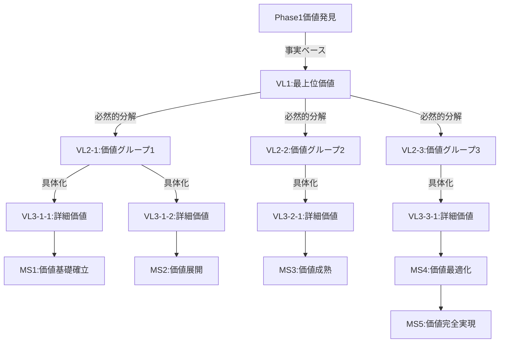

# /parasol:2-value - 価値定義と企業活動設計

## コマンド: `/parasol:2-value`

組織が提供する価値を定義し、それを実現する企業活動を設計します。バックキャスティングアプローチで理想状態から逆算します。

## 実行時間
約2-3時間

## 前提条件
- Phase 1（コンテキスト分析）の完了
- 組織のビジョン・ミッション
- 事業戦略の理解

## 実行内容

### Task 1: 価値宣言

#### 最上位価値の定義（VL1）
```yaml
価値宣言:
  ビジョン: [組織が目指す理想の姿]

  提供価値:
    顧客への価値: [顧客が得る最終的な価値]
    社会への価値: [社会的インパクト]
    組織への価値: [組織が得る価値]

  価値の独自性:
    差別化要因: [他社にない独自価値]
    競争優位性: [持続可能な優位性]
    価値の持続性: [長期的な価値提供力]
```

### Task 2: 価値分解（VL1→VL2→VL3）

#### 価値の階層的分解
```yaml
VL1: 最上位価値
  定義: [組織全体の提供価値]
  測定指標: [成功の測定方法]

VL2: 価値グループ（3-5個）
  VL2-1: [価値グループ1]
    定義: [詳細な定義]
    VL1への貢献: [どのようにVL1に貢献するか]

  VL2-2: [価値グループ2]
    定義: [詳細な定義]
    VL1への貢献: [どのようにVL1に貢献するか]

  VL2-3: [価値グループ3]
    定義: [詳細な定義]
    VL1への貢献: [どのようにVL1に貢献するか]

VL3: 詳細価値（各VL2に3-5個）
  VL3-1-1: [詳細価値]
    定義: [具体的な価値]
    実現方法: [どのように実現するか]
    必要な活動: [必要な企業活動]
```

### Task 3: 価値マイルストーン設定

#### バックキャスティングによるマイルストーン
```yaml
MS5: 価値の完全実現（18ヶ月後）
  状態: [理想の実現状態]
  成功基準: [測定可能な基準]
  価値指標: [具体的な数値目標]

MS4: 価値の最適化（12ヶ月後）
  状態: [最適化された状態]
  成功基準: [測定可能な基準]
  MS5への移行: [必要な進化]

MS3: 価値の成熟（9ヶ月後）
  状態: [成熟した状態]
  成功基準: [測定可能な基準]
  MS4への移行: [必要な改善]

MS2: 価値の展開（6ヶ月後）
  状態: [展開された状態]
  成功基準: [測定可能な基準]
  MS3への移行: [必要な拡大]

MS1: 価値の基礎確立（3ヶ月後）
  状態: [基礎が確立した状態]
  成功基準: [測定可能な基準]
  MS2への移行: [必要な発展]
```

### Task 4: 企業活動設計

#### 価値を実現する企業活動
```yaml
中核活動:
  活動1:
    名称: [活動名]
    目的: [活動の目的]
    価値貢献: [どの価値に貢献]
    必要リソース: [人/技術/資金]

  活動2:
    名称: [活動名]
    目的: [活動の目的]
    価値貢献: [どの価値に貢献]
    必要リソース: [人/技術/資金]

支援活動:
  活動1:
    名称: [活動名]
    役割: [支援の内容]
    対象: [支援対象の中核活動]

  活動2:
    名称: [活動名]
    役割: [支援の内容]
    対象: [支援対象の中核活動]

活動間の連携:
  連携パターン1:
    活動A → 活動B
    連携内容: [情報/成果物の受け渡し]
    頻度: [連携の頻度]

  連携パターン2:
    活動C ⇄ 活動D
    連携内容: [相互作用の内容]
    頻度: [連携の頻度]
```

## 成果物

以下のファイルが`outputs/2-value/`に生成されます：

1. **value-declaration.md**
   - 価値宣言書
   - 独自価値の定義
   - 価値提供のビジョン

2. **value-decomposition.md**
   - VL1→VL2→VL3の階層構造
   - 各レベルの詳細定義
   - 価値間の関係性

3. **value-milestones.md**
   - 5段階のマイルストーン
   - 各段階の成功基準
   - 進化のロードマップ

4. **enterprise-activities.md**
   - 企業活動の設計
   - 活動間の連携
   - リソース配分計画

## 決定記録

**VDR-001: 価値定義の決定**
```yaml
決定事項: 組織の最上位価値と分解構造
根拠: 市場分析と組織能力の評価
代替案: 検討した他の価値定義
影響: 全フェーズの方向性を決定
```

## チェックリスト

- [ ] 価値宣言が明確で測定可能か
- [ ] 価値分解が論理的で完全か
- [ ] マイルストーンが現実的で達成可能か
- [ ] 企業活動が価値実現に直結しているか
- [ ] バックキャスティングが適切に行われたか

## 価値トレーサビリティ（Phase 2）

> **参照**: `_value-traceability-system/phase-integration-patterns.md` - Phase 2固有の価値分解トレーサビリティ

### VL分解の構造的必然性

**Phase 1からの価値継承**：
```yaml
価値継承チェック:
  Phase1価値発見 → VL1定義:
    - 現在価値ギャップ: [Phase1で特定した具体的なギャップ]
    - 市場機会: [Phase1で確認した客観的機会]
    - 組織能力: [Phase1で評価した価値創造能力]
    - 価値実現可能性: [Phase1データに基づく論理的導出]
```

**VL1 → VL2分解の必然性**：
```yaml
VL1分解ロジック:
  分解原則: MECE（Mutually Exclusive, Collectively Exhaustive）
  
  VL2-1必然性証明:
    - VL1実現に不可欠な理由: [論理的説明]
    - 独立性: [他のVL2と重複しない理由]
    - 完全性: [VL1の一部を確実に実現する証明]
  
  VL2-2必然性証明:
    - VL1実現に不可欠な理由: [論理的説明]
    - 独立性: [他のVL2と重複しない理由]
    - 完全性: [VL1の一部を確実に実現する証明]
  
  VL2-3必然性証明:
    - VL1実現に不可欠な理由: [論理的説明]
    - 独立性: [他のVL2と重複しない理由]
    - 完全性: [VL1の一部を確実に実現する証明]

  分解完全性証明:
    - VL2-1 + VL2-2 + VL2-3 = VL1の数式的証明
    - 漏れなし: [VL1の全要素がVL2で網羅される証明]
    - 重複なし: [VL2間で重複がない証明]
```

**VL2 → VL3詳細化の論理性**：
```yaml
VL3詳細化ロジック:
  各VL2に対する3-5個のVL3:
    - 実現方法の具体性: [抽象的価値の具体的実現方法]
    - 測定可能性: [定量的測定が可能な形への変換]
    - 実装可能性: [現実的リソースでの実現可能性]
    - 必要活動明確化: [必要な企業活動の特定]
```

### マイルストーン設計の価値的必然性

**バックキャスティングの論理検証**：
```yaml
MS5→MS1設計ロジック:
  MS5（価値完全実現）:
    - VL実現状態: [全VLが完全に実現された状態]
    - 成功指標: [定量的な測定指標]
    - 価値創造証明: [価値実現の客観的証拠]
  
  MS4→MS1逆算:
    - 各MSがMS5実現に必要不可欠
    - MS間の論理的依存関係
    - タイムライン実現可能性
    - リソース要求の現実性
```

### 想像表現検出・排除

**価値定義での想像排除**：
```yaml
検出・排除対象:
  価値分解での推測:
    - ❌ "顧客は〜を求めているだろう" 
    - ✅ "顧客調査で〜と確認された"
  
  マイルストーン設定での仮定:
    - ❌ "〜ヶ月で実現できるはず"
    - ✅ "類似プロジェクト実績により〜ヶ月で実現可能"
  
  価値測定での曖昧表現:
    - ❌ "成功すると思われる"
    - ✅ "KPI達成により成功を定量的に確認"
```

### MS1品質ゲート

**Phase 2完了基準**：
```yaml
価値分解品質:
  - [ ] VL1-VL3の論理的必然性100%証明
  - [ ] 想像表現完全排除（検出率0%）
  - [ ] 全価値の測定可能性確立
  - [ ] 価値実現活動の明確化完了

マイルストーン品質:
  - [ ] MS5→MS1バックキャスティング妥当性
  - [ ] 各MSの価値貢献明確化
  - [ ] タイムライン実現可能性検証
  - [ ] リソース要求現実性確認

価値トレーサビリティ:
  - [ ] Phase1価値発見からVL1への完全追跡
  - [ ] VL1→VL2→VL3の完全分解記録
  - [ ] VL3→MS実現への論理的接続
  - [ ] 次フェーズ価値移転準備完了
```

### 価値実現の論理構造図



## 次のステップ

価値定義が完了したら、ビジネス設計フェーズへ：

```bash
# 価値分解トレーサビリティチェック
./value-trace verify-decomposition --vl1-to-vl3

# MS1品質ゲート実行
./value-trace quality-gate --milestone=MS1

# 次フェーズへの価値移転
./value-trace transfer --to=phase3

# Phase 3実行
/parasol:3-business
```

---

*定義した価値階層とマイルストーンが、すべての後続設計・実装の構造的基盤となります。価値トレーサビリティにより、実現確実性が保証されます。*