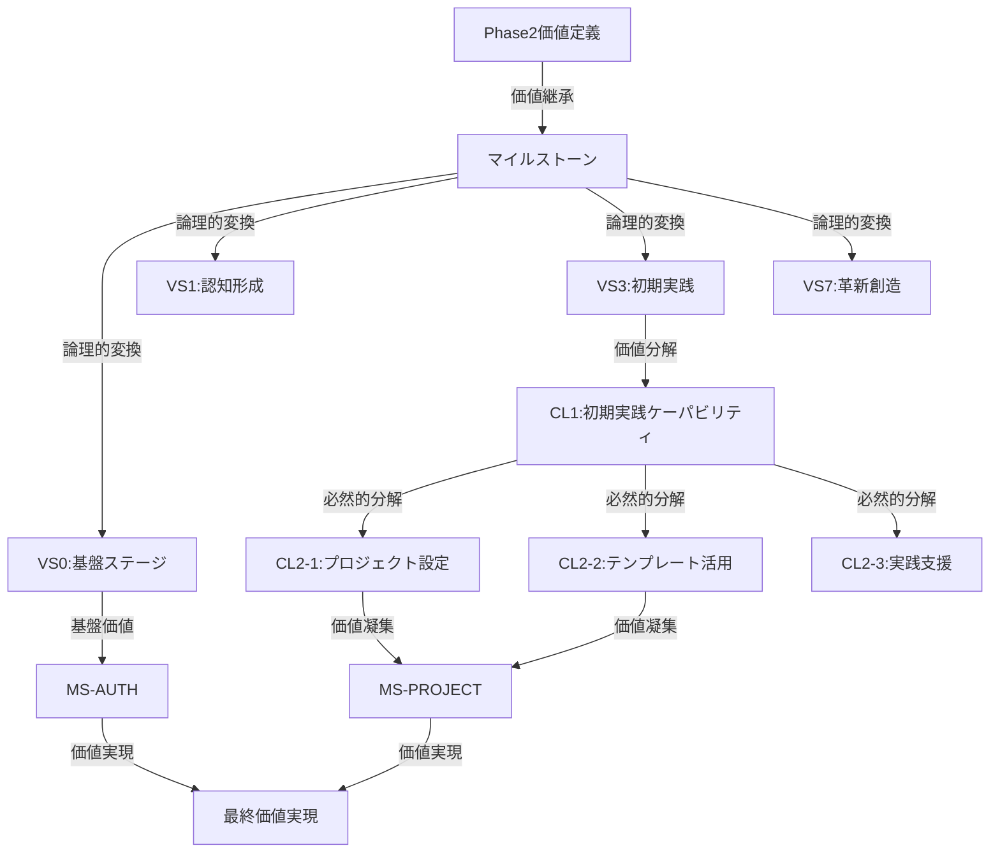

# /parasol:3-business - バリューステージ設計

## コマンド: `/parasol:3-business`

価値マイルストーンをバリューステージ（VS）に変換し、各ステージで必要なケーパビリティを設計します。

## 実行時間
約2-3時間

## 前提条件
- Phase 2（価値定義）の完了
- 価値マイルストーンの承認
- 企業活動の理解

## 実行内容

### Task 1: バリューステージ設計

#### MS→VS変換
```yaml
VS0: 基盤ステージ（汎用・横断的）
  定義: すべてのステージで共通利用される基盤価値
  状態: 基盤サービスが利用可能な状態
  横断的機能:
    - 認証認可
    - データ管理
    - 監査ログ
    - 通知配信

VS1: 認知形成ステージ
  対応MS: MS1前半
  定義: フレームワークの存在と価値が認知された状態
  成功基準: 組織内での認知率80%以上
  主要活動: マーケティング、教育、広報

VS2: 理解促進ステージ
  対応MS: MS1後半-MS2前半
  定義: フレームワークの使い方が理解された状態
  成功基準: チームの自律的利用開始
  主要活動: トレーニング、ドキュメント、サポート

VS3: 初期実践ステージ
  対応MS: MS2後半-MS3前半
  定義: パイロットプロジェクトで成功体験を得た状態
  成功基準: 3件以上の成功事例
  主要活動: パイロット支援、テンプレート提供

VS4: 展開拡大ステージ
  対応MS: MS3後半-MS4前半
  定義: 複数プロジェクトで標準採用された状態
  成功基準: 50%以上のプロジェクトで採用
  主要活動: スケーリング支援、標準化

VS5: 成熟運用ステージ
  対応MS: MS4後半
  定義: 組織標準として定着し継続的改善が行われる状態
  成功基準: 改善サイクルの確立
  主要活動: 最適化、メトリクス管理

VS6: 価値最大化ステージ
  対応MS: MS5前半
  定義: 期待された価値が完全に実現された状態
  成功基準: ROI 200%以上達成
  主要活動: 高度自動化、AI統合

VS7: 革新創造ステージ
  対応MS: MS5後半
  定義: 新たな価値を継続的に創造する状態
  成功基準: 新価値創造の定常化
  主要活動: R&D、イノベーション
```

### Task 2: ケーパビリティ分解（CL1→CL2→CL3）

#### ZIGZAG構造による展開
```yaml
VS3-CL1: 初期実践ケーパビリティ（WHAT）
  定義: パイロットプロジェクトを成功させる能力
  責任: 成功体験の創出と展開

  VS3-CL2-1: プロジェクト設定（HOW）
    定義: プロジェクト環境を整える能力
    機能:
      - 環境構築
      - 初期設定
      - チーム編成

    VS3-CL3-1: 環境構築オペレーション（HOW）
      - 開発環境セットアップ
      - ツールインストール
      - アクセス権設定

    VS3-CL3-2: 初期設定オペレーション
      - プロジェクト構造作成
      - 設定ファイル生成
      - 基本設定実施

  VS3-CL2-2: テンプレート活用（HOW）
    定義: 標準テンプレートを活用する能力
    機能:
      - テンプレート選択
      - カスタマイズ
      - 適用

    VS3-CL3-3: テンプレート適用オペレーション
      - テンプレート選定
      - パラメータ設定
      - 生成と配置

  VS3-CL2-3: 実践支援（HOW）
    定義: チームを支援し成功に導く能力
    機能:
      - メンタリング
      - 問題解決
      - レビュー

    VS3-CL3-4: メンタリングオペレーション
      - ペアプログラミング
      - コードレビュー
      - Q&A対応
```

### Task 3: ステージ間の価値フロー

#### バリューストリーム形成
```yaml
価値の流れ:
  VS0 → 全ステージ（基盤提供）
    提供価値: 共通機能とインフラ
    依存関係: すべてのVSがVS0に依存

  VS1 → VS2（認知から理解へ）
    移行条件: 認知率80%達成
    移行活動: 教育プログラム開始

  VS2 → VS3（理解から実践へ）
    移行条件: 基礎知識の習得完了
    移行活動: パイロットプロジェクト選定

  VS3 → VS4（実践から展開へ）
    移行条件: 成功事例3件以上
    移行活動: 標準化と展開計画

  VS4 → VS5（展開から成熟へ）
    移行条件: 50%採用率達成
    移行活動: 改善プロセス導入

  VS5 → VS6（成熟から最大化へ）
    移行条件: 安定運用の確立
    移行活動: 自動化とAI導入

  VS6 → VS7（最大化から革新へ）
    移行条件: ROI目標達成
    移行活動: イノベーション投資
```

### Task 4: マイクロサービス境界設計

#### CL2グループによるMS境界
```yaml
MS-AUTH: 認証認可サービス（VS0）
  含まれるCL2:
    - ユーザー認証
    - 権限管理
    - セッション管理
  技術: OAuth2 + JWT
  API: REST/GraphQL

MS-ONBOARD: オンボーディングサービス（VS1-2）
  含まれるCL2:
    - 認知形成機能
    - 教育管理機能
    - 進捗トラッキング
  技術: Next.js + Node.js
  API: REST

MS-PROJECT: プロジェクト管理サービス（VS3-4）
  含まれるCL2:
    - プロジェクト設定
    - テンプレート管理
    - 展開支援
  技術: Spring Boot
  API: REST + GraphQL

MS-OPTIMIZE: 最適化サービス（VS5-6）
  含まれるCL2:
    - メトリクス管理
    - 改善提案
    - 自動最適化
  技術: Python + FastAPI
  API: REST

MS-INNOVATION: イノベーションサービス（VS7）
  含まれるCL2:
    - R&D管理
    - 実験管理
    - 知識管理
  技術: Python + LangChain
  API: GraphQL
```

## 成果物

以下のファイルが`outputs/3-business/`に生成されます：

1. **value-stages.md**
   - VS0-VS7の定義
   - 各ステージの成功基準
   - ステージ間の関係

2. **capability-hierarchy.md**
   - CL1→CL2→CL3の階層構造
   - ZIGZAG展開の詳細
   - 責任と機能の定義

3. **value-flow.md**
   - ステージ間の価値フロー
   - 移行条件と活動
   - 依存関係マップ

4. **microservice-boundaries.md**
   - MS境界の定義
   - 技術選定理由
   - API設計方針

## 決定記録

**BDR-001: バリューステージ構成**
```yaml
決定: VS0-VS7の8ステージ構成
理由: 基盤と価値実現の分離、段階的展開
代替案: 5ステージ構成、10ステージ構成
影響: アーキテクチャ設計の基礎
```

**BDR-002: マイクロサービス境界**
```yaml
決定: CL2グループベースの境界設定
理由: 凝集性と独立性のバランス
代替案: VSベース、CL1ベース
影響: 技術アーキテクチャ全体
```

## チェックリスト

- [ ] VS0の横断的利用が設計されているか
- [ ] 各VSの成功基準が測定可能か
- [ ] ケーパビリティ階層が完全か
- [ ] ステージ間の価値フローが明確か
- [ ] MS境界が適切に設定されているか

## 価値トレーサビリティ（Phase 3）

> **参照**: `_value-traceability-system/phase-integration-patterns.md` - Phase 3価値継承とケーパビリティ分解

### VS設計の価値継承確認

**Phase 2からの価値継承**：
```yaml
価値継承トレーサビリティ:
  VL→MS→VS変換ロジック:
    MS1-MS5 → VS0-VS7変換:
      - MS実現に必要なステージの論理的導出
      - 各VSがMS達成に直接貢献する証明
      - VS間の価値フローの必然性
      - ステージ遷移条件の価値的根拠

  VS0基盤ステージの価値正当性:
    - 全VSの価値実現に不可欠な根拠
    - 横断的価値提供の必然性
    - 基盤なくしては価値実現不可能の証明
```

**ステージ間価値フローの構造的必然性**：
```yaml
VS価値フロー検証:
  VS1→VS2→...→VS7:
    - 各遷移の価値進化論理
    - 前ステージ完了が次ステージ開始に不可欠な理由
    - 価値累積効果の確認
    - 最終価値実現への段階的貢献

  遷移条件の価値的根拠:
    VS1→VS2: "認知率80%達成"
      - なぜ80%で次段階可能か: [具体的な価値実現根拠]
      - 80%未満では価値実現できない理由
    VS3→VS4: "成功事例3件以上"  
      - なぜ3件で展開可能か: [統計的・経験的根拠]
      - 3件未満では展開できない理由
```

### ケーパビリティ分解の価値必然性

**CL1→CL2→CL3の価値分解トレーサビリティ**：
```yaml
VS3_初期実践ケーパビリティ分解例:
  CL1: VS3価値実現責任
    価値貢献度: [VS3がMS実現にどの程度寄与するかの定量化]
    
  CL2分解の必然性:
    CL2-1_プロジェクト設定:
      VS3実現に不可欠な理由: [論理的説明]
      他CL2との独立性: [重複なき責任分担の証明]
      
    CL2-2_テンプレート活用:
      VS3実現に不可欠な理由: [論理的説明]
      他CL2との独立性: [重複なき責任分担の証明]
      
    CL2-3_実践支援:
      VS3実現に不可欠な理由: [論理的説明]
      他CL2との独立性: [重複なき責任分担の証明]
  
  CL3オペレーション分解:
    各CL2の具体的実行方法への分解
    - 実行可能性: [現実的なオペレーションレベル]
    - 測定可能性: [成果の定量的測定方法]
    - 価値貢献: [CL2、そしてVSへの貢献]
```

### マイクロサービス境界の価値根拠

**CL2グループによるMS境界の価値正当化**：
```yaml
MS境界設定の価値的理由:
  MS-AUTH（認証認可サービス）:
    価値凝集性: 
      - 含まれるCL2が共通価値を実現
      - 認証価値の独立性と完全性
      - 他MSとの価値境界明確化
    
    価値責任:
      - VS0基盤価値の一部を完全に実現
      - 全VSの価値実現に不可欠な基盤提供
      - セキュリティ価値の専門的実現

  MS-PROJECT（プロジェクト管理サービス）:
    価値凝集性:
      - VS3-VS4価値実現の中核機能集約
      - プロジェクト成功価値の完全責任
      - 価値測定とフィードバックループの実現
```

### 想像表現検出・排除

**ビジネス設計での想像排除**：
```yaml
検出・排除対象:
  ステージ設計での推測:
    - ❌ "ユーザーは段階的に慣れていくだろう"
    - ✅ "段階的学習理論により、この順序で習熟効率が最大化される"
  
  ケーパビリティ分解での仮定:
    - ❌ "このケーパビリティがあれば十分と思われる"
    - ✅ "価値実現に必要十分なケーパビリティをMECE分解で特定"
  
  マイクロサービス境界での個人的判断:
    - ❌ "この境界が開発しやすそう"
    - ✅ "価値凝集性とデータ結合度分析により最適境界を決定"
```

### MS2品質ゲート

**Phase 3完了基準**：
```yaml
VS設計品質:
  - [ ] MS→VS変換の論理的必然性100%証明
  - [ ] VS間価値フローの構造的整合性確認
  - [ ] ステージ遷移条件の価値的根拠明確化
  - [ ] VS0基盤ステージの横断的価値提供確認

ケーパビリティ品質:
  - [ ] CL1→CL2→CL3分解の価値必然性証明
  - [ ] 全CLの価値貢献定量化完了
  - [ ] ZIGZAG構造の論理的整合性確認
  - [ ] オペレーションレベルの実行可能性検証

MS境界品質:
  - [ ] 価値凝集性に基づく境界設定
  - [ ] MS間の価値責任分担明確化
  - [ ] 技術選択の価値貢献根拠確立
  - [ ] 次フェーズ価値移転準備完了
```

### 価値実現アーキテクチャ図



## 次のステップ

ビジネス設計が完了したら、アーキテクチャ設計フェーズへ：

```bash
# ケーパビリティ価値分解検証
./value-trace verify-capability-decomposition --vs-to-cl

# MS2品質ゲート実行
./value-trace quality-gate --milestone=MS2

# 次フェーズへの価値移転
./value-trace transfer --to=phase4

# Phase 4実行
/parasol:4-architecture
```

---

*バリューステージとケーパビリティ設計が後続の技術設計の価値基盤となります。価値トレーサビリティにより、技術判断も価値駆動で行われます。*