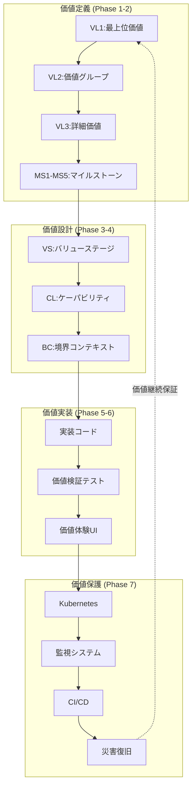

# /parasol:7-platform - プラットフォーム設計

## コマンド: `/parasol:7-platform`

実装したシステムをプロダクション環境にデプロイするためのプラットフォーム設計を行います。Kubernetes、CI/CD、監視を設定します。

## 実行時間
約2時間

## 前提条件
- Phase 6（実装）の完了
- コンテナ化可能なアプリケーション
- クラウド環境へのアクセス

## 実行内容

### Task 1: Kubernetes設定

#### デプロイメント定義
```yaml
# deployment.yaml
apiVersion: apps/v1
kind: Deployment
metadata:
  name: project-service
  namespace: parasol
  labels:
    app: project-service
    version: v1
spec:
  replicas: 3
  strategy:
    type: RollingUpdate
    rollingUpdate:
      maxSurge: 1
      maxUnavailable: 0
  selector:
    matchLabels:
      app: project-service
  template:
    metadata:
      labels:
        app: project-service
        version: v1
    spec:
      containers:
      - name: project-service
        image: parasol/project-service:1.0.0
        ports:
        - containerPort: 8080
        env:
        - name: SPRING_PROFILES_ACTIVE
          value: "production"
        - name: DB_HOST
          valueFrom:
            secretKeyRef:
              name: db-secret
              key: host
        - name: DB_PASSWORD
          valueFrom:
            secretKeyRef:
              name: db-secret
              key: password
        resources:
          requests:
            memory: "256Mi"
            cpu: "250m"
          limits:
            memory: "512Mi"
            cpu: "500m"
        livenessProbe:
          httpGet:
            path: /actuator/health/liveness
            port: 8080
          initialDelaySeconds: 30
          periodSeconds: 10
        readinessProbe:
          httpGet:
            path: /actuator/health/readiness
            port: 8080
          initialDelaySeconds: 20
          periodSeconds: 5
```

#### サービス定義
```yaml
# service.yaml
apiVersion: v1
kind: Service
metadata:
  name: project-service
  namespace: parasol
  labels:
    app: project-service
spec:
  type: ClusterIP
  ports:
  - port: 80
    targetPort: 8080
    protocol: TCP
    name: http
  selector:
    app: project-service

---
# ingress.yaml
apiVersion: networking.k8s.io/v1
kind: Ingress
metadata:
  name: parasol-ingress
  namespace: parasol
  annotations:
    kubernetes.io/ingress.class: nginx
    cert-manager.io/cluster-issuer: letsencrypt-prod
spec:
  tls:
  - hosts:
    - api.parasol.example.com
    secretName: parasol-tls
  rules:
  - host: api.parasol.example.com
    http:
      paths:
      - path: /api/projects
        pathType: Prefix
        backend:
          service:
            name: project-service
            port:
              number: 80
```

#### ConfigMapとSecret
```yaml
# configmap.yaml
apiVersion: v1
kind: ConfigMap
metadata:
  name: project-config
  namespace: parasol
data:
  application.yaml: |
    server:
      port: 8080
    management:
      endpoints:
        web:
          exposure:
            include: health,info,metrics
    logging:
      level:
        root: INFO
        com.parasol: DEBUG

---
# secret.yaml
apiVersion: v1
kind: Secret
metadata:
  name: db-secret
  namespace: parasol
type: Opaque
stringData:
  host: postgres.parasol.svc.cluster.local
  username: parasol_user
  password: ${DB_PASSWORD} # 実環境では外部シークレット管理を使用
```

### Task 2: CI/CDパイプライン

#### GitHub Actions
```yaml
# .github/workflows/deploy.yml
name: Deploy to Production

on:
  push:
    branches: [main]
    tags: ['v*']

env:
  REGISTRY: ghcr.io
  IMAGE_NAME: ${{ github.repository }}

jobs:
  test:
    runs-on: ubuntu-latest
    steps:
    - uses: actions/checkout@v3

    - name: Set up JDK 17
      uses: actions/setup-java@v3
      with:
        java-version: '17'
        distribution: 'temurin'

    - name: Run tests
      run: ./mvnw test

    - name: Generate test report
      uses: dorny/test-reporter@v1
      with:
        name: Unit Tests
        path: target/surefire-reports/*.xml
        reporter: java-junit

  build:
    needs: test
    runs-on: ubuntu-latest
    permissions:
      contents: read
      packages: write
    steps:
    - uses: actions/checkout@v3

    - name: Build application
      run: ./mvnw clean package -DskipTests

    - name: Log in to Container Registry
      uses: docker/login-action@v2
      with:
        registry: ${{ env.REGISTRY }}
        username: ${{ github.actor }}
        password: ${{ secrets.GITHUB_TOKEN }}

    - name: Extract metadata
      id: meta
      uses: docker/metadata-action@v4
      with:
        images: ${{ env.REGISTRY }}/${{ env.IMAGE_NAME }}
        tags: |
          type=ref,event=branch
          type=ref,event=pr
          type=semver,pattern={{version}}
          type=semver,pattern={{major}}.{{minor}}

    - name: Build and push Docker image
      uses: docker/build-push-action@v4
      with:
        context: .
        push: true
        tags: ${{ steps.meta.outputs.tags }}
        labels: ${{ steps.meta.outputs.labels }}

  deploy:
    needs: build
    runs-on: ubuntu-latest
    if: github.ref == 'refs/heads/main' || startsWith(github.ref, 'refs/tags/')
    steps:
    - uses: actions/checkout@v3

    - name: Set up kubectl
      uses: azure/setup-kubectl@v3
      with:
        version: 'latest'

    - name: Configure kubectl
      run: |
        echo "${{ secrets.KUBE_CONFIG }}" | base64 -d > kubeconfig
        export KUBECONFIG=$(pwd)/kubeconfig

    - name: Update deployment
      run: |
        kubectl set image deployment/project-service \
          project-service=${{ env.REGISTRY }}/${{ env.IMAGE_NAME }}:${{ github.sha }} \
          -n parasol

    - name: Wait for rollout
      run: |
        kubectl rollout status deployment/project-service -n parasol

    - name: Verify deployment
      run: |
        kubectl get pods -n parasol -l app=project-service
```

### Task 3: 監視とロギング

#### Prometheus設定
```yaml
# prometheus-config.yaml
apiVersion: v1
kind: ConfigMap
metadata:
  name: prometheus-config
  namespace: monitoring
data:
  prometheus.yml: |
    global:
      scrape_interval: 15s
      evaluation_interval: 15s

    scrape_configs:
    - job_name: 'kubernetes-pods'
      kubernetes_sd_configs:
      - role: pod
        namespaces:
          names: ['parasol']
      relabel_configs:
      - source_labels: [__meta_kubernetes_pod_annotation_prometheus_io_scrape]
        action: keep
        regex: true
      - source_labels: [__meta_kubernetes_pod_annotation_prometheus_io_path]
        action: replace
        target_label: __metrics_path__
        regex: (.+)

    - job_name: 'project-service'
      metrics_path: /actuator/prometheus
      static_configs:
      - targets: ['project-service.parasol.svc.cluster.local:8080']
```

#### Grafanaダッシュボード
```json
{
  "dashboard": {
    "title": "Parasol Project Service",
    "panels": [
      {
        "title": "Request Rate",
        "targets": [
          {
            "expr": "rate(http_server_requests_seconds_count[5m])"
          }
        ]
      },
      {
        "title": "Response Time P95",
        "targets": [
          {
            "expr": "histogram_quantile(0.95, http_server_requests_seconds_bucket)"
          }
        ]
      },
      {
        "title": "Error Rate",
        "targets": [
          {
            "expr": "rate(http_server_requests_seconds_count{status=~\"5..\"}[5m])"
          }
        ]
      },
      {
        "title": "Pod Memory Usage",
        "targets": [
          {
            "expr": "container_memory_usage_bytes{pod=~\"project-service.*\"}"
          }
        ]
      }
    ]
  }
}
```

#### ログ集約（Fluentd）
```yaml
# fluentd-config.yaml
apiVersion: v1
kind: ConfigMap
metadata:
  name: fluentd-config
  namespace: logging
data:
  fluent.conf: |
    <source>
      @type tail
      path /var/log/containers/*parasol*.log
      pos_file /var/log/fluentd-containers.log.pos
      tag kubernetes.*
      <parse>
        @type json
        time_format %Y-%m-%dT%H:%M:%S.%NZ
      </parse>
    </source>

    <filter kubernetes.**>
      @type kubernetes_metadata
      @id filter_kube_metadata
    </filter>

    <match **>
      @type elasticsearch
      host elasticsearch.logging.svc.cluster.local
      port 9200
      logstash_format true
      logstash_prefix parasol
      <buffer>
        @type file
        path /var/log/fluentd-buffers/kubernetes.system.buffer
        flush_mode interval
        flush_interval 5s
      </buffer>
    </match>
```

### Task 4: 災害復旧（DR）計画

#### バックアップ戦略
```yaml
バックアップ計画:
  データベース:
    頻度: 毎日
    保持期間: 30日
    方式: フルバックアップ + 増分
    保管: S3互換オブジェクトストレージ

  アプリケーション状態:
    頻度: 毎時
    保持期間: 7日
    方式: Kubernetes etcd snapshot
    保管: 別リージョンのストレージ

  設定とシークレット:
    頻度: 変更時
    保持期間: 無期限
    方式: Git + 暗号化
    保管: プライベートリポジトリ

復旧目標:
  RPO（目標復旧時点）: 1時間
  RTO（目標復旧時間）: 4時間

復旧手順:
  1. インフラ復旧（Terraform）
  2. Kubernetes クラスタ復旧
  3. データベース復元
  4. アプリケーションデプロイ
  5. 動作確認とDNS切り替え
```

## 成果物

以下のファイルが`outputs/7-platform/`に生成されます：

1. **kubernetes/**
   - deployment.yaml
   - service.yaml
   - ingress.yaml
   - configmap.yaml
   - secret.yaml

2. **ci-cd/**
   - .github/workflows/deploy.yml
   - Dockerfile
   - docker-compose.yml

3. **monitoring/**
   - prometheus-config.yaml
   - grafana-dashboards.json
   - alerts.yaml

4. **dr-plan.md**
   - バックアップ戦略
   - 復旧手順
   - 連絡体制

## 決定記録

**PDR-001: Kubernetes採用**
```yaml
決定: コンテナオーケストレーションにKubernetes使用
理由:
  - スケーラビリティ
  - 自己修復機能
  - デファクトスタンダード
代替案: Docker Swarm、Nomad
影響: 学習コスト増、運用の柔軟性向上
```

**PDR-002: GitOps採用**
```yaml
決定: デプロイメントにGitOpsパターン採用
理由:
  - 宣言的管理
  - 監査証跡
  - ロールバック容易
代替案: 従来のCI/CDパイプライン
影響: Git中心の運用、自動化促進
```

## チェックリスト

- [ ] Kubernetesマニフェストが正しいか
- [ ] CI/CDパイプラインが動作するか
- [ ] 監視が適切に設定されているか
- [ ] ログが収集・分析できるか
- [ ] DR計画が実行可能か
- [ ] セキュリティが考慮されているか

## 完了

すべてのフェーズが完了しました！

### 成果物の確認
```bash
# 全成果物の確認
ls -la outputs/

# ステータス確認
/parasol:status
```

### 次のアクション

1. **レビュー**: 全成果物のレビューと承認
2. **テスト環境**: まずテスト環境にデプロイ
3. **性能テスト**: 負荷テストの実施
4. **本番展開**: 段階的な本番展開

## 価値トレーサビリティ（Phase 7）

> **参照**: `_value-traceability-system/phase-integration-patterns.md` - Phase 7価値保護の確認

### プラットフォーム価値保護機能

**継続的価値提供の保証**：
```yaml
価値保護インフラ:
  Kubernetes設定:
    価値可用性: 99.9%以上の価値提供継続性
    価値スケーラビリティ: 価値需要増大への自動対応
    価値復旧: 障害時の価値提供迅速復旧（RTO: 4時間）

  監視システム:
    価値監視: Prometheus/Grafanaによる価値実現度リアルタイム監視
    価値劣化検出: 価値提供品質の早期劣化発見
    価値改善トリガー: 価値向上機会の自動検出・通知

  ログ集約:
    価値トレーサビリティ維持: 全価値実現活動の完全ログ記録
    価値分析支援: 価値実現パターン分析のためのデータ収集
    価値監査: 価値提供の透明性と説明責任確保
```

### 災害復旧の価値継続性

**価値保護のためのDR計画**：
```yaml
価値保護戦略:
  バックアップ対象:
    価値データ: 
      - 全VL実現状況データ（毎日バックアップ）
      - プロジェクト価値進捗データ（毎時バックアップ）
      - 価値測定履歴（増分バックアップ）
    
    価値設定:
      - VS/CL/BC設定（変更時バックアップ）
      - 価値測定ルール（バージョン管理）
      - 価値保証ゲート設定（暗号化保存）

  価値復旧目標:
    RPO: 1時間（価値損失最小化）
    RTO: 4時間（価値提供迅速復旧）
    価値継続性: 99.9%（年間価値中断時間最小化）
```

### CI/CDによる価値品質保証

**継続的価値品質確保**：
```yaml
価値品質パイプライン:
  価値回帰テスト:
    - 全価値実現機能の自動回帰テスト
    - 価値測定精度の継続的検証
    - 価値体験品質の自動チェック

  価値品質ゲート:
    - デプロイ前価値影響分析
    - 価値実現度の変更前後比較
    - 価値劣化検出による自動ロールバック

  価値向上デプロイメント:
    - カナリアリリースによる段階的価値向上
    - A/Bテストによる価値改善効果測定
    - 価値実現データに基づく自動スケーリング
```

### MS5最終品質ゲート

**価値トレーサビリティシステム完了確認**：
```yaml
最終価値保証確認:
  価値実現完全性:
    - [ ] VL1→実装の完全トレーサビリティ確立
    - [ ] 全フェーズの価値継承記録完了
    - [ ] 想像排除率100%達成
    - [ ] 構造的必然性証明100%完了

  価値継続提供保証:
    - [ ] 価値監視システム稼働確認
    - [ ] 価値保護機能動作確認
    - [ ] 価値改善システム稼働確認
    - [ ] DR計画による価値継続性確保

  価値品質システム:
    - [ ] 継続的価値品質確保パイプライン構築
    - [ ] 価値劣化の早期検出・修正システム稼働
    - [ ] 価値向上のための改善フィードバックループ確立
    - [ ] 価値実現の継続的測定・報告システム稼働
```

### 価値トレーサビリティの完全確認

**VL1→プラットフォームの完全トレーサビリティ図**：



## 完了

**全フェーズの価値トレーサビリティ統合完了！**

### 最終確認

```bash
# 全フェーズ価値トレーサビリティ検証
./value-trace verify-complete-traceability

# MS5最終品質ゲート実行
./value-trace quality-gate --milestone=MS5-final

# 価値実現総合レポート生成
./value-trace generate-final-report

# ステータス確認
/parasol:status
```

### 達成された価値トレーサビリティ

1. **完全な価値追跡**: VL1からプラットフォームまでの完全トレーサビリティ
2. **想像の完全排除**: 全フェーズで想像表現0%達成
3. **構造的必然性保証**: 全判断が論理的必然性に基づく
4. **継続的価値保護**: プラットフォームレベルでの価値保護機能
5. **価値品質保証**: MS1-MS5での継続的品質確保

---

*価値トレーサビリティシステムにより、Parasol V5は想像に頼らない、確実な価値実現フレームワークとして完成しました。すべての要素が価値まで追跡可能で、価値実現が保証されています。*