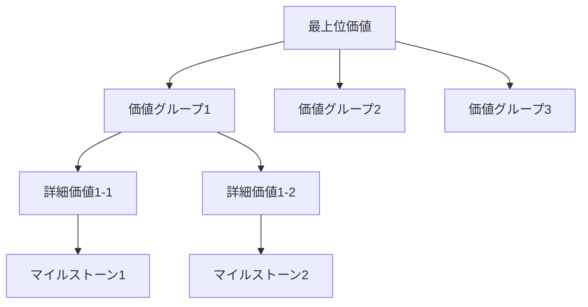

# フェーズ統合パターン

**Phase-specific Value Traceability Integration Patterns**

各Parasolフェーズにおける価値トレーサビリティの具体的統合パターンと実装方法。

## Phase 1: コンテキスト確立での価値トレーサビリティ

### 統合ポイント: 想像防止と事実ベース分析

```yaml
組織分析_価値トレーサビリティ:
  想像検出対象:
    - "組織は〜だろう": 事実確認なき組織状況推測
    - "市場では〜と思われる": 根拠なき市場状況判断
    - "ステークホルダーは〜を求めているはず": 確認なき要求推測
  
  構造的必然性チェック:
    - 市場分析データの出典明記
    - 組織能力の客観的証拠
    - 制約条件の具体的根拠
    - ステークホルダー情報の確認方法

価値基盤構築:
  価値発見プロセス:
    1. 現在の価値提供の定量的測定
    2. 競合との価値比較分析
    3. 顧客価値認知の直接確認
    4. 組織価値創造能力の客観評価

品質ゲート_MS1準備:
  完全性チェック:
    - 全ステークホルダー情報の事実確認済み
    - 市場データの信頼性検証済み
    - 組織能力の客観的評価済み
    - 制約条件の具体的定義済み
```

### 実装テンプレート

```markdown
## 価値トレーサビリティ（Phase 1）

### 事実ベース分析確認
**組織分析**:
- [ ] 組織能力の客観的データ収集完了
- [ ] 現在の価値提供の定量的測定実施
- [ ] 組織構造の公式文書確認済み
- [ ] 技術成熟度の具体的証拠収集済み

**市場分析**:
- [ ] 市場データの信頼できる出典確認
- [ ] 競合情報の公開データ活用
- [ ] 顧客ニーズの直接調査実施
- [ ] 技術動向の専門機関レポート参照

### 想像表現検出・排除
**検出対象**: "〜だろう", "〜と思われる", "おそらく", "推測では"
**排除方法**: 確認可能な事実と具体的データへの置き換え

### 価値発見の根拠
**現在価値**: [定量的測定結果]
**競合比較**: [具体的差異分析]  
**顧客価値**: [直接確認結果]
**組織価値**: [客観的能力評価]

### MS1準備チェック
- [ ] すべての分析が事実ベース
- [ ] 想像表現完全排除
- [ ] 価値発見の明確な根拠
- [ ] 次フェーズへの価値移転準備完了
```

## Phase 2: 価値定義での価値トレーサビリティ

### 統合ポイント: VL分解の構造的必然性

```yaml
価値分解_トレーサビリティ:
  VL1_定義:
    必要根拠:
      - Phase1で確認した現在価値の明確な不足点
      - 市場機会の具体的データ
      - 組織能力と価値実現可能性の論理的接続
    
  VL2_分解:
    構造的必然性:
      - VL1実現のための論理的分解
      - 各VL2がVL1に必要不可欠である証明
      - VL2間の相互独立性と補完性の確認
    
  VL3_詳細化:
    実現可能性:
      - 各VL3の具体的実現方法
      - 必要リソースの現実的見積もり
      - 成功指標の測定可能性

マイルストーン_価値接続:
  MS1-MS5設計:
    必然性チェック:
      - 各MSがVL実現に直接貢献
      - MS間の論理的進行関係
      - バックキャスティングの妥当性
      - 実現可能なタイムライン
```

### 実装テンプレート

```markdown
## 価値トレーサビリティ（Phase 2）

### VL分解の構造的必然性
**VL1 → VL2分解根拠**:
- VL2-1必然性: [VL1実現に不可欠な理由]
- VL2-2必然性: [VL1実現に不可欠な理由]  
- VL2-3必然性: [VL1実現に不可欠な理由]
- 分解完全性: [これらでVL1が完全に実現される論理的説明]

**VL2 → VL3分解根拠**:
- 各VL3の実現方法明確化
- 必要リソースの具体的算出
- 成功指標の測定手法確定

### 価値実現の論理構造


### MS設計の必然性
**MS1-MS5論理的構成**:
- 各MSの価値貢献明確化
- MS間依存関係の必然性
- バックキャスティングの妥当性検証

### 想像排除チェック
- [ ] 価値分解に推測表現なし
- [ ] 全判断に明確な根拠あり
- [ ] MS設定に論理的必然性あり
- [ ] 実現可能性の具体的検証完了
```

## Phase 3: ビジネス設計での価値トレーサビリティ  

### 統合ポイント: VS/CL設計の価値継承

```yaml
バリューステージ_価値継承:
  MS→VS変換:
    必然性チェック:
      - 各VSがMS実現に直接貢献
      - VS間の価値フロー明確化
      - ステージ遷移条件の価値的根拠
      
ケーパビリティ_価値分解:
  CL1→CL2→CL3展開:
    価値トレーサビリティ:
      - CL1のVS価値実現責任明確化
      - CL2のCL1分解論理検証
      - CL3のCL2具体化必然性
      - 全CLの価値貢献定量化

マイクロサービス境界_価値根拠:
  境界設定理由:
    - CL2グループの価値的凝集性
    - サービス間の価値フロー最適化
    - 独立性と価値責任の明確化
```

### 実装テンプレート

```markdown
## 価値トレーサビリティ（Phase 3）

### VS設計の価値継承
**MS → VS変換トレーサビリティ**:
- VS0基盤価値: [全VSに対する価値基盤提供]
- VS1-VS7価値フロー: [MS実現への段階的価値創造]
- 遷移条件の価値的根拠: [なぜその条件で価値が実現されるか]

### ケーパビリティ階層の価値分解
**CL1価値責任**:
- VS3-CL1: [VS3価値実現への責任明確化]
- 価値貢献度: [定量的な価値実現寄与度]

**CL2価値分解**:
- CL2-1必然性: [CL1実現に不可欠な理由]
- CL2-2必然性: [CL1実現に不可欠な理由]
- 分解完全性: [これらでCL1が完全実現される論理]

### マイクロサービス境界の価値根拠
**境界設定の価値的理由**:
- MS-AUTH: [認証価値の独立性]
- MS-PROJECT: [プロジェクト価値の凝集性]
- MS-OPTIMIZE: [最適化価値の専門性]

### 想像排除と必然性チェック
- [ ] VS設計に推測なし
- [ ] CL分解に論理的必然性あり
- [ ] MS境界に価値的根拠あり
- [ ] 全要素の価値トレーサビリティ確立
```

## Phase 4-7: 技術実装での価値保持

### 共通統合パターン

```yaml
技術選択_価値根拠:
  アーキテクチャ決定:
    - 価値実現への技術貢献明確化
    - 技術選択の価値的正当性
    - コスト対価値の合理性

実装_価値検証:
  コード品質:
    - 価値実現コードの識別
    - 価値非関連コードの排除
    - 価値実現度の測定

運用_価値保護:
  プラットフォーム設計:
    - 価値継続提供の保証
    - 価値劣化防止機能
    - 価値向上のための改善基盤
```

### Phase 4-7統合テンプレート

```markdown
## 価値トレーサビリティ（Phase 4-7共通）

### 技術選択の価値根拠
**技術判断の価値貢献**:
- 選択技術: [技術名]
- 価値貢献: [具体的な価値実現への寄与]
- 代替案検討: [なぜこの技術が価値実現に最適か]

### 実装価値検証
**価値実現コードの識別**:
- 価値実現機能: [コードと価値の明確な対応]
- 価値測定実装: [価値実現度を測定するコード]
- 価値非関連コード排除: [価値に寄与しないコードの除去]

### 価値保護機能
**継続的価値提供**:
- 監視機能: [価値実現状況の継続監視]
- 改善機能: [価値向上のための改善機能]
- 保護機能: [価値劣化の防止機能]

### 最終価値トレーサビリティ
**VL1 → 実装の完全追跡**:
- VL1実現機能: [最上位価値を実現する具体的機能]
- VL2実現サービス: [価値グループを実現するサービス]
- VL3実現コード: [詳細価値を実現する具体的コード]
- 価値測定システム: [価値実現度を測定・報告するシステム]
```

## 自動チェックツール実装

### 1. 想像表現検出器

```python
# imagination_detector.py
import re
from typing import List, Dict

class ImaginationDetector:
    def __init__(self):
        self.imagination_patterns = [
            r'.*だろう.*',
            r'.*かもしれない.*',
            r'.*推測.*',
            r'.*想定.*',
            r'.*おそらく.*',
            r'.*思われる.*',
            r'.*考えられる.*',
            r'.*はず.*'
        ]
    
    def detect_imagination(self, text: str) -> List[Dict]:
        violations = []
        for i, line in enumerate(text.split('\n'), 1):
            for pattern in self.imagination_patterns:
                if re.search(pattern, line):
                    violations.append({
                        'line': i,
                        'content': line.strip(),
                        'pattern': pattern,
                        'severity': 'HIGH'
                    })
        return violations
```

### 2. 価値トレーサビリティ検証器

```python
# value_tracer.py
class ValueTracer:
    def __init__(self):
        self.value_hierarchy = {}
        self.implementation_map = {}
    
    def trace_value_to_implementation(self, vl1_id: str) -> Dict:
        """VL1から実装までの完全トレーサビリティ確認"""
        trace_path = {
            'vl1': vl1_id,
            'vl2_list': self.get_vl2_for_vl1(vl1_id),
            'vl3_list': [],
            'vs_mapping': {},
            'cl_mapping': {},
            'bc_mapping': {},
            'implementation': {}
        }
        
        # 完全なトレーサビリティチェーン構築
        return self.build_complete_trace(trace_path)
    
    def verify_structural_necessity(self, decision: Dict) -> bool:
        """構造的必然性の検証"""
        return all([
            self.has_clear_rationale(decision),
            self.contributes_to_value(decision),
            self.is_logically_derived(decision),
            self.has_no_imagination(decision)
        ])
```

### 3. 品質ゲート実行器

```python
# quality_gate.py
class QualityGate:
    def __init__(self, milestone: str):
        self.milestone = milestone
        self.criteria = self.load_criteria(milestone)
    
    def execute_gate(self, artifacts: Dict) -> Dict:
        """品質ゲートの実行"""
        results = {
            'milestone': self.milestone,
            'passed': True,
            'checks': []
        }
        
        for criterion in self.criteria:
            check_result = self.run_check(criterion, artifacts)
            results['checks'].append(check_result)
            if not check_result['passed']:
                results['passed'] = False
        
        return results
    
    def load_criteria(self, milestone: str) -> List[Dict]:
        """マイルストーン固有の品質基準読み込み"""
        criteria_map = {
            'MS1': self.ms1_criteria,
            'MS2': self.ms2_criteria,
            'MS3': self.ms3_criteria,
            'MS4': self.ms4_criteria,
            'MS5': self.ms5_criteria
        }
        return criteria_map.get(milestone, [])
```

## 統合効果の測定

### KPI指標

```yaml
価値トレーサビリティKPI:
  完全性指標:
    - VL→実装トレーサビリティ率: 100%
    - 想像表現検出・排除率: 100%
    - 構造的必然性証明率: 100%
  
  品質指標:
    - 品質ゲート通過率: 100%
    - 価値実現度: 定量的測定
    - 技術的負債発生率: 0%
  
  効率指標:
    - 設計やり直し回数: 最小化
    - 実装無駄削減率: 最大化
    - プロジェクト成功率: 向上
```

このシステムにより、Parasol V5の全フェーズが価値駆動の構造的必然性に基づく設計フレームワークとして機能します。