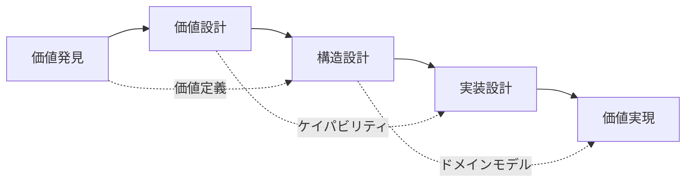

# parasol:milestone - マイルストーン統合管理コマンド

## 概要

Parasol V5のMS1からMS5までのマイルストーンを統合的に管理し、価値実現の段階的な進行を保証します。各マイルストーンでの成果物と価値の継承を自動的に追跡し、構造的必然性を維持しながらプロジェクトを進行させます。

## マイルストーン概要

### MS1: 価値発見（Value Discovery）
- URLまたはコードベースから価値を抽出
- ステークホルダーと価値の特定
- 初期価値マップの作成

### MS2: 価値設計（Value Design）
- 価値ストリームの詳細設計
- ケイパビリティへの分解
- 価値実現の優先順位付け

### MS3: 構造設計（Structural Design）
- ドメインモデルの確立
- バウンデッドコンテキストの定義
- 技術アーキテクチャの決定

### MS4: 実装設計（Implementation Design）
- 詳細な実装計画
- API/インターフェース設計
- データモデルの確定

### MS5: 価値実現（Value Realization）
- コード生成と実装
- 価値の検証とテスト
- 本番環境への展開

## コマンド構文

```bash
amplifier parasol:milestone <サブコマンド> [オプション]
```

## サブコマンド

### status - 現在の状況確認

プロジェクトの現在のマイルストーン状況を表示します。

```bash
amplifier parasol:milestone status [--detailed] [--format <format>]
```

**出力例:**
```
プロジェクト: asahi-digital-transform
現在のマイルストーン: MS2 (進行中)

マイルストーン進捗:
MS1 [████████████████████] 100% ✓ 完了
MS2 [████████████--------]  60% ⚡ 進行中
MS3 [--------------------]   0% ⏸ 待機中
MS4 [--------------------]   0% ⏸ 待機中
MS5 [--------------------]   0% ⏸ 待機中

MS2の残タスク:
- [ ] ケイパビリティマッピング (VS3, VS4)
- [ ] 優先順位マトリックスの作成
- [ ] ステークホルダーレビュー

次のアクション:
amplifier parasol:milestone advance --continue
```

### advance - マイルストーンの進行

次のマイルストーンへ進行、または現在のマイルストーンを完了させます。

```bash
amplifier parasol:milestone advance [--to <milestone>] [--force] [--validate]
```

**オプション:**
- `--to <milestone>`: 特定のマイルストーンへジャンプ（MS1-MS5）
- `--force`: 検証をスキップして強制進行
- `--validate`: 進行前に包括的な検証を実施
- `--continue`: 現在のマイルストーンの作業を継続

**使用例:**
```bash
# 次のマイルストーンへ進行
amplifier parasol:milestone advance

# MS3へ直接移行（MS2完了が前提）
amplifier parasol:milestone advance --to MS3 --validate

# 現在のマイルストーンを継続
amplifier parasol:milestone advance --continue
```

### rollback - マイルストーンの巻き戻し

問題が発生した場合に前のマイルストーンへ戻ります。

```bash
amplifier parasol:milestone rollback [--to <milestone>] [--preserve-work]
```

**オプション:**
- `--to <milestone>`: 特定のマイルストーンへ巻き戻し
- `--preserve-work`: 作業内容を保持したまま巻き戻し
- `--reason <text>`: 巻き戻しの理由を記録

**使用例:**
```bash
# 前のマイルストーンへ戻る
amplifier parasol:milestone rollback --reason "価値定義の見直しが必要"

# 作業を保持してMS1へ戻る
amplifier parasol:milestone rollback --to MS1 --preserve-work
```

### checkpoint - チェックポイント作成

現在の状態を保存し、後で復元できるようにします。

```bash
amplifier parasol:milestone checkpoint [--name <name>] [--description <desc>]
```

**使用例:**
```bash
# 名前付きチェックポイント作成
amplifier parasol:milestone checkpoint --name "before-major-refactor"

# 自動チェックポイント（タイムスタンプ付き）
amplifier parasol:milestone checkpoint
```

### validate - マイルストーン検証

現在のマイルストーンの成果物と品質を検証します。

```bash
amplifier parasol:milestone validate [--milestone <ms>] [--fix] [--report]
```

**検証内容:**

**MS1検証:**
- 価値が明確に定義されているか
- ステークホルダーが特定されているか
- 価値の測定基準があるか

**MS2検証:**
- すべての価値がケイパビリティに分解されているか
- 優先順位が明確か
- 依存関係が解決されているか

**MS3検証:**
- ドメインモデルの一貫性
- バウンデッドコンテキストの境界明確性
- 技術選択の必然性

**出力例:**
```
MS2 検証結果:

✓ 価値ストリーム定義: 完了 (8/8)
✓ ケイパビリティ分解: 完了 (24/24)
⚠ 優先順位付け: 不完全 (18/24)
✗ 依存関係解決: 未完了 (循環依存を検出)

総合評価: 75% (要改善)

修正提案:
1. 以下のケイパビリティの優先順位を設定:
   - inventory-management
   - customer-analytics
   
2. 循環依存の解決:
   order-service ←→ payment-service
   
自動修正: amplifier parasol:milestone validate --fix
```

### dependencies - 依存関係の確認

マイルストーン間の依存関係と前提条件を表示します。

```bash
amplifier parasol:milestone dependencies [--from <ms>] [--to <ms>] [--visualize]
```

**出力例:**


### timeline - タイムライン表示

プロジェクトのマイルストーン進行履歴を表示します。

```bash
amplifier parasol:milestone timeline [--days <n>] [--format <format>]
```

**出力例:**
```
プロジェクトタイムライン:

2024-01-01 09:00 │ MS1 開始
2024-01-02 14:30 │ ├─ 価値抽出完了
2024-01-03 11:00 │ ├─ ステークホルダー分析完了
2024-01-04 16:00 │ └─ MS1 完了 ✓
2024-01-04 16:15 │ MS2 開始
2024-01-08 10:00 │ ├─ 価値ストリーム設計完了
2024-01-10 15:30 │ ├─ ケイパビリティ分解 (進行中)
                 │
現在 ············→ ⚡
```

## 品質ゲート統合

### 自動品質チェック

各マイルストーンには自動的に品質ゲートが設定されています：

```yaml
quality_gates:
  MS1:
    - 価値の具体性チェック
    - ステークホルダーカバレッジ
    - 測定指標の定義
    
  MS2:
    - ケイパビリティ完全性
    - 優先順位の一貫性
    - リソース実現可能性
    
  MS3:
    - ドメインモデル整合性
    - 境界の明確性
    - 技術的実現可能性
```

### カスタム品質ルール

```yaml
# .parasol/milestone-rules.yaml
custom_gates:
  MS2:
    - id: capability-size
      rule: "各ケイパビリティは3-7の機能を含む"
      severity: warning
      
    - id: value-trace
      rule: "すべてのケイパビリティが価値にトレース可能"
      severity: error
```

## 自動化機能

### マイルストーン自動進行

```bash
# 条件を満たしたら自動的に次へ
amplifier parasol:milestone auto-advance --enable

# 進行条件の設定
amplifier parasol:milestone set-conditions --file conditions.yaml
```

### 進捗レポート自動生成

```bash
# 日次進捗レポート
amplifier parasol:milestone report --schedule daily

# マイルストーン完了時の成果物レポート
amplifier parasol:milestone report --on-complete
```

## CI/CD統合

### GitHub Actions

```yaml
- name: Milestone Validation
  run: |
    amplifier parasol:milestone validate
    amplifier parasol:milestone advance --validate
```

### 自動通知

```bash
# Slack通知設定
amplifier parasol:milestone notify --slack-webhook $SLACK_WEBHOOK

# メール通知
amplifier parasol:milestone notify --email team@example.com
```

## トラブルシューティング

### マイルストーンがブロックされた場合

```bash
# ブロック理由の詳細表示
amplifier parasol:milestone diagnose

# 強制進行（管理者権限）
amplifier parasol:milestone advance --force --admin

# 部分的な進行
amplifier parasol:milestone advance --partial
```

### データ不整合の修復

```bash
# 整合性チェック
amplifier parasol:milestone integrity-check

# 自動修復
amplifier parasol:milestone repair --auto

# 手動修復ガイド
amplifier parasol:milestone repair --guide
```

## ベストプラクティス

### 1. 段階的進行

```bash
# 各マイルストーンを確実に完了
amplifier parasol:milestone validate --strict
amplifier parasol:milestone advance

# スキップは避ける
# ✗ amplifier parasol:milestone advance --to MS5 --force
```

### 2. 定期的なチェックポイント

```bash
# 重要な決定前後でチェックポイント作成
amplifier parasol:milestone checkpoint --name "before-architecture-decision"

# 週次でのチェックポイント
amplifier parasol:milestone checkpoint --schedule weekly
```

### 3. チームコラボレーション

```bash
# 進捗の共有
amplifier parasol:milestone share --format pdf

# レビュー会の準備
amplifier parasol:milestone prepare-review --milestone MS3
```

## 次のステップ

現在のマイルストーンを完了したら：

```bash
# 品質ゲートの実行
amplifier parasol:quality-gate check

# 次のマイルストーンへ
amplifier parasol:milestone advance
```