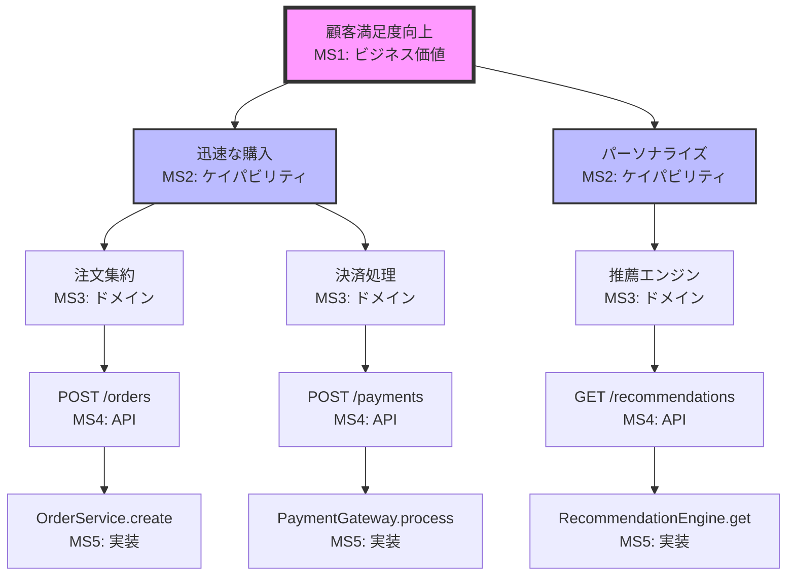

# parasol:value-inheritance - 価値継承チェックコマンド

## 概要

マイルストーン間で価値が正しく継承され、変質・劣化・逸脱していないかを検証します。MS1で定義された価値が、MS5の実装まで一貫して保たれることを保証する、Parasol V5の中核機能です。

## 価値継承の原則

### 価値の不変性原則
- **定義された価値は変わらない** - 実装方法は変わっても、提供する価値は不変
- **価値は増幅される** - 各段階で価値が具体化・強化される
- **価値の劣化を防ぐ** - 技術的制約による価値の妥協を検出・防止

### 価値の具体化階層
```
MS1: 抽象的価値（ビジネス価値）
 ↓ 継承と具体化
MS2: 機能的価値（ケイパビリティ）
 ↓ 継承と具体化
MS3: 構造的価値（ドメインモデル）
 ↓ 継承と具体化
MS4: 技術的価値（API・データ設計）
 ↓ 継承と具体化
MS5: 実現価値（実装コード）
```

## コマンド構文

```bash
amplifier parasol:value-inheritance <サブコマンド> [オプション]
```

## サブコマンド

### check - 価値継承のチェック

現在のマイルストーンまでの価値継承状況を検証します。

```bash
amplifier parasol:value-inheritance check [--from <ms>] [--to <ms>] [--deep]
```

**オプション:**
- `--from <ms>`: チェック開始マイルストーン（デフォルト: MS1）
- `--to <ms>`: チェック終了マイルストーン（デフォルト: 現在）
- `--deep`: 深層分析モード
- `--value <id>`: 特定の価値のみチェック

**実行例:**
```bash
# 全体の価値継承チェック
amplifier parasol:value-inheritance check

# MS1からMS3までの継承チェック
amplifier parasol:value-inheritance check --from MS1 --to MS3

# 特定価値の詳細追跡
amplifier parasol:value-inheritance check --value VAL-001 --deep
```

**出力例:**
```
価値継承チェック結果:

価値: "顧客の購買体験を向上させる" (VAL-001)

MS1 → MS2: ✓ 完全継承
  └─ ケイパビリティに適切に分解
     - quick-checkout (高優先度)
     - personalized-recommendations (中優先度)
     - unified-cart (高優先度)

MS2 → MS3: ⚠ 部分的継承
  └─ quick-checkoutがドメインモデルで複雑化
     警告: 3ステップが5ステップに増加

MS3 → MS4: ✗ 継承失敗
  └─ personalized-recommendationsが未実装
     エラー: APIエンドポイントが定義されていない

総合評価: 66.7% (要改善)
```

### visualize - 価値継承の可視化

価値がどのように各マイルストーンで具体化されているかを視覚的に表示します。

```bash
amplifier parasol:value-inheritance visualize [--output <file>] [--format <format>]
```

**オプション:**
- `--output <file>`: 出力ファイル名
- `--format <format>`: 出力形式（svg, png, html, mermaid）
- `--layout <type>`: レイアウト方式（tree, flow, matrix）
- `--filter <criteria>`: フィルタ条件

**可視化例（Mermaid形式）:**


### trace - 価値トレースの詳細追跡

特定の価値が各マイルストーンでどのように変換されているかを詳細に追跡します。

```bash
amplifier parasol:value-inheritance trace --value <value-id> [--reverse]
```

**オプション:**
- `--value <id>`: 追跡する価値ID
- `--reverse`: 逆方向追跡（実装から価値へ）
- `--show-decisions`: 各段階での設計決定を表示
- `--show-alternatives`: 検討された代替案を表示

**出力例:**
```
価値トレース: VAL-001 "顧客の購買体験を向上させる"

[MS1] ビジネス価値
├─ 定義: 購入プロセスの時間を50%削減
├─ KPI: 平均購入完了時間（現在: 5分 → 目標: 2.5分）
└─ ステークホルダー: エンドユーザー、マーケティング部門

    ↓ 分解

[MS2] ケイパビリティ: quick-checkout
├─ 機能: ワンクリック購入、保存された支払い方法
├─ 優先度: HIGH
└─ 想定効果: 購入時間を2分短縮

    ↓ モデリング
    
[MS3] ドメインモデル: CheckoutAggregate
├─ エンティティ: Order, Payment, ShippingInfo
├─ ビジネスルール: 在庫確認、価格計算、割引適用
└─ 設計決定: CQRSパターン採用（読み取り性能向上のため）

    ↓ 技術設計
    
[MS4] API設計: /api/v1/checkout/quick
├─ メソッド: POST
├─ レスポンスタイム目標: <500ms
└─ 設計決定: GraphQLではなくREST（シンプルさ優先）

    ↓ 実装
    
[MS5] 実装: QuickCheckoutService
├─ 技術: Node.js + Redis（キャッシュ）
├─ パフォーマンス: 平均300ms（目標達成 ✓）
└─ 価値実現: 購入時間 2.3分（目標達成 ✓）
```

### repair - 価値継承の修復

検出された価値継承の問題を修復します。

```bash
amplifier parasol:value-inheritance repair [--auto] [--interactive] [--strategy <name>]
```

**オプション:**
- `--auto`: 自動修復モード
- `--interactive`: 対話的修復モード
- `--strategy <name>`: 修復戦略（align, simplify, redesign）
- `--preview`: 修復内容のプレビュー

**修復戦略:**

1. **align（整合）戦略**
   - 下位マイルストーンを上位に合わせる
   - 最小限の変更で価値を復元

2. **simplify（簡素化）戦略**
   - 複雑化した実装を単純化
   - 価値に不要な要素を除去

3. **redesign（再設計）戦略**
   - 問題のある部分を再設計
   - 価値を最大化する新しいアプローチ

**実行例:**
```bash
# 自動修復（安全な修正のみ）
amplifier parasol:value-inheritance repair --auto

# 対話的修復
amplifier parasol:value-inheritance repair --interactive

# プレビューモード
amplifier parasol:value-inheritance repair --preview --strategy simplify
```

### metrics - 継承メトリクスの表示

価値継承の健全性を数値化して表示します。

```bash
amplifier parasol:value-inheritance metrics [--format <format>] [--export <file>]
```

**メトリクス例:**
```
価値継承メトリクス:

全体スコア: 87.5/100

詳細スコア:
├─ 完全性: 92% (23/25の価値が完全継承)
├─ 一貫性: 88% (価値の変質が少ない)
├─ 追跡性: 95% (ほぼ完全なトレーサビリティ)
└─ 実現度: 76% (KPI達成率)

問題のある価値:
1. VAL-003: MS3で30%の機能が欠落
2. VAL-007: MS4で技術的制約により劣化

トレンド: ↗ 改善中（先週比 +5.2%）
```

## 自動検証ルール

### 標準検証ルール

```yaml
# 組み込みの検証ルール
inheritance_rules:
  - completeness:
      description: "すべての価値が次段階に継承される"
      severity: error
      
  - no_degradation:
      description: "価値が劣化しない"
      severity: error
      
  - traceability:
      description: "価値が追跡可能"
      severity: warning
      
  - consistency:
      description: "価値の表現が一貫している"
      severity: warning
```

### カスタム検証ルール

```yaml
# .parasol/inheritance-rules.yaml
custom_rules:
  - id: performance-inheritance
    description: "パフォーマンス目標が継承される"
    check:
      MS1_target: "response_time < 1s"
      MS4_api: "sla.response_time < 1s"
      MS5_actual: "metrics.p99 < 1s"
    severity: error
    
  - id: security-inheritance
    description: "セキュリティ要件が継承される"
    check:
      MS1_requirement: "data_encryption"
      MS3_model: "includes_encryption"
      MS5_implementation: "uses_aes256"
    severity: critical
```

## 継承パターンライブラリ

### 成功パターン

```yaml
successful_patterns:
  - direct_mapping:
      description: "1対1の直接マッピング"
      example: "ビジネス価値 → 単一ケイパビリティ → 単一サービス"
      
  - fan_out:
      description: "1対多の展開"
      example: "1つの価値 → 複数の協調するケイパビリティ"
      
  - convergence:
      description: "多対1の収束"
      example: "複数の価値 → 統合されたプラットフォーム"
```

### アンチパターン

```yaml
anti_patterns:
  - value_dilution:
      description: "価値の希釈"
      symptom: "1つの価値が多数の小さな機能に分散"
      fix: "価値の再定義と集約"
      
  - technical_hijack:
      description: "技術による価値の乗っ取り"
      symptom: "技術的興味が価値を上書き"
      fix: "価値中心の再設計"
      
  - scope_creep:
      description: "スコープの逸脱"
      symptom: "元の価値と無関係な機能追加"
      fix: "価値への再フォーカス"
```

## CI/CD統合

### 継続的価値検証

```yaml
# .github/workflows/value-inheritance.yml
name: Value Inheritance Check
on:
  pull_request:
    paths:
      - 'src/**'
      - 'design/**'
      
jobs:
  check-inheritance:
    runs-on: ubuntu-latest
    steps:
      - name: Check Value Inheritance
        run: |
          amplifier parasol:value-inheritance check --strict
          amplifier parasol:value-inheritance metrics --export metrics.json
          
      - name: Comment PR
        if: failure()
        uses: actions/github-script@v6
        with:
          script: |
            github.issues.createComment({
              issue_number: context.issue.number,
              body: '❌ 価値継承チェックが失敗しました。詳細はログを確認してください。'
            })
```

## ベストプラクティス

### 1. 早期検出・早期修正

```bash
# 各マイルストーン移行前にチェック
amplifier parasol:value-inheritance check --before-advance

# 日次での継承状況確認
amplifier parasol:value-inheritance metrics --daily-report
```

### 2. 価値の明示的管理

```yaml
# 各成果物に価値タグを付与
# order-service.yaml
metadata:
  inherits_values: [VAL-001, VAL-003]
  implements_capabilities: [CAP-001, CAP-005]
  realizes_kpis: [response_time, conversion_rate]
```

### 3. チーム認識の統一

```bash
# 価値継承マップの共有
amplifier parasol:value-inheritance visualize --format pdf --share

# ワークショップの実施
amplifier parasol:value-inheritance workshop --topic "価値の劣化を防ぐ"
```

## トラブルシューティング

### 継承の断絶を発見した場合

```bash
# 詳細な断絶分析
amplifier parasol:value-inheritance analyze-break --value VAL-001

# 影響範囲の確認
amplifier parasol:value-inheritance impact --downstream

# 修復計画の生成
amplifier parasol:value-inheritance repair-plan --output plan.md
```

### パフォーマンス最適化

```bash
# 増分チェック（変更部分のみ）
amplifier parasol:value-inheritance check --incremental

# キャッシュ活用
amplifier parasol:value-inheritance check --use-cache

# 並列分析
amplifier parasol:value-inheritance check --parallel --workers 4
```

## 次のステップ

価値継承を確保したら：

```bash
# 統合実行で次のフェーズへ
amplifier parasol:quick-start --continue

# 全体の健全性チェック
amplifier parasol:project-health check
```