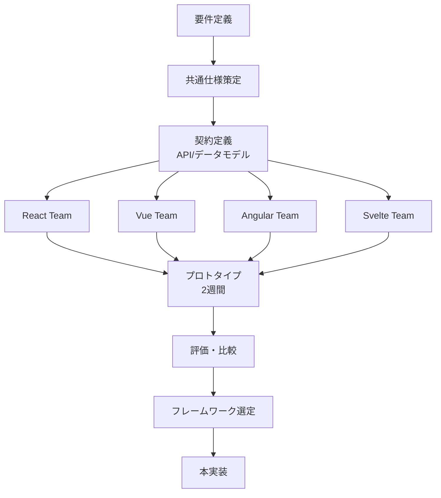

---
bundle:
  name: parasol-frontend-parallel
  version: 1.0.0
  description: Frontend parallel development patterns for multi-framework comparison
  
includes:
  - bundle: ./bc-modular-design.md
  
config:
  frontend_comparison:
    frameworks:
      - name: react
        meta_framework: next.js
        strengths: [ecosystem, performance, flexibility]
        use_cases: [complex-spa, e-commerce, saas]
        
      - name: vue
        meta_framework: nuxt.js
        strengths: [simplicity, progressive, approachable]
        use_cases: [medium-complexity, rapid-prototyping, japan-market]
        
      - name: angular
        meta_framework: angular-universal
        strengths: [enterprise, typescript-first, all-inclusive]
        use_cases: [large-enterprise, banking, complex-forms]
        
      - name: svelte
        meta_framework: sveltekit
        strengths: [performance, simplicity, compile-time]
        use_cases: [high-performance, interactive-apps, small-bundles]
        
    decision_criteria:
      - name: team_expertise
        weight: 0.3
        description: チームの既存スキルセット
        
      - name: ecosystem_maturity
        weight: 0.2
        description: ライブラリ・ツールの充実度
        
      - name: performance_requirements
        weight: 0.2
        description: パフォーマンス要件
        
      - name: maintenance_cost
        weight: 0.2
        description: 長期的な保守コスト
        
      - name: hiring_ease
        weight: 0.1
        description: 開発者採用の容易さ
---

# Frontend Parallel Development Pattern

フロントエンドフレームワークを並列で開発・評価するためのパターンです。

## なぜ並列開発が必要か

### 技術選定リスクの軽減
- フレームワーク選定の失敗は後戻りが困難
- 実際に作ってみないと分からない課題が多い
- チームの生産性に直結する重要な決定

### 学習とイノベーション
- 複数のアプローチから最良のパターンを発見
- フレームワーク間の良いところを相互に取り入れ
- チーム全体の技術力向上

## 並列開発フロー



## 実装例：ECサイトのフロントエンド

### 共通契約定義

```yaml
# contracts/frontend-contract.yaml
api_contract:
  type: graphql
  schema: ./api/schema.graphql
  
data_models:
  Product:
    fields:
      - id: string
      - name: string  
      - price: number
      - images: string[]
      - variants: ProductVariant[]
      
  Cart:
    fields:
      - items: CartItem[]
      - total: number
      - tax: number
      
features:
  required:
    - product_listing
    - product_detail
    - cart_management
    - checkout_flow
    - user_authentication
    
performance_requirements:
  - first_contentful_paint: <1.5s
  - time_to_interactive: <3s
  - lighthouse_score: >90
```

### フレームワーク別実装比較

#### React実装の特徴

```tsx
// 強み: コンポーネントの再利用性とエコシステム
const ProductList = () => {
  const { products, loading, error } = useProducts();
  const { addToCart } = useCart();
  
  return (
    <ProductGrid>
      {products.map(product => (
        <ProductCard 
          key={product.id}
          product={product}
          onAddToCart={addToCart}
        />
      ))}
    </ProductGrid>
  );
};

// 課題: ボイラープレートが多い、状態管理の複雑さ
```

#### Vue実装の特徴

```vue
<!-- 強み: テンプレートの直感性と段階的な採用 -->
<template>
  <ProductGrid>
    <ProductCard
      v-for="product in products"
      :key="product.id"
      :product="product"
      @add-to-cart="addToCart"
    />
  </ProductGrid>
</template>

<script setup>
// Composition APIでロジックの整理が容易
const { products } = useProducts()
const { addToCart } = useCart()
</script>

<!-- 課題: TypeScriptサポートがReactより弱い -->
```

### パフォーマンス比較

```yaml
performance_results:
  react_next:
    bundle_size: 95KB
    fcp: 1.2s
    tti: 2.8s
    lighthouse: 92
    
  vue_nuxt:
    bundle_size: 89KB
    fcp: 1.1s
    tti: 2.5s
    lighthouse: 94
    
  angular_universal:
    bundle_size: 125KB
    fcp: 1.4s
    tti: 3.2s
    lighthouse: 88
    
  svelte_kit:
    bundle_size: 45KB
    fcp: 0.9s
    tti: 1.8s
    lighthouse: 96
```

## 評価マトリクス

```yaml
evaluation_matrix:
  react:
    team_expertise: 7/10 # 既存メンバー2名が経験あり
    ecosystem_maturity: 10/10 # 最も充実
    performance: 8/10 # 良好
    maintenance: 8/10 # 情報豊富
    hiring: 9/10 # 人材豊富
    total_score: 8.5
    
  vue:
    team_expertise: 9/10 # 既存メンバー3名が経験あり
    ecosystem_maturity: 8/10 # 十分充実
    performance: 9/10 # 優秀
    maintenance: 9/10 # シンプル
    hiring: 7/10 # 日本では人材あり
    total_score: 8.6
    
  decision:
    primary: vue # チーム経験とパフォーマンスを重視
    secondary: react # エコシステムが必要な場合の選択肢
    rationale: |
      - チームの既存スキルを最大限活用
      - パフォーマンス要件を満たす
      - 日本市場での採用も考慮
```

## 移行戦略

選定後も他フレームワークの知見を活用：

```yaml
migration_strategy:
  phase1:
    action: Vue.jsで本実装開始
    incorporate:
      from_react:
        - コンポーネント設計パターン
        - Storybookによるコンポーネント管理
      from_svelte:
        - コンパイル時最適化の考え方
        
  phase2:
    action: マイクロフロントエンドの検討
    plan:
      - 新機能をReactで実装してみる
      - 段階的な共存を実現
      
  continuous:
    - 四半期ごとに技術選定を再評価
    - 新しいフレームワークの調査を継続
```

## CLI コマンド

```bash
# フロントエンド並列生成
parasol frontend generate ShoppingCart \
  --frameworks react,vue,angular,svelte \
  --features product-list,cart,checkout \
  --api graphql

# パフォーマンステスト実行
parasol frontend benchmark ShoppingCart \
  --frameworks all \
  --scenarios product-browse,add-to-cart,checkout

# 比較レポート生成
parasol frontend compare ShoppingCart \
  --output comparison-report.html \
  --criteria performance,dx,bundle-size

# 選定したフレームワークで本実装
parasol frontend implement ShoppingCart \
  --framework vue \
  --include-patterns react:component-patterns
```

## ベストプラクティス

### 1. 共通化すべきもの
- デザインシステム（デザイントークン）
- APIクライアント仕様
- ビジネスロジック（可能な限り）
- E2Eテストシナリオ

### 2. フレームワーク固有に最適化すべきもの
- 状態管理パターン
- ルーティング設定
- ビルド最適化
- 開発者体験

### 3. 評価期間の目安
- プロトタイプ: 2週間
- 機能実装: 1-2スプリント
- パフォーマンス測定: 1週間
- 意思決定: 1週間

## まとめ

並列フロントエンド開発により：
- 技術選定の確実性向上
- チームの学習効果
- 最適なソリューションの発見
- 将来の技術変更への備え

重要なのは「すべて試してから決める」こと。