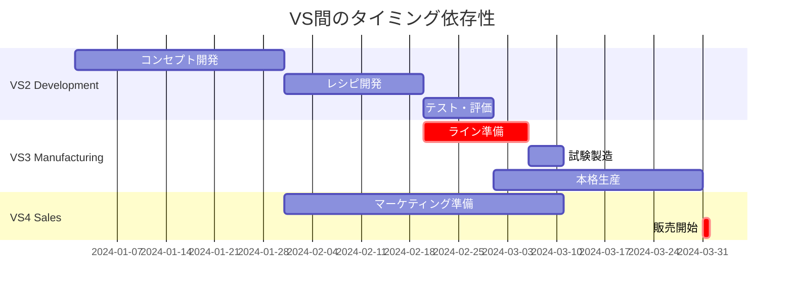

# Value Stream Dependency Analyzer

## 概要

Parasolプロジェクトにおけるバリューストリーム間の依存関係を分析するテンプレート。

## 依存関係発見ワークシート

### 1. データフローマッピング

```yaml
project: [PROJECT_NAME]
analysis_date: [DATE]

# Step 1: 各VSの入出力を列挙

VS2_Product_Development:
  inputs:
    external:
      - 市場調査データ
      - 顧客フィードバック
      - 競合分析
    from_other_VS:
      - VS4: 販売実績データ
      - VS3: 製造制約情報
    
  outputs:
    - 製品仕様書
    - レシピ情報
    - 品質基準
    - マーケティング素材

  internal_processes:
    - コンセプト開発
    - 試作品製造
    - テスト・評価
    - 承認プロセス

# Step 2: データ依存関係の特定

data_dependencies:
  VS2_to_VS3:
    data_type: レシピ・仕様
    format: structured_document
    frequency: per_product_launch
    criticality: high
    latency_requirement: before_production
    
  VS3_to_VS4:
    data_type: 在庫情報
    format: real_time_api
    frequency: continuous
    criticality: high
    latency_requirement: < 1_minute
```

### 2. タイミング依存性チャート



### 3. イベント相互作用マトリックス

```yaml
event_interaction_matrix:
  # トリガーイベントと影響
  
  new_product_approved:
    source: VS2
    triggers:
      VS3:
        - action: prepare_production_line
        - timing: immediate
        - priority: high
      VS4:
        - action: develop_marketing_plan
        - timing: parallel
        - priority: high
  
  quality_issue_detected:
    source: VS3
    triggers:
      VS2:
        - action: investigate_recipe
        - timing: immediate
        - priority: critical
      VS4:
        - action: halt_affected_sales
        - timing: immediate
        - priority: critical
  
  inventory_shortage:
    source: VS4
    triggers:
      VS3:
        - action: expedite_production
        - timing: immediate
        - priority: high
```

### 4. リソース共有分析

```yaml
shared_resources:
  human_resources:
    food_scientists:
      primary: VS2
      secondary: VS3
      conflict_resolution: VS2_priority
      
    quality_inspectors:
      shared_between: [VS2, VS3]
      allocation: 60_40_split
      
  equipment:
    pilot_plant:
      primary: VS2
      secondary: VS3
      scheduling: weekly_rotation
      
  systems:
    recipe_database:
      owner: VS2
      consumers: [VS3, VS4]
      access_pattern: read_heavy
```

### 5. ビジネスルール依存性

```yaml
business_rule_dependencies:
  quality_standards:
    defined_by: VS2
    enforced_by: VS3
    reported_to: VS4
    
  pricing_rules:
    factors:
      - VS2: product_cost_structure
      - VS3: manufacturing_cost
      - VS4: market_positioning
    decision_flow: VS2 → VS3 → VS4
    
  inventory_policies:
    min_stock_levels:
      - defined_by: VS4
      - constrained_by: VS3_capacity
      - influenced_by: VS2_shelf_life
```

## 共通ケイパビリティ発見チェックリスト

### 横断的機能の識別

- [ ] 複数のVSで同じ機能を実装していないか？
- [ ] 共通のビジネスルールはあるか？
- [ ] 同じデータを複数VSが必要としていないか？
- [ ] 統一が必要な品質基準はあるか？

### 共通ケイパビリティ候補

```yaml
candidate_capabilities:
  quality_management:
    current_state:
      VS2: 品質基準定義
      VS3: 品質検査実施
      VS4: 品質クレーム対応
    
    unified_capability:
      name: integrated_quality_system
      functions:
        - define_standards
        - monitor_compliance
        - track_metrics
        - manage_issues
      benefits:
        - single_source_of_truth
        - end_to_end_traceability
        - automated_alerts
```

## コリジョン分析テンプレート

### VSペアコリジョン

```json
{
  "collision_analysis": {
    "pair": "VS[X] × VS[Y]",
    "concept_a": {
      "name": "VS[X]のコア特性",
      "key_attributes": []
    },
    "concept_b": {
      "name": "VS[Y]のコア特性",
      "key_attributes": []
    },
    "forced_combination": "何を統合するか",
    "emergent_properties": [
      "新たな機能・価値",
      "予想外のシナジー",
      "効率化の可能性"
    ],
    "breakthrough_potential": "high/medium/low",
    "implementation_difficulty": "high/medium/low",
    "recommended_capability": {
      "name": "",
      "description": "",
      "value_proposition": ""
    }
  }
}
```

## 統合アーキテクチャパターン

### 1. ハブ&スポークパターン

```yaml
hub_and_spoke:
  central_hub: data_integration_platform
  spokes:
    - VS2: recipe_publisher
    - VS3: production_events
    - VS4: sales_analytics
  benefits:
    - centralized_transformation
    - single_point_of_governance
    - simplified_monitoring
```

### 2. メッシュパターン

```yaml
mesh_pattern:
  direct_connections:
    VS2_VS3: recipe_sync_api
    VS3_VS4: inventory_stream
    VS2_VS4: product_catalog_sync
  when_to_use:
    - low_latency_critical
    - simple_integrations
    - limited_transformation_needs
```

### 3. イベントバスパターン

```yaml
event_bus:
  topics:
    - domain_events
    - system_events
    - audit_events
  publishers:
    VS2: [product_created, recipe_updated]
    VS3: [batch_completed, quality_check_passed]
    VS4: [order_placed, inventory_low]
  subscribers:
    quality_service: [quality_check_passed, product_created]
    inventory_service: [batch_completed, order_placed]
```

## 分析結果テンプレート

```markdown
# VS依存関係分析結果

## エグゼクティブサマリ

- 分析対象VS: [VS2, VS3, VS4]
- 発見した依存関係: [X]件
- 共通ケイパビリティ: [Y]件
- クリティカルパス: [VS2 → VS3 → VS4]

## 優先対応事項

1. **データ統合基盤**
   - 理由: 全VSがリアルタイムデータを必要
   - ROI: 高

2. **品質管理統合**
   - 理由: 現在は分散しており追跡が困難
   - ROI: 中

## 推奨アーキテクチャ

[Hub & Spoke / Mesh / Event-driven]

## Next Steps

1. 詳細設計フェーズへ
2. POC実装
3. 段階的移行計画
```