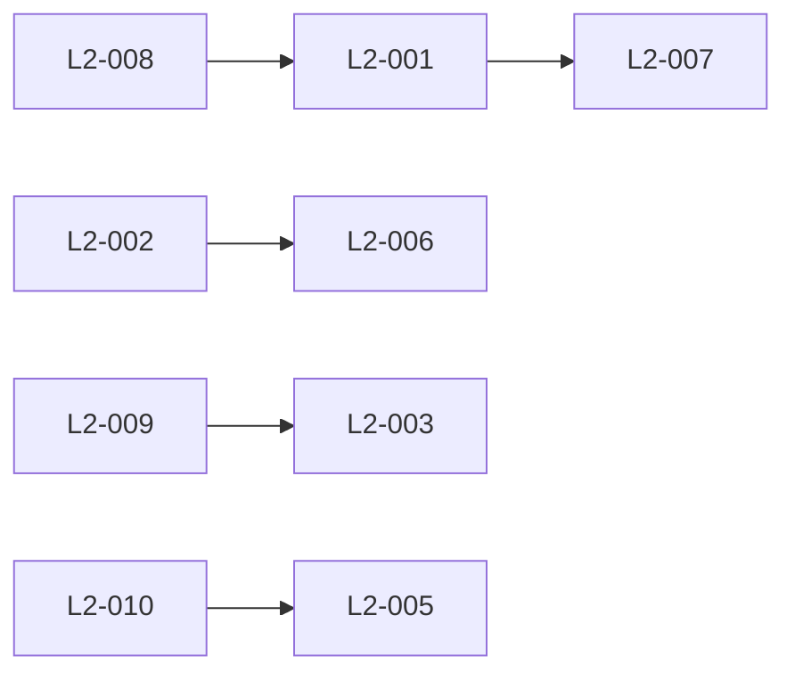

# Phase 2-2: L2戦術的能力設計

## 実行コンテキスト

このドキュメントは、アサヒグループの戦術的能力（L2 Tactical Capabilities）を設計するための実行可能なMarkdownです。

### 前提条件
- Phase 2-1のL1戦略的能力が定義済みであること
- L1能力5つが確定していること
- 各L1能力の成熟度評価が完了していること

### 実行方法
```bash
/ddd:1-plan parasol/phases/phase2-capability/2-2-tactical-capabilities.md
```

---

## 入力：L1戦略的能力からの要求

### L1能力の一覧
1. **L1-001**: 持続可能価値創造エクセレンス
2. **L1-002**: グローバル市場リーダーシップ
3. **L1-003**: 革新的エコシステム構築
4. **L1-004**: デジタル変革リーダーシップ
5. **L1-005**: レジリエント経営基盤

### 能力分解の原則
- 各L1能力に対して2-3個のL2能力を定義
- 具体的で実行可能なレベルまで分解
- 測定可能な成果を含む

---

## タスク：L2戦術的能力の定義

### 実行ステップ

#### Step 1: L1→L2能力マッピング

各L1能力を実現するための戦術的能力を特定します。

```
L1能力 → L2能力群
----------------------------------------
L1-001（持続可能価値） → L2-001: 環境イノベーション
                     → L2-002: 健康・ウェルネス強化
                     → L2-003: 地域共創
                     → L2-004: ESGガバナンス

L1-002（市場リーダー） → L2-005: アジア市場開拓
                     → L2-006: プレミアム化戦略
                     → L2-007: 新カテゴリー創造

L1-003（エコシステム） → L2-008: オープンイノベーション
                     → L2-009: サプライチェーン統合
                     → L2-010: デジタルプラットフォーム
```

#### Step 2: 各L2能力の詳細定義

##### L2-001: 環境イノベーション能力
```yaml
定義: カーボンニュートラル・循環型経済を実現する技術革新
重要度: 最高
実行内容:
  - CO2削減技術の開発・実装
  - 循環型パッケージング
  - 水資源保全・再生
成功指標:
  - CO2削減: -50%（2030年）
  - リサイクル率: 100%
  - 水使用効率: 2.5L/L
必要リソース:
  - 環境技術者: 100名
  - 投資額: 500億円/5年
```

##### L2-002: 健康・ウェルネス強化能力
```yaml
定義: 消費者の心身の健康に貢献する製品・サービス開発
重要度: 高
実行内容:
  - 機能性食品の開発
  - パーソナライズド栄養
  - ウェルネスプログラム
成功指標:
  - 機能性製品比率: 40%
  - 健康貢献者数: 1000万人
  - 顧客健康スコア: +20%
必要リソース:
  - R&D人材: 200名
  - 臨床試験: 100件
```

[以降のL2-003からL2-010も同様に定義]

#### Step 3: L2能力の優先順位付け

優先順位マトリクス：

| L2能力 | ビジネス影響 | 実現可能性 | 優先度 | 開始時期 |
|--------|-------------|-----------|--------|----------|
| L2-010 | 高 | 高 | 最優先 | 即時 |
| L2-001 | 高 | 中 | 優先 | Q1 |
| L2-002 | 高 | 高 | 最優先 | 即時 |
| L2-005 | 高 | 中 | 優先 | Q2 |
| L2-008 | 中 | 高 | 優先 | Q1 |

#### Step 4: 能力間の依存関係



---

## 出力：L2戦術的能力定義書

### 生成する成果物
1. L2能力定義書（10能力の詳細）
2. L1-L2マッピング表
3. 優先順位マトリクス
4. 依存関係図
5. 実行ロードマップ

### 保存先
```
projects/asahi-parasol-development/
└── phase2-capability-design/
    └── L2-tactical-capabilities.md
```

---

## 検証項目

- [ ] 各L2能力がL1能力の実現に貢献するか
- [ ] L2能力が具体的で実行可能か
- [ ] 成功指標が測定可能か
- [ ] リソース要件が現実的か
- [ ] 優先順位が戦略と整合しているか

---

## 次のステップ

このL2能力定義が承認されたら：

```bash
# L3運用的能力の設計へ進む
/ddd:1-plan parasol/phases/phase2-capability/2-3-operational-capabilities.md
```

---

## 参考情報

- [L1戦略的能力定義書](../../projects/asahi-parasol-development/phase2-capability-design/L1-strategic-capabilities.md)
- [価値定義書](../../projects/asahi-parasol-development/phase1-value-analysis/value-definition.md)
- [パラソルフレームワーク](../README.md)

---

*このドキュメントは実行可能なMDとして、AmplifierのDDDワークフローで処理できます。*