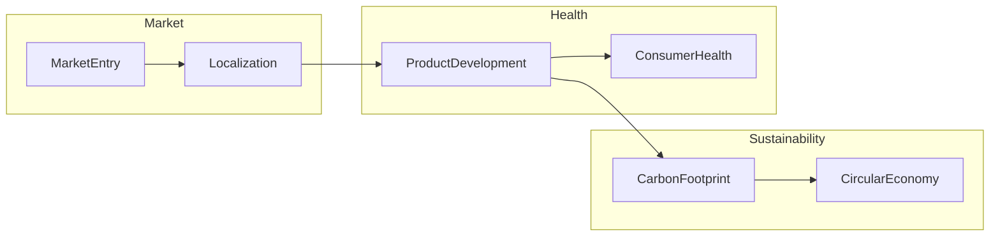

# Phase 3-2: エンティティと集約設計

## 実行コンテキスト

このドキュメントは、各境界コンテキスト内のエンティティと集約（Aggregates）を設計するための実行可能なMarkdownです。

### 前提条件
- Phase 3-1の境界コンテキストが定義済みであること
- 各コンテキストの責任範囲が明確であること
- ユビキタス言語が確立されていること

### 実行方法
```bash
/ddd:1-plan parasol/phases/phase3-domain/3-2-entities-aggregates.md
```

---

## 入力：境界コンテキストからの要求

### 主要コンテキスト
1. **サステナビリティコンテキスト**: 環境価値管理
2. **健康ウェルネスコンテキスト**: 健康価値創造
3. **グローバル市場コンテキスト**: 市場展開管理
4. **イノベーションコンテキスト**: R&D・パートナーシップ

---

## タスク：エンティティと集約の定義

### 実行ステップ

#### Step 1: サステナビリティコンテキストのモデル

##### 集約: カーボンフットプリント管理
```yaml
集約ルート: CarbonFootprint
エンティティ:
  CarbonFootprint:
    ID: FootprintId
    属性:
      - productId: ProductId
      - scope1Emission: CO2Amount
      - scope2Emission: CO2Amount
      - scope3Emission: CO2Amount
      - measurementDate: Date
      - certificationStatus: CertificationStatus
    ビジネスルール:
      - 総排出量は各スコープの合計
      - 認証は年1回更新必須
      - 削減目標との差分を自動計算

  EmissionSource:
    ID: SourceId
    属性:
      - sourceType: SourceType
      - location: Location
      - emissionFactor: Factor
      - activeStatus: Boolean

値オブジェクト:
  CO2Amount:
    - value: Decimal
    - unit: "tCO2e"

  CertificationStatus:
    - status: Enum[Pending, Certified, Expired]
    - certifiedBy: String
    - expiryDate: Date
```

##### 集約: 循環型経済管理
```yaml
集約ルート: CircularEconomy
エンティティ:
  MaterialFlow:
    ID: FlowId
    属性:
      - materialType: MaterialType
      - inputAmount: Amount
      - recycledContent: Percentage
      - outputDestination: Destination
      - traceabilityCode: String
    ビジネスルール:
      - リサイクル率は70%以上維持
      - トレーサビリティは必須

  RecyclingPartner:
    ID: PartnerId
    属性:
      - partnerName: String
      - certifications: List<Certification>
      - capacity: Amount
      - performance: Score
```

#### Step 2: 健康ウェルネスコンテキストのモデル

##### 集約: 商品開発パイプライン
```yaml
集約ルート: ProductDevelopment
エンティティ:
  DevelopmentProject:
    ID: ProjectId
    属性:
      - projectName: String
      - category: ProductCategory
      - stage: DevelopmentStage
      - healthClaims: List<HealthClaim>
      - targetLaunchDate: Date
    ビジネスルール:
      - ステージゲート承認必須
      - 健康効果は科学的根拠必須
      - 開発期間6ヶ月以内

  ClinicalTrial:
    ID: TrialId
    属性:
      - protocol: TrialProtocol
      - participants: Integer
      - results: TrialResults
      - ethicsApproval: ApprovalStatus

値オブジェクト:
  HealthClaim:
    - claimType: Enum[Functional, Nutritional]
    - evidence: ScientificEvidence
    - approvalStatus: RegulatoryStatus

  DevelopmentStage:
    - stage: Enum[Ideation, Prototype, Testing, Launch]
    - gatekeeper: Role
    - criteria: List<Criterion>
```

##### 集約: 消費者健康プロファイル
```yaml
集約ルート: ConsumerHealth
エンティティ:
  HealthProfile:
    ID: ProfileId
    属性:
      - consumerId: ConsumerId
      - healthScore: Score
      - nutritionNeeds: NutritionProfile
      - preferences: List<Preference>
      - consentStatus: ConsentStatus
    ビジネスルール:
      - 個人情報保護法準拠
      - 同意なしのデータ利用禁止
      - 健康スコアは月次更新

  WellnessJourney:
    ID: JourneyId
    属性:
      - startDate: Date
      - goals: List<HealthGoal>
      - progress: List<Milestone>
      - recommendations: List<Product>
```

#### Step 3: グローバル市場コンテキストのモデル

##### 集約: 市場エントリー戦略
```yaml
集約ルート: MarketEntry
エンティティ:
  MarketStrategy:
    ID: StrategyId
    属性:
      - targetMarket: Market
      - entryMode: EntryMode
      - localPartners: List<Partner>
      - regulatoryRequirements: List<Requirement>
      - projectedROI: ROI
    ビジネスルール:
      - 規制要件クリア必須
      - ROI 150%以上
      - 現地パートナー必須

  Localization:
    ID: LocalizationId
    属性:
      - originalProduct: ProductId
      - adaptations: List<Adaptation>
      - localBrand: BrandIdentity
      - pricingStrategy: PricingModel

値オブジェクト:
  Market:
    - country: Country
    - region: Region
    - marketSize: Money
    - growthRate: Percentage

  EntryMode:
    - mode: Enum[Export, JointVenture, Acquisition]
    - investment: Money
    - timeline: Duration
```

#### Step 4: ドメインイベントの定義

```yaml
サステナビリティコンテキスト:
  - CarbonFootprintMeasured
  - EmissionTargetAchieved
  - RecyclingRateImproved
  - SustainabilityCertified

健康ウェルネスコンテキスト:
  - ProductDevelopmentStarted
  - ClinicalTrialCompleted
  - HealthClaimApproved
  - ConsumerHealthImproved

グローバル市場コンテキスト:
  - MarketEntryApproved
  - LocalizationCompleted
  - PartnershipEstablished
  - MarketShareGained
```

#### Step 5: 集約間の関係性



---

## 出力：エンティティ・集約定義書

### 生成する成果物
1. エンティティカタログ（全エンティティの詳細）
2. 集約定義書（境界とルール）
3. 値オブジェクト一覧
4. ドメインイベントカタログ
5. ERD（Entity Relationship Diagram）

### 保存先
```
projects/asahi-parasol-development/
└── phase3-domain-modeling/
    ├── entities-aggregates.md
    ├── domain-events.md
    └── erd-diagrams/
```

---

## 検証項目

- [ ] 集約の境界が適切か
- [ ] エンティティの識別子が一意か
- [ ] ビジネスルールが実装可能か
- [ ] 値オブジェクトが不変か
- [ ] ドメインイベントが網羅的か

---

## 次のステップ

このエンティティ・集約定義が承認されたら：

```bash
# ドメインサービスとリポジトリの設計へ進む
/ddd:1-plan parasol/phases/phase3-domain/3-3-domain-services.md
```

---

## 参考情報

- [境界コンテキスト定義書](./3-1-bounded-contexts.md)
- [能力設計書](../../projects/asahi-parasol-development/phase2-capability-design/)
- [DDDパターン](https://www.domainlanguage.com/ddd/patterns/)

---

*このドキュメントは実行可能なMDとして、AmplifierのDDDワークフローで処理できます。*