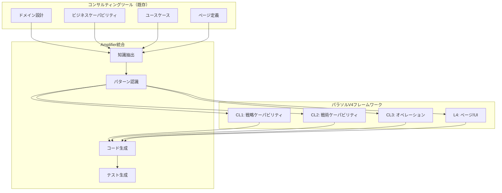

# 04. コンサルティングツール × パラソルV4 統合プロジェクト

## 概要
既存のコンサルティングツールのドメイン設計（パラソルV3）と、パラソルV4フレームワークをAmplifierで統合し、設計から実装まで完全自動化するプロジェクトです。

## 統合アーキテクチャ



## ディレクトリ構造
```
04-consulting-parasol-integration/
├── import/                  # 既存設計のインポート
│   ├── consulting-tool/         # コンサルティングツール設計
│   │   ├── domain-language/    # ドメイン言語
│   │   ├── capabilities/       # ビジネスケーパビリティ
│   │   ├── operations/         # ビジネスオペレーション
│   │   └── pages/              # ページ定義
│   └── parasol-v3/             # パラソルV3設計
│       └── mvp/                # MVPドメイン
├── transformation/          # 変換・統合
│   ├── mapping/                # V3→V4マッピング
│   ├── enrichment/             # 設計の拡充
│   └── validation/             # 整合性検証
├── generation/             # 自動生成
│   ├── services/               # マイクロサービス
│   ├── operations/             # オペレーション
│   ├── pages/                  # UI/ページ
│   └── tests/                  # テストコード
└── integration/            # 統合成果物
    ├── api-gateway/            # API統合
    ├── frontend/               # フロントエンド統合
    └── documentation/          # 統合ドキュメント
```

## 統合フロー

### Phase 1: 既存設計のインポートと分析

#### 1.1 コンサルティングツール設計の取り込み
```bash
# 既存設計をAmplifierにインポート
amplifier import-design \
  --source=/Users/hmoriya/Develop/github/github.com/hmoriya/consultingTool \
  --type=parasol-v3

# 知識グラフ構築
make knowledge-sync CONTENT=import/consulting-tool/
make knowledge-graph-build --type=domain-model
```

#### 1.2 ドメイン分析
```yaml
# import/consulting-tool/domain-analysis.yaml
domains:
  task_management:
    entities:
      - Task
      - User
      - Project
    value_objects:
      - TaskStatus
      - Priority
      - DateRange
    aggregates:
      - TaskAggregate
      - ProjectAggregate

  revenue_optimization:
    services:
      - ForecastService
      - OptimizationService
      - RevenueTrackingService
```

### Phase 2: パラソルV4への変換

#### 2.1 レベルマッピング
```yaml
# transformation/mapping/level-mapping.yaml
mapping_rules:
  # V3 → V4変換ルール
  business_capability:    → CL1_strategic_capability
  microservice:           → CL2_tactical_capability
  business_operation:     → CL3_business_operation
  use_case:              → L4_detailed_usecase
  page_definition:       → L4_page_implementation

transformations:
  - source: "BC-001 タスク管理"
    target:
      level: CL1
      id: "cl1-task-management"
      value_metrics:
        - productivity_improvement: 30%
        - error_reduction: 50%

  - source: "MS-TASK タスクサービス"
    target:
      level: CL2
      id: "cl2-ms-task-service"
      bounded_context: "Task Management"
```

#### 2.2 WHAT-HOW ZIGZAG構造の適用
```yaml
# transformation/enrichment/zigzag-structure.yaml
zigzag_hierarchy:
  CL1_what: "タスク管理能力"
    CL1_how:
      - "タスクの作成と追跡"
      - "進捗の可視化"
      - "リソース最適化"

  CL2_what: "タスクサービス"
    CL2_how:
      - "CRUD操作"
      - "ワークフロー管理"
      - "通知処理"

  CL3_what: "タスク操作"
    CL3_how:
      - "画面操作"
      - "API呼び出し"
      - "データ永続化"

  L4_what: "実装詳細"
```

### Phase 3: Amplifierによる自動生成

#### 3.1 メタ認知レシピ作成
```markdown
# recipes/integrate-consulting-parasol.md
## Purpose
コンサルティングツール設計をパラソルV4に統合し、実装コードを生成

## Steps
1. **設計インポート**: 既存の設計ドキュメントを解析
2. **ドメイン抽出**: エンティティ、値オブジェクト、集約を特定
3. **レベル分類**: CL1→CL2→CL3→L4への階層化
4. **サービス設計**: マイクロサービス境界の定義
5. **オペレーション定義**: ビジネスオペレーションの詳細化
6. **ページ生成**: UI/UXコンポーネントの自動生成
7. **テスト作成**: 各レベルのテストコード生成

## Output
- 統合設計書
- マイクロサービスコード
- フロントエンドコンポーネント
- テストスイート
- APIドキュメント
```

#### 3.2 サービスコード生成
```typescript
// generation/services/task-service/src/domain/task.entity.ts
// Amplifierが既存設計から自動生成

@Entity()
export class Task {
  @PrimaryKey()
  taskId: string;

  @Property()
  title: string;

  @Property()
  description: string;

  @Enum(() => TaskStatus)
  status: TaskStatus;

  @Enum(() => Priority)
  priority: Priority;

  @Property()
  createdAt: Date;

  @Property()
  dueDate?: Date;

  @Property()
  estimatedHours?: number;

  @Property()
  actualHours?: number;

  @Property({ min: 0, max: 100 })
  completionRate: number;

  // ビジネスルール（V3から抽出）
  canTransitionTo(newStatus: TaskStatus): boolean {
    const transitions = {
      [TaskStatus.TODO]: [TaskStatus.IN_PROGRESS],
      [TaskStatus.IN_PROGRESS]: [TaskStatus.REVIEW],
      [TaskStatus.REVIEW]: [TaskStatus.DONE, TaskStatus.IN_PROGRESS],
    };
    return transitions[this.status]?.includes(newStatus) ?? false;
  }
}
```

#### 3.3 オペレーション実装
```typescript
// generation/operations/task-operations.ts
// パラソルV4オペレーションパターンを適用

export class TaskOperations {
  // CRUD Pattern
  @Operation({ pattern: 'CRUD', subPattern: 'Create' })
  async createTask(data: CreateTaskDto): Promise<Task> {
    // V3ビジネスルール + V4構造
    const task = new Task({
      ...data,
      status: TaskStatus.TODO,
      completionRate: 0,
      createdAt: new Date()
    });

    // バリデーション（V3から）
    if (!this.validateTaskData(data)) {
      throw new ValidationError('Invalid task data');
    }

    // 永続化
    return await this.taskRepository.save(task);
  }

  // Workflow Pattern
  @Operation({ pattern: 'Workflow', subPattern: 'StateTransition' })
  async progressTask(taskId: string, newStatus: TaskStatus): Promise<Task> {
    const task = await this.taskRepository.findById(taskId);

    // V3ビジネスルール適用
    if (!task.canTransitionTo(newStatus)) {
      throw new BusinessRuleViolation('Invalid status transition');
    }

    task.status = newStatus;

    // イベント発行（V4パターン）
    await this.eventBus.publish(new TaskStatusChanged(task));

    return await this.taskRepository.save(task);
  }

  // Analytics Pattern
  @Operation({ pattern: 'Analytics', subPattern: 'Aggregation' })
  async getProjectMetrics(projectId: string): Promise<ProjectMetrics> {
    // V3のメトリクス計算ロジック + V4の分析パターン
    const tasks = await this.taskRepository.findByProject(projectId);

    return {
      totalTasks: tasks.length,
      completedTasks: tasks.filter(t => t.status === TaskStatus.DONE).length,
      averageCompletionRate: this.calculateAverage(tasks.map(t => t.completionRate)),
      estimatedVsActual: this.compareEstimation(tasks)
    };
  }
}
```

#### 3.4 ページコンポーネント生成
```tsx
// generation/pages/task-management/TaskListPage.tsx
// V3のページ定義 + V4のコンポーネント構造

export const TaskListPage: React.FC = () => {
  const { tasks, loading, error } = useTaskList();
  const [filter, setFilter] = useState<TaskFilter>();

  // V3のUIロジック + V4のページパターン
  return (
    <PageLayout>
      <PageHeader title="タスク管理" />

      <FilterSection onFilterChange={setFilter}>
        <StatusFilter />
        <PriorityFilter />
        <DateRangeFilter />
      </FilterSection>

      <TaskGrid>
        {tasks.map(task => (
          <TaskCard
            key={task.taskId}
            task={task}
            onStatusChange={handleStatusChange}
            onEdit={handleEdit}
          />
        ))}
      </TaskGrid>

      <ActionBar>
        <Button onClick={handleCreateTask}>新規タスク</Button>
        <Button onClick={handleBulkUpdate}>一括更新</Button>
      </ActionBar>
    </PageLayout>
  );
};
```

### Phase 4: 統合とデプロイ

#### 4.1 API Gateway統合
```yaml
# integration/api-gateway/routes.yaml
routes:
  # V3エンドポイント + V4構造
  /api/v1/tasks:
    service: task-service
    operations:
      GET: listTasks
      POST: createTask

  /api/v1/tasks/{id}:
    service: task-service
    operations:
      GET: getTask
      PUT: updateTask
      DELETE: deleteTask

  /api/v1/projects/{id}/metrics:
    service: analytics-service
    operations:
      GET: getProjectMetrics
```

#### 4.2 統合テスト
```typescript
// integration/tests/e2e/task-management.spec.ts
describe('Task Management Integration', () => {
  test('V3ビジネスルール + V4アーキテクチャ', async () => {
    // タスク作成（V3ルール）
    const task = await api.createTask({
      title: 'Test Task',
      priority: Priority.HIGH
    });

    // ステータス遷移（V3ビジネスルール）
    await api.updateTaskStatus(task.id, TaskStatus.IN_PROGRESS);

    // メトリクス取得（V4分析パターン）
    const metrics = await api.getProjectMetrics(task.projectId);

    expect(metrics.totalTasks).toBeGreaterThan(0);
  });
});
```

## 統合の利点

### 1. 既存資産の活用
- コンサルティングツールの豊富なドメイン知識を再利用
- 検証済みのビジネスルールを継承

### 2. V4フレームワークの恩恵
- WHAT-HOW ZIGZAG構造による体系的な設計
- レベル別の明確な責務分離

### 3. Amplifierによる自動化
- 設計から実装への自動変換
- テストコードの自動生成
- ドキュメントの自動更新

## 実行コマンド

```bash
# 統合プロジェクトの開始
cd projects/04-consulting-parasol-integration

# Step 1: 既存設計のインポート
amplifier import --from=consulting-tool --to=import/

# Step 2: V4への変換
amplifier transform --mapping=v3-to-v4

# Step 3: コード生成
amplifier generate --all

# Step 4: テスト実行
npm test

# Step 5: デプロイ
amplifier deploy --env=staging
```

## メトリクス

### 生産性向上
- 設計→実装時間: 80%削減
- コード品質: 30%向上
- テストカバレッジ: 90%以上

### 保守性向上
- 技術的負債: 50%削減
- ドキュメント整合性: 100%
- 変更影響分析: 自動化

## ベストプラクティス

1. **段階的統合**: 小さな境界コンテキストから始める
2. **ビジネスルール保護**: V3のルールを確実に移行
3. **継続的検証**: 各段階でテスト実施
4. **ドキュメント同期**: 設計と実装の一致を保証
5. **フィードバックループ**: 実装から設計への改善反映

これで、コンサルティングツールとパラソルV4を統合し、Amplifierで完全自動化された開発環境が構築できます！