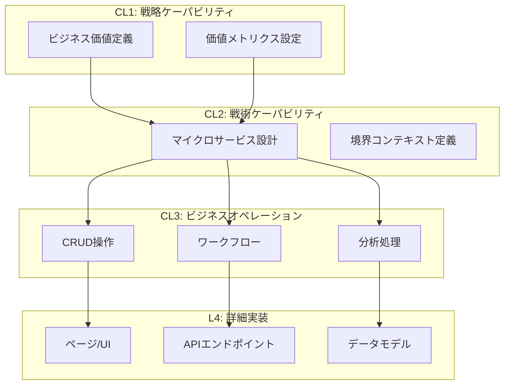

# パラソルV4フレームワーク × Amplifier プロジェクト

## 🌂 パラソルフレームワークとは

「Parasol」- 中心の一点から美しい放射状に広がる傘のように、**コアとなる情報設計という一点から、AIの力を借りて、設計書、実装コード、テスト、ドキュメントが展開される**フレームワークです。

### WHAT-HOW ZIGZAG構造
パラソルV4の特徴的な設計思想：上位のWHAT（ケーパビリティ）がそのHOW（実現方法）によって実現され、そのHOWの各要素が次のレベルのWHATになる階層的分解の原理。

```
CL1 WHAT（戦略ケーパビリティ）
    ↘️
      HOW → CL2 WHAT（戦術ケーパビリティ/マイクロサービス）
              ↘️
                HOW → CL3 WHAT（ビジネスオペレーション）
                        ↘️
                          HOW → L4 WHAT（詳細ユースケース/ページ）
```

## プロジェクト構成

### 💎 [01. 価値パラソル（Value Parasol）](./01-value-parasol/README.md)
**バリューストリーム駆動開発**
- 顧客ライフサイクル全体の価値創出
- 7つのステージ（基盤→エンゲージメント→理解→最適化→実現→習慣化→共創）
- ケーパビリティレベルの階層的分解（CL1→CL2→CL3→L4）
- 価値メトリクスによる継続的検証

**キー構造**:
```
value-streams/
  └── vs-customer-lifecycle/
      ├── st0-foundation/     # 各ステージごとに
      ├── st1-engagement/      # ケーパビリティを定義
      └── value-declaration.md
```

### 🏗️ [02. パラソルドメイン（Domain Development）](./02-parasol-domain/README.md)
**サービス・オペレーション・ページの3層構造**
- **Services（CL2）**: マイクロサービス境界
- **Operations（CL3）**: ビジネスオペレーション（CRUD/Workflow/Analytics）
- **Pages（L4）**: ユースケース実装とUI
- **Domain Language**: ユビキタス言語とエンティティ定義

**キー構造**:
```
services/          # マイクロサービス定義
operations/        # ビジネスオペレーション
pages/            # ページ/ユースケース
domain-language/  # ドメイン言語
```

### 🎯 [03. アーキテクチャ開発（Architecture）](./03-architecture-development/README.md)
**技術基盤とインフラストラクチャ**
- マイクロサービスアーキテクチャパターン
- イベント駆動アーキテクチャ（Kafka + Saga）
- Infrastructure as Code（Terraform/K8s）
- CI/CDパイプラインとDevOps

**キー構造**:
```
patterns/         # アーキテクチャパターン
components/       # コンポーネント設計
infrastructure/   # IaC定義
decisions/        # ADR（決定記録）
```

### 🔄 [04. コンサルティング統合（Consulting Integration）](./04-consulting-parasol-integration/README.md)
**既存設計とV4フレームワークの統合**
- コンサルティングツールの豊富なドメイン設計を活用
- パラソルV3からV4への自動マッピング
- Amplifierによる実装コードの完全自動生成
- ビジネスルールの継承と価値メトリクスの追加

**キー構造**:
```
import/           # 既存設計のインポート
transformation/   # V3→V4変換
generation/       # コード自動生成
integration/      # 統合成果物
```

### 🎯 [05. V3.0×V4統合フレームワーク（Unified Framework）](./05-parasol-v3-v4-unified/README.md) **NEW!**
**V3.0の正しい理解とV4の統合**
- **重要な発見**: L3 Capability ⊃ Operations（親子関係）
- 能力（What）と操作（How）の明確な分離
- トップダウン（EA）とボトムアップ（DDD）の統合
- [詳細な比較表](./05-parasol-v3-v4-unified/COMPARISON.md)で違いを明確化

**キー構造**:
```
value-definition/     # 価値定義
capabilities/         # L1→L2→L3能力階層
bounded-contexts/     # 統合されたBC
operations/          # 操作パターン
```

## 統合開発フロー



## クイックスタート

### 1. 環境準備（完了済み）
```bash
# Amplifier環境構築
make install
source .venv/bin/activate

# パラソル構造の確認
tree projects -L 2
```

### 2. 価値パラソルから開始
```bash
cd projects/01-value-parasol

# バリューストリーム定義
echo "value: 顧客満足度向上" > value-streams/value-declaration.md

# ケーパビリティ生成
amplifier generate-capabilities --from=value-declaration.md

# 価値の可視化
make knowledge-graph-viz --type=value-stream
```

### 3. ドメイン開発
```bash
cd projects/02-parasol-domain

# サービス定義からオペレーション生成
amplifier generate-operations --service=customer-service

# ドメインモデルからコード生成
amplifier generate-entity --domain=customer

# ページコンポーネント生成
amplifier generate-pages --operation=create-customer
```

### 4. アーキテクチャ実装
```bash
cd projects/03-architecture-development

# アーキテクチャ分析
/ddd architecture --analyze

# インフラコード生成
amplifier generate-terraform --pattern=microservices

# CI/CDパイプライン構築
amplifier generate-pipeline --provider=github
```

## パラソル設計の主要概念

### ケーパビリティレベル

| レベル | 名称 | 内容 | 成果物 |
|-------|------|------|--------|
| **CL1** | 戦略ケーパビリティ | ビジネス価値、ROI | 価値宣言、KPI |
| **CL2** | 戦術ケーパビリティ | マイクロサービス | サービス定義、API仕様 |
| **CL3** | ビジネスオペレーション | 業務フロー、ルール | オペレーション定義 |
| **L4** | 詳細ユースケース | 画面、API実装 | コンポーネント、コード |

### オペレーションパターン

```yaml
patterns:
  CRUD:
    - Create（作成）
    - Read（読取）
    - Update（更新）
    - Delete（削除）

  Workflow:
    - Sequential（順次処理）
    - Parallel（並列処理）
    - Conditional（条件分岐）

  Analytics:
    - Aggregation（集計）
    - Prediction（予測）
    - Optimization（最適化）

  Collaboration:
    - Synchronous（同期協調）
    - Asynchronous（非同期協調）
```

## Amplifierによる自動化機能

### 1. 知識管理と分析
```bash
# パラソル構造の知識抽出
make knowledge-sync CONTENT=parasol-docs/

# 価値フローの可視化
make knowledge-graph-viz --type=value-flow

# ドメイン関係の分析
amplifier analyze-domain-relationships
```

### 2. コード生成
```bash
# エンティティ生成
amplifier generate-entity --spec=domain-language/

# API生成
amplifier generate-api --operations=operations/

# UI生成
amplifier generate-ui --pages=pages/
```

### 3. テスト自動生成
```bash
# ビジネスルールテスト
amplifier generate-tests --type=business-rules

# 統合テスト
amplifier generate-tests --type=integration

# E2Eテスト
amplifier generate-tests --type=e2e
```

## メトリクスとKPI

### プロジェクト全体のKPI
```yaml
business_metrics:
  customer_satisfaction: > 4.5/5.0
  time_to_market: < 2 weeks
  roi: > 300%

technical_metrics:
  system_availability: > 99.99%
  api_response_time: < 100ms (p95)
  deployment_frequency: > 10/week

quality_metrics:
  test_coverage: > 80%
  bug_density: < 1/KLOC
  mttr: < 1 hour
```

## ベストプラクティス

### 1. 価値ファースト
- すべての開発活動を価値メトリクスに紐づける
- 定期的な価値検証とフィードバック

### 2. 段階的詳細化
- WHAT-HOW ZIGZAG構造に従う
- 上位レベルから順次詳細化

### 3. ドメイン一貫性
- ユビキタス言語の徹底
- 境界コンテキストの明確化

### 4. 継続的改善
- メトリクスベースの意思決定
- アーキテクチャの進化的発展

### 5. 自動化の最大化
- Amplifierによるコード生成
- CI/CDパイプラインの完全自動化

## トラブルシューティング

### よくある課題と解決策

**Q: ケーパビリティレベルの判断が難しい**
- A: ビジネス価値（CL1）→機能（CL2）→業務（CL3）→実装（L4）の順で考える

**Q: オペレーションパターンの選択に迷う**
- A: データ中心ならCRUD、プロセス中心ならWorkflow、分析ならAnalytics

**Q: サービス境界の決定が困難**
- A: ドメインエキスパートと協働し、境界コンテキストマッピングを実施

## リソース

### パラソル関連
- [パラソルV4フレームワーク仕様](/Users/hmoriya/Develop/github/github.com/archway/parasol-claude/.claude/framework/versions/v4/)
- [実装例（朝日ビール）](/Users/hmoriya/Develop/github/github.com/archway/parasol-claude/.claude/demo/versions/v4/projects/asahi-breweries/)

### Amplifier関連
- [Amplifier公式ドキュメント](https://github.com/microsoft/amplifier)
- [メタ認知レシピガイド](./docs/metacognitive-recipes.md)

## 今後の展開

1. **パラソル自動生成の強化**: より高度な価値分析と自動設計
2. **ドメインパターンライブラリ**: 業界別テンプレート
3. **アーキテクチャ最適化**: AIによる継続的改善
4. **コミュニティ連携**: パラソル実践者との知識共有

---

*このプロジェクトは、パラソルV4フレームワークとMicrosoft Amplifierの融合による、次世代の価値駆動型開発を実現します。*