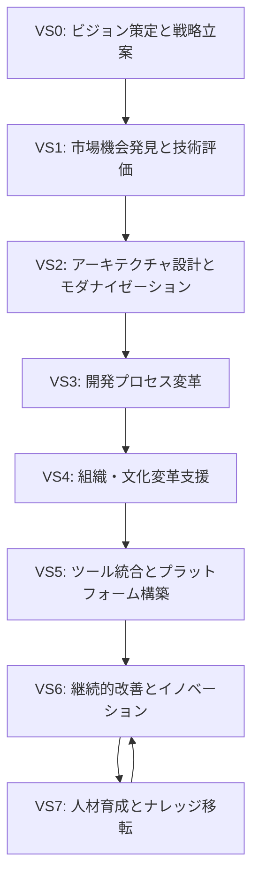

# Value Streams マッピング - 株式会社アークウェイ

## Value Streams 全体像



## VS0: ビジョン策定と戦略立案

### 概要
顧客企業のデジタル戦略立案と IT活用による未来デザインを支援

### 価値の流れ
```
経営課題分析 → ビジョン定義 → 戦略策定 → ロードマップ作成 → 承認獲得
```

### 主要アクティビティ
1. **現状分析**
   - ビジネス課題の整理
   - IT成熟度評価
   - 競合環境分析

2. **ビジョン策定**
   - 将来像の描画
   - 目標設定
   - KPI定義

3. **戦略立案**
   - 実現アプローチ設計
   - 投資計画策定
   - リスク評価

### インプット
- 経営戦略
- 市場環境情報
- 技術トレンド

### アウトプット
- デジタル戦略書
- 実行ロードマップ
- 投資計画

### 関与者
- 顧客: 経営層、IT企画部門
- アークウェイ: シニアコンサルタント

## VS1: 市場機会発見と技術評価

### 概要
新技術の評価と活用機会の発見、実証を通じた価値検証

### 価値の流れ
```
技術調査 → 適用可能性評価 → PoC企画 → 実証実験 → 効果測定 → 導入判断
```

### 主要アクティビティ
1. **技術トレンド分析**
   - 最新技術調査
   - 業界動向把握
   - ベンダー評価

2. **機会評価**
   - ビジネスインパクト分析
   - 技術的実現性検証
   - コスト効果分析

3. **PoC実施**
   - プロトタイプ開発
   - 効果検証
   - スケーラビリティ評価

### インプット
- 技術トレンド情報
- ビジネス要件
- 予算制約

### アウトプット
- 技術評価レポート
- PoC成果物
- 導入提案書

### 関与者
- 顧客: IT企画、技術部門
- アークウェイ: 技術コンサルタント、エンジニア

## VS2: アーキテクチャ設計とモダナイゼーション

### 概要
最適なソフトウェアアーキテクチャの設計とレガシーシステムの近代化

### 価値の流れ
```
現状評価 → 理想設計 → 移行計画 → 段階的実装 → 検証 → 最適化
```

### 主要アクティビティ
1. **アーキテクチャ評価**
   - 現状システム分析
   - 課題特定
   - 改善機会発見

2. **設計活動**
   - マイクロサービス設計
   - API設計
   - データアーキテクチャ

3. **実装支援**
   - リファクタリング
   - 新規開発
   - 移行作業

### インプット
- 既存システム情報
- ビジネス要件
- 技術制約

### アウトプット
- アーキテクチャ設計書
- 実装ガイドライン
- 移行計画

### 関与者
- 顧客: アーキテクト、開発チーム
- アークウェイ: アーキテクト、シニアエンジニア

## VS3: 開発プロセス変革

### 概要
DevOps導入による開発プロセスの最適化と自動化推進

### 価値の流れ
```
プロセス分析 → DevOps設計 → ツール導入 → 自動化実装 → 運用開始 → 改善
```

### 主要アクティビティ
1. **現状分析**
   - 開発プロセス評価
   - ボトルネック特定
   - 改善優先度設定

2. **DevOps導入**
   - CI/CDパイプライン構築
   - 自動テスト整備
   - 監視体制確立

3. **プロセス最適化**
   - ワークフロー改善
   - 自動化推進
   - メトリクス整備

### インプット
- 現行プロセス
- 開発環境情報
- チーム体制

### アウトプット
- DevOps実装
- 自動化スクリプト
- 運用手順書

### 関与者
- 顧客: 開発チーム、運用チーム
- アークウェイ: DevOpsエンジニア

## VS4: 組織・文化変革支援

### 概要
技術組織の変革と開発文化の醸成、働き方改革の推進

### 価値の流れ
```
組織診断 → 変革計画 → 研修実施 → 実践支援 → 定着化 → 文化醸成
```

### 主要アクティビティ
1. **組織アセスメント**
   - 成熟度評価
   - 文化診断
   - スキル評価

2. **変革推進**
   - チェンジマネジメント
   - 研修プログラム実施
   - コーチング

3. **文化醸成**
   - ベストプラクティス共有
   - コミュニティ形成
   - 成功体験の蓄積

### インプット
- 組織構造
- 現状の文化
- 変革目標

### アウトプット
- 変革ロードマップ
- 研修教材
- 組織変革成果

### 関与者
- 顧客: 全社員、HR部門
- アークウェイ: 組織コンサルタント

## VS5: ツール統合とプラットフォーム構築

### 概要
開発ツールチェーンの最適化と統合プラットフォームの構築

### 価値の流れ
```
要件定義 → ツール選定 → 導入計画 → 実装 → 統合 → トレーニング → 運用
```

### 主要アクティビティ
1. **ツール評価**
   - 要件分析
   - ツール比較
   - PoC実施

2. **導入・統合**
   - インストール/設定
   - カスタマイズ
   - 既存環境との統合

3. **運用支援**
   - 利用者トレーニング
   - 運用手順整備
   - サポート体制確立

### インプット
- ツール要件
- 既存環境
- 予算

### アウトプット
- 統合開発環境
- カスタマイズ機能
- 運用ドキュメント

### 関与者
- 顧客: インフラチーム、開発チーム
- アークウェイ: インフラエンジニア

## VS6: 継続的改善とイノベーション

### 概要
継続的な改善活動の推進と新技術を活用したイノベーション創出

### 価値の流れ
```
データ収集 → 分析 → 改善機会特定 → 施策立案 → 実行 → 効果測定 → 標準化
```

### 主要アクティビティ
1. **パフォーマンス分析**
   - メトリクス収集
   - ボトルネック分析
   - 改善機会発見

2. **改善実施**
   - 改善施策実行
   - A/Bテスト
   - 効果検証

3. **イノベーション推進**
   - 新技術実験
   - アイデア創出
   - プロトタイピング

### インプット
- 運用データ
- フィードバック
- 技術トレンド

### アウトプット
- 改善レポート
- イノベーション事例
- 新サービス

### 関与者
- 顧客: イノベーション推進部門
- アークウェイ: イノベーションコンサルタント

## VS7: 人材育成とナレッジ移転

### 概要
技術人材の育成と組織へのナレッジ定着による自走化支援

### 価値の流れ
```
スキル評価 → 育成計画 → 研修実施 → OJT → 評価 → フォローアップ
```

### 主要アクティビティ
1. **スキルアセスメント**
   - 現状スキル評価
   - ギャップ分析
   - 育成優先度設定

2. **教育プログラム**
   - 研修設計
   - ハンズオン実施
   - メンタリング

3. **ナレッジ管理**
   - ドキュメント整備
   - ナレッジDB構築
   - ベストプラクティス共有

### インプット
- スキル要件
- 現状スキルレベル
- 育成目標

### アウトプット
- 育成プログラム
- 研修教材
- スキル認定

### 関与者
- 顧客: HR、各部門
- アークウェイ: 教育担当

## Value Streams 間の関係性

### 依存関係
- VS0 → VS1: 戦略に基づく技術選定
- VS1 → VS2: 評価済み技術の実装
- VS2 → VS3: アーキテクチャに適したプロセス
- VS3 → VS4: プロセス変革には文化変革が必須
- VS4 → VS5: 文化に合ったツール選定
- VS5 → VS6: ツール活用による改善
- VS6 ⇄ VS7: 改善と学習の循環

### シナジー効果
- VS2 + VS3: アーキテクチャとプロセスの統合最適化
- VS3 + VS4 + VS5: DevOps三位一体（プロセス・文化・ツール）
- VS6 + VS7: 継続的学習による持続的イノベーション

---

⚠️ **候補案**: これは初期候補です。
`/parasol:2-value` コマンドで各VSを詳細化してください。