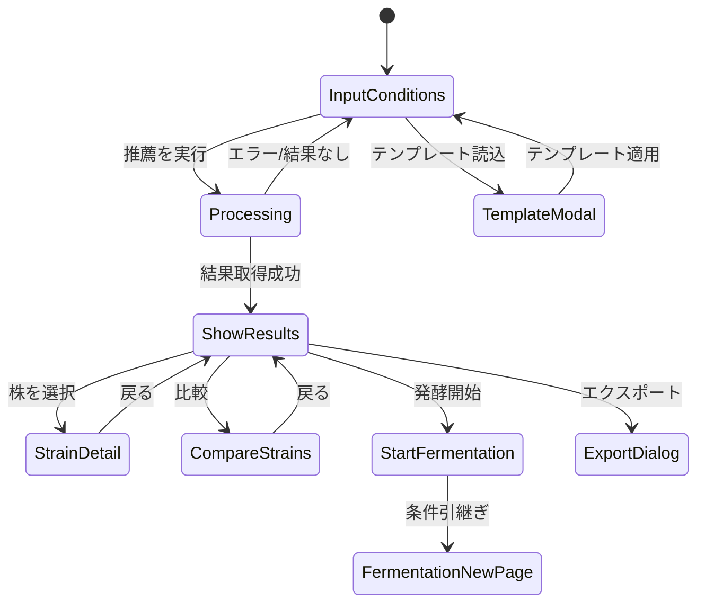

# Page Definition: 酵母株推薦画面

## 概要

| 項目 | 内容 |
|------|------|
| ページID | BC1-PG-003 |
| 名称 | 酵母株推薦 |
| URL | /fermentation/recommendations/yeast |
| 関連UC | BC1-UC-003 |

---

## 画面構成

```
┌─────────────────────────────────────────────────────────────────────┐
│ [ヘッダー] 酵母株推薦システム                                       │
├─────────────────────────────────────────────────────────────────────┤
│                                                                     │
│  ┌─────────────────────────┬───────────────────────────────────┐   │
│  │ 推薦条件                │ 推薦結果                          │   │
│  │                         │                                   │   │
│  │ モード選択:             │ [推薦実行後に表示]               │   │
│  │ (●) 風味プロファイル    │                                   │   │
│  │ ( ) 発酵条件            │ ┌───────────────────────────────┐ │   │
│  │ ( ) ハイブリッド        │ │ #1 ASH-2024-0042    [92%] ▶  │ │   │
│  │                         │ │    Asahi-A1                   │ │   │
│  │ ───────────────────     │ │    ✓ エステル ✓ クリーン     │ │   │
│  │                         │ │    ⚠ フルーティやや低め       │ │   │
│  │ 目標風味プロファイル:   │ ├───────────────────────────────┤ │   │
│  │                         │ │ #2 ASH-2024-0038    [87%] ▶  │ │   │
│  │ エステル    [Medium ▼]  │ │    Asahi-B2                   │ │   │
│  │ フェノール  [Low ▼]     │ │    ✓ 全項目適合               │ │   │
│  │ 硫黄        [None ▼]    │ ├───────────────────────────────┤ │   │
│  │ フルーティ  [High ▼]    │ │ #3 ASH-2023-0112    [81%] ▶  │ │   │
│  │ スパイシー  [Low ▼]     │ │    Ale-Pro                    │ │   │
│  │ クリーン    [High ▼]    │ │    ✓ 高い実績スコア          │ │   │
│  │                         │ └───────────────────────────────┘ │   │
│  │ ───────────────────     │                                   │   │
│  │                         │ [さらに表示...] 10件中3件表示     │   │
│  │ 制約条件（任意）:       │                                   │   │
│  │                         │                                   │   │
│  │ スケール   [全て ▼]     │                                   │   │
│  │ 最低ステータス          │                                   │   │
│  │            [Validated ▼]│                                   │   │
│  │ 除外株     [選択...]    │                                   │   │
│  │                         │                                   │   │
│  │ [テンプレート読込]      │                                   │   │
│  │ [条件クリア]            │                                   │   │
│  │                         │                                   │   │
│  │    [推薦を実行]         │   [比較] [発酵開始] [エクスポート]│   │
│  └─────────────────────────┴───────────────────────────────────┘   │
│                                                                     │
└─────────────────────────────────────────────────────────────────────┘
```

---

## UI要素定義

### 条件入力パネル

| 要素ID | 種類 | ラベル | 必須 | バリデーション |
|--------|------|--------|------|----------------|
| mode | RadioGroup | モード選択 | Yes | デフォルト: FlavorBased |
| esterLevel | Select | エステル | Conditional | FlavorLevel |
| phenolLevel | Select | フェノール | Conditional | FlavorLevel |
| sulfurLevel | Select | 硫黄 | Conditional | FlavorLevel |
| fruitiness | Select | フルーティ | Conditional | FlavorLevel |
| spiciness | Select | スパイシー | Conditional | FlavorLevel |
| cleanness | Select | クリーン | Conditional | FlavorLevel |
| temperatureMin | NumberInput | 最低温度 | Conditional | -10〜100°C |
| temperatureMax | NumberInput | 最高温度 | Conditional | min < max |
| fermentationSpeed | Select | 発酵速度 | Conditional | Slow/Medium/Fast |
| targetAttenuation | NumberInput | 目標発酵度 | Conditional | 0-100% |

### 制約条件パネル

| 要素ID | 種類 | ラベル | 必須 | バリデーション |
|--------|------|--------|------|----------------|
| scaleType | Select | スケールタイプ | No | All/Laboratory/Pilot/Production |
| minStatus | Select | 最低ステータス | No | Research/Validated/Production |
| excludeStrains | MultiSelect | 除外株 | No | 既存株から選択 |

### 結果パネル

| 要素ID | 種類 | ラベル |
|--------|------|--------|
| resultList | VirtualList | 推薦結果リスト |
| resultCard | Card | 推薦株カード |
| matchScore | ProgressBar | マッチスコア |
| matchDetails | Badge | マッチ/ミスマッチ項目 |

### アクションボタン

| 要素ID | 種類 | ラベル | 有効条件 |
|--------|------|--------|----------|
| executeRecommend | PrimaryButton | 推薦を実行 | 条件入力済み |
| loadTemplate | SecondaryButton | テンプレート読込 | 常時 |
| clearConditions | TextButton | 条件クリア | 条件入力済み |
| compareSelected | Button | 比較 | 2件以上選択時 |
| startFermentation | Button | 発酵開始 | 1件選択時 |
| exportResults | Button | エクスポート | 結果あり |

---

## 画面遷移



---

## イベント定義

| イベント | トリガー | アクション |
|----------|----------|------------|
| onModeChange | モード変更 | 関連入力フィールドの表示/非表示切替 |
| onExecuteRecommend | 推薦実行クリック | バリデーション、API呼び出し、ローディング表示 |
| onResultCardClick | 結果カードクリック | 詳細パネル展開/縮小 |
| onResultSelect | チェックボックス変更 | 選択状態更新、アクションボタン有効化 |
| onLoadTemplate | テンプレート読込 | テンプレート選択モーダル表示 |
| onClearConditions | 条件クリア | 全入力フィールドをリセット |
| onStartFermentation | 発酵開始クリック | 選択株と推薦条件を持ってページ遷移 |

---

## モード別表示制御

```typescript
const modeVisibility = {
  FlavorBased: {
    showFlavorInputs: true,
    showConditionInputs: false,
    requiredFlavor: true,
    requiredCondition: false
  },
  ConditionBased: {
    showFlavorInputs: false,
    showConditionInputs: true,
    requiredFlavor: false,
    requiredCondition: true
  },
  Hybrid: {
    showFlavorInputs: true,
    showConditionInputs: true,
    requiredFlavor: true,
    requiredCondition: true
  }
};
```

---

## API連携

### 推薦実行

```typescript
// POST /recommendations/yeast
const executeRecommendation = async (input: YeastRecommendationInput) => {
  setLoading(true);
  try {
    const response = await fetch('/api/v1/recommendations/yeast', {
      method: 'POST',
      headers: {
        'Content-Type': 'application/json',
        'Authorization': `Bearer ${token}`
      },
      body: JSON.stringify(input)
    });

    if (response.ok) {
      const result = await response.json();
      setRecommendations(result.recommendations);
      setQueryId(result.queryId); // セッション追跡用
    } else {
      throw new ApiError(await response.json());
    }
  } finally {
    setLoading(false);
  }
};
```

### 発酵開始への引継ぎ

```typescript
const startFermentationWithRecommendation = (strain: YeastStrain) => {
  // 推薦結果をセッションストレージに保存
  sessionStorage.setItem('recommendedStrain', JSON.stringify({
    strainId: strain.strainId,
    strainCode: strain.strainCode,
    recommendedConditions: strain.recommendedConditions,
    queryId: queryId
  }));

  // 発酵開始ページへ遷移
  navigate('/fermentation/processes/new?from=recommendation');
};
```

---

## 結果カードコンポーネント

```typescript
interface RecommendationCardProps {
  rank: number;
  strain: YeastStrain;
  matchScore: number;
  matchDetails: MatchDetails;
  onSelect: (id: string) => void;
  onExpand: (id: string) => void;
}

const RecommendationCard: React.FC<RecommendationCardProps> = ({
  rank, strain, matchScore, matchDetails, onSelect, onExpand
}) => (
  <Card>
    <CardHeader>
      <Checkbox onChange={() => onSelect(strain.strainId)} />
      <Badge>#{rank}</Badge>
      <Title>{strain.strainCode}</Title>
      <MatchScoreBar value={matchScore} />
      <ExpandButton onClick={() => onExpand(strain.strainId)} />
    </CardHeader>
    <CardBody>
      <StrainName>{strain.name}</StrainName>
      <MatchTags>
        {matchDetails.matchedItems.map(item => (
          <Tag color="green" key={item}>✓ {item}</Tag>
        ))}
        {matchDetails.mismatchedItems.map(item => (
          <Tag color="orange" key={item}>⚠ {item}</Tag>
        ))}
      </MatchTags>
    </CardBody>
  </Card>
);
```

---

## テンプレート定義

```typescript
const flavorTemplates = {
  lager: {
    name: 'クリーンラガー',
    profile: {
      esterLevel: 'Low',
      phenolLevel: 'None',
      sulfurLevel: 'VeryLow',
      fruitiness: 'Low',
      spiciness: 'None',
      cleanness: 'VeryHigh'
    }
  },
  ale: {
    name: 'フルーティエール',
    profile: {
      esterLevel: 'High',
      phenolLevel: 'Low',
      sulfurLevel: 'None',
      fruitiness: 'High',
      spiciness: 'Low',
      cleanness: 'Medium'
    }
  },
  wheat: {
    name: 'ヴァイツェン',
    profile: {
      esterLevel: 'High',
      phenolLevel: 'High',
      sulfurLevel: 'None',
      fruitiness: 'High',
      spiciness: 'Medium',
      cleanness: 'Low'
    }
  }
};
```

---

## エラー表示

| エラーコード | メッセージ | 表示方法 |
|--------------|------------|----------|
| NO_RESULTS | 条件に適合する酵母株が見つかりません | 結果パネルに表示 |
| INSUFFICIENT_DATA | 推薦に十分なデータがありません | 警告バナー |
| INVALID_CONDITIONS | 入力条件に矛盾があります | インラインエラー |
| TIMEOUT | 処理がタイムアウトしました | トースト通知 |

---

## パフォーマンス最適化

- 結果リストの仮想スクロール（10件以上時）
- 推薦結果の1時間キャッシュ
- 詳細展開時の遅延読み込み
- デバウンス処理（条件変更時300ms）

---

**作成日**: 2025-11-28
**VS/BC**: VS1/BC1 Fermentation Platform
