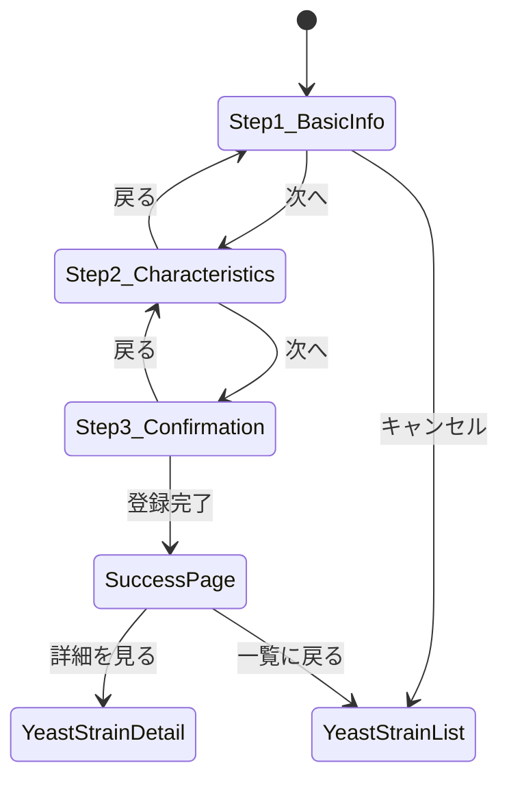

# Page Definition: 酵母株登録画面

## 概要

| 項目 | 内容 |
|------|------|
| ページID | BC1-PG-001 |
| 名称 | 酵母株登録 |
| URL | /fermentation/yeast-strains/new |
| 関連UC | BC1-UC-001 |

---

## 画面構成

```
┌─────────────────────────────────────────────────────────────┐
│ [ヘッダー] 酵母株登録                          [キャンセル] │
├─────────────────────────────────────────────────────────────┤
│ ステップインジケーター: [1.基本情報] > [2.特性] > [3.確認] │
├─────────────────────────────────────────────────────────────┤
│                                                             │
│  ┌─────────────────────────────────────────────────────┐   │
│  │ [ステップ1: 基本情報]                               │   │
│  │                                                     │   │
│  │ 名称 *          [________________________]         │   │
│  │                                                     │   │
│  │ 由来タイプ *    (●) Natural  ( ) Bred              │   │
│  │                 ( ) Modified ( ) Acquired           │   │
│  │                                                     │   │
│  │ 採取地/取得元 * [________________________]         │   │
│  │                                                     │   │
│  │ 採取日 *        [____/____/____]                   │   │
│  │                                                     │   │
│  │ [親株選択 - Bredの場合のみ表示]                     │   │
│  │ 親株 *          [株を検索・選択 ▼]                  │   │
│  │                 ├ ASH-2024-0012 Strain Alpha       │   │
│  │                 └ ASH-2024-0015 Strain Beta        │   │
│  └─────────────────────────────────────────────────────┘   │
│                                                             │
│                              [戻る]  [次へ: 特性入力]       │
└─────────────────────────────────────────────────────────────┘
```

---

## UI要素定義

### ステップ1: 基本情報

| 要素ID | 種類 | ラベル | 必須 | バリデーション |
|--------|------|--------|------|----------------|
| name | TextInput | 名称 | Yes | 1-100文字 |
| originSource | RadioGroup | 由来タイプ | Yes | 選択必須 |
| location | TextInput | 採取地/取得元 | Yes | 1-200文字 |
| collectedAt | DatePicker | 採取日 | Yes | 過去日付 |
| parentStrainIds | MultiSelect | 親株 | Conditional | Bredの場合必須 |

### ステップ2: 特性情報

| 要素ID | 種類 | ラベル | 必須 | バリデーション |
|--------|------|--------|------|----------------|
| alcoholTolerance | Slider | アルコール耐性 | No | 0-100% |
| temperatureMin | NumberInput | 最低適温 | No | -10〜100℃ |
| temperatureMax | NumberInput | 最高適温 | No | min < max |
| flocculationLevel | Select | 凝集性 | No | Low/Medium/High |
| attenuationMin | NumberInput | 最低発酵度 | No | 0-100% |
| attenuationMax | NumberInput | 最高発酵度 | No | min < max |
| oxygenRequirement | Select | 酸素要求量 | No | Low/Medium/High |

### ステップ2続き: 風味プロファイル（任意）

| 要素ID | 種類 | ラベル | 必須 | バリデーション |
|--------|------|--------|------|----------------|
| esterLevel | Select | エステル | No | FlavorLevel |
| phenolLevel | Select | フェノール | No | FlavorLevel |
| sulfurLevel | Select | 硫黄化合物 | No | FlavorLevel |
| fruitiness | Select | フルーティ | No | FlavorLevel |
| spiciness | Select | スパイシー | No | FlavorLevel |
| cleanness | Select | クリーンさ | No | FlavorLevel |
| notes | TextArea | 備考 | No | 0-500文字 |

### ステップ3: 確認

| 要素ID | 種類 | ラベル |
|--------|------|--------|
| confirmationPanel | Summary | 入力内容確認 |
| submitButton | Button | 登録する |
| backButton | Button | 戻る |

---

## 画面遷移



---

## イベント定義

| イベント | トリガー | アクション |
|----------|----------|------------|
| onOriginSourceChange | 由来タイプ変更 | 親株入力欄の表示/非表示切替 |
| onNextStep | 「次へ」クリック | バリデーション実行、ステップ遷移 |
| onPrevStep | 「戻る」クリック | 前ステップへ遷移 |
| onSubmit | 「登録する」クリック | API呼び出し、結果処理 |
| onCancel | 「キャンセル」クリック | 確認ダイアログ表示 |
| onParentStrainSearch | 親株検索入力 | 候補リスト更新 |

---

## バリデーションルール

### クライアントサイド

```typescript
const validationRules = {
  name: {
    required: true,
    minLength: 1,
    maxLength: 100,
    message: "名称は1〜100文字で入力してください"
  },
  originSource: {
    required: true,
    message: "由来タイプを選択してください"
  },
  location: {
    required: true,
    maxLength: 200,
    message: "採取地/取得元を入力してください"
  },
  collectedAt: {
    required: true,
    maxDate: "today",
    message: "採取日は今日以前の日付を入力してください"
  },
  parentStrainIds: {
    requiredIf: (data) => data.originSource === "Bred",
    minItems: 1,
    message: "育種株の場合は親株を1つ以上選択してください"
  },
  characteristics: {
    atLeastOne: true,
    message: "特性情報を1つ以上入力してください"
  }
};
```

---

## API連携

### 登録API呼び出し

```typescript
// POST /yeast-strains
const registerYeastStrain = async (input: RegisterYeastStrainInput) => {
  const response = await fetch('/api/v1/yeast-strains', {
    method: 'POST',
    headers: {
      'Content-Type': 'application/json',
      'Authorization': `Bearer ${token}`
    },
    body: JSON.stringify(input)
  });

  if (response.status === 201) {
    return response.json(); // YeastStrain with strainCode
  } else if (response.status === 409) {
    throw new DuplicateError("類似株が存在します");
  } else {
    throw new ValidationError(await response.json());
  }
};
```

### 親株検索API

```typescript
// GET /yeast-strains?keyword={query}&status=validated,production
const searchParentStrains = async (query: string) => {
  const response = await fetch(
    `/api/v1/yeast-strains?keyword=${query}&status=validated,production`
  );
  return response.json();
};
```

---

## エラー表示

| エラーコード | メッセージ | 表示方法 |
|--------------|------------|----------|
| VALIDATION_ERROR | 入力内容に誤りがあります | フィールド下部に赤文字 |
| DUPLICATE_STRAIN | 類似の酵母株が既に存在します | モーダルダイアログ |
| PARENT_NOT_FOUND | 選択された親株が見つかりません | フィールド下部に赤文字 |
| UNAUTHORIZED | 登録権限がありません | トースト通知 |

---

## アクセシビリティ

- 全フォーム要素にラベル関連付け
- Tab順序の論理的設定
- エラー時のフォーカス移動
- スクリーンリーダー対応のARIAラベル
- 色だけに依存しないエラー表示

---

**作成日**: 2025-11-28
**VS/BC**: VS1/BC1 Fermentation Platform
