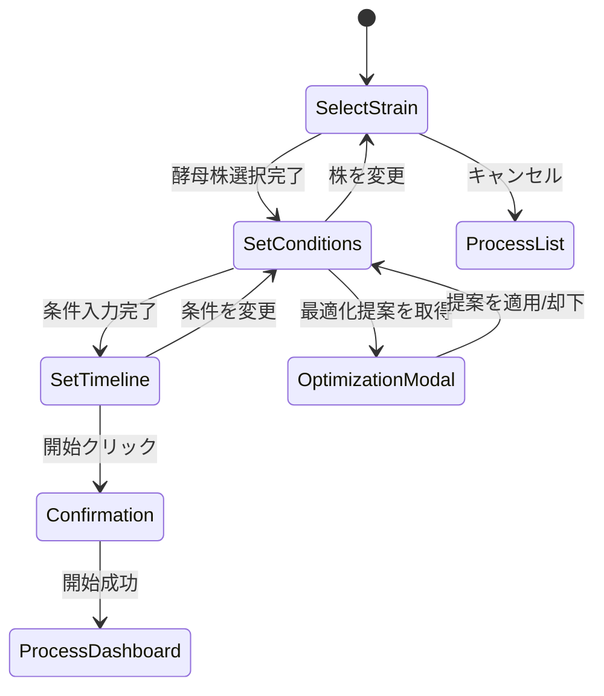

# Page Definition: 発酵プロセス開始画面

## 概要

| 項目 | 内容 |
|------|------|
| ページID | BC1-PG-002 |
| 名称 | 発酵プロセス開始 |
| URL | /fermentation/processes/new |
| 関連UC | BC1-UC-002 |

---

## 画面構成

```
┌─────────────────────────────────────────────────────────────────┐
│ [ヘッダー] 新規発酵プロセス開始                    [キャンセル] │
├─────────────────────────────────────────────────────────────────┤
│                                                                 │
│  ┌───────────────────────────┬─────────────────────────────┐   │
│  │ 酵母株選択                │ 選択株情報                  │   │
│  │                           │                             │   │
│  │ [検索: _____________]     │ ┌─────────────────────────┐ │   │
│  │                           │ │ ASH-2024-0042          │ │   │
│  │ ● ASH-2024-0042 Asahi-A1 │ │ Asahi-A1               │ │   │
│  │ ○ ASH-2024-0038 Asahi-B2 │ │                         │ │   │
│  │ ○ ASH-2024-0035 Lager-X  │ │ Status: Validated       │ │   │
│  │ ○ ASH-2023-0112 Ale-Pro  │ │ 適温: 10-15°C          │ │   │
│  │                           │ │ 凝集性: High           │ │   │
│  │ [もっと見る...]           │ │ 発酵速度: Medium       │ │   │
│  │                           │ │                         │ │   │
│  │                           │ │ [推奨条件を適用]       │ │   │
│  └───────────────────────────┴─────────────────────────────┘   │
│                                                                 │
│  ┌─────────────────────────────────────────────────────────┐   │
│  │ スケールタイプ                                          │   │
│  │                                                         │   │
│  │ (●) Laboratory (1-100L)   実験・研究用                 │   │
│  │ ( ) Pilot (100-1000L)     パイロット製造               │   │
│  │ ( ) Production (1000L+)   本製造 [要承認株]             │   │
│  └─────────────────────────────────────────────────────────┘   │
│                                                                 │
│  ┌─────────────────────────────────────────────────────────┐   │
│  │ 発酵条件                                                │   │
│  │                                                         │   │
│  │ 初期温度 *    [12.0] °C    ⚠️ 推奨: 10-15°C            │   │
│  │ 圧力          [101.3] kPa                              │   │
│  │ 溶存酸素      [8.0] mg/L                               │   │
│  │ 接種量 *      [1.0E7] cells/mL                         │   │
│  │ 麦汁比重 *    [1.048] SG                               │   │
│  │                                                         │   │
│  │ [最適化提案を取得]                                     │   │
│  └─────────────────────────────────────────────────────────┘   │
│                                                                 │
│  ┌─────────────────────────────────────────────────────────┐   │
│  │ タイムライン設定（任意）                     [+ ステージ追加]│
│  │                                                         │   │
│  │ ├─ Stage 1: Primary Fermentation                       │   │
│  │ │  温度: 12°C, 期間: 72時間                  [編集][削除]│   │
│  │ │                                                       │   │
│  │ └─ Stage 2: Diacetyl Rest                              │   │
│  │    温度: 15°C, 期間: 24時間                  [編集][削除]│   │
│  └─────────────────────────────────────────────────────────┘   │
│                                                                 │
│                                    [キャンセル] [プロセス開始]  │
└─────────────────────────────────────────────────────────────────┘
```

---

## UI要素定義

### 酵母株選択セクション

| 要素ID | 種類 | ラベル | 必須 | バリデーション |
|--------|------|--------|------|----------------|
| strainSearch | SearchInput | 酵母株検索 | - | - |
| strainList | RadioList | 酵母株リスト | Yes | 選択必須 |
| strainInfo | InfoPanel | 選択株情報 | - | 読み取り専用 |
| applyRecommended | Button | 推奨条件を適用 | - | - |

### スケールタイプセクション

| 要素ID | 種類 | ラベル | 必須 | バリデーション |
|--------|------|--------|------|----------------|
| scaleType | RadioGroup | スケールタイプ | Yes | 選択必須 |

### 発酵条件セクション

| 要素ID | 種類 | ラベル | 必須 | バリデーション |
|--------|------|--------|------|----------------|
| temperature | NumberInput | 初期温度 | Yes | -10〜100°C |
| pressure | NumberInput | 圧力 | No | 0〜200 kPa |
| dissolvedOxygen | NumberInput | 溶存酸素 | No | 0〜20 mg/L |
| pitchRate | ScientificInput | 接種量 | Yes | 1E6〜1E9 cells/mL |
| wortGravity | NumberInput | 麦汁比重 | Yes | 0.990〜1.200 |
| getOptimization | Button | 最適化提案を取得 | - | - |

### タイムラインセクション

| 要素ID | 種類 | ラベル | 必須 | バリデーション |
|--------|------|--------|------|----------------|
| timeline | DragDropList | ステージリスト | No | - |
| addStage | Button | ステージ追加 | - | - |

---

## 画面遷移



---

## イベント定義

| イベント | トリガー | アクション |
|----------|----------|------------|
| onStrainSearch | 検索入力 | APIで酵母株を検索、リスト更新 |
| onStrainSelect | 酵母株選択 | 株情報パネル更新、推奨条件取得 |
| onApplyRecommended | 推奨条件適用 | 条件フォームに推奨値をセット |
| onScaleTypeChange | スケール変更 | 酵母株フィルター更新、条件範囲調整 |
| onGetOptimization | 最適化取得 | API呼び出し、モーダル表示 |
| onAddStage | ステージ追加 | ステージ入力フォームを追加 |
| onStartProcess | 開始クリック | バリデーション、API呼び出し |

---

## 条件付きUI表示

### スケールタイプによる制限

```typescript
const scaleTypeConstraints = {
  Laboratory: {
    allowedStrainStatus: ['research', 'validated', 'production'],
    volumeRange: { min: 1, max: 100, unit: 'L' },
    approvalRequired: false
  },
  Pilot: {
    allowedStrainStatus: ['validated', 'production'],
    volumeRange: { min: 100, max: 1000, unit: 'L' },
    approvalRequired: false
  },
  Production: {
    allowedStrainStatus: ['production'],
    volumeRange: { min: 1000, max: null, unit: 'L' },
    approvalRequired: true,
    approvalMessage: "本製造には承認済み酵母株が必要です"
  }
};
```

### 条件警告表示

```typescript
const showConditionWarning = (strain: YeastStrain, value: number, field: string) => {
  const range = strain.characteristics.temperatureRange;
  if (field === 'temperature') {
    if (value < range.min || value > range.max) {
      return {
        level: 'warning',
        message: `推奨範囲: ${range.min}-${range.max}°C`
      };
    }
  }
  return null;
};
```

---

## API連携

### プロセス開始

```typescript
// POST /fermentation-processes
const startFermentationProcess = async (input: StartFermentationInput) => {
  const response = await fetch('/api/v1/fermentation-processes', {
    method: 'POST',
    headers: {
      'Content-Type': 'application/json',
      'Authorization': `Bearer ${token}`
    },
    body: JSON.stringify(input)
  });

  if (response.status === 201) {
    const result = await response.json();
    // ダッシュボードへリダイレクト
    navigate(`/fermentation/processes/${result.processId}/dashboard`);
    return result;
  }
  throw new ApiError(await response.json());
};
```

### 最適化提案取得

```typescript
// POST /recommendations/optimize-conditions
const getOptimizedConditions = async (strainId: string, scaleType: string) => {
  const response = await fetch('/api/v1/recommendations/optimize-conditions', {
    method: 'POST',
    headers: {
      'Content-Type': 'application/json',
      'Authorization': `Bearer ${token}`
    },
    body: JSON.stringify({
      strainId,
      scaleType,
      targetAttributes: { /* ユーザー指定の目標 */ }
    })
  });
  return response.json();
};
```

---

## モーダルダイアログ

### 最適化提案モーダル

```
┌─────────────────────────────────────────────────┐
│ 最適条件の提案                           [×]   │
├─────────────────────────────────────────────────┤
│                                                 │
│ ASH-2024-0042 に基づく最適条件:                │
│                                                 │
│ ┌─────────────────────────────────────────┐   │
│ │ 温度:      12.5°C (現在: 12.0°C)       │   │
│ │ 接種量:    1.2E7 cells/mL              │   │
│ │ 麦汁比重:  1.050 SG                    │   │
│ │                                         │   │
│ │ 信頼度: 87%                            │   │
│ │ ベース: 過去15件の成功プロセス          │   │
│ └─────────────────────────────────────────┘   │
│                                                 │
│ 予測される結果:                                │
│ - 発酵期間: 5-7日                             │
│ - 最終比重: 1.010-1.012                       │
│ - 風味: クリーン、軽いエステル                │
│                                                 │
│                    [キャンセル] [提案を適用]   │
└─────────────────────────────────────────────────┘
```

---

## エラー表示

| エラーコード | メッセージ | 表示方法 |
|--------------|------------|----------|
| STRAIN_NOT_FOUND | 酵母株が見つかりません | トースト通知 |
| STRAIN_NOT_ALLOWED | この酵母株は選択したスケールで使用できません | インライン警告 |
| CONDITION_OUT_OF_RANGE | 条件値が許容範囲外です | フィールド下部 |
| PROCESS_LIMIT_REACHED | 同時稼働プロセス数上限に達しています | モーダル |

---

**作成日**: 2025-11-28
**VS/BC**: VS1/BC1 Fermentation Platform
