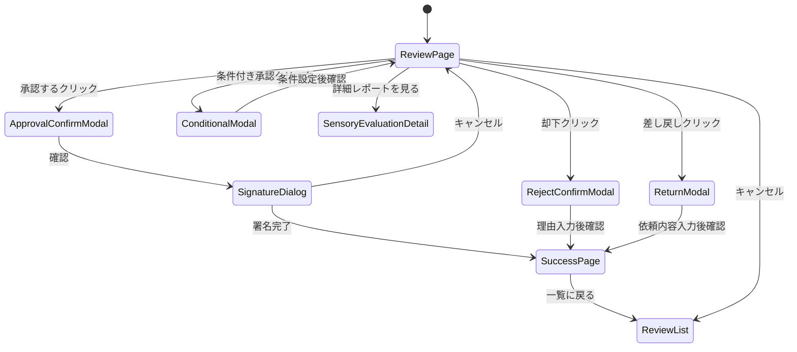

# Page Definition: 処方承認画面

## 概要

| 項目 | 内容 |
|------|------|
| ページID | BC2-PG-002 |
| 名称 | 処方承認 |
| URL | /product-development/recipes/{recipeId}/review |
| 関連UC | BC2-UC-002 |

---

## 画面構成

```
┌─────────────────────────────────────────────────────────────────────┐
│ [ヘッダー] 処方承認レビュー                                         │
│ RCP-BEER-202411-001 / Super Dry 新処方 v1.0.0                      │
├─────────────────────────────────────────────────────────────────────┤
│ ステータス: 承認待ち  申請者: 山田太郎  申請日: 2024-11-27          │
├─────────────────────────────────────────────────────────────────────┤
│                                                                     │
│  ┌───────────────────────────┬─────────────────────────────────┐   │
│  │ 処方詳細                  │ 承認チェックリスト              │   │
│  │                           │                                 │   │
│  │ [基本情報]               │ ☑ 製品コンセプト確認           │   │
│  │ 製品名: Super Dry 新処方 │ ☑ 原料構成確認                 │   │
│  │ 製品タイプ: Beer         │ ☑ 製造仕様確認                 │   │
│  │ ブランド: スーパードライ │ ☑ 品質基準定義済み             │   │
│  │                           │ ☐ 官能評価合格                 │   │
│  │ [製品コンセプト]         │                                 │   │
│  │ 「キレのある辛口」を追求 │ ─────────────────────────────  │   │
│  │ した新処方。若年層向け。 │                                 │   │
│  │                           │ 官能評価サマリー               │   │
│  │ [原料構成]               │ ┌─────────────────────────┐   │   │
│  │ ├ ピルスナーモルト 85%   │ │ 総合スコア: 7.8/10      │   │   │
│  │ ├ カラメルモルト   5%    │ │ パネル一致度: High      │   │   │
│  │ └ コーンスターチ   8%    │ │ 推奨: 承認可            │   │   │
│  │                           │ └─────────────────────────┘   │   │
│  │ [製造仕様]               │                                 │   │
│  │ 酵母株: ASH-2024-0042    │ [詳細レポートを見る]           │   │
│  │ 発酵温度: 12°C           │                                 │   │
│  │ 発酵期間: 7日            │                                 │   │
│  │                           │                                 │   │
│  │ [詳細を展開...]          │                                 │   │
│  └───────────────────────────┴─────────────────────────────────┘   │
│                                                                     │
│  ┌─────────────────────────────────────────────────────────────┐   │
│  │ 品質基準適合状況                                             │   │
│  │                                                               │   │
│  │ 理化学規格    [████████████████░░] 90% 適合                  │   │
│  │ 官能規格      [████████████████████] 100% 適合               │   │
│  │ 微生物規格    [████████████████████] 100% 適合               │   │
│  │ 賞味期限      [確認中...]                                    │   │
│  │                                                               │   │
│  │ ⚠ アルコール度数が規格上限に近い (5.4% / 規格: 5.0-5.5%)    │   │
│  └─────────────────────────────────────────────────────────────┘   │
│                                                                     │
│  ┌─────────────────────────────────────────────────────────────┐   │
│  │ 承認コメント                                                 │   │
│  │ [________________________________________________________]   │   │
│  │ [________________________________________________________]   │   │
│  └─────────────────────────────────────────────────────────────┘   │
│                                                                     │
│      [差し戻し]    [条件付き承認]    [却下]    [承認する]          │
└─────────────────────────────────────────────────────────────────────┘
```

---

## UI要素定義

### 処方詳細パネル

| 要素ID | 種類 | ラベル |
|--------|------|--------|
| recipeInfo | ReadOnly | 処方基本情報 |
| conceptText | ReadOnly | 製品コンセプト |
| ingredientList | CollapsibleList | 原料構成 |
| processSpec | CollapsibleList | 製造仕様 |
| expandDetails | LinkButton | 詳細を展開 |

### 承認チェックリスト

| 要素ID | 種類 | ラベル | 自動チェック |
|--------|------|--------|--------------|
| checkConcept | Checkbox | 製品コンセプト確認 | No |
| checkIngredients | Checkbox | 原料構成確認 | No |
| checkProcess | Checkbox | 製造仕様確認 | No |
| checkQualityStandard | Checkbox | 品質基準定義済み | Yes |
| checkSensoryEval | Checkbox | 官能評価合格 | Yes |

### 官能評価サマリー

| 要素ID | 種類 | ラベル |
|--------|------|--------|
| overallScore | ScoreDisplay | 総合スコア |
| consensusLevel | Badge | パネル一致度 |
| recommendation | Badge | 推奨 |
| viewDetailReport | LinkButton | 詳細レポート |

### 品質基準適合状況

| 要素ID | 種類 | ラベル |
|--------|------|--------|
| physicalCompliance | ProgressBar | 理化学規格 |
| sensoryCompliance | ProgressBar | 官能規格 |
| microbiologicalCompliance | ProgressBar | 微生物規格 |
| shelfLifeStatus | StatusText | 賞味期限 |
| complianceWarnings | AlertList | 警告事項 |

### 承認アクション

| 要素ID | 種類 | ラベル | 有効条件 |
|--------|------|--------|----------|
| commentInput | TextArea | 承認コメント | 常時 |
| returnButton | SecondaryButton | 差し戻し | 常時 |
| conditionalApproveButton | SecondaryButton | 条件付き承認 | 常時 |
| rejectButton | DangerButton | 却下 | 常時 |
| approveButton | PrimaryButton | 承認する | チェック完了時 |

---

## 画面遷移



---

## モーダルダイアログ

### 承認確認モーダル

```
┌─────────────────────────────────────────────────┐
│ 処方を承認しますか？                      [×]  │
├─────────────────────────────────────────────────┤
│                                                 │
│ RCP-BEER-202411-001                            │
│ Super Dry 新処方 v1.0.0                        │
│                                                 │
│ この操作により:                                │
│ • 処方ステータスが「承認済み」になります        │
│ • ブランド管理部門へ通知されます               │
│ • 処方の編集ができなくなります                 │
│                                                 │
│ ⚠ 承認後の変更は新バージョン作成が必要です    │
│                                                 │
│                 [キャンセル] [承認を続行]       │
└─────────────────────────────────────────────────┘
```

### デジタル署名ダイアログ

```
┌─────────────────────────────────────────────────┐
│ デジタル署名                              [×]  │
├─────────────────────────────────────────────────┤
│                                                 │
│ 承認を確定するためにパスワードを入力して       │
│ ください。                                      │
│                                                 │
│ 承認者: 鈴木花子 (品質管理マネージャー)        │
│                                                 │
│ パスワード: [********************]             │
│                                                 │
│             [キャンセル] [署名して承認]        │
└─────────────────────────────────────────────────┘
```

### 却下理由入力モーダル

```
┌─────────────────────────────────────────────────┐
│ 却下理由を入力                            [×]  │
├─────────────────────────────────────────────────┤
│                                                 │
│ 却下理由 *                                      │
│ [________________________________________]     │
│ [________________________________________]     │
│ [________________________________________]     │
│                                                 │
│ 却下理由は申請者に通知されます。               │
│                                                 │
│                    [キャンセル] [却下を確定]   │
└─────────────────────────────────────────────────┘
```

---

## イベント定義

| イベント | トリガー | アクション |
|----------|----------|------------|
| onPageLoad | ページ読み込み | 処方詳細、品質基準、官能評価データ取得 |
| onChecklistChange | チェックボックス変更 | 承認ボタンの有効/無効切替 |
| onApproveClick | 承認するクリック | 確認モーダル表示 |
| onConfirmApproval | 承認確認 | 署名ダイアログ表示 |
| onSignatureSubmit | 署名送信 | API呼び出し、承認処理実行 |
| onRejectClick | 却下クリック | 理由入力モーダル表示 |
| onReturnClick | 差し戻しクリック | 修正依頼入力モーダル表示 |

---

## API連携

### 処方承認

```typescript
// POST /recipes/{recipeId}/approve
const approveRecipe = async (recipeId: string, input: ApproveInput) => {
  const response = await fetch(`/api/v1/recipes/${recipeId}/approve`, {
    method: 'POST',
    headers: {
      'Content-Type': 'application/json',
      'Authorization': `Bearer ${token}`
    },
    body: JSON.stringify({
      comment: input.comment,
      digitalSignature: input.signature
    })
  });

  if (response.ok) {
    showSuccessToast('処方が承認されました');
    navigate('/product-development/recipes/review-list');
    return response.json();
  }
  throw new ApiError(await response.json());
};
```

### 処方却下

```typescript
// POST /recipes/{recipeId}/reject
const rejectRecipe = async (recipeId: string, reason: string) => {
  const response = await fetch(`/api/v1/recipes/${recipeId}/reject`, {
    method: 'POST',
    headers: {
      'Content-Type': 'application/json',
      'Authorization': `Bearer ${token}`
    },
    body: JSON.stringify({ reason })
  });

  if (response.ok) {
    showSuccessToast('処方が却下されました');
    navigate('/product-development/recipes/review-list');
    return response.json();
  }
  throw new ApiError(await response.json());
};
```

---

## アクセス制御

```typescript
const canApprove = (user: User, recipe: Recipe): boolean => {
  // 申請者と承認者が異なることを確認
  if (recipe.submittedBy === user.id) return false;

  // 製品タイプに応じた権限レベル確認
  const requiredLevel = approvalLevelByProductType[recipe.productType];
  return user.approvalLevel >= requiredLevel;
};
```

---

## エラー表示

| エラーコード | メッセージ | 表示方法 |
|--------------|------------|----------|
| QUALITY_STANDARD_MISSING | 品質基準が定義されていません | アラートバナー |
| SENSORY_NOT_COMPLETED | 官能評価が未完了です | 警告バナー |
| SELF_APPROVAL_NOT_ALLOWED | 自身の申請は承認できません | モーダル |
| INSUFFICIENT_PERMISSION | 承認権限がありません | モーダル |
| SIGNATURE_INVALID | 署名の検証に失敗しました | フィールドエラー |

---

**作成日**: 2025-11-28
**VS/BC**: VS2/BC2 Product Recipe
